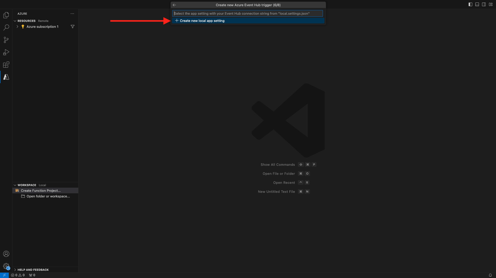

# 2.4.5创建您的Microsoft Azure项目

## 2.4.5.1熟悉Azure事件中心功能

Azure Functions允许您运行一小段代码（称为&#x200B;**函数**），而无需担心应用程序基础结构。 利用Azure Functions，云基础架构可提供保持应用程序大规模运行所需的所有最新服务器。

函数是由特定类型的事件触发的&#x200B;****。 支持的触发器包括响应数据更改、响应消息（例如事件中心）、按计划运行或作为HTTP请求的结果。

Azure Functions是一种无服务器计算服务，可让您运行事件触发的代码，而无需明确配置或管理基础架构。

Azure事件中心与Azure Functions集成以实现无服务器架构。

## 2.4.5.2打开Visual Studio代码并登录到Azure

Visual Studio Code可以轻松地……

- 定义Azure函数并将其绑定到事件中心
- 本地测试
- 部署到Azure
- 远程日志函数执行

### 打开Visual Studio Code

要打开Visual Studio代码，请在操作系统的搜索中输入&#x200B;**visual**（在OSX上搜索，在窗口的任务栏中搜索）。 如果未找到，则需要重复[练习0 — 先决条件](./ex0.md)中所述的步骤。


### 登录到Azure

当您使用在[练习0 — 先决条件](./ex0.md)中注册的Azure帐户登录时，Visual Studio代码将允许您查找并绑定所有事件中心资源。

单击Visual Studio Code中的&#x200B;**Azure**&#x200B;图标。 如果没有该选项，则安装所需的扩展时可能会出现问题。

接下来，选择&#x200B;**登录到Azure**：


系统会将您重定向到浏览器以登录。 请记住选择用于注册的Azure帐户。


当您在浏览器中看到以下屏幕时，您是使用Visual Code Studio登录的：


返回到Visual Code Studio（您将看到Azure订阅的名称，例如&#x200B;**Azure订阅1**）：


## 2.4.5.3创建Azure项目

将鼠标悬停在&#x200B;**Azure订阅1**&#x200B;上时，该部分上方将显示一个菜单，请选择&#x200B;**新建项目……**：


选择您选择的本地文件夹以保存项目，然后单击&#x200B;**选择**：


现在，您将进入项目创建向导。 选择&#x200B;**Javascript**&#x200B;作为项目的语言：


选择&#x200B;**Azure事件中心触发器**&#x200B;作为项目的第一个函数模板：


输入函数的名称，使用以下格式`--aepUserLdap---aep-event-hub-trigger`并按Enter键：


选择&#x200B;**新建本地应用设置**：



选择一个事件中心命名空间，您应会看到在&#x200B;**练习2**&#x200B;中定义的事件中心。 在此示例中，事件中心命名空间为&#x200B;**vangeluw-aep-enablement**：


选择您的事件中心，您应该会看到在&#x200B;**练习2**&#x200B;中定义的事件中心。 我的示例为&#x200B;**vangeluw-aep-enablement-event-hub**：


选择&#x200B;**RootManageSharedAccessKey**&#x200B;作为事件中心策略：


输入以使用&#x200B;**$Default**：


选择&#x200B;**添加到工作区**，了解如何打开项目：


创建项目后，单击&#x200B;**index.js**&#x200B;以在编辑器中打开文件：


Adobe Experience Platform发送到事件中心的有效负载将包含区段ID：

```json
[{
"segmentMembership": {
"ups": {
"ca114007-4122-4ef6-a730-4d98e56dce45": {
"lastQualificationTime": "2020-08-31T10:59:43Z",
"status": "realized"
},
"be2df7e3-a6e3-4eb4-ab12-943a4be90837": {
"lastQualificationTime": "2020-08-31T10:59:56Z",
"status": "realized"
},
"39f0feef-a8f2-48c6-8ebe-3293bc49aaef": {
"lastQualificationTime": "2020-08-31T10:59:56Z",
"status": "realized"
}
}
},
"identityMap": {
"ecid": [{
"id": "08130494355355215032117568021714632048"
}]
}
}]
```

将Visual Studio代码的index.js中的代码替换为以下代码。 每次Real-time CDP将区段资格发送到事件中心目标时，都会执行此代码。 在我们的示例中，代码只是用于显示和增强接收的有效负载。 但您可以想像任何类型的功能来实时处理区段资格。

```javascript
// Marc Meewis - Solution Consultant Adobe - 2020
// Adobe Experience Platform Enablement - Module 13

// Main function
// -------------
// This azure function is fired for each segment activated to the Adobe Exeperience Platform Real-time CDP Azure 
// Eventhub destination
// This function enriched the received segment payload with the name fo the segment. 
// You can replace this function with any logic that is require to process and deliver
// Adobe Experience Platform segments in real-time to any application or platform that 
// would need to act upon an AEP segment qualiification.
// 

module.exports = async function (context, eventHubMessages) {

    return new Promise (function (resolve, reject) {

        context.log('Message : ' + JSON.stringify(eventHubMessages, null, 2));

        resolve();

    });    

};
```

结果应如下所示：


## 2.4.5.4运行Azure项目

现在该运行您的项目了。 在此阶段，我们不会将该项目部署到Azure。 我们将在调试模式下在本地运行该程序。 选择运行图标，单击绿色箭头。


首次在调试模式下运行项目时，需要附加Azure存储帐户，请单击&#x200B;**选择存储帐户**。


从存储帐户列表中，选择作为[13.1.4设置你的Azure存储帐户](./ex1.md)的一部分创建的帐户。 您的存储帐户名为`--aepUserLdap--aepstorage`，例如： **mmeewisaepstorage**。


您的项目现已启动并正在运行，并将列出事件中心中的事件。 在下一个练习中，您将在Luma演示网站上演示符合这些区段资格的行为。 因此，您将在事件中心触发器功能的终端中接收区段资格有效负载：


## 2.4.5.5停止Azure项目

要停止项目，请选择&#x200B;**终端**&#x200B;选项卡，在终端窗口中单击，在OSX上按&#x200B;**CMD-C**，在Windows上按&#x200B;**CTRL-C**：


下一步：[2.4.6端到端方案](./ex6.md)

[返回模块2.4](./segment-activation-microsoft-azure-eventhub.md)

[返回所有模块](./../../../overview.md)
