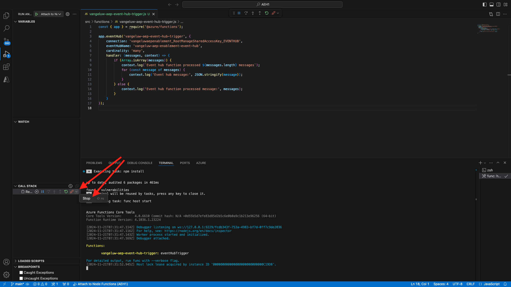

# 2.4.6创建您的Microsoft Azure项目

## 熟悉Azure事件中心功能

Azure Functions允许您运行一小段代码（称为&#x200B;**函数**），而无需担心应用程序基础架构。 利用Azure Functions，云基础架构可提供保持应用程序大规模运行所需的所有最新服务器。

函数是由特定类型的事件触发的&#x200B;****。 支持的触发器包括响应数据更改、响应消息（例如事件中心）、按计划运行或作为HTTP请求的结果。

Azure Functions是一种无服务器计算服务，可让您运行事件触发的代码，而无需明确配置或管理基础架构。

Azure事件中心与Azure Functions集成以实现无服务器架构。

## 打开Visual Studio代码并登录到Azure

Visual Studio Code可以轻松地……

- 定义Azure函数并将其绑定到事件中心
- 本地测试
- 部署到Azure
- 远程日志函数执行

### 打开Visual Studio Code

### 登录到Azure

使用您在上一个练习中注册的Azure帐户登录时，Visual Studio Code将允许您查找并绑定所有事件中心资源。

打开Visual Studio Code并单击&#x200B;**Azure**&#x200B;图标。

接下来，选择&#x200B;**登录到Azure**：


系统会将您重定向到浏览器以登录。 请记住选择用于注册的Azure帐户。

当您在浏览器中看到以下屏幕时，您是使用Visual Code Studio登录的：


返回到Visual Code Studio（您将看到Azure订阅的名称，例如&#x200B;**Azure订阅1**）：


## 创建Azure项目

单击&#x200B;**创建函数项目……**：


选择您选择的本地文件夹以保存项目，然后单击&#x200B;**选择**：


现在，您将进入项目创建向导。 单击&#x200B;**Javascript**&#x200B;作为项目的语言：


然后选择&#x200B;**模型v4**。


选择&#x200B;**Azure事件中心触发器**&#x200B;作为项目的第一个函数模板：


输入函数的名称，使用以下格式`--aepUserLdap---aep-event-hub-trigger`并按Enter键：


选择&#x200B;**新建本地应用设置**：


单击以选择您之前创建的名为`--aepUserLdap---aep-enablement`的事件中心命名空间。


接下来，单击以选择您之前创建的名为`--aepUserLdap---aep-enablement-event-hub`的事件中心。


单击以选择&#x200B;**RootManageSharedAccessKey**&#x200B;作为事件中心策略：


选择&#x200B;**添加到工作区**，了解如何打开项目：


您随后可能会收到这样的消息。 在这种情况下，请单击&#x200B;**是，我信任作者**。


创建项目后，单击&#x200B;**index.js**&#x200B;以在编辑器中打开文件：


Adobe Experience Platform发送到事件中心的有效负载将包含受众ID：

```json
[{
"segmentMembership": {
"ups": {
"ca114007-4122-4ef6-a730-4d98e56dce45": {
"lastQualificationTime": "2020-08-31T10:59:43Z",
"status": "realized"
},
"be2df7e3-a6e3-4eb4-ab12-943a4be90837": {
"lastQualificationTime": "2020-08-31T10:59:56Z",
"status": "realized"
},
"39f0feef-a8f2-48c6-8ebe-3293bc49aaef": {
"lastQualificationTime": "2020-08-31T10:59:56Z",
"status": "realized"
}
}
},
"identityMap": {
"ecid": [{
"id": "08130494355355215032117568021714632048"
}]
}
}]
```

将Visual Studio代码的index.js中的代码替换为以下代码。 每次Real-time CDP将受众资格发送到事件中心目标时，都将执行此代码。 在我们的示例中，代码只是用于显示和增强接收的有效负载。 但是你可以想象任何一种功能可以实时处理受众资格。

```javascript
// Marc Meewis - Solution Consultant Adobe - 2020
// Adobe Experience Platform Enablement - Module 2.4

// Main function
// -------------
// This azure function is fired for each audience activated to the Adobe Exeperience Platform Real-time CDP Azure 
// Eventhub destination
// This function enriched the received audience payload with the name of the audience. 
// You can replace this function with any logic that is require to process and deliver
// Adobe Experience Platform audiences in real-time to any application or platform that 
// would need to act upon an AEP audience qualification.
// 

module.exports = async function (context, eventHubMessages) {

    return new Promise (function (resolve, reject) {

        context.log('Message : ' + JSON.stringify(eventHubMessages, null, 2));

        resolve();

    });    

};
```

结果应如下所示：


## 运行Azure项目

现在该运行您的项目了。 在此阶段，我们不会将该项目部署到Azure。 我们将在调试模式下在本地运行该程序。 选择运行图标，单击绿色箭头。


首次在调试模式下运行项目时，需要附加Azure存储帐户，单击&#x200B;**选择存储帐户**，然后选择之前创建的名为`--aepUserLdap--aepstorage`的存储帐户。

您的项目现已启动并正在运行，并将列出事件中心中的事件。 在下一个练习中，您将在CitiSignal演示网站上演示符合受众条件的行为。 因此，您将在事件中心触发函数的终端中接收受众资格有效负载。


## 停止Azure项目

要停止项目，请转到VSC中的列&#x200B;**调用栈栈**，单击正在运行的项目上的箭头，然后单击&#x200B;**停止**。



下一步：[2.4.7端到端方案](./ex7.md)

[返回模块2.4](./segment-activation-microsoft-azure-eventhub.md)

[返回所有模块](./../../../overview.md)
