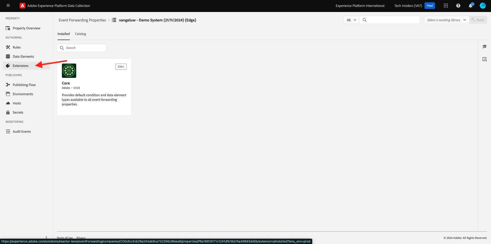
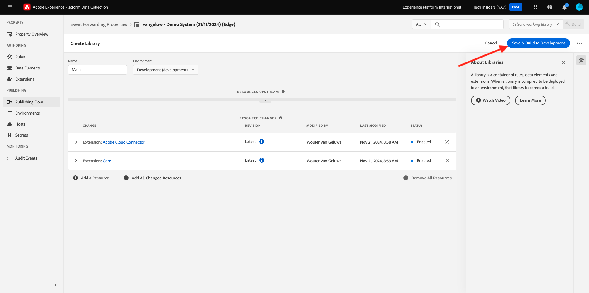

# 2.5.1创建Adobe Experience Platform数据收集事件转发属性

## 什么是Adobe Experience Platform数据收集事件转发属性？

通常，使用Adobe Experience Platform数据收集收集数据时，会在&#x200B;**客户端**&#x200B;上收集该数据。 **客户端**&#x200B;是一个环境，例如网站或移动应用程序。 在《快速入门》和《数据收集》中，深入讨论了Adobe Experience Platform数据收集客户端属性的配置，并在您的网站和移动应用程序上实施了Adobe Experience Platform数据收集客户端属性，以便在客户与网站和移动应用程序交互时可以在那里收集数据。

当该交互数据通过Adobe Experience Platform数据收集客户端属性收集时，网站或移动设备应用程序会向Adobe的Edge发送请求。 Edge是Adobe的数据收集环境，是点击流数据进入Adobe生态系统的入口点。 收集的数据然后从Edge发送到Adobe Experience Platform、Adobe Analytics、Adobe Audience Manager或Adobe Target等应用程序。

通过添加Adobe Experience Platform数据收集事件转发属性，现在可以配置一个Adobe Experience Platform数据收集属性，以侦听Edge上的传入数据。 当Edge上运行的Adobe Experience Platform数据收集事件转发属性看到传入数据时，它能够使用该数据并将其转发到其他位置。 现在，其他位置也可以是非Adobe外部webhook，因此可以将该数据发送到，例如，您选择的数据湖、决策应用程序或能够打开webhook的任何其他应用程序。

客户端资产对Adobe Experience Platform数据收集事件转发资产的配置非常熟悉，能够像过去一样使用Adobe Experience Platform数据收集客户端资产配置数据元素和规则。 但是，数据的访问和使用方式会因您的用例而略有不同。

让我们从创建Adobe Experience Platform数据收集事件转发属性开始。

## 创建Adobe Experience Platform数据收集事件转发属性

转到[https://experience.adobe.com/#/data-collection/](https://experience.adobe.com/#/data-collection/)。 在左侧菜单中，单击&#x200B;**事件转发**。 然后，您将看到所有可用的Adobe Experience Platform数据收集事件转发属性的概述。 单击&#x200B;**创建属性**&#x200B;按钮。

或者，如果已经创建其他事件转发属性，则UI的外观会略有不同。 在这种情况下，请单击&#x200B;**新建属性**。

您现在需要输入Adobe Experience Platform数据收集事件转发属性的名称。 作为命名约定，请使用`--aepUserLdap-- - Demo System (DD/MM/YYYY) (Edge)`。 例如，在此示例中，名称为&#x200B;**vangeluw - Demo System (22/02/2022) (Edge)**。 单击&#x200B;**保存**。

然后，您将返回Adobe Experience Platform数据收集事件转发属性列表。 单击以打开您刚刚创建的资产。

## 配置Adobe云连接器扩展

在左侧菜单中，转到&#x200B;**扩展**。 您将看到已配置&#x200B;**Core**&#x200B;扩展。

转到&#x200B;**目录**。 您将看到&#x200B;**Adobe云连接器**&#x200B;扩展以及许多其他扩展。 单击&#x200B;**安装**&#x200B;可安装包。

随后将添加该扩展。 此步骤没有要执行的配置。 系统会将您重新引导至已安装的扩展概述。

## 2.5.1.3部署您的Adobe Experience Platform数据收集事件转发资产

在左侧菜单中，转到&#x200B;**发布流**。 单击&#x200B;**添加库**。

输入名称&#x200B;**Main**，选择环境&#x200B;**开发（开发）**，然后单击&#x200B;**+添加所有更改的资源**。

你会看到这个。 单击&#x200B;**保存并构建用于开发**。

随后将生成您的库，这可能需要1-2分钟。

下一步： [2.5.2更新您的数据流以使您的数据收集事件转发属性可以使用数据](./ex2.md)

[返回模块2.5](./aep-data-collection-ssf.md)

[返回所有模块](./../../../overview.md)
