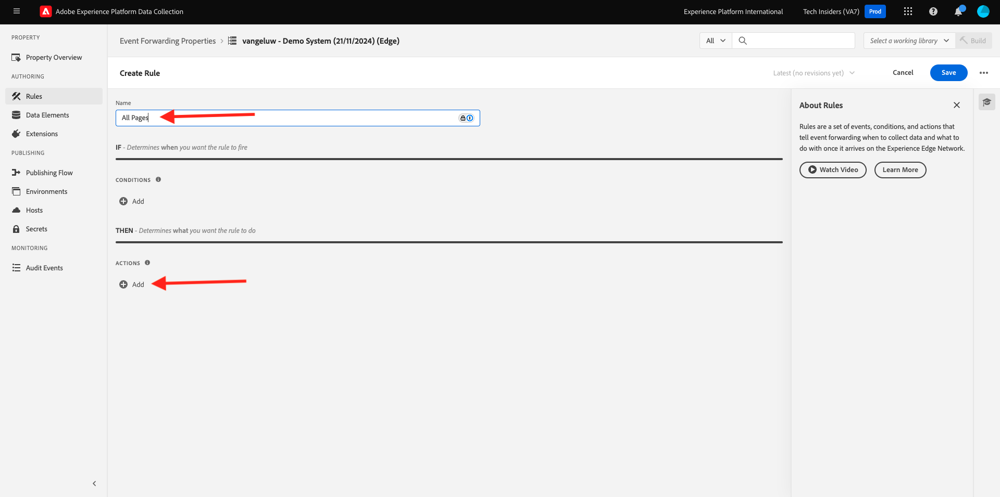
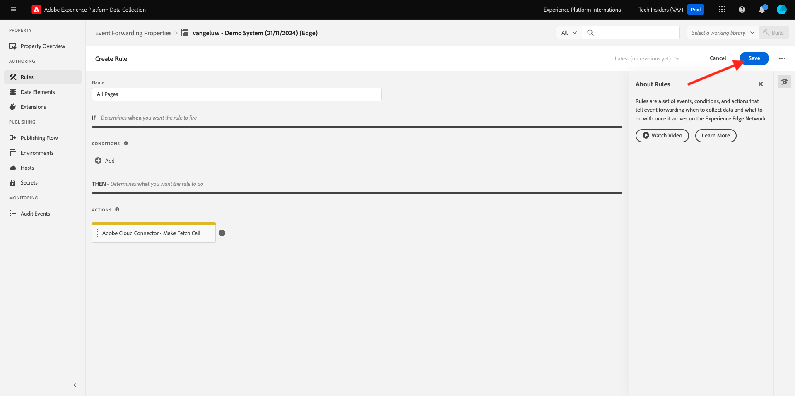
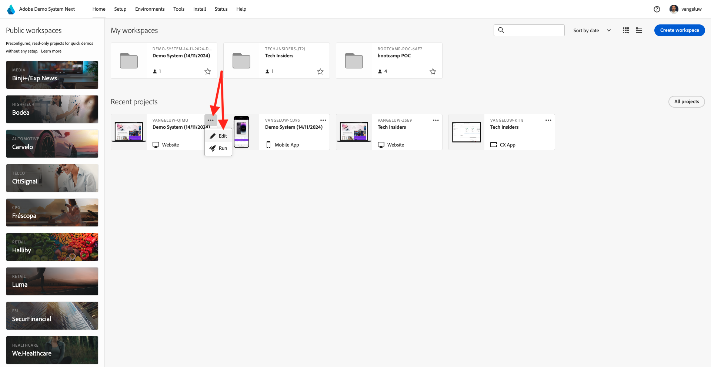

# 2.5.3创建和配置自定义webhook

## 2.5.3.1创建自定义webhook

转到[https://webhook.site/](https://webhook.site/)。 您会看到如下所示的内容：

您会看到唯一URL，它类似于： `https://webhook.site/585126a1-41fc-4721-864b-d4aa8c268a1d`。

此网站现在已为您创建此webhook，您将能够在您的&#x200B;**[!DNL Event Forwarding property]**&#x200B;中配置此webhook以开始测试事件转发。

## 2.5.3.2更新事件转发属性：创建数据元素

转到[https://experience.adobe.com/#/data-collection/](https://experience.adobe.com/#/data-collection/)并转到&#x200B;**事件转发**。 搜索您的事件转发属性，然后单击该属性以将其打开。

在左侧菜单中，转到&#x200B;**数据元素**。 单击&#x200B;**创建新数据元素**。

然后，您将看到要配置的新数据元素。

进行以下选择：

- 作为&#x200B;**Name**，输入&#x200B;**XDM事件**。
- 对于&#x200B;**扩展**，请选择&#x200B;**核心**。
- 对于&#x200B;**数据元素类型**，请选择&#x200B;**路径**。
- 作为&#x200B;**Path**，输入&#x200B;**arc.event.xdm**。 通过输入此路径，您将从网站或移动设备应用程序发送到Adobe Edge的事件有效负载中过滤掉&#x200B;**XDM**&#x200B;部分。

现在你就可以拥有这个了。 单击&#x200B;**保存**。

>[!NOTE]
>
>在上述路径中，引用了&#x200B;**arc**。 **arc**&#x200B;表示Adobe资源上下文，**arc**&#x200B;始终表示服务器端上下文中可用的最高对象。 可以使用Adobe Experience Platform数据收集服务器功能将增强和转换添加到该&#x200B;**arc**&#x200B;对象。
>
>在上述路径中，引用了&#x200B;**事件**。 **event**&#x200B;表示一个独特事件，Adobe Experience Platform数据收集服务器将始终单独评估每个事件。 有时，您可能会在Web SDK客户端发送的有效负载中看到对&#x200B;**events**&#x200B;的引用，但在Adobe Experience Platform数据收集服务器中，将单独评估每个事件。

## 2.5.3.3更新您的Adobe Experience Platform数据收集服务器属性：创建规则

在左侧菜单中，转到&#x200B;**规则**。 单击&#x200B;**创建新规则**。

然后，您将看到要配置的新规则。 输入&#x200B;**Name**： **所有页面**。 在本练习中，您无需配置条件。 相反，您将设置一个操作。 单击&#x200B;**操作**&#x200B;下的&#x200B;**+添加**&#x200B;按钮。

你会看到这个。 进行以下选择：

- 选择&#x200B;**扩展**： **Adobe云连接器**。
- 选择&#x200B;**操作类型**： **发出获取调用**。

这应该为您提供此&#x200B;**名称**： **Adobe云连接器 — 进行获取调用**。 您现在应该会看到以下内容：

接下来，配置以下内容：

- 将请求方法从GET更改为&#x200B;**POST**
- 在[https://webhook.site/](https://webhook.site/)网站上输入您在前面的步骤之一中创建的自定义webhook的URL，它类似于： `https://webhook.site/585126a1-41fc-4721-864b-d4aa8c268a1d`

您现在应该拥有此项。 接下来，转到&#x200B;**正文**。

你会看到这个。 单击数据元素图标，如下所示。

在弹出窗口中，选择您在上一步中创建的数据元素&#x200B;**XDM事件**。 单击&#x200B;**选择**。

你会看到这个。 单击&#x200B;**保留更改**。

你会看到这个。 单击&#x200B;**保存**。

现在，您已在Event Forwarding属性中配置了第一个规则。 转到&#x200B;**发布流**以发布您的更改。
按指示单击**编辑**&#x200B;以打开开发库&#x200B;**Main**。

单击&#x200B;**Add All Changed Resources**&#x200B;按钮，随后您将看到规则和数据元素出现在此库中。 接下来，单击&#x200B;**保存并生成以进行开发**。 您的更改正在部署中。

几分钟后，您将看到部署已完成并准备好进行测试。

## 2.5.3.4测试您的配置

转到[https://builder.adobedemo.com/projects](https://builder.adobedemo.com/projects)。 使用Adobe ID登录后，您将看到此内容。 单击您的网站项目以将其打开。

您现在可以按照以下流程访问该网站。 单击&#x200B;**集成**。

在&#x200B;**集成**&#x200B;页面上，您需要选择在练习0.1中创建的数据收集属性。

随后您将看到您的演示网站已打开。 选择URL并将其复制到剪贴板。

打开一个新的无痕浏览器窗口。

粘贴您在上一步中复制的演示网站的URL。 然后，系统将要求您使用Adobe ID登录。

选择您的帐户类型并完成登录过程。

然后，您会看到您的网站已加载到无痕浏览器窗口中。 对于每个演示，您将需要使用新的无痕浏览器窗口来加载演示网站URL。

打开浏览器开发人员视图时，您可以按照以下指示检查网络请求。 使用过滤器&#x200B;**interact**&#x200B;时，您将看到Adobe Experience Platform数据收集客户端发送到Adobe Edge的网络请求。

如果选择原始有效负载，请转到[https://jsonformatter.org/json-pretty-print](https://jsonformatter.org/json-pretty-print)并粘贴有效负载。 单击&#x200B;**美化**。 然后，您将看到JSON有效负载、**事件**&#x200B;对象和&#x200B;**xdm**&#x200B;对象。 在前面的步骤之一中，当您定义数据元素时，使用了引用&#x200B;**arc.event.xdm**，这将导致您解析出此有效负载的&#x200B;**xdm**&#x200B;对象。

将视图切换到您在前面的步骤之一中使用的网站[https://webhook.site/](https://webhook.site/)。 现在，您应该有一个与此类似、网络请求显示在左侧菜单中的视图。 您看到的&#x200B;**xdm**&#x200B;有效负载过滤出了如上所示的网络请求。

在有效负载中向下滚动一点以查找页面名称，在本例中为&#x200B;**vangeluw-OCUC**（演示网站的项目名称）。

如果您现在可以在整个网站上导航，您将看到其他网络请求实时显示在此自定义webhook上。

您现在已将Web SDK/XDM负载的服务器端转发配置为外部自定义webhook。 在接下来的练习中，您将配置类似的方法，并将向Google和AWS环境发送相同的数据。

下一步： [2.5.4创建和配置Google Cloud函数](./ex4.md)

[返回模块2.5](./aep-data-collection-ssf.md)

[返回所有模块](./../../../overview.md)
