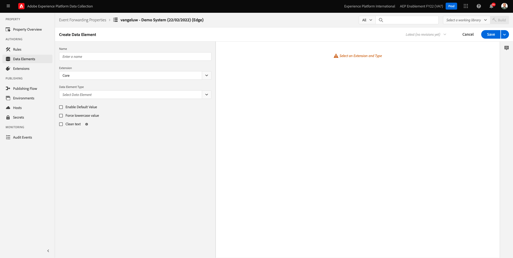
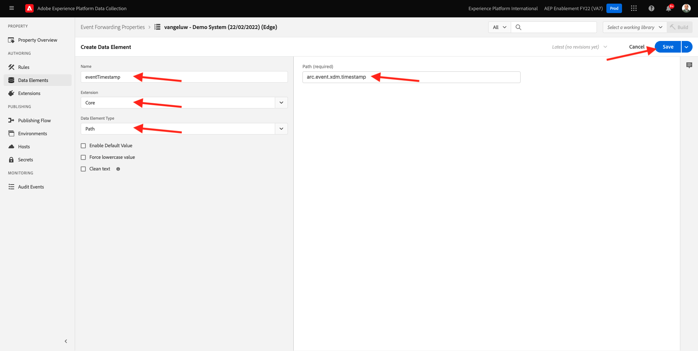

# 2.5.4创建和配置Google Cloud功能

## 2.5.4.1创建您的Google Cloud函数

转到[https://console.cloud.google.com/](https://console.cloud.google.com/)。 转到&#x200B;**云函数**。


你会看到这个。 单击&#x200B;**创建函数**。


你会看到这个。


进行以下选择：

- **函数名称**： `--aepUserLdap---event-forwarding`
- **地区**：选择任意地区
- **触发器类型**：选择&#x200B;**HTTP**
- **身份验证**：选择&#x200B;**允许未经身份验证的调用**

您现在应该拥有此项。 单击&#x200B;**保存**。


单击&#x200B;**下一步**。


您随后将看到以下内容：


进行以下选择：

- **运行时**：选择&#x200B;**Node.js 16**（或更高版本）
- **入口点**：输入&#x200B;**helloAEP**

单击&#x200B;**启用API**&#x200B;以启用&#x200B;**云构建API**。 然后您会看到一个新窗口。 在该新窗口中，再次单击&#x200B;**启用**。


你会看到这个。 单击&#x200B;**启用**。


启用&#x200B;**Cloud Build API**&#x200B;后，您将会看到此内容。


返回到&#x200B;**云函数**。
在云函数内联编辑器中，确保您具有以下代码：

```javascript
/**
 * Responds to any HTTP request.
 *
 * @param {!express:Request} req HTTP request context.
 * @param {!express:Response} res HTTP response context.
 */
exports.helloAEP = (req, res) => {
  let message = req.query.message || req.body.message || 'Hello World!';
  res.status(200).send(message);
};
```

接下来，单击&#x200B;**部署**。


你会看到这个。 正在创建您的云功能。 这可能需要几分钟的时间。


创建并运行您的函数后，您将会看到此内容。 单击函数的名称以将其打开。


你会看到这个。 转到&#x200B;**触发器**。 您随后将看到&#x200B;**触发器URL**，您将使用该链接在Launch服务器端定义终结点。


复制触发器URL，它类似于： **https://europe-west1-dazzling-pillar-273812.cloudfunctions.net/vangeluw-event-forwarding**。

在接下来的步骤中，您将配置Adobe Experience Platform数据收集服务器以将有关&#x200B;**页面查看次数**&#x200B;的特定信息流式传输到您的Google Cloud函数。 您不会仅按原样转发完整有效负载，而只会将&#x200B;**ECID**、**时间戳**&#x200B;和&#x200B;**页面名称**&#x200B;之类的内容发送到您的Google Cloud Function。

以下是您需要解析的有效负载示例，以过滤掉上述变量：

```json
{
  "events": [
    {
      "xdm": {
        "eventType": "web.webpagedetails.pageViews",
        "web": {
          "webPageDetails": {
            "URL": "https://builder.adobedemo.com/run/vangeluw-OCUC",
            "name": "vangeluw-OCUC",
            "viewName": "vangeluw-OCUC",
            "pageViews": {
              "value": 1
            }
          },
          "webReferrer": {
            "URL": "https://builder.adobedemo.com/run/vangeluw-OCUC/equipment"
          }
        },
        "device": {
          "screenHeight": 1080,
          "screenWidth": 1920,
          "screenOrientation": "landscape"
        },
        "environment": {
          "type": "browser",
          "browserDetails": {
            "viewportWidth": 1920,
            "viewportHeight": 451
          }
        },
        "placeContext": {
          "localTime": "2022-02-23T06:51:07.140+01:00",
          "localTimezoneOffset": -60
        },
        "timestamp": "2022-02-23T05:51:07.140Z",
        "implementationDetails": {
          "name": "https://ns.adobe.com/experience/alloy/reactor",
          "version": "2.8.0+2.9.0",
          "environment": "browser"
        },
        "_experienceplatform": {
          "identification": {
            "core": {
              "ecid": "08346969856929444850590365495949561249"
            }
          },
          "demoEnvironment": {
            "brandName": "vangeluw-OCUC"
          },
          "interactionDetails": {
            "core": {
              "channel": "web"
            }
          }
        }
      },
      "query": {
        "personalization": {
          "schemas": [
            "https://ns.adobe.com/personalization/html-content-item",
            "https://ns.adobe.com/personalization/json-content-item",
            "https://ns.adobe.com/personalization/redirect-item",
            "https://ns.adobe.com/personalization/dom-action"
          ],
          "decisionScopes": [
            "eyJ4ZG06YWN0aXZpdHlJZCI6Inhjb3JlOm9mZmVyLWFjdGl2aXR5OjE0YzA1MjM4MmUxYjY1MDUiLCJ4ZG06cGxhY2VtZW50SWQiOiJ4Y29yZTpvZmZlci1wbGFjZW1lbnQ6MTRiZjA5ZGM0MTkwZWJiYSJ9",
            "__view__"
          ]
        }
      }
    }
  ],
  "query": {
    "identity": {
      "fetch": [
        "ECID"
      ]
    }
  },
  "meta": {
    "state": {
      "domain": "adobedemo.com",
      "cookiesEnabled": true,
      "entries": [
        {
          "key": "kndctr_907075E95BF479EC0A495C73_AdobeOrg_identity",
          "value": "CiYwODM0Njk2OTg1NjkyOTQ0NDg1MDU5MDM2NTQ5NTk0OTU2MTI0OVIPCPn66KfyLxgBKgRJUkwx8AH5-uin8i8="
        },
        {
          "key": "kndctr_907075E95BF479EC0A495C73_AdobeOrg_consent_check",
          "value": "1"
        },
        {
          "key": "kndctr_907075E95BF479EC0A495C73_AdobeOrg_consent",
          "value": "general=in"
        }
      ]
    }
  }
}
```

这些字段包含需要解析的信息：

- ECID： **events.xdm。_experienceplatform.identification.core.ecid**
- 时间戳：**时间戳**
- 页面名称： **events.xdm.web.webPageDetails.name**

现在，让我们转到Adobe Experience Platform数据收集服务器，配置数据元素以实现这一点。

## 2.5.4.2更新事件转发属性：数据元素

转到[https://experience.adobe.com/#/data-collection/](https://experience.adobe.com/#/data-collection/)并转到&#x200B;**事件转发**。 搜索您的事件转发属性，然后单击该属性以将其打开。


在左侧菜单中，转到&#x200B;**数据元素**。 单击&#x200B;**添加数据元素**。


然后，您将看到要配置的新数据元素。



进行以下选择：

- 作为&#x200B;**Name**，输入&#x200B;**customerECID**。
- 对于&#x200B;**扩展**，请选择&#x200B;**核心**。
- 对于&#x200B;**数据元素类型**，请选择&#x200B;**路径**。
- 作为&#x200B;**路径**，输入`arc.event.xdm.--aepTenantId--.identification.core.ecid`。 输入此路径后，您将从网站或移动设备应用程序发送到Adobe Edge的事件有效负载中过滤掉字段&#x200B;**ecid**。

>[!NOTE]
>
>在上方路径和下方路径中，引用了&#x200B;**arc**。 **arc**&#x200B;表示Adobe资源上下文，**arc**&#x200B;始终表示服务器端上下文中可用的最高对象。 可以使用Adobe Experience Platform数据收集服务器功能将增强和转换添加到该&#x200B;**arc**&#x200B;对象。
>
>在上方路径和下方路径中，引用了&#x200B;**事件**。 **event**&#x200B;表示一个独特事件，Adobe Experience Platform数据收集服务器将始终单独评估每个事件。 有时，您可能会在Web SDK客户端发送的有效负载中看到对&#x200B;**events**&#x200B;的引用，但在Adobe Experience Platform数据收集服务器中，将单独评估每个事件。

现在你就可以拥有这个了。 单击&#x200B;**保存**。


单击&#x200B;**添加数据元素**。


然后，您将看到要配置的新数据元素。


进行以下选择：

- 作为&#x200B;**Name**，输入&#x200B;**eventTimestamp**。
- 对于&#x200B;**扩展**，请选择&#x200B;**核心**。
- 对于&#x200B;**数据元素类型**，请选择&#x200B;**路径**。
- 作为&#x200B;**Path**，输入&#x200B;**arc.event.xdm.timestamp**。 输入此路径后，您将过滤掉网站或移动设备应用程序发送到Adobe Edge的事件有效负载中的字段&#x200B;**timestamp**。

现在你就可以拥有这个了。 单击&#x200B;**保存**。



单击&#x200B;**添加数据元素**。


然后，您将看到要配置的新数据元素。


进行以下选择：

- 作为&#x200B;**Name**，输入&#x200B;**pageName**。
- 对于&#x200B;**扩展**，请选择&#x200B;**核心**。
- 对于&#x200B;**数据元素类型**，请选择&#x200B;**路径**。
- 作为&#x200B;**路径**，输入&#x200B;**arc.event.xdm.web.webPageDetails.name**。 输入此路径后，您将过滤掉网站或移动设备应用程序发送到Adobe Edge的事件有效负载中的字段&#x200B;**name**。

现在你就可以拥有这个了。 单击&#x200B;**保存**。


现在，您已创建以下数据元素：


## 2.5.4.3更新事件转发属性：更新规则

在左侧菜单中，转到&#x200B;**规则**。 在上一个练习中，您创建了规则&#x200B;**所有页面**。 单击该规则以将其打开。


你会看到这个。 单击&#x200B;**操作**&#x200B;下的&#x200B;**+**&#x200B;图标以添加新操作。


你会看到这个。


进行以下选择：

- 选择&#x200B;**扩展**： **Adobe云连接器**。
- 选择&#x200B;**操作类型**： **发出获取调用**。

这应该为您提供此&#x200B;**名称**： **Adobe云连接器 — 进行获取调用**。 您现在应该会看到以下内容：


接下来，配置以下内容：

- 将GET协议更改为&#x200B;**POST**
- 输入您在前面的步骤之一中创建的Google Cloud函数的URL，如下所示： **https://europe-west1-dazzling-pillar-273812.cloudfunctions.net/vangeluw-event-forwarding**

您现在应该拥有此项。 接下来，转到&#x200B;**正文**。


你会看到这个。 单击&#x200B;**JSON**&#x200B;的单选按钮。


按如下方式配置&#x200B;**Body**：

| 键 | 值 |
|--- |--- |
| customerECID | {{customerECID}} |
| pageName | {{pageName}} |
| eventTimestamp | {{eventTimestamp}} |

你会看到这个。 单击&#x200B;**保留更改**。


你会看到这个。 单击&#x200B;**保存**。


您现在更新了Adobe Experience Platform数据收集服务器资产中的现有规则。 转到&#x200B;**发布流**&#x200B;以发布您的更改。 按指示单击&#x200B;**编辑**&#x200B;以打开开发库&#x200B;**Main**。


单击&#x200B;**Add All Changed Resources**&#x200B;按钮，随后您将看到规则和数据元素出现在此库中。 接下来，单击&#x200B;**保存并生成以进行开发**。 您的更改正在部署中。


几分钟后，您将看到部署已完成并准备好进行测试。


## 2.5.3.4测试您的配置

转到[https://builder.adobedemo.com/projects](https://builder.adobedemo.com/projects)。 使用Adobe ID登录后，您将看到此内容。 单击您的网站项目以将其打开。


您现在可以按照以下流程访问该网站。 单击&#x200B;**集成**。


在&#x200B;**集成**&#x200B;页面上，您需要选择在练习0.1中创建的数据收集属性。


随后您将看到您的演示网站已打开。 选择URL并将其复制到剪贴板。


打开一个新的无痕浏览器窗口。


粘贴您在上一步中复制的演示网站的URL。 然后，系统将要求您使用Adobe ID登录。


选择您的帐户类型并完成登录过程。


然后，您会看到您的网站已加载到无痕浏览器窗口中。 对于每个演示，您将需要使用新的无痕浏览器窗口来加载演示网站URL。


打开浏览器开发人员视图时，您可以按照以下指示检查网络请求。 使用过滤器&#x200B;**interact**&#x200B;时，您将看到Adobe Experience Platform数据收集客户端发送到Adobe Edge的网络请求。


将视图切换到Google Cloud Function并转到&#x200B;**日志**。 现在，您应该有一个类似于此视图的视图，其中显示了许多日志条目。 每次看到&#x200B;**函数执行开始**&#x200B;时，都表示您的Google Cloud函数中接收了传入流量。


让我们稍微更新一下您的函数，以便处理传入数据，并显示从Adobe Experience Platform数据收集服务器收到的信息。 转到&#x200B;**SOURCE**&#x200B;并单击&#x200B;**编辑**。


在下一个屏幕中，单击&#x200B;**下一步**。


更新您的代码，如下所示：

```javascript
/**
 * Responds to any HTTP request.
 *
 * @param {!express:Request} req HTTP request context.
 * @param {!express:Response} res HTTP response context.
 */
exports.helloAEP = (req, res) => {
  console.log('>>>>> Function has started. The following information was received from Event Forwarding:');
  console.log(req.body);

  let message = req.query.message || req.body.message || 'Hello World!';
  res.status(200).send(message);
};
```

你就能拥有这个了。 单击&#x200B;**部署**。


几分钟后，将再次部署您的函数。 单击函数名称以将其打开。


在您的演示网站上，导航到产品，例如&#x200B;**DEIRDRE RELAXED-FIT CAPRI**。


将视图切换到Google Cloud Function并转到&#x200B;**日志**。 现在，您应该有一个类似于此视图的视图，其中显示了许多日志条目。

现在，对于演示网站上的每个页面查看，您应该会在Google Cloud函数的日志中看到一个新的日志条目弹出窗口，其中显示接收的信息。


现在，您已成功将Adobe Experience Platform数据收集收集的数据实时发送到Google Cloud函数端点。 从那里，这些数据可供任何Google Cloud Platform应用程序使用，例如用于存储和报告或机器学习用例的BigQuery。

下一步： [2.5.5向AWS生态系统转发活动](./ex5.md)

[返回模块2.5](./aep-data-collection-ssf.md)

[返回所有模块](./../../../overview.md)
