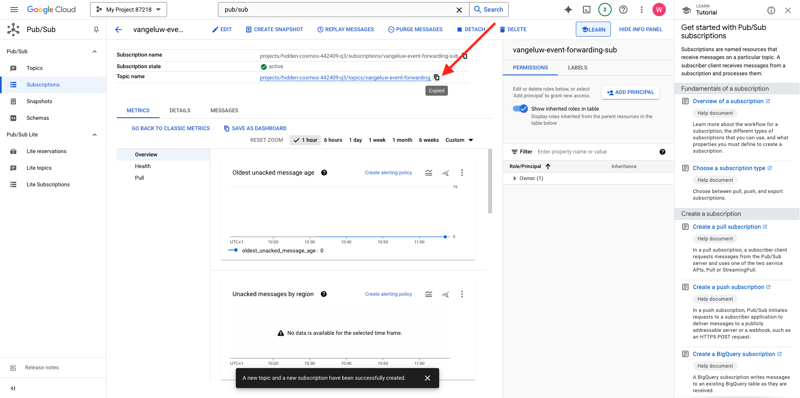
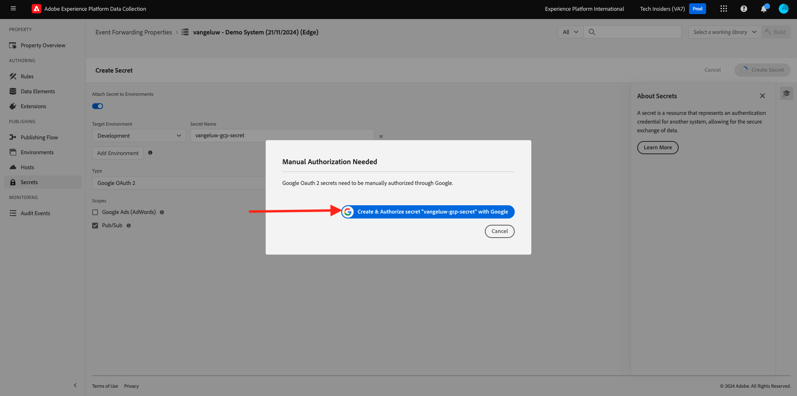
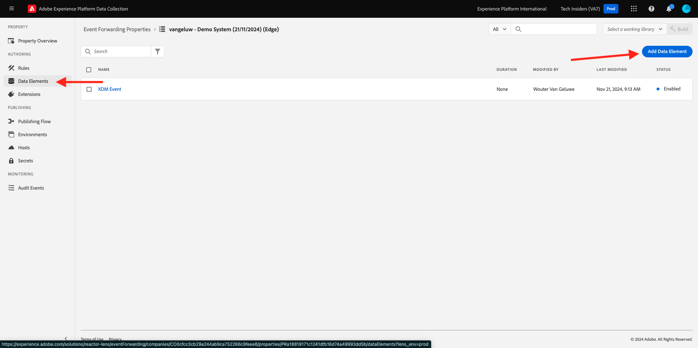
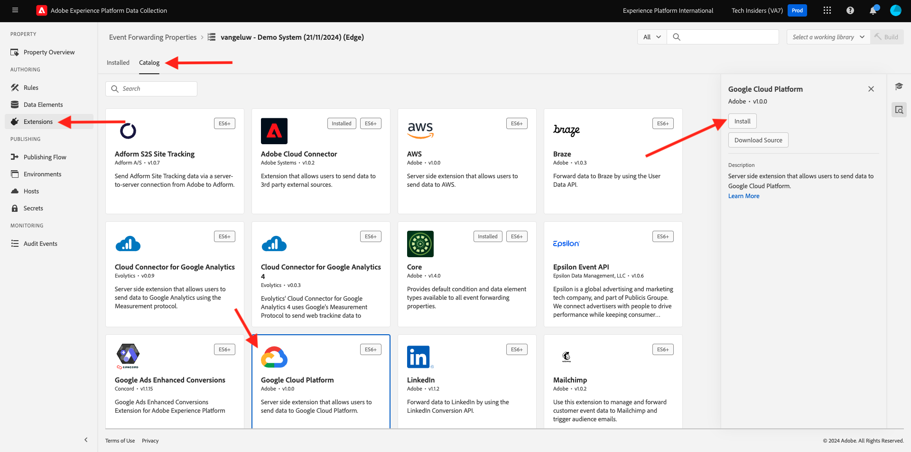
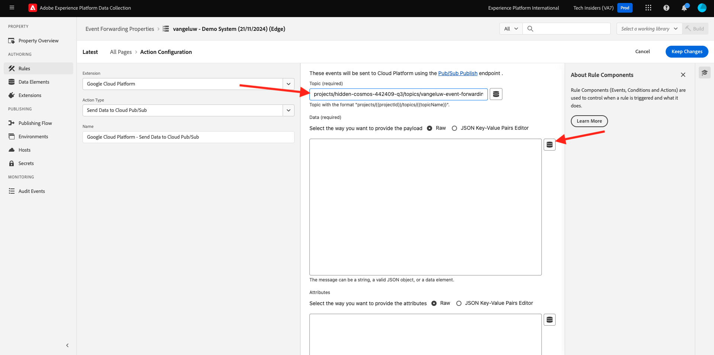

# 2.5.4将事件转发到GCP Pub/Sub

>[!NOTE]
>
>在本练习中，您需要具有对Google Cloud Platform环境的访问权限。 如果您尚无法访问GCP，请使用您的个人电子邮件地址创建一个新帐户。

## 创建您的Google Cloud Pub/Sub主题

转到[https://console.cloud.google.com/](https://console.cloud.google.com/)。 在搜索栏中输入`pub/sub`。 单击搜索结果&#x200B;**Pub/Sub - Global real-time messaging**。

你会看到这个。 单击&#x200B;**创建主题**。

你会看到这个。 对于您的主题ID，请使用`--aepUserLdap---event-forwarding`。 单击&#x200B;**创建**。

您的主题现已创建。 单击主题的&#x200B;**订阅ID**。

你会看到这个。 将&#x200B;**主题名称**&#x200B;复制到剪贴板并将其存储，因为您将在下一个练习中需要它。

现在转到Adobe Experience Platform数据收集事件转发，以更新您的事件转发属性并开始将事件转发到Pub/Sub。

## 更新事件转发属性：密钥

事件转发属性中的&#x200B;**密钥**&#x200B;用于存储用于针对外部API进行身份验证的凭据。在此示例中，您需要配置一个密钥来存储Google Cloud Platform OAuth令牌，当使用Pub/Sub将数据流式传输到GCP时，将使用该令牌进行身份验证。

转到[https://experience.adobe.com/#/data-collection/](https://experience.adobe.com/#/data-collection/)并转到&#x200B;**密钥**。 单击&#x200B;**新建密钥**。

你会看到这个。 请按照以下说明操作：

- 名称：使用`--aepUserLdap---gcp-secret`
- 目标环境：选择&#x200B;**开发**
- 类型：**Google OAuth 2**
- 选中&#x200B;**Pub/Sub**&#x200B;的复选框

单击&#x200B;**创建密钥**。

单击&#x200B;**创建密钥**&#x200B;后，您将看到一个弹出窗口，用于设置事件转发属性的密钥与Google之间的身份验证。 单击&#x200B;**使用Google创建和授权密钥`--aepUserLdap---gcp-secret`**。

单击以选择您的Google帐户。

单击&#x200B;**继续**。

>[!NOTE]
>
>您的弹出消息可能有所不同。 请授权/允许请求的访问，以继续练习。

在成功进行身份验证后，您将看到此内容。

您的密钥现在已成功配置，并可在数据元素中使用。

## 更新事件转发属性：数据元素

要在Event Forwarding属性中使用密钥，您需要创建一个数据元素，用于存储密钥的值。

转到[https://experience.adobe.com/#/data-collection/](https://experience.adobe.com/#/data-collection/)并转到&#x200B;**事件转发**。 搜索您的事件转发属性，然后单击该属性以将其打开。

在左侧菜单中，转到&#x200B;**数据元素**。 单击&#x200B;**添加数据元素**。

按如下方式配置数据元素：

- 名称： **GCP密码**
- 扩展： **核心**
- 数据元素类型： **密码**
- 开发密码：选择您创建的名为`--aepUserLdap---gcp-secret`的密码

单击&#x200B;**保存**

## 更新事件转发属性：扩展

配置好密钥和数据元素后，您现在可以在事件转发属性中为Google Cloud Platform设置扩展。

转到[https://experience.adobe.com/#/data-collection/](https://experience.adobe.com/#/data-collection/)，转到&#x200B;**事件转发**&#x200B;并打开您的事件转发属性。

接下来，转到&#x200B;**扩展**，转到&#x200B;**目录**。 单击&#x200B;**Google Cloud Platform**&#x200B;扩展，然后单击&#x200B;**安装**。

你会看到这个。 单击数据元素图标。

选择在上一个练习中创建的数据元素，其名称为&#x200B;**GCP密码**。 单击&#x200B;**选择**。

你会看到这个。 单击&#x200B;**保存**。

## 更新事件转发属性：更新规则

现在，您的Google Cloud Platform扩展已配置，您可以定义一个规则以开始将事件数据转发到您的Pub/Sub主题。 为此，您需要更新您在上一个练习中创建的&#x200B;**所有页面**&#x200B;规则。

在左侧菜单中，转到&#x200B;**规则**。 在上一个练习中，您创建了规则&#x200B;**所有页面**。 单击该规则以将其打开。

你会看到这个。 单击&#x200B;**操作**&#x200B;下的&#x200B;**+**&#x200B;图标以添加新操作。

你会看到这个。 进行以下选择：

- 选择&#x200B;**扩展**： **Google Cloud Platform**。
- 选择&#x200B;**操作类型**： **将数据发送到Cloud Pub/Sub**。

这应该为您提供以下&#x200B;**名称**： **Google Cloud Platform — 将数据发送到Cloud Pub/Sub**。 您现在应该会看到以下内容：

现在，您需要配置之前创建的Pub/Sub主题。

您可以在此处找到&#x200B;**主题名称**，复制它。

将&#x200B;**主题名称**&#x200B;粘贴到规则配置中。 接下来，单击&#x200B;**数据（必需）**&#x200B;字段旁边的“数据元素”图标。

选择&#x200B;**XDM事件**&#x200B;并单击&#x200B;**选择**。

你会看到这个。 单击&#x200B;**保留更改**。

单击&#x200B;**保存**。

你会看到这个。

## Publish您的更改

您的配置现已完成。 转到&#x200B;**发布流**&#x200B;以发布您的更改。 按指示单击&#x200B;**编辑**&#x200B;以打开开发库&#x200B;**Main**。

单击&#x200B;**Add All Changed Resources**&#x200B;按钮，随后您将看到规则和数据元素出现在此库中。 接下来，单击&#x200B;**保存并生成以进行开发**。 您的更改正在部署中。

几分钟后，您将看到部署已完成并准备好进行测试。

## 测试您的配置

转到[https://dsn.adobe.com](https://dsn.adobe.com)。 使用Adobe ID登录后，您将看到此内容。 单击网站项目上的3个点&#x200B;**...**，然后单击&#x200B;**运行**&#x200B;以将其打开。

随后您将看到您的演示网站已打开。 选择URL并将其复制到剪贴板。

打开一个新的无痕浏览器窗口。

粘贴您在上一步中复制的演示网站的URL。 然后，系统将要求您使用Adobe ID登录。

选择您的帐户类型并完成登录过程。

然后，您会看到您的网站已加载到无痕浏览器窗口中。 对于每个练习，您将需要使用新的无痕浏览器窗口来加载演示网站URL。

将视图切换到Google Cloud Pub/Sub，然后转到&#x200B;**消息**。 单击“**提取**”，几秒钟后您将在列表中看到一些消息。 单击消息可将其内容可视化。

您现在可以在Google Pub/Sub中查看事件的XDM有效负荷。 您现在已成功将Adobe Experience Platform数据收集收集的数据实时发送到Google Cloud Pub/Sub端点。 从那里，这些数据可供任何Google Cloud Platform应用程序使用，例如用于存储和报告或机器学习用例的BigQuery。

下一步：[2.5.5将事件转发到AWS Kinesis和AWS S3](./ex5.md)

[返回模块2.5](./aep-data-collection-ssf.md)

[返回所有模块](./../../../overview.md)
