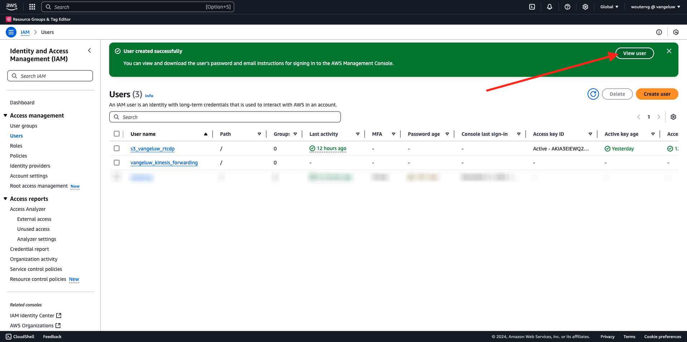
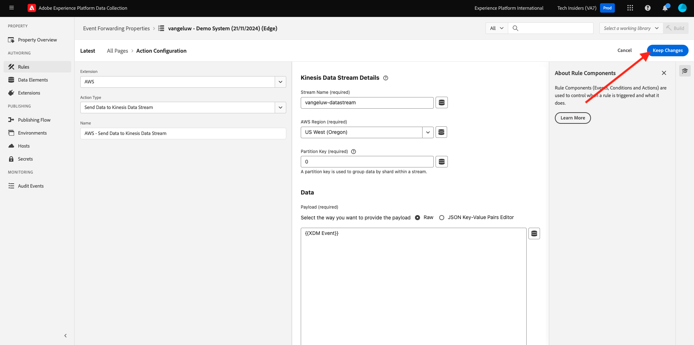

# 2.5.5将活动转发到AWS Kinesis和AWS S3

>[!IMPORTANT]
>
>能否完成本练习是可选的，使用AWS Kinesis需要支付相关费用。 虽然AWS提供了一个免费套餐帐户，可让您免费测试和配置许多服务，但AWS Kinesis并不包含在该免费套餐帐户中。 因此，为了实施和测试此练习，需要支付使用AWS Kinesis的费用。

## 很高兴知道

Adobe Experience Platform支持将各种Amazon服务作为目标。
Kinesis和S3都是[配置文件导出目标](https://experienceleague.adobe.com/docs/experience-platform/destinations/destination-types.html?lang=en)，可以用作Adobe Experience PlatformReal-Time CDP的一部分。
您可以轻松地将高价值区段事件和相关配置文件属性馈送到您选择的系统。

在本练习中，您将了解如何设置自己的Amazon Kinesis流，以将来自Adobe Experience Platform Edge生态系统的事件数据流式传输到云存储目标，如Amazon S3。 如果您希望从Web和移动属性收集体验事件并将它们推送到Datalake中以用于分析和操作报告，则此功能非常有用。 数据湖通常通过大量每日文件导入以批量方式摄取数据，它们不会公开可与事件转发结合使用的公共http端点。

支持上述用例意味着流式数据在写入文件之前需要缓冲或放入队列中。 必须注意不要打开文件以便跨多个进程进行写访问。 将这项任务委托给专用系统非常适合在保证高服务水平的情况下实现良好扩展，这正是Kinesis需要帮助的地方。

Amazon Kinesis数据流侧重于摄取和存储数据流。 Kinesis Data Firehose侧重于将数据流交付到选定的目标，如S3存储桶。

作为本练习的一部分，您将……

- 执行Kinesis数据流的基本设置
- 创建Firehose投放流并使用S3存储段作为目标
- 将Amazon API网关配置为Rest API端点，以接收事件数据
- 将原始事件数据从Adobe的Edge转发到Kinesis流

## 配置AWS S3存储段

转到[https://console.aws.amazon.com](https://console.aws.amazon.com)并使用您的Amazon帐户登录。

登录后，您将被重定向到&#x200B;**AWS管理控制台**。

在&#x200B;**查找服务**&#x200B;菜单中，搜索&#x200B;**s3**。 单击第一个搜索结果： **S3 — 云中的可扩展存储**。

您随后将看到&#x200B;**Amazon S3**&#x200B;主页。 单击&#x200B;**创建存储桶**。

在&#x200B;**创建Bucket**&#x200B;屏幕中，您需要配置以下两项内容：

- 名称：使用名称`eventforwarding---aepUserLdap--`。

保留所有其他默认设置。 向下滚动并单击&#x200B;**创建存储桶**。

然后，您会看到正在创建存储段，并且会被重定向到Amazon S3主页。

## 配置AWS Kinesis数据流

在&#x200B;**查找服务**&#x200B;菜单中，搜索&#x200B;**kinesis**。 单击第一个搜索结果： **Kinesis — 使用实时流数据**。

选择&#x200B;**Kinesis数据流**。 单击&#x200B;**创建数据流**。

对于&#x200B;**数据流名称**，请使用`--aepUserLdap---datastream`。

无需更改任何其他设置。 向下滚动并单击&#x200B;**创建数据流**。

你会看到这个。 成功创建数据流后，您可以继续进行下一个练习。

## 配置AWS Firehose投放流

在&#x200B;**查找服务**&#x200B;菜单中，搜索&#x200B;**kinesis**。 单击&#x200B;**Kinesis Data Firehose**。

单击&#x200B;**创建Firehose流**。

对于&#x200B;**Source**，请选择&#x200B;**Amazon Kinesis数据流**。 对于&#x200B;**目标**，请选择&#x200B;**Amazon S3**。 单击&#x200B;**浏览**&#x200B;以选择您的数据流。

选择您的数据流。 单击&#x200B;**选择**。

你会看到这个。 记住&#x200B;**Firehose流名称**，因为稍后您将需要它。

向下滚动直到看到&#x200B;**目标设置**。 单击&#x200B;**浏览**&#x200B;以选择您的S3存储段。

选择您的S3存储段并单击&#x200B;**选择**。

然后你将看到类似这样的内容。 更新以下设置：

- 新的行分隔符：设置为&#x200B;**已启用**
- 动态分区：设置为&#x200B;**未启用**

再向下滚动一点，然后单击&#x200B;**创建Firehose流**

几分钟后，将创建您的Firehose流并&#x200B;**激活**。

## 创建IAM用户

在左侧的AWS IAM菜单中，单击&#x200B;**用户**。 您随后将看到&#x200B;**用户**&#x200B;屏幕。 单击&#x200B;**创建用户**。

接下来，配置您的用户：

- 用户名：使用`--aepUserLdap--_kinesis_forwarding`

单击&#x200B;**下一步**。

然后，您将会看到此权限屏幕。 单击&#x200B;**直接附加策略**。

输入搜索词&#x200B;**kinesisfirehose**&#x200B;以查看所有相关策略。 选择策略&#x200B;**AmazonKinesisFirehoseFullAccess**。 向下滚动并单击&#x200B;**下一步**。

检查您的配置。 单击&#x200B;**创建用户**。

你会看到这个。 单击&#x200B;**查看用户**。

单击&#x200B;**添加权限**，然后单击&#x200B;**创建内联策略**。

你会看到这个。 选择服务&#x200B;**Kinesis**。

转到&#x200B;**写入**&#x200B;并选中&#x200B;**PutRecord**&#x200B;的复选框。

向下滚动到&#x200B;**资源**&#x200B;并选择&#x200B;**全部**。 单击&#x200B;**下一步**。

将您的策略命名为： **Kinesis_PutRecord**，然后单击&#x200B;**创建策略**。

你会看到这个。 单击&#x200B;**安全凭据**。

单击&#x200B;**创建访问密钥**。

选择&#x200B;**在AWS**&#x200B;外部运行的应用程序。 向下滚动并单击&#x200B;**下一步**。

单击&#x200B;**创建访问密钥**

你会看到这个。 单击&#x200B;**显示**&#x200B;查看您的访问密钥：

您的&#x200B;**访问密钥**&#x200B;现已显示。

>[!IMPORTANT]
>
>将凭据存储在计算机上的文本文件中。
>
> - 访问密钥ID： ...
> - 访问密钥： ...
>
> 单击&#x200B;**完成**&#x200B;后，您将再也看不到您的凭据！

单击&#x200B;**完成**。

您现在已成功创建具有适当权限的IAM用户，在Event Forwarding属性中配置AWS扩展时，需要指定该权限。

## 更新事件转发属性：扩展

配置好密钥和数据元素后，您现在可以在事件转发属性中为Google Cloud Platform设置扩展。

转到[https://experience.adobe.com/#/data-collection/](https://experience.adobe.com/#/data-collection/)，转到&#x200B;**事件转发**&#x200B;并打开您的事件转发属性。

接下来，转到&#x200B;**扩展**，转到&#x200B;**目录**。 单击&#x200B;**AWS**&#x200B;扩展，然后单击&#x200B;**安装**。

输入您在上一个练习中生成的IAM用户凭据。 单击&#x200B;**保存**。

接下来，您需要配置开始将事件数据转发到Kinesis的规则。

## 更新事件转发属性：规则

在左侧菜单中，转到&#x200B;**规则**。 单击以打开您在前面的练习中创建的&#x200B;**所有页面**&#x200B;规则。

你会看到这个。 单击&#x200B;**+**&#x200B;图标以添加新操作。

你会看到这个。 进行以下选择：

- 选择&#x200B;**扩展**： **AWS**
- 选择&#x200B;**操作类型**： **将数据发送到Kinesis数据流**
- 名称： **AWS — 将数据发送到Kinesis数据流**

您现在应该会看到以下内容：

接下来，配置以下内容：

- 流名称： `--aepUserLdap---datastream`
- AWS地区：在AWS数据流设置中检查您所在的地区
- 分区键： **0**

您可以在此处查看您的AWS地区：

您现在应该拥有此项。 接下来，单击&#x200B;**数据**&#x200B;字段的数据元素图标。

选择&#x200B;**XDM事件**&#x200B;并单击&#x200B;**选择**。

你就能拥有这个了。 单击&#x200B;**保留更改**。

你会看到这个。 单击&#x200B;**保存**。

转到&#x200B;**发布流**以发布您的更改。
单击**Main**&#x200B;打开开发库。

单击&#x200B;**Add All Changed Resources**&#x200B;按钮，随后您将看到在此库中显示的规则和数据元素更改。 接下来，单击&#x200B;**保存并生成以进行开发**。 您的更改正在部署中。

几分钟后，您将看到部署已完成并准备好进行测试。

## 测试您的配置

转到[https://dsn.adobe.com](https://dsn.adobe.com)。 使用Adobe ID登录后，您将看到此内容。 单击网站项目上的3个点&#x200B;**...**，然后单击&#x200B;**运行**&#x200B;以将其打开。

随后您将看到您的演示网站已打开。 选择URL并将其复制到剪贴板。

打开一个新的无痕浏览器窗口。

粘贴您在上一步中复制的演示网站的URL。 然后，系统将要求您使用Adobe ID登录。

选择您的帐户类型并完成登录过程。

然后，您会看到您的网站已加载到无痕浏览器窗口中。 对于每个练习，您将需要使用新的无痕浏览器窗口来加载演示网站URL。

将视图切换到&#x200B;**AWS**。 通过打开数据流并进入&#x200B;**监控**&#x200B;选项卡，您现在将看到传入的流量。

然后，当您打开Data Firehose流并进入&#x200B;**监控**&#x200B;选项卡时，您也会看到传入的流量。

最后，当您查看S3存储段时，您现在会注意到由于数据摄取而在其中创建了文件。

当您下载此类文件并使用文本编辑器将其打开时，您将看到它包含来自已转发事件的XDM有效负载。

>[!IMPORTANT]
>
>一旦您的设置按预期工作，请不要忘记打开AWS Kinesis数据流和Data Firehose以避免收费！

下一步：[摘要和优点](./summary.md)

[返回模块2.5](./aep-data-collection-ssf.md)

[返回所有模块](./../../../overview.md)
