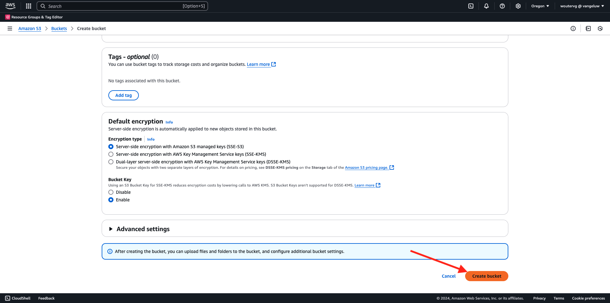
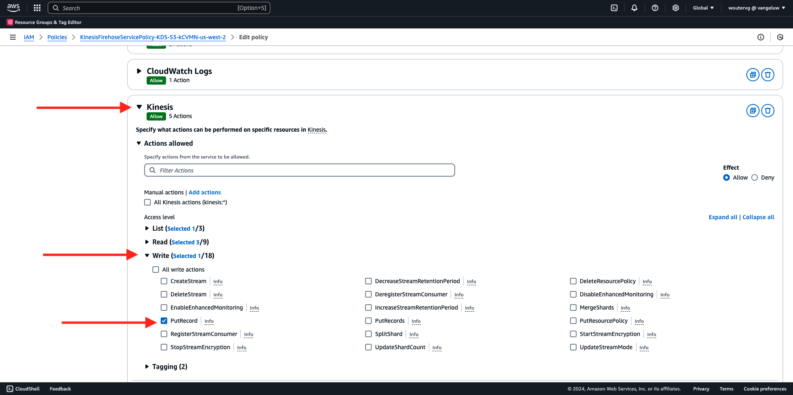

# 2.5.5面向AWS生态系统的未来活动

>[!IMPORTANT]
>
>能否完成本练习是可选的，使用AWS Kinesis需要支付相关费用。 虽然AWS提供了一个免费套餐帐户，可让您免费测试和配置许多服务，但AWS Kinesis并不包含在该免费套餐帐户中。 因此，为了实施和测试此练习，需要支付使用AWS Kinesis的费用。

## 很高兴知道

Adobe Experience Platform支持将各种Amazon服务作为目标。
Kinesis和S3都是[配置文件导出目标](https://experienceleague.adobe.com/docs/experience-platform/destinations/destination-types.html?lang=en)，可以用作Adobe Experience PlatformReal-Time CDP的一部分。
您可以轻松地将高价值区段事件和相关配置文件属性馈送到您选择的系统。

在本注释中，您将了解如何设置自己的Amazon Kinesis流，以将来自Adobe Experience Platform Edge生态系统的事件数据流式传输到云存储目标，如Amazon S3。 如果您希望从Web和移动属性收集体验事件并将它们推送到Datalake中以用于分析和操作报告，则此功能非常有用。 数据湖通常通过大量每日文件导入以批量方式摄取数据，它们不会公开可与事件转发结合使用的公共http端点。

支持上述用例意味着，在将数据写入文件之前，需要缓冲流式传输的数据或将其置于队列中。 必须注意不要打开文件以便跨多个进程进行写访问。 将这项任务委托给专用系统非常适合在保证高服务水平的情况下实现良好扩展，这正是Kinesis需要帮助的地方。

Amazon Kinesis数据流侧重于摄取和存储数据流。 Kinesis Data Firehose侧重于将数据流交付到选定的目标，如S3存储桶。

作为本练习的一部分，您将……

- 执行Kinesis数据流的基本设置
- 创建Firehose投放流并使用S3存储段作为目标
- 将Amazon API网关配置为Rest API端点，以接收事件数据
- 将原始事件数据从Adobe的Edge转发到Kinesis流

## 2.5.5.1配置AWS S3存储段

转到[https://console.aws.amazon.com](https://console.aws.amazon.com)，然后使用您之前创建的Amazon帐户登录。


登录后，您将被重定向到&#x200B;**AWS管理控制台**。


在&#x200B;**查找服务**&#x200B;菜单中，搜索&#x200B;**s3**。 单击第一个搜索结果： **S3 — 云中的可扩展存储**。


您随后将看到&#x200B;**Amazon S3**&#x200B;主页。 单击&#x200B;**创建存储桶**。


在&#x200B;**创建Bucket**&#x200B;屏幕中，您需要配置以下两项内容：

- 名称：使用名称`eventforwarding---aepUserLdap--`。 例如，在本练习中，存储桶名称为&#x200B;**aepmodulertcdpvangeluw**
- 区域：使用区域&#x200B;**EU (Frankfurt) eu-central-1**


保留所有其他默认设置。 向下滚动并单击&#x200B;**创建存储桶**。



然后，您会看到正在创建存储段，并且会被重定向到Amazon S3主页。


## 2.5.5.2配置AWS Kinesis数据流

在&#x200B;**查找服务**&#x200B;菜单中，搜索&#x200B;**kinesis**。 单击第一个搜索结果： **Kinesis — 使用实时流数据**。


选择&#x200B;**Kinesis数据流**。 单击&#x200B;**创建数据流**。


对于&#x200B;**数据流名称**，请使用`--aepUserLdap---datastream`。


无需更改任何其他设置。 向下滚动并单击&#x200B;**创建数据流**。


你会看到这个。 成功创建数据流后，您可以继续进行下一个练习。


## 2.5.5.3配置AWS Firehose投放流

在&#x200B;**查找服务**&#x200B;菜单中，搜索&#x200B;**kinesis**。 单击&#x200B;**Kinesis Data Firehose**。


单击&#x200B;**创建投放流**。


对于&#x200B;**Source**，请选择&#x200B;**Amazon Kinesis数据流**。 对于&#x200B;**目标**，请选择&#x200B;**Amazon S3**。 单击&#x200B;**浏览**&#x200B;以选择您的数据流。


选择您的数据流。 单击&#x200B;**选择**。


你会看到这个。 记住&#x200B;**投放流名称**，因为稍后您将需要它。


向下滚动直到看到&#x200B;**目标设置**。 单击&#x200B;**浏览**&#x200B;以选择您的S3存储段。


选择您的S3存储段并单击&#x200B;**选择**。


然后你将看到类似这样的内容。 更新以下设置：

- 动态分区：设置为&#x200B;**已启用**
- 多记录解聚：设置为&#x200B;**已禁用**
- 新的行分隔符：设置为&#x200B;**已启用**
- JSON的内联分析：设置为&#x200B;**已启用**


向下滚动一下，您将会看到此内容。 更新以下设置：

- 动态分区键
   - 键名称： **dynamicPartitioningKey**
   - JQ表达式： **.dynamicPartitioningKey**
- S3存储段前缀：添加以下代码：

```bash
!{partitionKeyFromQuery:dynamicPartitioningKey}/!{timestamp:yyyy}/!{timestamp:MM}/!{timestamp:dd}/!{timestamp:HH}/}
```

- S3存储段错误输出前缀：设置为&#x200B;**错误**


最后，再向下滚动一点，然后单击&#x200B;**创建投放流**


几分钟后，将创建您的投放流并&#x200B;**激活**。


## 2.5.5.4配置AWS IAM角色

在&#x200B;**查找服务**&#x200B;菜单中，搜索&#x200B;**iam**。 单击&#x200B;**API网关**。


单击&#x200B;**角色**。


搜索您的&#x200B;**KinesisFirehose**&#x200B;角色。 单击以将其打开。


单击您的权限策略名称以将其打开。


在打开的新屏幕中，单击&#x200B;**编辑策略**。


在&#x200B;**Kinesis** - **操作**&#x200B;下，确保启用了&#x200B;**PutRecord**&#x200B;的&#x200B;**写入**&#x200B;权限。 单击&#x200B;**查看策略**。



单击&#x200B;**保存更改**。


你以后会回到这里的。 单击&#x200B;**角色**。


搜索您的&#x200B;**KinesisFirehose**&#x200B;角色。 单击以将其打开。


转到&#x200B;**信任关系**&#x200B;并单击&#x200B;**编辑信任策略**。


通过粘贴此代码以替换现有代码来覆盖当前信任策略：

```json
{
	"Version": "2012-10-17",
	"Statement": [
		{
			"Effect": "Allow",
			"Principal": {
				"Service": [
                    "firehose.amazonaws.com",
                    "kinesis.amazonaws.com",
                    "apigateway.amazonaws.com"
                ]
			},
			"Action": "sts:AssumeRole"
		}
	]
}
```

单击&#x200B;**更新策略**


你会看到这个。 在下一步中，您需要为此角色指定&#x200B;**ARN**。


## 2.5.5.5配置AWS API网关

Amazon API Gateway是一种AWS服务，用于创建、发布、维护、监控以及保护任何规模的REST、HTTP和WebSocket API。 API开发人员可以创建一些API，以访问AWS或其他Web服务以及存储在AWS Cloud中的数据。

现在，您将通过HTTPS端点向Internet公开Kinesis数据流，该端点随后可由Adobe服务（如事件转发）直接使用。

在&#x200B;**查找服务**&#x200B;菜单中，搜索&#x200B;**API网关**。 单击&#x200B;**API网关**。


然后你将看到类似这样的内容。 单击&#x200B;**创建API**。


单击&#x200B;**REST API**&#x200B;卡上的&#x200B;**生成**。


你会看到这个。 填写如下设置：

- 选择协议：选择&#x200B;**REST**
- 创建新API：选择&#x200B;**新API**
- 设置：
   - API名称：使用`--aepUserLdap---eventforwarding`
   - 终结点类型：选择&#x200B;**区域**

单击&#x200B;**创建API**。


你会看到这个。 单击&#x200B;**操作**，然后单击&#x200B;**创建资源**。


你会看到这个。 将&#x200B;**资源名称**&#x200B;设置为&#x200B;**流**。 单击&#x200B;**创建资源**。


你会看到这个。 单击&#x200B;**操作**，然后单击&#x200B;**创建方法**。


在下拉列表中，选择&#x200B;**POST**&#x200B;并单击&#x200B;**v**&#x200B;按钮。


你会看到这个。 填写如下设置：

- 集成类型： **AWS服务**
- AWS地区：选择您的Kinesis数据流使用的地区，在此例中为：**us-west-2**
- AWS服务：选择&#x200B;**Kinesis**
- AWS子域：留空
- HTTP方法：选择&#x200B;**POST**
- 操作类型：选择&#x200B;**使用操作名称**
- 操作：输入&#x200B;**PutRecord**
- 执行角色：按照上一个练习中的说明，粘贴Kinesis Data Firehose使用的执行角色的&#x200B;**ARN**
- 内容处理：选择&#x200B;**通过**
- 使用默认超时：启用复选框

单击&#x200B;**保存**。


你会看到这个。 单击&#x200B;**集成请求**。


单击&#x200B;**HTTP标头**。


向下滚动一点，然后单击&#x200B;**添加标题**。


将&#x200B;**Name**&#x200B;设置为&#x200B;**Content-Type**，将&#x200B;**从**&#x200B;映射到`'application/x-amz-json-1.1'`。 单击&#x200B;**v**&#x200B;图标以保存更改。


你会看到这个。 对于&#x200B;**请求正文直通**，请选择&#x200B;**未定义模板时（推荐）**。 接下来，单击&#x200B;**添加映射模板**。


在&#x200B;**Content-Type**&#x200B;下，输入&#x200B;**application/json**。 单击&#x200B;**v**&#x200B;图标以保存更改。


向下滚动以查找代码编辑器窗口。 将以下代码粘贴到其中：

```json
{
  "StreamName": "$input.path('StreamName')",
  "Data": "$util.base64Encode($input.json('$.Data'))",
  "PartitionKey": "$input.path('$.PartitionKey')"
}
```

单击&#x200B;**保存**。


接下来，向上滚动并单击&#x200B;**&lt; — 方法执行**&#x200B;以返回。


单击&#x200B;**测试**。


向下滚动，并将此代码粘贴到&#x200B;**请求正文**&#x200B;下。 单击&#x200B;**测试**。

```json
{
  "Data": {
    "message": "Hello World",
    "dynamicPartitioningKey": "v2"
  },
  "PartitionKey": "1",
  "StreamName": "--aepUserLdap---datastream"
}
```


您随后将看到类似的结果：


你会看到这个。 单击&#x200B;**操作**，然后单击&#x200B;**部署API**。


对于&#x200B;**部署阶段**，请选择&#x200B;**新建阶段**。 作为&#x200B;**阶段名称**，输入&#x200B;**prod**。 单击&#x200B;**部署**。


你会看到这个。 单击&#x200B;**保存更改**。 仅供参考：图像中的URL是用于向发送数据的URL(在此示例中为：https://vv1i5vwg2k.execute-api.us-west-2.amazonaws.com/prod)。


您可以使用以下cURL请求测试您的设置，您只需将以下URL替换为您的URL（在本示例中为`https://vv1i5vwg2k.execute-api.us-west-2.amazonaws.com/prod`），并在URL的末尾添加`/stream`即可。

```json
curl --location --request POST 'https://vv1i5vwg2k.execute-api.us-west-2.amazonaws.com/prod/stream' \
--header 'Content-Type: application/json' \
--data-raw '{
    "Data": {
        "userid": "--aepUserLdap--@adobe.com",
        "firstName":"--aepUserLdap--",
        "offerName":"10% off on outdoor gears",
        "offerCode": "10OFF-SPRING",
        "dynamicPartitioningKey": "campaign"
    },
    "PartitionKey": "1",
    "StreamName": "--aepUserLdap---datastream"
}'
```

将以上更新的代码粘贴到“终端”窗口中，然后按Enter。 然后，您会看到此响应，类似于上面测试时看到的响应。


## 2.5.5.6更新您的事件转发属性

您现在可以通过AWS API Gateway激活到AWS Kinesis数据流，因此您现在可以将原始体验事件发送到AWS生态系统。 使用Real-Time CDP连接和事件转发，您现在可以轻松启用事件转发到新创建的AWS API网关端点。

### 2.5.5.6.1更新事件转发属性：创建数据元素

转到[https://experience.adobe.com/#/data-collection/](https://experience.adobe.com/#/data-collection/)并转到&#x200B;**事件转发**。 搜索您的事件转发属性，然后单击该属性以将其打开。


在左侧菜单中，转到&#x200B;**数据元素**。 单击&#x200B;**添加数据元素**。


然后，您将看到要配置的新数据元素。


进行以下选择：

- 作为&#x200B;**Name**，输入&#x200B;**awsDataObject**。
- 对于&#x200B;**扩展**，请选择&#x200B;**核心**。
- 作为&#x200B;**数据元素类型**，请选择&#x200B;**自定义代码**。

现在你就可以拥有这个了。 单击&#x200B;**&lt;/>打开编辑器**。


在编辑器中，将以下代码粘贴到第3行。 单击&#x200B;**保存**。

```javascript
const newObj = {...arc.event.xdm, dynamicPartitioningKey: "event_forwarding"}
return JSON.stringify(newObj);
```


>[!NOTE]
>
>在上述路径中，引用了&#x200B;**arc**。 **arc**&#x200B;表示Adobe资源上下文，**arc**&#x200B;始终表示服务器端上下文中可用的最高对象。 可以使用Adobe Experience Platform数据收集服务器功能将增强和转换添加到该&#x200B;**arc**&#x200B;对象。
>
>在上述路径中，引用了&#x200B;**事件**。 **event**&#x200B;表示一个独特事件，Adobe Experience Platform数据收集服务器将始终单独评估每个事件。 有时，您可能会在Web SDK客户端发送的有效负载中看到对&#x200B;**事件**&#x200B;的引用，但在Adobe Experience Platform数据收集事件转发中，将单独评估每个事件。

你以后会回到这里的。 单击&#x200B;**保存**&#x200B;或&#x200B;**保存到库**。


### 2.5.5.6.2更新您的Adobe Experience Platform数据收集服务器属性：更新您的规则

在左侧菜单中，转到&#x200B;**规则**。 单击以打开您在前面的练习中创建的&#x200B;**所有页面**&#x200B;规则。


你会看到这个。 单击&#x200B;**+**&#x200B;图标以添加新操作。


你会看到这个。 进行以下选择：

- 选择&#x200B;**扩展**： **Adobe云连接器**。
- 选择&#x200B;**操作类型**： **发出获取调用**。

这应该为您提供此&#x200B;**名称**： **Adobe云连接器 — 进行获取调用**。 您现在应该会看到以下内容：


接下来，配置以下内容：

- 将请求方法从GET更改为&#x200B;**POST**
- 输入您在前面的步骤之一中创建的AWS API网关端点的URL，它类似于： `https://vv1i5vwg2k.execute-api.us-west-2.amazonaws.com/prod/stream`

您现在应该拥有此项。 接下来，转到&#x200B;**标头**。


在标头下，添加具有键&#x200B;**Content-Type**&#x200B;和值&#x200B;**application/json**&#x200B;的新标头。 接下来，转到&#x200B;**正文**。


你会看到这个。 将以下代码粘贴到字段&#x200B;**Body (Raw)**&#x200B;中。 单击&#x200B;**保留更改**。

```json
{
    "Data":{{awsDataObject}},
    "PartitionKey": "1",
    "StreamName": "--aepUserLdap---datastream"
}
```


到时你会看到回到这里。 单击&#x200B;**保存**&#x200B;或&#x200B;**保存到库**。


现在，您已在Event Forwarding属性中配置了第一个规则。 转到&#x200B;**发布流**以发布您的更改。
单击**Main**&#x200B;打开开发库。


单击&#x200B;**Add All Changed Resources**&#x200B;按钮，随后您将看到在此库中显示的规则和数据元素更改。 接下来，单击&#x200B;**保存并生成以进行开发**。 您的更改正在部署中。


几分钟后，您将看到部署已完成并准备好进行测试。


## 2.5.5.7测试您的配置

转到[https://builder.adobedemo.com/projects](https://builder.adobedemo.com/projects)。 使用Adobe ID登录后，您将看到此内容。 单击您的网站项目以将其打开。


您现在可以按照以下流程访问该网站。 单击&#x200B;**集成**。


在&#x200B;**集成**&#x200B;页面上，您需要选择在练习0.1中创建的数据收集属性。


随后您将看到您的演示网站已打开。 选择URL并将其复制到剪贴板。


打开一个新的无痕浏览器窗口。


粘贴您在上一步中复制的演示网站的URL。 然后，系统将要求您使用Adobe ID登录。


选择您的帐户类型并完成登录过程。


然后，您会看到您的网站已加载到无痕浏览器窗口中。 对于每个演示，您将需要使用新的无痕浏览器窗口来加载演示网站URL。


打开浏览器开发人员视图时，您可以按照以下指示检查网络请求。 使用过滤器&#x200B;**interact**&#x200B;时，您将看到Adobe Experience Platform数据收集客户端发送到Adobe Edge的网络请求。


如果选择原始有效负载，请转到[https://jsonformatter.org/json-pretty-print](https://jsonformatter.org/json-pretty-print)并粘贴有效负载。 单击&#x200B;**美化**。 然后，您将看到JSON有效负载、**事件**&#x200B;对象和&#x200B;**xdm**&#x200B;对象。 在前面的步骤之一中，当您定义数据元素时，使用了引用&#x200B;**arc.event.xdm**，这将导致您解析出此有效负载的&#x200B;**xdm**&#x200B;对象。


将视图切换到&#x200B;**AWS**。 通过打开数据流并进入&#x200B;**监控**&#x200B;选项卡，您现在将看到传入的流量。


当您打开投放流并进入&#x200B;**监控**&#x200B;选项卡时，您也会看到传入的流量。


最后，当您查看S3存储段时，您现在会注意到由于数据摄取而在其中创建了文件。


当您下载此类文件并使用文本编辑器将其打开时，您将看到它包含来自已转发事件的XDM有效负载。


下一步：[摘要和优点](./summary.md)

[返回模块2.5](./aep-data-collection-ssf.md)

[返回所有模块](./../../../overview.md)
