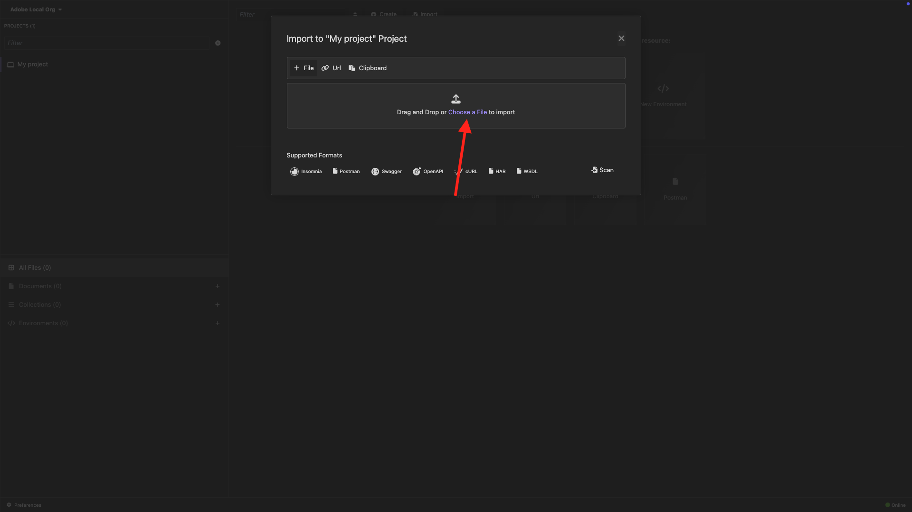

# PostBuster

>[!IMPORTANT]
>
>以下说明仅适用于Adobe员工。

>[!IMPORTANT]
>
>按照以下说明，您将拥有将在这些练习中使用的所有必需API集合：
>
>- [2.1.3可视化您自己的实时客户个人资料 — API](./modules/rtcdp-b2c/module2.1/ex3.md)
>- [2.3.6目标SDK](./modules/rtcdp-b2c/module2.3/ex6.md)
>- [3.3.6使用API测试您的决定](./modules/ajo-b2c/module3.3/ex6.md)
>- [5.1.8查询服务API](./modules/datadistiller/module5.1/ex8.md)

## 安装PostBuster

转到[https://adobe.service-now.com/esc?id=adb_esc_kb_article&sysparm_article=KB0020542](https://adobe.service-now.com/esc?id=adb_esc_kb_article&sysparm_article=KB0020542)。

单击以下载&#x200B;**PostBuster**&#x200B;的最新版本。


下载适用于您的操作系统的正确版本。


下载完成并安装后，打开PostBuster。 您应该会看到此内容。 单击&#x200B;**导入**。


下载[postbuster.json.zip](./assets/postman/postbuster.json.zip)并将其解压缩到桌面上。


单击&#x200B;**选择文件**。



选择文件&#x200B;**aep_tutorial.json**。 单击&#x200B;**打开**。


您应该会看到此内容。 单击&#x200B;**扫描**。


单击&#x200B;**导入**。


您应该会看到此内容。 单击以打开导入的收藏集。


现在，您可以看到自己的收藏集。 您仍需要配置环境以保存某些环境变量。


单击&#x200B;**基本环境**，然后单击&#x200B;**编辑**&#x200B;图标。


您应该会看到此内容。


复制以下环境占位符并将其粘贴到&#x200B;**基本环境**&#x200B;中。

```json
{
	"CLIENT_SECRET": "",
	"API_KEY": "",
	"ACCESS_TOKEN": "",
	"SCOPES": [
		"openid",
		"AdobeID",
		"read_organizations",
		"additional_info.projectedProductContext",
		"session",
		"ff_apis",
		"firefly_api"
	],
	"TECHNICAL_ACCOUNT_ID": "",
	"IMS": "ims-na1.adobelogin.com",
	"IMS_ORG": "",
	"access_token": "",
	"IMS_TOKEN": "",
	"QS_QUERY_ID": "",
	"SANDBOX_NAME": ""
}
```

然后您应该拥有此项。


创建AdobeIO项目后，环境应如下所示。 您现在不需要执行此操作，将在稍后阶段解决此问题。


>[!NOTE]
>
>{width="50px" align="left"}
>
>如果您有任何疑问，希望分享对未来内容提出建议的一般反馈，请直接联系技术业内人士，方式是向&#x200B;**techinsiders@adobe.com**&#x200B;发送电子邮件。

[返回所有模块](./overview.md)
