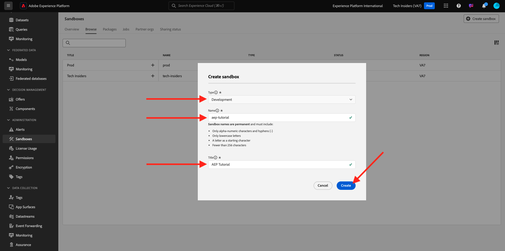
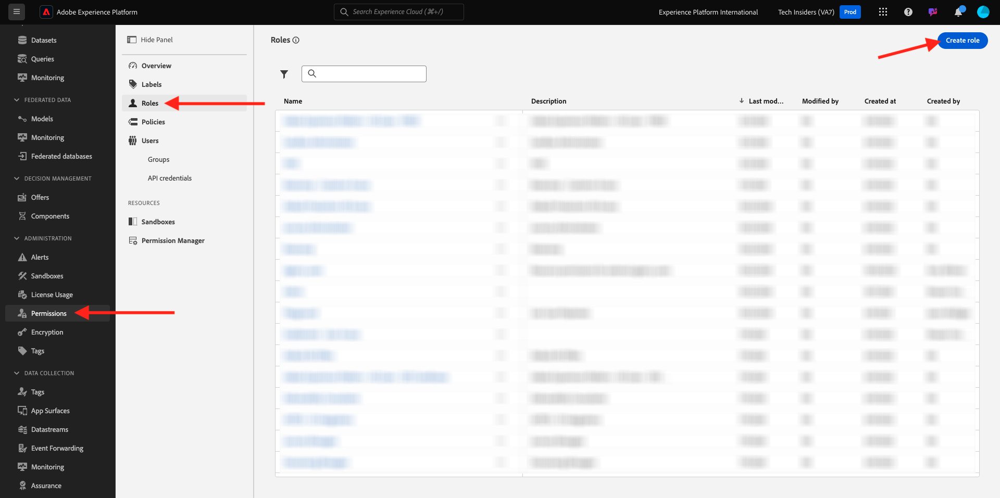
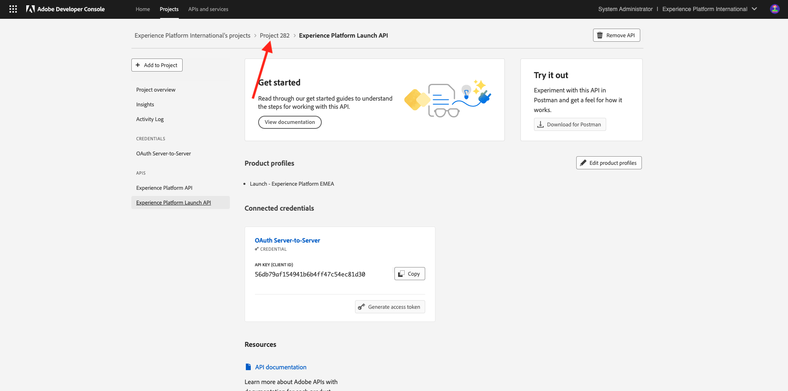
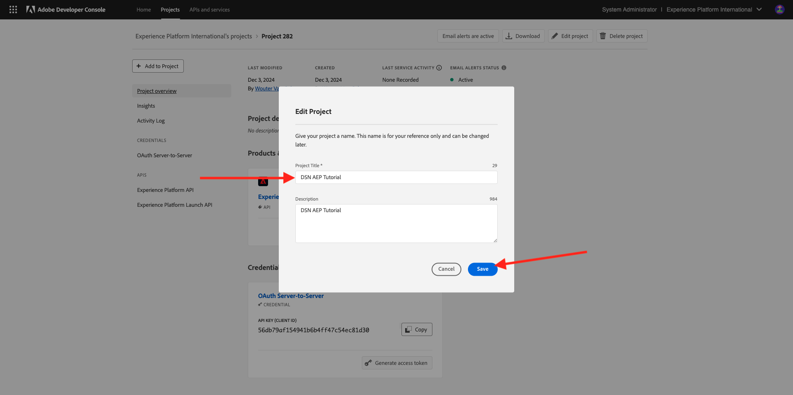

# 设置您的Adobe Experience Platform实例

>[!IMPORTANT]
>
>本页仅供系统管理员角色使用。 您需要具有特定实例系统管理员访问权限才能执行以下步骤。 如果您不是Adobe Experience Cloud组织中的系统管理员，请联系您的系统管理员，并在继续执行以下任何步骤之前请求他们的批准和帮助。

## 概述

为了以实践方式学习所有这些教程，需要在您的IMS组织中配置以下Adobe Experience Cloud应用程序：

- Adobe实时CDP
- Adobe Experience Platform 数据收集
- Adobe Journey Optimizer
- Customer Journey Analytics
- 数据蒸馏器
- 联合受众构成

如果没有为您的IMS组织配置特定应用程序服务，则您将无法以实际操作方式执行该特定练习。

## 创建沙盒

要在您自己的Adobe Experience Platform实例中完成本教程，建议您先设置一个新的开发沙盒。 要创建新沙盒，请转到[https://experience.adobe.com/platform](https://experience.adobe.com/platform)，转到沙盒，然后转到&#x200B;**浏览**。 单击&#x200B;**创建沙盒**。

创建沙盒，如下所示：

- 类型： **开发**
- 名称： **aep-tutorial**
- 标题： **Adobe Experience Platform教程**

单击&#x200B;**创建**。

此时将创建您的沙盒。 几分钟后您会看到此内容。

## 设置权限

转到&#x200B;**权限**，然后转到&#x200B;**角色**。

单击以打开将由学习本教程的学习者使用的特定&#x200B;**角色**。 单击&#x200B;**创建角色**。

为角色命名(如&#x200B;**Adobe Experience Platform Tutorial**)，单击&#x200B;**确认**。

在&#x200B;**沙盒**&#x200B;下拉菜单中，选择您刚刚创建的沙盒，并确保删除任何其他沙盒（同时删除&#x200B;**Prod**）。

添加各种资源并设置权限。 请确保不为&#x200B;**沙盒管理**&#x200B;添加任何权限。

按照指示添加更多资源并设置权限。

按照指示添加更多资源并设置权限。 单击 **Save**。然后，单击&#x200B;**关闭**。

## 设置Adobe I/O

转到
[https://developer.adobe.com/console/integrations](https://developer.adobe.com/console/integrations)。 确保您在正确的实例中。 单击&#x200B;**新建项目**。

单击&#x200B;**添加到项目**，然后单击&#x200B;**API**。

单击&#x200B;**Adobe Experience Platform**，然后启用&#x200B;**Experience PlatformAPI**。 单击&#x200B;**下一步**。

对于&#x200B;**凭据名称**，请使用&#x200B;**DSN AEP教程**。 单击&#x200B;**下一步**。

选择一个可用的产品配置文件。 此产品配置文件不会确定此Adobe I/O项目的权限 — 这将在下一步完成。 单击&#x200B;**保存配置的API**。

单击&#x200B;**添加到项目**，然后再次单击&#x200B;**API**。

单击&#x200B;**Adobe Experience Platform**，然后启用&#x200B;**Experience Platform LaunchAPI**。 单击&#x200B;**下一步**。

单击&#x200B;**下一步**。

选择能够创建和管理数据收集属性的产品配置文件。 单击&#x200B;**保存配置的API**。

你会看到这个。 单击当前&#x200B;**项目XXX**&#x200B;名称。

单击&#x200B;**编辑项目**。

输入新的&#x200B;**项目标题**，如&#x200B;**DSN Adobe Experience Platform教程**。 单击&#x200B;**保存**。

您的Adobe I/O项目现已准备就绪。

## 将Adobe I/O项目链接到角色

转到&#x200B;**权限**，转到&#x200B;**角色**，然后单击您之前创建的新角色。

转到&#x200B;**API凭据**。 单击&#x200B;**+添加API凭据**。

然后，您将看到在上一步中创建的Adobe I/O凭据。 选择它并单击&#x200B;**保存**。

您的Adobe I/O项目现在已设置访问Adobe Experience Platform API所需的权限。

>[!IMPORTANT]
>
>您需要至少等待10分钟，然后才能继续演示系统下一步中的后续步骤。

## 在演示系统中设置环境下一步

转到[https://dsn.adobe.com/tools/org-admin](https://dsn.adobe.com/tools/org-admin)。 单击&#x200B;**+添加组织**。

填写必填字段：

- IMS 组织 ID
- 名称
- 租户ID（不包括任何&#x200B;**下划线**）
- 区域

您的系统管理员应该能够帮助您使用这些字段的值。

单击&#x200B;**保存**。

您的环境现在将成为列表的一部分。 在列表中找到它，然后单击&#x200B;**链接**&#x200B;图标。

现在，您需要输入作为Adobe I/O项目凭据的一部分创建的值。 您可以在此处找到&#x200B;**客户端ID**、**客户端密钥**&#x200B;和&#x200B;**作用域**：

**技术帐户ID**：

复制并粘贴这些内容，单击&#x200B;**保存**。

您的DSN环境现已正确设置。

## 设置您对DSN环境的访问权限

转到[https://dsn.adobe.com/tools/environment-admin](https://dsn.adobe.com/tools/environment-admin)。 选择您刚刚创建的IMS组织，选择您的用户，然后单击&#x200B;**沙盒**&#x200B;下的&#x200B;**+分配**。

输入您在上面的第一步中定义的&#x200B;**沙盒名称**。 它应如下所示：

- 名称： **aep-tutorial**

单击&#x200B;**确认**。

您的沙盒现在可供您选择的用户使用。

## DSN快速设置

转到[https://dsn.adobe.com/quick-setup](https://dsn.adobe.com/quick-setup)。 打开&#x200B;**环境**&#x200B;下拉菜单，然后选择您的IMS组织/沙盒。

对于&#x200B;**配置**，请选择&#x200B;**Global v2.0**。

向下滚动至&#x200B;**Industry - Telco**&#x200B;并选择&#x200B;**Citi Signal - Advanced**。

向上滚动并单击&#x200B;**开始**。

输入&#x200B;**标题**&#x200B;并单击&#x200B;**开始**。

>[!NOTE]
>
>如果沙盒中未创建默认合并策略，您可能会收到错误。 如果是这种情况，请等待一段时间，以自动创建合并策略，或手动转到Adobe Experience Platform，转到配置文件>合并策略并创建新的默认合并策略。

然后，您将看到正在进行的安装的进度，此过程将需要几分钟时间。

成功完成所有工作后，即表示您的Adobe Experience Platform实例配置成功，可供学习者参加教程。

>[!NOTE]
>
>本教程不使用数据导入步骤，因此如果该步骤失败，请不要担心，请继续。

转到[https://experience.adobe.com/platform](https://experience.adobe.com/platform)，转到&#x200B;**数据集**。 您现在应该会看到类似的数据集列表，这些数据集全部由DSN快速设置程序创建。

>[!NOTE]
>
>感谢您花时间学习Adobe Experience Platform及其应用程序的所有知识。 如果您有任何疑问，希望分享对未来内容提出建议的一般反馈，请直接联系技术业内人士，方式是向&#x200B;**techinsiders@adobe.com**&#x200B;发送电子邮件。

{width="50px" align="left"}

>[!NOTE]
>
>如果您有任何疑问，希望分享对未来内容提出建议的一般反馈，请直接联系技术业内人士，方式是向&#x200B;**techinsiders@adobe.com**&#x200B;发送电子邮件。

[返回所有模块](./overview.md)
