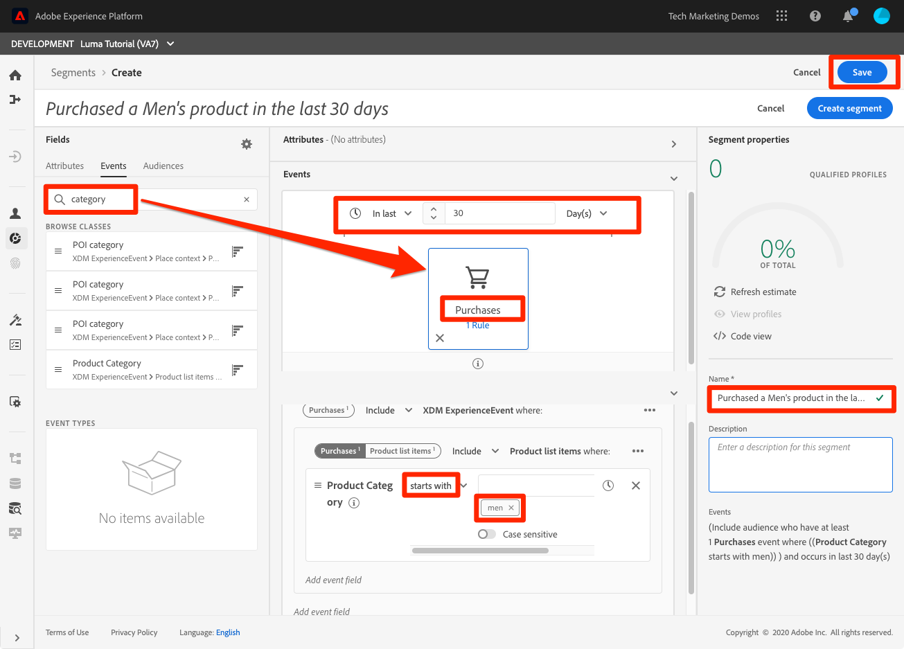

# 构建区段

<!-- 30 min-->
在本课程中，我们将根据我们在之前课程中摄取的用户档案数据构建一些区段。

拥有实时客户用户档案后，您可以创建具有相似特征且可能对营销策略做出类似响应的个人区段。 这些区段的构建基块是您之前创建的XDM字段。

**数据架构师** 将需要在本教程之外创建区段，并支持其同事执行此任务。

在开始练习之前，请观看此简短视频，了解有关创建区段的更多信息：
>[!VIDEO](https://video.tv.adobe.com/v/27254?quality=12&learn=on)

## 所需权限

在 [配置权限](configure-permissions.md) 课程中，您将设置完成本课程所需的所有访问控制，具体说明：

* 权限项 **[!UICONTROL 配置文件管理]** > **[!UICONTROL 管理区段]**, **[!UICONTROL 查看区段]**&#x200B;和 **[!UICONTROL 导出受众区段]**
* 权限项 **[!UICONTROL 配置文件管理]** > **[!UICONTROL 查看配置文件]**&#x200B;和 **[!UICONTROL 管理配置文件]**
* 权限项 **[!UICONTROL 沙箱]** > `Luma Tutorial`
* 用户对 `Luma Tutorial Platform` 产品配置文件
* 开发人员角色对 `Luma Tutorial Platform` 产品配置文件（用于API）

## 构建基本区段

让我们为具有金牌或白金状态的忠诚度计划客户创建一个简单的区段

1. 在Platform用户界面中，转到 **[!UICONTROL 区段]** 在左侧导航中
1. 选择 **[!UICONTROL 创建区段]** 按钮
1. 架构生成器左侧有三个选项卡，分别用于“属性”（记录数据）、“事件”（时间系列数据）和“受众”
1. 选择齿轮图标可注意区段生成器默认如何仅显示包含数据的字段，并允许您更改合并策略
1. 在“属性”选项卡中，导航到 **XDM个人资料>忠诚度** 文件夹（您还可以搜索“忠诚度”）
1. 拖放， `Tier` 从“属性字段”菜单到“区段生成器”画布
1. 选择 `Tier` 等于 `Gold` 或 `Platinum`
1. 选择 **[!UICONTROL 刷新估计]** 查看符合区段资格条件的用户档案数
1. 作为 **[!UICONTROL 名称]**，输入 `Luma customers with level Gold or Above`
1. 选择 **[!UICONTROL 保存]**
   

<!--## Build a sequential segment-->

## 构建动态区段

在本练习中，我们将为在30天内购买了同一产品两次的客户创建一个区段。 动态区段允许您使用字段作为变量来缩放分段。

1. 转到 **[!UICONTROL 区段]** 在左侧导航中
1. 选择 **[!UICONTROL 创建区段]** 按钮
1. 选择 **[!UICONTROL 事件]** 选项卡
1. 筛选列表以 `purchases`
1. 拖动 **[!UICONTROL 购买]** 事件类型到画布上 _两次_
1. 选择两个 **[!UICONTROL 购买]** 事件并选择“在30天内”
1. 确认此时段定义为 **“包括至少具有1次购买事件的受众，然后在30天内至少具有1次购买事件”**

   
1. 现在，将事件过滤器更改为 `sku`
1. 将SKU字段拖动到第二个购买事件
   
1. 现在，清除事件过滤器
1. 您应会在 **[!UICONTROL 浏览变量]** 部分，则存在两个购买事件的文件夹。 单击以浏览 **[!UICONTROL 购买1]**\
   
1. 深入到 **[!UICONTROL 产品列表项]** 文件夹，选择 **[!UICONTROL SKU]** ，并将其拖动到 **[!UICONTROL 等于]** 操作数。 将鼠标悬停在区域上时，将其放在“添加到比较操作数”部分
1. 命名区段 `Bought same product within 30 days`
1. 确认受众定义为 **“包括那些在30天内至少发生了1次购买事件且至少发生了1次购买事件(（SKU等于购买1 SKU）的受众”**
1. 选择 **[!UICONTROL 保存]** 按钮

   

## 构建多实体区段

请记住，我们是如何在 `Luma Offline Purchase Events Schema` 和 `Luma Product Catalog Schema` 在早期课堂上？ 我们这样做是为了能够在架构中使用多实体分段的关系。

借助高级多实体分段功能，您可以使用多个XDM类创建区段以扩展您的架构。 因此，区段生成器可以像其他字段是配置文件数据存储的本机字段一样访问其他字段

您将通过应用您在 `Luma Product Catalog Schema` 和 `Luma Offline Purchase Events Schema`.

1. 转到 **[!UICONTROL 区段]** 在左侧导航中
1. 选择 **[!UICONTROL 创建区段]** 按钮
1. 选择 **[!UICONTROL 事件]** 选项卡
1. 筛选列表以 `purchases`
1. 拖动 **[!UICONTROL 购买]** 事件类型到画布上
1. 选择事件上方的时钟下拉列表，然后选择 **[!UICONTROL 最近30天]**
1. 筛选 **[!UICONTROL 事件]** 列表 `category` 然后将 **[!UICONTROL 产品类别]** 字段上 **[!UICONTROL 购买]**
1. 将运算符更改为 **[!UICONTROL 开头]** 输入 `men` 框中
1. 作为 **[!UICONTROL 名称]**，输入 `Purchased a Men's product in the last 30 days`
1. 确认受众定义 `(Include audience who have at least 1 Purchases event where ((Product Category starts with men)) ) and occurs in last 30 day(s)`
1. 选择 **[!UICONTROL 保存]** 按钮

   

## 批量和流分段

单击 **[!UICONTROL 区段]** 在左侧导航中，让我们花些时间查看我们的三个区段：

* 我们的两个区段是批处理客户细分，一个是流客户细分。
* Platform会尽可能默认使用流式分段，以便客户在符合条件时即符合区段的资格条件。 当区段定义对于流式处理而言过于复杂时，它们将自动转换为批处理。 在这种情况下，两个区段默认为批处理，因为购买事件的回顾窗口大于七天。 有关流限制的完整和最新列表，请参阅 [文档](https://experienceleague.adobe.com/docs/experience-platform/segmentation/ui/streaming-segmentation.html).
* 批处理作业按每日计划运行，可关闭。

## 其他资源

* [Segmentation Service文档](https://experienceleague.adobe.com/docs/experience-platform/segmentation/home.html)
* [分段服务API参考](https://www.adobe.io/experience-platform-apis/references/segmentation/)

分段方面有更多内容，特别是对于激活区段而言。 这些主题将在另一个教程中介绍。

你已经通过了所有的练习！ 请转到 [结论](conclusion.md).
