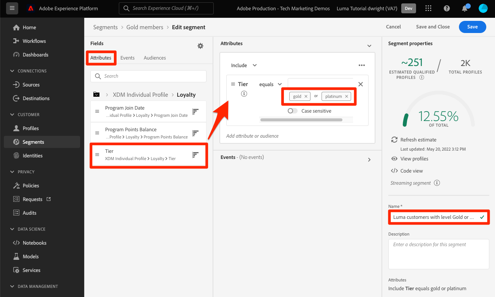

# 构建区段

<!-- 30 min-->
在本课程中，我们将根据在前一课程中摄取的用户档案数据构建一些区段。

一旦您拥有实时客户档案，您就可以创建具有相似特征并可能以类似方式响应营销策略的个人区段。 这些区段的构建基块是您之前创建的XDM字段。

**数据架构师** 将需要在本教程之外创建区段，并通过此任务支持他们的同事。

在开始练习之前，请观看此简短视频，了解有关创建区段的更多信息：
>[!VIDEO](https://video.tv.adobe.com/v/27254?learn=on)

## 所需的权限

在 [配置权限](configure-permissions.md) 在本课程中，您将设置完成本课程所需的所有访问控制，特别是：

* 权限项 **[!UICONTROL 用户档案管理]** > **[!UICONTROL 管理区段]**， **[!UICONTROL 查看区段]**、和 **[!UICONTROL 导出受众区段]**
* 权限项 **[!UICONTROL 用户档案管理]** > **[!UICONTROL 查看配置文件]**、和 **[!UICONTROL 管理配置文件]**
* 权限项 **[!UICONTROL 沙盒]** > `Luma Tutorial`
* 对的用户角色访问权限 `Luma Tutorial Platform` 产品配置文件
* 开发人员角色访问 `Luma Tutorial Platform` 产品配置文件（用于API）

## 构建基本区段

让我们为具有金级或白金级的忠诚度计划客户创建一个简单的区段

1. 在平台用户界面中，转到 **[!UICONTROL 区段]** 在左侧导航中
1. 选择 **[!UICONTROL 创建区段]** 按钮
1. 架构生成器的左侧有三个选项卡，分别代表属性（记录数据）、事件（时间序列数据）和受众
1. 选择齿轮图标以记录区段生成器的默认设置方式，即仅显示包含数据的字段，并允许您更改合并策略
1. 在属性选项卡中，导航到 **XDM个人资料>忠诚度** 文件夹（您还可以搜索“忠诚度”）
1. 拖放， `Tier` 从属性字段菜单到区段生成器画布
1. 选择 `Tier` 等于 `Gold` 或 `Platinum`
1. 选择 **[!UICONTROL 刷新估计]** 查看有多少用户档案符合您的区段的条件
1. 作为 **[!UICONTROL 名称]**，输入 `Luma customers with level Gold or Above`
1. 选择 **[!UICONTROL 保存]**
   

<!--## Build a sequential segment-->

## 构建动态区段

在本练习中，我们将为在30天内购买过两次相同产品的客户创建一个区段。 利用动态区段，您可以使用字段作为变量来扩展分段。

1. 转到 **[!UICONTROL 区段]** 在左侧导航中
1. 选择 **[!UICONTROL 创建区段]** 按钮
1. 选择 **[!UICONTROL 活动]** 选项卡
1. 筛选列表至 `purchases`
1. 拖动 **[!UICONTROL 购买]** 将事件类型置于画布上 _两次_
1. 选择两者之间的时钟图标 **[!UICONTROL 购买]** 事件并选择“在30天内”
1. 确认此时您的区段定义为 **“包括至少具有1个购买事件，然后在30天内至少具有1个购买事件的受众”**
   
1. 现在，将事件筛选器更改为 `sku`
1. 将SKU字段拖至第二个购买事件
   
1. 现在清除事件过滤器
1. 您应会看到 **[!UICONTROL 浏览变量]** 部分中，存在两个购买事件的文件夹。 单击以浏览 **[!UICONTROL 购买1]**\
   
1. 深入了解 **[!UICONTROL 产品列表项]** 文件夹，选择 **[!UICONTROL SKU]** 字段，并将其拖动到 **[!UICONTROL 等于]** 操作数。 将鼠标悬停在该区域上时，将其放入“Add to compare opands”（添加以比较操作数）部分
1. 命名您的区段 `Bought same product within 30 days`
1. 确认您的受众定义为 **“包括至少具有1个购买事件的受众，然后在30天内具有至少1个购买事件，其中(（SKU等于购买1 SKU）)”**
1. 选择 **[!UICONTROL 保存]** 按钮

   

## 构建多实体区段

请记住，我们是如何在 `Luma Offline Purchase Events Schema` 和 `Luma Product Catalog Schema` 在之前的课程中？ 我们这样做是为了在架构中使用多实体分段关系。

借助高级多实体分段功能，您可以使用多个XDM类创建区段以扩展架构。 因此，区段生成器可以访问其他字段，就像它们是配置文件数据存储中的原生字段一样

您将通过应用在以下对象之间构建的关系来创建下一个区段： `Luma Product Catalog Schema` 和您的 `Luma Offline Purchase Events Schema`.

1. 转到 **[!UICONTROL 区段]** 在左侧导航中
1. 选择 **[!UICONTROL 创建区段]** 按钮
1. 选择 **[!UICONTROL 活动]** 选项卡
1. 筛选列表至 `purchases`
1. 拖动 **[!UICONTROL 购买]** 将事件类型置于画布上
1. 选择事件上方的时钟下拉菜单，然后选择 **[!UICONTROL 最近30天]**
1. 筛选 **[!UICONTROL 活动]** 列表至 `category` 然后拖动 **[!UICONTROL 产品类别]** 字段到 **[!UICONTROL 购买]**
1. 将运算符更改为 **[!UICONTROL 开头为]** 并输入 `men` 放入文本框中
1. 作为 **[!UICONTROL 名称]**，输入 `Purchased a Men's product in the last 30 days`
1. 确认受众定义 `(Include audience who have at least 1 Purchases event where ((Product Category starts with men)) ) and occurs in last 30 day(s)`
1. 选择 **[!UICONTROL 保存]** 按钮

   

## 批量分段和流式分段

单击 **[!UICONTROL 区段]** 在左侧导航中，让我们花些时间查看一下我们的三个区段：

* 我们的两个区段是批处理区段，一个是流式区段。
* Platform会尽可能默认使用流式客户细分，这样客户在符合条件后即可尽快获得细分资格。 当区段定义过于复杂而无法流式传输时，它们会自动转换为批处理。 在这种情况下，这两个区段将默认使用批处理，因为采购事件的回顾时间范围大于7天。 有关流限制的完整最新列表，请参阅 [文档](https://experienceleague.adobe.com/docs/experience-platform/segmentation/ui/streaming-segmentation.html).
* 批处理作业按每日计划运行，可以切换该计划。

## 其他资源

* [Segmentation Service文档](https://experienceleague.adobe.com/docs/experience-platform/segmentation/home.html?lang=zh-Hans)
* [分段服务API参考](https://www.adobe.io/experience-platform-apis/references/segmentation/)

分段还有更多功能，尤其是激活区段时。 这些主题将在另一个教程中讨论。

你做完了所有的练习！ 请转到 [结论](conclusion.md).
