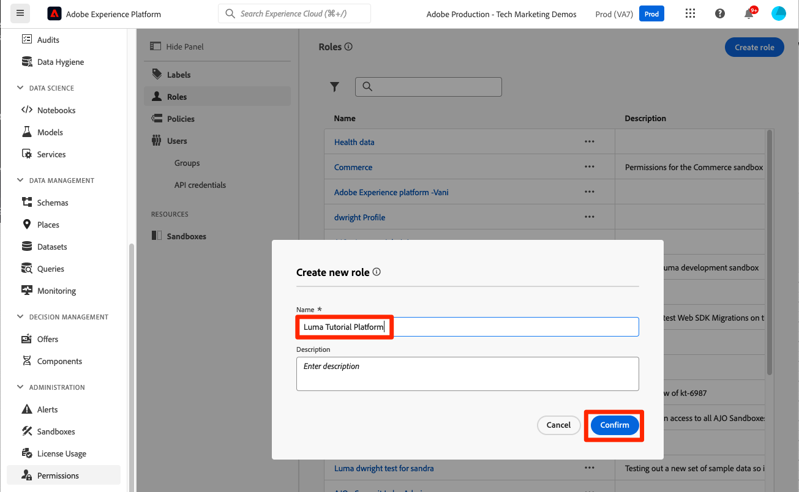

# 配置权限

<!--30min-->

在本课程中，您将使用Platform界面中的[!DNL Adobe's Admin Console]和[!UICONTROL 权限]屏幕配置Adobe Experience Platform用户权限。

访问控制是Experience Platform中的一项关键隐私功能，我们建议将权限限制为人员履行其工作职能所需的最低权限。 有关详细信息，请参阅[访问控制文档](https://experienceleague.adobe.com/docs/experience-platform/access-control/home.html?lang=zh-Hans)。

数据架构师和数据工程师是Adobe Experience Platform的高级用户，您需要获得许多权限才能完成本教程并在以后的日常工作中完成。 数据架构师可能参与其公司的&#x200B;*其他Platform用户*&#x200B;的管理，例如营销人员、分析师和数据科学家。 完成本课程后，请考虑如何使用这些功能管理公司的其他用户。

**数据架构师**&#x200B;经常在本教程之外为其他用户配置权限。

>[!IMPORTANT]
>
>Adobe Experience Cloud产品的系统管理员必须完成本课程中的某些步骤，这些步骤将在章节标题中介绍。 如果您不是系统管理员，请与您公司的管理员联系，要求他们完成这些任务。 在[设置Developer Console和Postman](set-up-developer-console-and-postman.md)课程中，还需要完成一项任务。

## 关于Admin Console

[!DNL Admin Console]是用于管理用户对所有Adobe Experience Cloud产品的访问权限的界面。 要访问Platform，必须在Admin Console中添加用户或用户，然后在Adobe Experience Platform的“权限”屏幕中管理其所有精细的权限项。

以下是Platform现有角色的简要摘要：

* 产品配置文件的&#x200B;**用户**&#x200B;可以根据产品配置文件中分配的权限在Platform用户界面中完成任务。
* **开发人员**&#x200B;可以在Adobe Developer Console中创建API凭据和项目，以便开始使用Experience PlatformAPI
* **产品管理员**&#x200B;可以在Adobe Admin Console中将用户和开发人员添加到Adobe Experience Platform产品中，并在Platform界面的“权限”屏幕中管理粒度用户访问权限。
* **系统管理员**&#x200B;可以添加产品管理员，并基本上管理所有Adobe Experience Cloud产品的任何权限。

## 将用户和开发人员添加到`AEP-Default-All-Users`产品配置文件（需要系统管理员或产品管理员）

在本练习中，您或系统管理员或产品管理员会将您添加为Adobe Admin ConsoleAdobe Experience Platform产品中的用户和开发人员。

>[!NOTE]
>
>如果您是系统管理员，正在为参加本教程的同事提供帮助，请考虑将您的同事添加为Adobe Experience Platform的&#x200B;*产品管理员*。 作为产品管理员，他们将来能够自行完成这些步骤并管理其他Experience Platform用户。

要将教程参与者添加为[!UICONTROL 用户]和[!UICONTROL 开发人员]，请执行以下操作：

1. 登录[Adobe Admin Console](https://adminconsole.adobe.com)
1. 在顶部导航中选择&#x200B;**[!UICONTROL 产品]**
1. 选择&#x200B;**Adobe Experience Platform**
   
1. 您的Experience Platform实例中可能已经存在多个配置文件。 选择`AEP-Default-All-Users`配置文件
   

1. 转到&#x200B;**[!UICONTROL 用户]**&#x200B;选项卡
1. 选择&#x200B;**[!UICONTROL 添加用户]**&#x200B;按钮
   
1. 完成工作流以将教程参与者作为用户添加到产品配置文件

1. 转到&#x200B;**[!UICONTROL 开发人员]**&#x200B;选项卡
1. 选择&#x200B;**[!UICONTROL 添加开发人员]**&#x200B;按钮
   
1. 完成工作流以将教程参与者作为开发人员添加到产品配置文件

## 在Adobe Experience Platform中添加角色（需要系统管理员或产品管理员）

Experience Platform的粒度权限在Platform界面的“权限”屏幕中进行管理。 只有系统和产品管理员才有权访问此屏幕，因此如果您没有管理员权限，则需要拥有该权限的用户协助。

权限在“角色”中进行管理。 为教程创建角色：

1. 登录[Adobe Experience Platform](https://platform.adobe.com)
1. 在左侧导航中选择&#x200B;**[!UICONTROL 权限]**，您将转到[!UICONTROL 角色]屏幕
1. 选择&#x200B;**[!UICONTROL 创建角色]**

   
1. 为角色命名`Luma Tutorial Platform`（如果贵公司的多个人员正在参加本教程，请添加该教程参与者的姓名），然后选择&#x200B;**[!UICONTROL 确认]**

   

1. 使用&#x200B;**[!UICONTROL +]**&#x200B;和&#x200B;**[!UICONTROL 全部添加]**&#x200B;为以下资源添加所有权限项：

   1. 数据建模
   1. 数据管理
   1. 用户档案管理
   1. Identity Management
   1. 沙盒管理
   1. 查询服务
   1. 数据收集
   1. 数据治理
   1. 仪表板
   1. 警报

      

1. 在数据摄取下，添加管理源和查看源权限项。

1. 添加所有权限项后，请确保选择保存按钮
   

在[创建沙盒](create-a-sandbox.md)和[设置Developer Console和Postman](set-up-developer-console-and-postman.md)课程之后，您将对此角色进行一些小更新。

## 创建数据收集产品配置文件（需要系统管理员或产品管理员）

在本练习中，您或您公司的系统管理员将为数据收集(以前称为Adobe Experience Platform Launch)创建产品配置文件，并将您添加为产品配置文件管理员。

>[!NOTE]
>
>如果您是系统管理员，正在向同事提供本教程的帮助，请考虑将他们添加为数据收集的&#x200B;*产品管理员*。 作为产品管理员，他们将能够自行完成这些步骤，并在将来管理数据收集的其他用户。

要创建产品配置文件，请执行以下操作：

1. 在[!DNL Adobe Admin Console]中，转到Adobe Experience Platform数据收集产品
1. 添加名为`Luma Tutorial Data Collection`的新配置文件（如果贵公司的多个人员正在参加本教程，请在该教程的结尾处添加该教程参与者的姓名）
1. 关闭&#x200B;**[!UICONTROL 属性]** > **[!UICONTROL 自动包含]**&#x200B;设置
1. 此时不分配任何属性或权限
1. 将教程参与者添加为此用户档案的管理员

完成这些步骤后，您应该会看到`Luma Tutorial Data Collection`配置文件已设置为一位管理员。

## 配置数据收集产品配置文件

现在您是`Luma Tutorial Data Collection`产品配置文件的管理员，您可以配置完成本教程所需的权限和角色。

### 添加权限

现在，您将向配置文件添加各个权限项：

1. 在[Adobe Admin Console](https://adminconsole.adobe.com)中，转到&#x200B;**[!UICONTROL 产品]** > **[!UICONTROL 数据收集]**
1. 打开`Luma Tutorial Data Collection`配置文件
1. 转到&#x200B;**[!UICONTROL 权限]**&#x200B;选项卡
1. 打开&#x200B;**[!UICONTROL 平台]**
1. 确保选择所有可用的平台（根据您的许可证，您可能会看到不同的选项）
1. **[!UICONTROL 保存]**&#x200B;任何更改
   
1. 打开&#x200B;**[!UICONTROL 属性]**
1. 确保&#x200B;**[!UICONTROL 自动包含]**&#x200B;切换为关闭，以便您无法访问任何属性（我们将在稍后添加）
1. **[!UICONTROL 保存]**&#x200B;任何更改
   
1. 打开&#x200B;**[!UICONTROL 属性权限]**
1. 选择&#x200B;**[!UICONTROL 全部添加]**&#x200B;以添加所有属性权限
1. **[!UICONTROL 保存]**
   
1. 打开&#x200B;**[!UICONTROL 公司权限]**
1. 添加&#x200B;**[!UICONTROL 管理属性]**
1. 选择&#x200B;**[!UICONTROL 保存]**
   

### 将您自己添加为用户

现在将您自己作为用户添加到数据收集配置文件：

1. 转到&#x200B;**[!UICONTROL 用户]**&#x200B;选项卡
1. 选择&#x200B;**[!UICONTROL 添加用户]**&#x200B;按钮
   
1. 完成工作流以将您自己作为用户添加到产品配置文件

您无需将自己添加为数据收集的开发人员。

现在，您几乎拥有完成本教程所需的所有权限！ 您将在[!DNL Adobe Admin Console]内再进行两次调整，包括在[创建沙盒](create-a-sandbox.md)后进行的一次调整！
