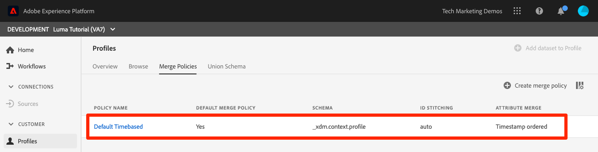

# 创建合并策略

<!--20 min-->

在本课程中，您将创建合并策略，以优先考虑如何将多个数据源合并到配置文件中。

Adobe Experience Platform允许您将来自多个来源的数据整合在一起，并将这些数据组合在一起，以便查看每个客户的完整视图。 在汇总此数据时，合并策略将确定数据的优先顺序以及合并哪些数据以创建该统一视图。

在本课程中，我们将坚持使用用户界面，但也可以使用API选项创建合并策略。

**数据架构师**&#x200B;需要在本教程之外创建合并策略。

在开始练习之前，请观看此简短视频，了解有关合并策略的更多信息：
>[!VIDEO](https://video.tv.adobe.com/v/345074?captions=chi_hans&learn=on&enablevpops)

## 所需的权限

在[配置权限](configure-permissions.md)课程中，您已设置完成本课程所需的所有访问控制。

<!--* Permission items **[!UICONTROL Profile Management]** > **[!UICONTROL View Merge Policies]** and **[!UICONTROL Manage Merge Policies]**
* Permission item **[!UICONTROL Profile Management]** > **[!UICONTROL View Profiles]** and **[!UICONTROL Manage Profiles]**
* Permission item **[!UICONTROL Sandboxes]** > `Luma Tutorial`
* User-role access to the `Luma Tutorial Platform` product profile
-->

## 关于合并策略和合并架构

您可能还记得，在关于批量摄取的课程中，我们为同一客户上传了两条信息稍有不同的记录。 在[!DNL Loyalty]数据中，客户的名字是`Daniel`，他住在`New York City`，但在CRM数据中，客户的名字是`Danny`，他住在`Portland`。 客户数据会随着时间的推移而不断变化。 也许他从`Portland`移到了`New York City`。 其他因素也会发生变化，例如电话号码和电子邮件地址。 当两个数据源为同一用户提供不同的信息时，合并策略可帮助您决定如何处理这些类型的冲突。

那么，为什么`Danny`作为名字而胜出？ 让我们看一下：

1. 在Platform用户界面中，从左侧导航中选择&#x200B;**[!UICONTROL 配置文件]**
1. 转到&#x200B;**[!UICONTROL 合并策略]**&#x200B;选项卡
1. 默认合并策略按时间戳排序。 由于您在忠诚度数据之后上传CRM数据，因此`Danny`在配置文件中作为名字获胜：

为配置文件启用多个架构时，将为所有启用配置文件的记录架构自动创建[!UICONTROL 联合架构]，记录架构共享基类。 您可以通过转到[!UICONTROL 合并架构]选项卡来查看&#x200B;**[!UICONTROL 合并架构]**。

请注意，ExperienceEvent类没有合并架构。 虽然ExperienceEvent数据仍登陆配置文件，因为它是基于时间序列的，但每个事件都包含时间戳和ID，因此不存在冲突。

现在，如果您不喜欢该默认合并策略，该怎么办？ 如果Luma认为他们的忠诚体系应该成为冲突时真相的来源呢？ 为此，我们将创建一个合并策略。

## 在UI中创建合并策略

1. 在合并策略屏幕上，选择右上角的&#x200B;**[!UICONTROL 创建合并策略]**&#x200B;按钮
1. 作为&#x200B;**[!UICONTROL Name]**，输入`Loyalty Prioritized`
1. 作为&#x200B;**[!UICONTROL 架构]**，选择&#x200B;**[!UICONTROL XDM配置文件]**(请注意，您的自定义类（由于是记录数据）也可用于合并策略)
1. 对于&#x200B;**[!UICONTROL Id拼接]**，请选择&#x200B;**[!UICONTROL 专用图形]**
1. 对于&#x200B;**[!UICONTROL 属性合并]**，选择&#x200B;**[!UICONTROL 数据集优先顺序]**
1. 将`Luma Loyalty Dataset`和`Luma CRM Dataset`拖放到&#x200B;**[!UICONTROL 数据集]**&#x200B;面板。
1. 通过将`Luma Loyalty Dataset`拖放到`Luma CRM Dataset`的上方以确保位于顶部
1. 选择&#x200B;**[!UICONTROL 保存]**&#x200B;按钮
   <!--do i need to explain Private Graph? Is that GA?-->
   

## 验证合并策略

让我们看看合并策略是否正在按我们期望的方式运行：

1. 转到&#x200B;**[!UICONTROL 浏览]**&#x200B;选项卡
1. 将&#x200B;**[!UICONTROL 合并策略]**&#x200B;更改为新的`Loyalty Prioritized`策略
1. 作为&#x200B;**[!UICONTROL 身份命名空间]**，使用您的`Luma CRM Id`
1. 由于&#x200B;**[!UICONTROL 标识值]**&#x200B;使用`b642b4217b34b1e8d3bd915fc65c4452`
1. 选择&#x200B;**[!UICONTROL 显示配置文件]**&#x200B;按钮
1. `Daniel`回来了！

## 创建具有有限数据集的合并策略

使用数据集优先级创建合并策略时，只有包含在右侧中的相同基类的数据集会包含在配置文件中。 让我们设置另一个合并策略

1. 在合并策略屏幕上，选择右上角的&#x200B;**[!UICONTROL 创建合并策略]**&#x200B;按钮
1. 作为&#x200B;**[!UICONTROL Name]**，输入`Loyalty Only`
1. 作为&#x200B;**[!UICONTROL 架构]**，选择&#x200B;**[!UICONTROL XDM配置文件]**
1. 对于&#x200B;**[!UICONTROL Id拼接]**，选择&#x200B;**[!UICONTROL 无]**
1. 对于&#x200B;**[!UICONTROL 属性合并]**，选择&#x200B;**[!UICONTROL 数据集优先顺序]**
1. 仅将`Luma Loyalty Dataset`拖放到&#x200B;**[!UICONTROL 选定数据集]**&#x200B;面板。
1. 选择&#x200B;**[!UICONTROL 保存]**&#x200B;按钮

## 验证合并策略

现在，我们来看看此合并策略的作用：

1. 转到&#x200B;**[!UICONTROL 浏览]**&#x200B;选项卡
1. 将&#x200B;**[!UICONTROL 合并策略]**&#x200B;更改为新的`Loyalty Only`策略
1. 作为&#x200B;**[!UICONTROL 身份命名空间]**，使用您的`Luma CRM Id`
1. 由于&#x200B;**[!UICONTROL 标识值]**&#x200B;使用`b642b4217b34b1e8d3bd915fc65c4452`
1. 选择&#x200B;**[!UICONTROL 显示配置文件]**&#x200B;按钮
1. 确认未找到配置文件：
   

CRM ID是`Luma Loyalty Dataset`中的标识字段，但只能使用主标识查找配置文件。 那么，让我们使用主要身份`Luma Loyalty Id`查找配置文件”

1. 将&#x200B;**[!UICONTROL 身份命名空间]**&#x200B;更改为`Luma Loyalty Id`
1. 由于&#x200B;**[!UICONTROL 标识值]**&#x200B;使用`5625458`
1. 选择&#x200B;**[!UICONTROL 显示配置文件]**&#x200B;按钮
1. 选择配置文件ID以打开配置文件
1. 转到&#x200B;**[!UICONTROL 属性]**&#x200B;选项卡
1. 请注意，CRM数据集中的其他配置文件详细信息（如手机号码和电子邮件地址）不可用，因为我们的`Loyalty Only`合并策略不包含CRM数据集。
   
1. 转到&#x200B;**[!UICONTROL 事件]**&#x200B;选项卡
1. ExperienceEvent数据可用，尽管未明确将其包含在合并策略数据集中：
   

## 有关合并策略的更多信息

在配置文件搜索中，将使用的合并策略更改回`Default Timebased`并选择&#x200B;**[!UICONTROL 显示配置文件]**&#x200B;按钮。 丹尼回来了！

这是怎么回事？ 整合个人资料并不是一蹴而就的事情。 根据多种因素（包括使用哪种合并策略），动态组合实时客户用户档案。 您可以创建要在不同的上下文中使用的多个合并策略，具体取决于您希望使用的客户视图。

合并策略的一个主要用例是数据管理。 例如，假设您将第三方数据摄取到Platform，该平台不能用于个性化用例，但&#x200B;_可以_&#x200B;用于广告用例。 您可以创建排除此第三方数据集的合并策略，并使用此合并策略为您的广告用例生成区段。

## 其他资源

* [合并策略文档](https://experienceleague.adobe.com/docs/experience-platform/profile/merge-policies/overview.html?lang=zh-Hans)
* [合并策略API（实时客户个人资料API的一部分）引用](https://www.adobe.io/experience-platform-apis/references/profile/#tag/Merge-policies)

现在我们转到[数据治理框架](apply-data-governance-framework.md)。
