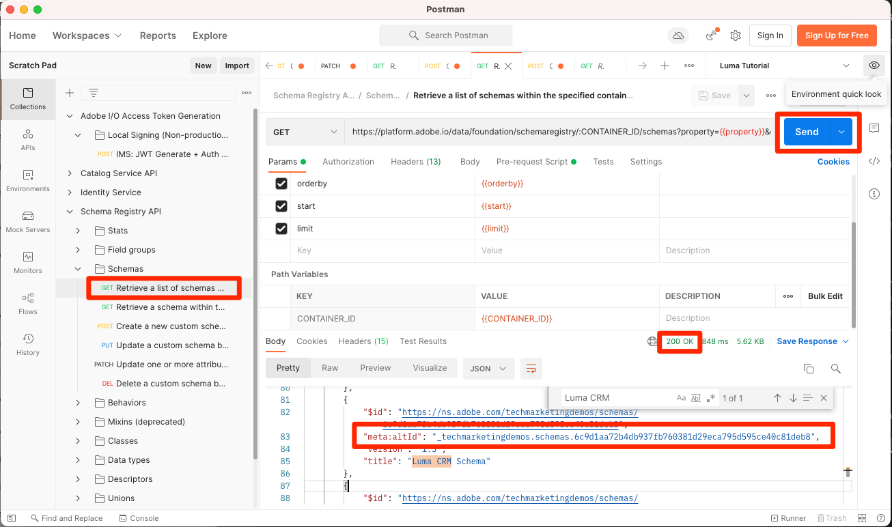

# 启用Real-Time Customer Profile

<!-- 15min-->
在本课程中，您将为Real-time Customer Profile启用架构和数据集。

好吧，我说数据集课程是本教程中最短的一课时，我撒谎了 — 这个课程应该用更少的时间！ 实际上，你所要做的就是做一些切换。 但是当你翻动这些开关时 _真的_ 这很重要，所以我想用整整一页来讲述。

利用实时客户档案，您可以查看合并了来自多个渠道（包括在线、离线、CRM和第三方数据）的数据的每个单个客户的整体视图。 用户档案允许您将不同的客户数据整合到一个统一的视图中，并提供每个客户互动的可操作、带时间戳的帐户。

虽然听起来很神奇，但您无需激活 *您的所有数据* 用于配置文件。 实际上，您应该只启用激活用例所需的数据。 启用要用于营销用例、呼叫中心集成等的数据，在这些用例中，您需要快速访问强大的客户档案。 如果您上载的数据仅用于分析，则可能不应为配置文件启用该功能。

这里有些重要的 [Real-Time Customer Profile数据的护栏](https://experienceleague.adobe.com/docs/experience-platform/profile/guardrails.html?lang=en) 在决定您自己的哪些数据应为配置文件启用时，您应该查看这些数据。

<!--is this accurate. Are there other considerations to point out? -->

**数据架构师** 将需要在本教程之外启用Real-Time Customer Profile。

在开始练习之前，请观看此简短视频，了解有关Real-Time Customer Profile的更多信息：
>[!VIDEO](https://video.tv.adobe.com/v/27251?quality=12&learn=on)

## 所需的权限

在 [配置权限](configure-permissions.md) 在本课程中，您将设置完成本课程所需的所有访问控制。


<!--* Permission items **[!UICONTROL Data Modeling]** > **[!UICONTROL View Schemas]** and **[!UICONTROL Manage Schemas]**
* Permission items **[!UICONTROL Data Management]** > **[!UICONTROL View Datasets]** and **[!UICONTROL Manage Datasets]**
* Permission item **[!UICONTROL Sandboxes]** > `Luma Tutorial`
* User-role access to the `Luma Tutorial Platform` product profile
* Developer-role access to the `Luma Tutorial Platform` product profile (for API)
-->

## 使用Platform用户界面为Real-time Customer Profile启用架构

让我们从启用架构的简单任务开始：

1. 在Platform用户界面中打开 **Luma忠诚度模式**
1. In **[!UICONTROL 架构属性]**，切换 **个人资料** 切换
1. 在确认模式中，按 **[!UICONTROL 启用]** 按钮以确认
1. 选择 **[!UICONTROL 保存]** 按钮以保存更改

   >[!IMPORTANT]
   >
   >为配置文件启用架构后，无法禁用或删除该架构。 此外，在此时间点之后，无法从架构中删除字段。 在随后的“生产”环境中使用您自己的数据时，请务必牢记这些含义。 您应在本教程中使用开发沙盒，可随时删除它。
   >
   >在本教程的受控环境中，您将为用户档案启用架构和数据集， _提取任何数据之前_. 在使用您自己的数据时，我们建议您按照以下顺序执行操作：
   >
   > 1. 首先，将一些数据摄取到数据集中。
   > 1. 解决在数据摄取过程中出现的任何问题（例如，数据验证或映射问题）。
   > 1. 为配置文件启用数据集和架构
   > 1. 重新摄取数据


   

很简单，对吧？ 对这些其他架构重复上述步骤：

1. Luma产品目录架构
1. Luma离线购买事件架构
1. Luma Web事件架构（在确认模式下，选中“此架构的数据将在identityMap字段中包含主标识”框。）

## 使用平台API为Real-time Customer Profile启用架构

现在，是时候启用 `Luma CRM Schema` 使用API。 如果您想跳过此练习，而只是在用户界面中启用它，请直接进行。

### 获取架构的meta：altId

首先，让我们获取 `meta:altId` 的 `Luma CRM Schema`：

1. Open [!DNL Postman]
1. 如果您没有访问令牌，请打开请求 **[!DNL OAuth: Request Access Token]** 并选择 **发送** 来请求新的访问令牌，就像在 [!DNL Postman] 上课。
1. 打开请求 **[!DNL Schema Registry API > Schemas > Retrieve a list of schemas within the specified container.]**
1. 选择 **发送** 按钮
1. 您应会收到200响应
1. 在响应中查找 `Luma CRM Schema` 并复制 `meta:altId` 值
   

### 启用架构

现在我们有了架构的meta：altId，可以为配置文件启用它：

1. 打开请求 **[!DNL Schema Registry API > Schemas > Update one or more attributes of a custom schema specified by ID.]**
1. 在 **参数** 粘贴您的 `meta:altId` 值作为 `SCHEMA_ID` 参数值
1. 在 **正文** 选项卡，粘贴以下代码

   ```json
   [{
       "op": "add",
       "path": "/meta:immutableTags",
       "value": ["union"]
   }]
   ```

1. 选择 **发送** 按钮
1. 您应会收到200响应

   

您应该能够在用户界面中看到已为配置文件启用所有五个架构（您可能需要SHIFT — 重新加载才能看到这一点） `Luma CRM Schema` 已启用)：


## 使用Platform用户界面为Real-time Customer Profile启用数据集

还必须为配置文件启用数据集，并且过程更简单：

1. 在Platform用户界面中打开 `Luma Loyalty Dataset`
1. 切换 **[!UICONTROL 个人资料]** 切换
1. 在确认模式中，按 **[!UICONTROL 启用]** 按钮以确认

   

对这些其他数据集重复上述步骤：

1. Luma产品目录数据集
1. Luma离线购买事件数据集
1. Luma Web事件数据集

>[!NOTE]
>
>与架构不同，您可以从配置文件中禁用数据集，但所有之前摄取的数据将保留在配置文件中。

## 使用平台API为Real-time Customer Profile启用数据集

现在，您将使用API为配置文件启用数据集。 同样，如果您希望使用上述方法通过用户界面启用它，这也没问题。

### 获取数据集的id

首先，我们需要获取 `id` 的 `Luma CRM Dataset`：

1. Open [!DNL Postman]
1. 如果您没有访问令牌，请打开请求 **[!DNL OAuth: Request Access Token]** 并选择 **发送** 来请求新的访问令牌，就像在 [!DNL Postman] 上课。
1. 打开请求 **[!DNL Catalog Service API > Datasets > Retrieve a list of datasets.]**
1. 选择 **发送** 按钮
1. 您应会收到200响应
1. 在响应中查找 `Luma CRM Dataset` 项目并复制id：
   

### 启用数据集

现在我们有了数据集的ID，可以为配置文件启用它：

1. 打开请求 **[!DNL Catalog Service API > Datasets > Update one or more attributes of a dataset specified by ID.]**
1. 在 **参数** 更新 `DATASET_ID` 对您自己的价值
1. 在 **正文** 选项卡，粘贴以下代码。 请注意，前两个值是预先存在的标记，在上一个响应中可见。 除了我们即将添加的两个新标记之外，还需要将它们包含在正文中：

   ```json
   {
       "tags":{
           "adobe/pqs/table":["luma_crm_dataset"],
           "adobe/siphon/table/format":["parquet"],
           "unifiedProfile":["enabled:true"],
           "unifiedIdentity":["enabled:true"]
           }
   }
   ```

1. 选择 **发送** 按钮
1. 您应会收到200响应

   

您还可以确认用户界面显示数据集已启用：


>[!IMPORTANT]
>
> 如果您在为用户档案启用架构和数据集之前摄取数据，则以后需要再次摄取该数据。

## 其他资源

* [Real-time Customer Profile文档](https://experienceleague.adobe.com/docs/experience-platform/profile/home.html?lang=zh-Hans)
* [Real-Time Customer Profile API参考](https://www.adobe.io/experience-platform-apis/references/profile/)


**数据工程师** 应继续到 [订阅数据摄取事件](subscribe-to-data-ingestion-events.md) 上课。
**数据架构师** _可以跳过前面_ 然后转到 [批量摄取课程](ingest-batch-data.md).
