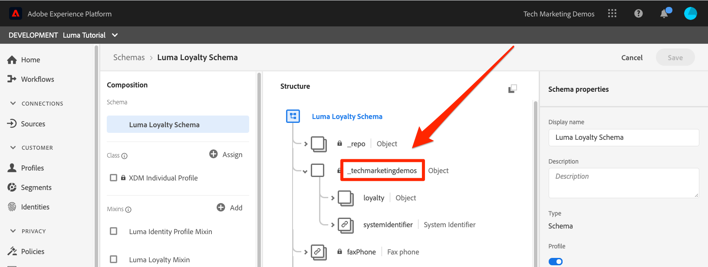
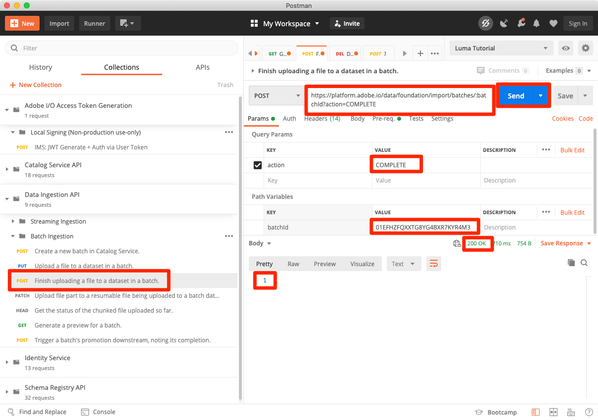
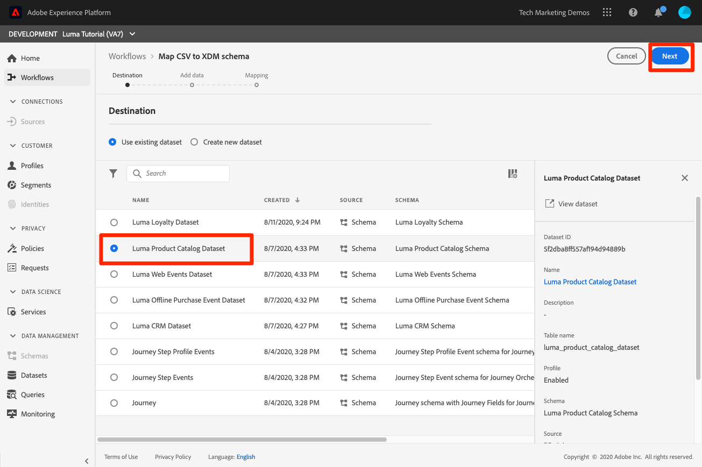

# 摄取批量数据

<!-- 1hr-->
在本课程中，您将使用各种方法将批量数据摄取到Experience Platform中。

批量数据摄取允许您一次将大量数据摄取到Adobe Experience Platform。 您可以在Platform的界面中或使用API一次性上传并摄取批量数据。 您还可以使用源连接器从第三方服务（如云存储服务）定期配置计划的批量上传。

**数据工程师** 将需要在本教程之外摄取批量数据。

在开始练习之前，请观看此简短视频，了解有关数据摄取的更多信息：
>[!VIDEO](https://video.tv.adobe.com/v/27106?quality=12&learn=on)


## 所需的权限

在 [配置权限](configure-permissions.md) 在本课程中，您将设置完成本课程所需的所有访问控制。

<!--
* Permission item **[!UICONTROL Data Management]** > **[!UICONTROL View Datasets]**, **[!UICONTROL Manage Datasets]** and **[!UICONTROL Data Monitoring]**
* Permission items **[!UICONTROL Data Ingestion]** > **[!UICONTROL View Sources]** and **[!UICONTROL Manage Sources]**
* Permission item **[!UICONTROL Profile Management]** > **[!UICONTROL View Profiles]**
* Permission item **[!UICONTROL Sandboxes]** > `Luma Tutorial`
* User-role access to the `Luma Tutorial Platform` product profile
* Developer-role access to the `Luma Tutorial Platform` product profile (for API)
-->

在“源”练习中，您将需要访问(S) FTP服务器或云存储解决方案。 如果您没有解决方法，则可以采取相应的措施。

## 使用Platform用户界面批量摄取数据

数据可以采用JSON和Parquet格式直接上传到数据集屏幕上的数据集中。 这是创建后测试部分数据摄取的绝佳方法

### 下载并准备数据

首先，获取示例数据并根据租户对其进行自定义：

>[!NOTE]
>
>数据包含在 [luma-data.zip](assets/luma-data.zip) 文件是虚构的，仅用于演示目的。

1. 下载 [luma-data.zip](assets/luma-data.zip) 敬您的 **Luma教程资产** 文件夹。
1. 解压缩文件，创建一个名为的文件夹 `luma-data` ，其中包含我们在本课程中将使用的四个数据文件
1. 打开 `luma-loyalty.json` 并替换的所有实例 `_techmarketingdemos` 具有您自己的underscore-tenant id，如您自己的架构中所示：
   

1. 保存更新的文件

### 摄取数据

1. 在Platform用户界面中，选择 **[!UICONTROL 数据集]** 在左侧导航中
1. 打开您的 `Luma Loyalty Dataset`
1. 向下滚动直到您看到 **[!UICONTROL 添加数据]** 右列的部分
1. 上传 `luma-loyalty.json` 文件。
1. 上传文件后，将出现批处理的一行
1. 如果在几分钟后重新加载页面，您应该会看到该批次已成功上传，包含1000条记录和1000个配置文件片段。

   
   <!--do i need to explain error diagnostics and partial ingestion-->

>[!NOTE]
>
>有几个选择， **[!UICONTROL 错误诊断]** 和 **[!UICONTROL 部分摄取]**，您将在本课程的各个屏幕上看到。 这些选项在本教程中未介绍。 一些快速信息：
>
>* 启用错误诊断会生成有关数据摄取的数据，然后您可以使用数据访问API查看这些数据。 要了解更多相关内容，请参阅 [文档](https://experienceleague.adobe.com/docs/experience-platform/data-access/home.html).
>* 部分摄取允许您摄取包含错误的数据，最多可摄取到您可以指定的特定阈值。 要了解更多相关内容，请参阅 [文档](https://experienceleague.adobe.com/docs/experience-platform/ingestion/batch/partial.html)

### 验证数据

有几种方法可以确认数据已成功摄取。

#### 在Platform用户界面中验证

要确认数据已引入数据集，请执行以下操作：

1. 在您摄取数据的同一页面上，选择 **[!UICONTROL 预览数据集]** 右上角的按钮
1. 选择 **预览** 按钮上，您应该能够查看一些摄取的数据。

   


要确认数据登陆用户档案（可能需要几分钟时间才能将数据登陆），请执行以下操作：

1. 转到 **[!UICONTROL 配置文件]** 在左侧导航中
1. 选择旁边的图标 **[!UICONTROL 选择身份命名空间]** 字段以打开模式窗口
1. 选择您的 `Luma Loyalty Id` 命名空间
1. 然后，输入其中一项 `loyaltyId` 数据集中的值，  `5625458`
1. 选择 **[!UICONTROL 视图]**
   

#### 使用数据摄取事件进行验证

如果您在上一课程中订阅了数据摄取事件，请检查您独特的webhook.site URL。 您应该会看到以下三个请求按以下顺序显示，中间有一些时间，如下所示 `eventCode` 值：

1. `ing_load_success` — 摄取的批次
1. `ig_load_success` — 批次被摄取到身份图中
1. `ps_load_success` — 批次已引入配置文件服务


请参阅 [文档](https://experienceleague.adobe.com/docs/experience-platform/ingestion/quality/subscribe-events.html#available-status-notification-events) 以了解有关通知的更多详细信息。

## 使用平台API批量摄取数据

现在，让我们使用API上传数据。

>[!NOTE]
>
>数据架构师随时可以通过用户界面方法上传CRM数据。

### 下载并准备数据

1. 您应该已经下载并解压缩 [luma-data.zip](assets/luma-data.zip) 到您的 `Luma Tutorial Assets` 文件夹。
2. 打开 `luma-crm.json` 并替换的所有实例 `_techmarketingdemos` 使用您自己的underscore-tenant id，如您的架构中所示
3. 保存更新的文件

### 获取数据集ID

首先，我们获取要向其引入数据的数据集的数据集ID的ID：

1. Open [!DNL Postman]
1. 如果您没有访问令牌，请打开请求 **[!DNL OAuth: Request Access Token]** 并选择 **发送** 来请求新的访问令牌，就像在 [!DNL Postman] 上课。
1. 打开您的环境变量，并确保 **CONTAINER_ID** 仍为 `tenant`
1. 打开请求 **[!DNL Catalog Service API > Datasets > Retrieve a list of datasets.]** 并选择 **发送**
1. 您应该获得一个 `200 OK` 响应
1. 复制的ID `Luma CRM Dataset` 来自响应正文
   

### 创建批次

现在，我们可以在数据集中创建一个批次：

1. 下载 [数据摄取API.postman_collection.json](https://raw.githubusercontent.com/adobe/experience-platform-postman-samples/master/apis/experience-platform/Data%20Ingestion%20API.postman_collection.json) 敬您的 `Luma Tutorial Assets` 文件夹
1. 将收藏集导入 [!DNL Postman]
1. 选择请求 **[!DNL Data Ingestion API > Batch Ingestion > Create a new batch in Catalog Service.]**
1. 将以下内容粘贴为 **正文** 请求的， ***将datasetId值替换为您自己的值***：

   ```json
   {
       "datasetId":"REPLACE_WITH_YOUR_OWN_DATASETID",
       "inputFormat": {
           "format": "json"
       }
   }
   ```

1. 选择 **发送** 按钮
1. 您应会收到一个包含新批次ID的“201已创建”响应！
1. 复制 `id` 新批次的
   

### 摄取数据

现在，我们可以将数据上传到批次中：

1. 选择请求 **[!DNL Data Ingestion API > Batch Ingestion > Upload a file to a dataset in a batch.]**
1. 在 **参数** 选项卡，在相应的字段中输入您的数据集id和批次id
1. 在 **参数** 选项卡，输入 `luma-crm.json` 作为 **文件路径**
1. 在 **正文** 选项卡，选择 **二进制** option
1. 选择下载的 `luma-crm.json` 来自您的本地 `Luma Tutorial Assets` 文件夹
1. 选择 **发送** 并且您应会在响应正文中获得包含“1”的“200 OK”响应

   

此时，如果您在Platform用户界面中查看批次，您会看到它位于“[!UICONTROL 正在加载]”状态：


由于批处理API通常用于上传多个文件，因此您需要告知平台批次何时完成，我们将在下一步执行此操作。

### 完成批次

要完成批，请执行以下操作：

1. 选择请求 **[!DNL Data Ingestion API > Batch Ingestion > Finish uploading a file to a dataset in a batch.]**
1. 在 **参数** 选项卡，输入 `COMPLETE` 作为 **操作**
1. 在 **参数** 选项卡，输入批次id。 如果数据集id或filePath存在，则无需担心。
1. 确保POST的URL为 `https://platform.adobe.io/data/foundation/import/batches/:batchId?action=COMPLETE` 并且没有任何不必要的引用 `datasetId` 或 `filePath`
1. 选择 **发送** 并且您应会在响应正文中获得包含“1”的“200 OK”响应

   

### 验证数据

#### 在Platform用户界面中验证

验证数据是否已像对“忠诚度”数据集所做的那样登陆Platform用户界面。

首先，确认该批次显示已摄取1000条记录：


接下来，使用预览数据集确认批次：


最后，通过查找其中一个用户档案，确认已创建其中一个用户档案 `Luma CRM Id` 命名空间，例如 `112ca06ed53d3db37e4cea49cc45b71e`


我想指出一件有趣的事情，刚刚发生。 打开该 `Danny Wright` 个人资料。 配置文件同时具有 `Lumacrmid` 和 `Lumaloyaltyid`. 记住 `Luma Loyalty Schema` 包含两个标识字段：Luma忠诚度ID和CRM ID。 现在，我们已经上传了两个数据集，它们已合并到单个配置文件中。 忠诚度数据具有 `Daniel` “New York City”（纽约市）作为家庭地址，而CRM数据具有 `Danny` 作为名字和 `Portland` 作为具有相同忠诚度ID的客户的家庭地址。 我们回头来看看名字为什么会出现 `Danny` 在关于合并策略的课程中。

恭喜，您刚刚合并了配置文件！


#### 使用数据摄取事件进行验证

如果您在上一课程中订阅了数据摄取事件，请检查您独特的webhook.site URL。 您应该会看到三个请求进入，就像忠诚度数据一样：


请参阅 [文档](https://experienceleague.adobe.com/docs/experience-platform/ingestion/quality/subscribe-events.html#available-status-notification-events) 以了解有关通知的更多详细信息。

## 使用工作流引入数据

我们来看看另一种上传数据的方法。 工作流功能允许您摄取尚未在XDM中建模的CSV数据。

### 下载并准备数据

1. 您应该已经下载并解压缩 [luma-data.zip](assets/luma-data.zip) 到您的 `Luma Tutorial Assets` 文件夹。
1. 确认您拥有`luma-products.csv`

### 创建工作流

现在，让我们设置工作流：

1. 转到 **[!UICONTROL 工作流]** 在左侧导航中
1. 选择 **[!UICONTROL 将CSV映射到XDM架构]** 并选择 **[!UICONTROL Launch]** 按钮
   
1. 选择您的 `Luma Product Catalog Dataset` 并选择 **[!UICONTROL 下一个]** 按钮
   
1. 添加 `luma-products.csv` 您下载的文件并选择 **[!UICONTROL 下一个]** 按钮
   
1. 现在，您位于映射器界面中，可以在其中映射源数据（中的列名称之一）中的字段。 `luma-products.csv` 文件)到XDM字段。 在我们的示例中，列名称与架构字段名称足够接近，因此映射器能够自动检测正确的映射！ 如果映射器无法自动检测右字段，则可以选择目标字段右侧的图标以选择正确的XDM字段。 此外，如果您不想从CSV摄取其中一列，则可以从映射器中删除该行。 欢迎您随时尝试和更改中的栏标题 `luma-products.csv` 以熟悉地图绘制器的工作方式。
1. 选择 **[!UICONTROL 完成]** 按钮
   

### 验证数据

上传批次后，通过预览数据集来验证上传。

由于 `Luma Product SKU` 是非人员命名空间，我们将不会看到产品SKU的任何配置文件。

您应该会看到对webhook的三个点击。

## 通过源引入数据

好吧，你做事很辛苦。 现在，让我们进入的乐土 _自动_ 批量摄取！ 当我说“SET IT！” 你说，“算了！” “设定它！” “算了！” “设定它！” “算了！” 开个玩笑，你绝不会做这种事！ 好了，回去工作。 你快完成了。

转到 **[!UICONTROL 源]** 在左侧导航中打开源目录。 在这里，您将看到与业界领先的数据和存储提供商的各种现成的集成。


好，让我们使用源连接器摄取数据。

这个练习将是你自己的冒险风格。 我将使用FTP源连接器显示工作流。 您可以使用在公司中使用的其他云存储源连接器，也可以使用数据集用户界面上传json文件，就像我们处理忠诚度数据时所做的那样。

许多源都具有类似的配置工作流，您可以在其中执行以下操作：

1. 输入您的身份验证详细信息
1. 选择要摄取的数据
1. 选择要将其摄取到的Platform数据集
1. 将字段映射到您的XDM架构
1. 选择要从该位置摄取数据的频率

>[!NOTE]
>
>我们将在本练习中使用的离线购买数据包含日期时间数据。 日期时间数据应位于以下任一位置： [ISO 8061格式字符串](https://www.iso.org/iso-8601-date-and-time-format.html) (“2018-07-10T15”:05:59.000-08:00”)或以毫秒(1531263959000)为单位的Unix时间，并在摄取时转换为目标XDM类型。 有关数据转换和其他限制的更多信息，请参阅 [批量摄取API文档](https://experienceleague.adobe.com/docs/experience-platform/ingestion/batch/api-overview.html#types).

### 下载、准备数据并将其上传到您首选的云存储供应商

1. 您应该已经下载并解压缩 [luma-data.zip](assets/luma-data.zip) 到您的 `Luma Tutorial Assets` 文件夹。
1. 打开 `luma-offline-purchases.json` 并替换的所有实例 `_techmarketingdemos` 使用您自己的underscore-tenant id，如您的架构中所示
1. 更新所有时间戳，以便事件发生在上个月(例如，搜索 `"timestamp":"2022-06` 并替换年和月)
1. 选择您首选的云存储提供商，并确保它在 [!UICONTROL 源] 目录
1. 上传 `luma-offline-purchases.json` 到首选云存储提供商中的位置

### 将数据摄取到您的首选云存储位置

1. 在Platform用户界面中，筛选 [!UICONTROL 源] 目录到 **[!UICONTROL 云存储]**
1. 请注意，在下，提供了指向文档的便捷链接 `...`
1. 在首选云存储供应商的框中，选择 **[!UICONTROL 配置]** 按钮
   
1. **[!UICONTROL 身份验证]** 是第一步。 输入帐户名称，例如 `Luma's FTP Account` 以及您的身份验证详细信息。 对于所有云存储源，此步骤应该非常相似，尽管字段可能稍有不同。 输入帐户的身份验证详细信息后，您可以将其重新用于其他源连接，这些源连接可能按不同计划发送与同一帐户中其他文件不同的数据
1. 选择 **[!UICONTROL “连接到源”按钮]**
1. 当Platform成功连接到源时，选择 **[!UICONTROL 下一个]** 按钮
   

1. 在 **[!UICONTROL 选择数据]** 步骤，用户界面将使用您的凭据打开云存储解决方案上的文件夹
1. 选择您要摄取的文件，例如 `luma-offline-purchases.json`
1. 作为 **[!UICONTROL 数据格式]**，选择 `XDM JSON`
1. 然后，您可以预览文件中的json结构和示例数据
1. 选择 **[!UICONTROL 下一个]** 按钮
   

1. 在 **[!UICONTROL 映射]** 步骤，选择您的 `Luma Offline Purchase Events Dataset` 并选择 **[!UICONTROL 下一个]** 按钮。 在消息中请注意，由于我们要摄取的数据是JSON文件，因此没有将源字段映射到目标字段的映射步骤。 JSON数据必须已位于XDM中。 如果您正在摄取CSV，您将在以下步骤中看到完整映射用户界面：
   
1. 在 **[!UICONTROL 计划]** 步骤，选择从源中摄取数据的频率。 请花些时间查看相关选项。 我们只进行一次性摄取，所以请将 **[!UICONTROL 频率]** 日期 **[!UICONTROL 一次]** 并选择 **[!UICONTROL 下一个]** 按钮：
   
1. 在 **[!UICONTROL 数据流详细信息]** 步骤，您可以选择数据流名称，输入可选描述，打开错误诊断以及部分摄取。 保持设置不变并选择 **[!UICONTROL 下一个]** 按钮：
   
1. 在 **[!UICONTROL 审核]** 步骤，您可以同时查看所有设置并进行编辑或选择 **[!UICONTROL 完成]** 按钮
1. 保存后，您将登陆一个屏幕，如下所示：
   

### 验证数据

上传批次后，通过预览数据集来验证上传。

您应该会看到对webhook的三个点击。

查找具有值的配置文件 `5625458` 在 `loyaltyId` 命名空间中，查看其配置文件中是否存在任何购买事件。 您应该会看到一次购买。 您可以通过选择 **[!UICONTROL 查看JSON]**：


## ETL工具

与多个ETL供应商Adobe合作伙伴以支持将数据摄取到Experience Platform中。 由于第三方供应商的多样性，本教程中不包含ETL，但欢迎您查看以下部分资源：

* [为Adobe Experience Platform开发ETL集成](https://experienceleague.adobe.com/docs/experience-platform/etl/home.html)
* [有关Adobe交换的“信息Adobe Experience Platform连接器”页面](https://exchange.adobe.com/experiencecloud.details.101570.informatica-adobe-experience-cloud-connector.html)
* [Adobe Experience Platform Connector的Informatica文档](https://docs.informatica.com/integration-cloud/cloud-data-integration-connectors/current-version/adobe-experience-platform-connector/preface.html)
* [[!DNL Snaplogic] Adobe Experience Platform快照包](https://www.snaplogic.com/resources/videos/august-2020-aep)

## 其他资源

* [批量摄取文档](https://experienceleague.adobe.com/docs/experience-platform/ingestion/batch/overview.html)
* [批量摄取API参考](https://www.adobe.io/experience-platform-apis/references/data-ingestion/#tag/Batch-Ingestion)

现在，我们 [使用Web SDK流式传输数据](ingest-streaming-data.md)
