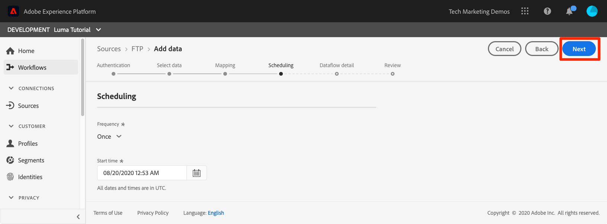
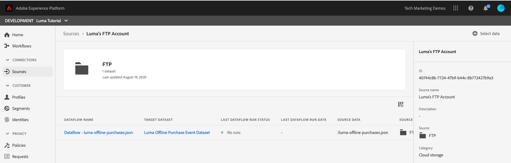

# 摄取批次数据

<!-- 1hr-->
在本课程中，您将使用各种方法将批量数据摄取到Experience Platform中。

批量数据摄取允许您一次将大量数据摄取到Adobe Experience Platform。 您可以在Platform的界面中或使用API一次性摄取批量数据。 您还可以使用Source连接器配置从第三方服务（例如云存储服务）定期计划的批量上传。

**数据工程师**&#x200B;需要在本教程之外摄取批量数据。

在开始练习之前，请观看此简短视频，了解有关数据摄取的更多信息：

>[!VIDEO](https://video.tv.adobe.com/v/27106?learn=on)


## 所需的权限

在[配置权限](configure-permissions.md)课程中，您已设置完成本课程所需的所有访问控制。

<!--
* Permission item **[!UICONTROL Data Management]** > **[!UICONTROL View Datasets]**, **[!UICONTROL Manage Datasets]** and **[!UICONTROL Data Monitoring]**
* Permission items **[!UICONTROL Data Ingestion]** > **[!UICONTROL View Sources]** and **[!UICONTROL Manage Sources]**
* Permission item **[!UICONTROL Profile Management]** > **[!UICONTROL View Profiles]**
* Permission item **[!UICONTROL Sandboxes]** > `Luma Tutorial`
* User-role access to the `Luma Tutorial Platform` product profile
* Developer-role access to the `Luma Tutorial Platform` product profile (for API)
-->

在“源”练习中，您将需要访问(S)FTP服务器或云存储解决方案。 如果您没有解决方法，则可以采取相应的措施。

## 使用Platform用户界面批量摄取数据

数据可以采用JSON和Parquet格式直接上传到数据集屏幕上的数据集中。 这是创建后测试部分数据摄取的绝佳方法

### 下载并准备数据

首先，获取示例数据并为租户对其进行自定义：

>[!NOTE]
>
>[luma-data.zip](assets/luma-data.zip)文件中包含的数据是虚构的，仅用于演示目的。

1. 将[luma-data.zip](assets/luma-data.zip)下载到您的&#x200B;**Luma Tutorial Assets**&#x200B;文件夹。
1. 解压缩文件，创建一个名为`luma-data`的文件夹，其中包含我们将在本课程中使用的四个数据文件
1. 在文本编辑器中打开`luma-loyalty.json`并使用您自己的下划线租户ID替换`_techmarketingdemos`的所有实例，如您自己的架构中所示：
   

1. 保存更新的文件

### 摄取数据

1. 在Platform用户界面中，在左侧导航中选择&#x200B;**[!UICONTROL 数据集]**
1. 打开您的`Luma Loyalty Dataset`
1. 向下滚动，直到在右列中看到&#x200B;**[!UICONTROL 添加数据]**&#x200B;部分
1. 上传`luma-loyalty.json`文件。
1. 上传文件后，将出现批处理的一行
1. 如果在几分钟后重新加载页面，您应该会看到该批次已成功上传，包含1000条记录和1000个配置文件片段。

   
   <!--do i need to explain error diagnostics and partial ingestion-->

>[!NOTE]
>
>在本课程的各个屏幕中，您会看到一些选项，**[!UICONTROL 错误诊断]**&#x200B;和&#x200B;**[!UICONTROL 部分摄取]**。 本教程中未介绍这些选项。 一些快速信息：
>
>* 启用错误诊断会生成有关数据摄取的数据，然后您可以使用数据访问API查看这些数据。 有关详情，请参阅[文档](https://experienceleague.adobe.com/docs/experience-platform/data-access/home.html)。
>* 部分摄取允许您摄取包含错误的数据，最大摄取阈值由您指定。 有关详情，请参阅[文档](https://experienceleague.adobe.com/docs/experience-platform/ingestion/batch/partial.html)

### 验证数据

有几种方法可确认数据已成功摄取。

#### 在Platform用户界面中验证

要确认数据已摄取到数据集中，请执行以下操作：

1. 在您摄取数据的同一页面上，选择右上方的&#x200B;**[!UICONTROL 预览数据集]**&#x200B;按钮
1. 选择&#x200B;**预览**&#x200B;按钮，您应该能够看到一些摄取的数据。

   


要确认数据登陆到用户档案（可能需要几分钟时间才能将数据登陆），请执行以下操作：

1. 在左侧导航中转到&#x200B;**[!UICONTROL 配置文件]**
1. 选择&#x200B;**[!UICONTROL 选择身份命名空间]**&#x200B;字段旁边的图标以打开模式窗口
1. 选择您的`Luma Loyalty Id`命名空间
1. 然后，输入数据集中的`loyaltyId`值之一，`5625458`
1. 选择&#x200B;**[!UICONTROL 视图]**
   

#### 使用数据摄取事件进行验证

如果您在上一课程中订阅了数据摄取事件，请检查您独特的webhook.site URL。 您应该会看到三个请求按以下顺序显示，中间有一些时间，具有以下`eventCode`值：

1. `ing_load_success` — 已摄取的批次
1. `ig_load_success` — 批次已摄取到身份图中
1. `ps_load_success` — 批次已引入配置文件服务


有关通知的更多详细信息，请参阅[文档](https://experienceleague.adobe.com/docs/experience-platform/ingestion/quality/subscribe-events.html#available-status-notification-events)。

## 使用平台API批量摄取数据

现在，让我们使用API上传数据。

>[!NOTE]
>
>数据架构师随时可以通过用户界面方法上传CRM数据。

### 下载并准备数据

1. 您应该已经下载[luma-data.zip](assets/luma-data.zip)并将其解压缩到您的`Luma Tutorial Assets`文件夹中。
2. 在文本编辑器中打开`luma-crm.json`并使用您自己的下划线租户ID替换`_techmarketingdemos`的所有实例，如您的架构中所示
3. 保存更新的文件

### 获取数据集ID

首先，我们获取要向其引入数据的数据集的数据集ID的ID：

1. 打开[!DNL Postman]
1. 如果您没有访问令牌，请打开请求&#x200B;**[!DNL OAuth: Request Access Token]**，然后选择&#x200B;**发送**&#x200B;以请求新的访问令牌，就像在[!DNL Postman]课程中一样。
1. 打开您的环境变量，并确保&#x200B;**CONTAINER_ID**&#x200B;的值仍为`tenant`
1. 打开请求&#x200B;**[!DNL Catalog Service API > Datasets > Retrieve a list of datasets.]**&#x200B;并选择&#x200B;**发送**
1. 您应会收到`200 OK`响应
1. 从响应正文中复制`Luma CRM Dataset`的ID
   

### 创建批次

现在，我们可以在数据集中创建一个批次：

1. 将[数据摄取API.postman_collection.json](https://raw.githubusercontent.com/adobe/experience-platform-postman-samples/master/apis/experience-platform/Data%20Ingestion%20API.postman_collection.json)下载到`Luma Tutorial Assets`文件夹
1. 将集合导入[!DNL Postman]
1. 选择请求&#x200B;**[!DNL Data Ingestion API > Batch Ingestion > Create a new batch in Catalog Service.]**
1. 将以下内容粘贴为请求的&#x200B;**Body**，***将datasetId值替换为您自己的***：

   ```json
   {
       "datasetId":"REPLACE_WITH_YOUR_OWN_DATASETID",
       "inputFormat": {
           "format": "json"
       }
   }
   ```

1. 选择&#x200B;**发送**&#x200B;按钮
1. 您应该会收到一个包含新批次ID的201已创建响应！
1. 复制新批次的`id`
   已创建

### 摄取数据

现在，我们可以将数据上传到批次中：

1. 选择请求&#x200B;**[!DNL Data Ingestion API > Batch Ingestion > Upload a file to a dataset in a batch.]**
1. 在&#x200B;**参数**&#x200B;选项卡中，在相应的字段中输入您的数据集ID和批次ID
1. 在&#x200B;**参数**&#x200B;选项卡中，输入`luma-crm.json`作为&#x200B;**filePath**
1. 在&#x200B;**正文**&#x200B;选项卡中，选择&#x200B;**二进制**&#x200B;选项
1. 从本地`Luma Tutorial Assets`文件夹中选择下载的`luma-crm.json`
1. 选择&#x200B;**发送**，您应该会在响应正文中获得一个“200 OK”响应，其中包含“1”

   

此时，如果您在Platform用户界面中查看批次，会看到该批次处于“[!UICONTROL 正在加载]”状态：


由于批处理API通常用于上传多个文件，因此您需要在批处理完成时告知Platform，我们将在下一步中执行此操作。

### 完成批次

要完成批处理，请执行以下操作：

1. 选择请求&#x200B;**[!DNL Data Ingestion API > Batch Ingestion > Finish uploading a file to a dataset in a batch.]**
1. 在&#x200B;**参数**&#x200B;选项卡中，输入`COMPLETE`作为&#x200B;**操作**
1. 在&#x200B;**参数**&#x200B;选项卡中，输入您的批次ID。 如果数据集id或filePath存在，请不要担心。
1. 确保POST的URL为`https://platform.adobe.io/data/foundation/import/batches/:batchId?action=COMPLETE`，并且没有对`datasetId`或`filePath`的任何不必要的引用
1. 选择&#x200B;**发送**，您应该会在响应正文中获得一个“200 OK”响应，其中包含“1”

   

### 验证数据

#### 在Platform用户界面中验证

验证数据是否已抵达Platform用户界面，就像您对Loyalty数据集所做的那样。

首先，确认该批次显示已摄取1000条记录：


接下来，使用预览数据集确认批次：


最后，通过按照`Luma CRM Id`命名空间查找其中一个配置文件来确认您的其中一个配置文件已创建，例如`112ca06ed53d3db37e4cea49cc45b71e`


有一件有趣的事情刚发生过，我想指出来。 打开该`Danny Wright`配置文件。 配置文件同时具有`Lumacrmid`和`Lumaloyaltyid`。 请记住`Luma Loyalty Schema`包含两个标识字段：Luma忠诚度ID和CRM ID。 现在，我们已经上传了两个数据集，它们合并到了一个配置文件中。 忠诚度数据将`Daniel`作为名字，将“New York City”作为家庭地址，而CRM数据将`Danny`作为名字，`Portland`作为具有相同忠诚度ID的客户的家庭地址。 我们将回顾合并策略课程中名字显示`Danny`的原因。

恭喜，您刚刚合并了配置文件！


#### 使用数据摄取事件进行验证

如果您在上一课程中订阅了数据摄取事件，请检查您独特的webhook.site URL。 您应该会看到三个请求进入，就像忠诚度数据一样：


有关通知的更多详细信息，请参阅[文档](https://experienceleague.adobe.com/docs/experience-platform/ingestion/quality/subscribe-events.html#available-status-notification-events)。

## 通过工作流引入数据

我们来看一下另一种上传数据的方法。 工作流功能允许您摄取尚未在XDM中建模的CSV数据。

### 下载并准备数据

1. 您应该已经下载[luma-data.zip](assets/luma-data.zip)并将其解压缩到您的`Luma Tutorial Assets`文件夹中。
1. 确认您拥有`luma-products.csv`

### 创建工作流

现在，让我们设置工作流：

1. 在左侧导航中转到&#x200B;**[!UICONTROL 工作流]**
1. 选择&#x200B;**[!UICONTROL 将CSV映射到XDM架构]**&#x200B;并选择&#x200B;**[!UICONTROL 启动]**按钮
   
1. 选择您的`Luma Product Catalog Dataset`并选择&#x200B;**[!UICONTROL 下一步]**按钮
   
1. 添加您下载的`luma-products.csv`文件并选择&#x200B;**[!UICONTROL 下一步]**按钮
   
1. 现在您位于映射器界面中，可以在其中将源数据（`luma-products.csv`文件中的列名之一）中的字段映射到目标架构中的XDM字段。 在我们的示例中，列名称与架构字段名称足够接近，因此映射器能够自动检测正确的映射！ 如果映射器无法自动检测右字段，则可以选择目标字段右侧的图标以选择正确的XDM字段。 此外，如果您不想从CSV摄取其中一列，则可以从映射器中删除该行。 欢迎在`luma-products.csv`中随意玩耍和更改列标题，以熟悉映射器的工作方式。
1. 选择&#x200B;**[!UICONTROL 完成]**按钮
   

### 验证数据

上传批次后，通过预览数据集验证上传。

由于`Luma Product SKU`是非人员命名空间，因此我们将不会看到产品SKU的任何配置文件。

您应该会看到对webhook的三个点击。

## 通过源引入数据

好吧，你做了很艰难的事。 现在，让我们进入&#x200B;_自动化_&#x200B;批量摄取的乐土！ 当我说“SET IT！” 你说，“算了！” “设置它！” “算了！” “设置它！” “算了！” 开玩笑的，你绝不会做这种事！ 好了，回去工作。 你快完成了。

在左侧导航中转到&#x200B;**[!UICONTROL 源]**&#x200B;以打开源目录。 在这里，您将看到与业界领先的数据和存储提供商的各种现成的集成。


好，让我们使用源连接器摄取数据。

这个练习将是你自己选择冒险的方式。 我将展示使用FTP源连接器的工作流。 您可以使用在公司中使用的其他云存储源连接器，也可以使用数据集用户界面上传json文件，就像我们处理忠诚度数据时所做的那样。

许多源都具有类似的配置工作流，您可以在其中执行以下操作：

1. 输入您的身份验证详细信息
1. 选择要摄取的数据
1. 选择要将其摄取到的Platform数据集
1. 将字段映射到您的XDM架构
1. 选择要从该位置摄取数据的频率

>[!NOTE]
>
>我们将在本练习中使用的离线购买数据包含日期时间数据。 日期时间数据应采用[ISO 8061格式字符串](https://www.iso.org/iso-8601-date-and-time-format.html)(&quot;2018-07-10T15:05:59.000-08:00&quot;)或以毫秒(1531263959000)为单位的Unix时间格式，并在摄取时转换为目标XDM类型。 有关数据转换和其他约束的详细信息，请参阅[批次摄取API文档](https://experienceleague.adobe.com/docs/experience-platform/ingestion/batch/api-overview.html#types)。

### 下载、准备数据并将其上传到您首选的云存储供应商

1. 您应该已经下载[luma-data.zip](assets/luma-data.zip)并将其解压缩到您的`Luma Tutorial Assets`文件夹中。
1. 在文本编辑器中打开`luma-offline-purchases.json`并使用您自己的下划线租户ID替换`_techmarketingdemos`的所有实例，如您的架构中所示
1. 更新所有时间戳，以便事件发生在上个月（例如，搜索`"timestamp":"2022-06`并替换年和月）
1. 选择首选的云存储提供商，确保它在[!UICONTROL 源]目录中可用
1. 将`luma-offline-purchases.json`上载到首选云存储提供商中的位置

### 将数据摄取到您的首选云存储位置

1. 在Platform用户界面中，将[!UICONTROL 源]目录筛选为&#x200B;**[!UICONTROL 云存储]**
1. 请注意，`...`下有指向文档的便捷链接
1. 在首选云存储供应商的框中，选择&#x200B;**[!UICONTROL 配置]**按钮
   
1. **[!UICONTROL 身份验证]**&#x200B;是第一步。 输入帐户的名称，例如`Luma's FTP Account`和身份验证详细信息。 对于所有云存储源，此步骤应该都非常相似，尽管字段可能略有不同。 输入帐户的身份验证详细信息后，您可以将其重新用于其他源连接，这些源连接可能按不同计划发送与同一帐户中其他文件不同的数据
1. 选择&#x200B;**[!UICONTROL 连接到源按钮]**
1. 当平台成功连接到Source时，选择&#x200B;**[!UICONTROL 下一步]**按钮
   

1. 在&#x200B;**[!UICONTROL 选择数据]**&#x200B;步骤中，用户界面将使用您的凭据打开云存储解决方案上的文件夹
1. 选择要摄取的文件，例如`luma-offline-purchases.json`
1. 选择`XDM JSON`作为&#x200B;**[!UICONTROL 数据格式]**
1. 然后，您可以预览文件中的json结构和示例数据
1. 选择&#x200B;**[!UICONTROL 下一步]**按钮
   

1. 在&#x200B;**[!UICONTROL 映射]**&#x200B;步骤中，选择您的`Luma Offline Purchase Events Dataset`并选择&#x200B;**[!UICONTROL 下一步]**按钮。 在消息中请注意，由于我们要摄取的数据是JSON文件，因此没有将源字段映射到目标字段的映射步骤。 JSON数据必须已位于XDM中。 如果您正在摄取CSV，您将在以下步骤中看到完整映射用户界面：
   
1. 在&#x200B;**[!UICONTROL 计划]**&#x200B;步骤中，您可以选择从Source中摄取数据的频率。 请花些时间查看相关选项。 我们即将执行一次性摄取，因此将&#x200B;**[!UICONTROL 频率]**&#x200B;保留在&#x200B;**[!UICONTROL 一次]**&#x200B;并选择&#x200B;**[!UICONTROL 下一步]**按钮：
   
1. 在&#x200B;**[!UICONTROL 数据流详细信息]**&#x200B;步骤中，您可以选择数据流名称、输入可选描述、打开错误诊断以及部分摄取。 保持设置不变并选择&#x200B;**[!UICONTROL 下一步]**按钮：
   
1. 在&#x200B;**[!UICONTROL 审核]**&#x200B;步骤中，您可以同时审核所有设置并进行编辑或选择&#x200B;**[!UICONTROL 完成]**&#x200B;按钮
1. 保存后，您将登陆到如下屏幕：
   

### 验证数据

上传批次后，通过预览数据集验证上传。

您应该会看到对webhook的三个点击。

再次在`loyaltyId`命名空间中查找值为`5625458`的配置文件，查看其配置文件中是否有任何购买事件。 您应该会看到一次购买。 您可以通过选择&#x200B;**[!UICONTROL 查看JSON]**&#x200B;来深入了解购买的详细信息：


## ETL工具

与多个ETL供应商Adobe合作伙伴以支持将数据摄取到Experience Platform中。 由于第三方供应商的多样性，本教程中不包含ETL，但欢迎您查看以下部分资源：

* [为Adobe Experience Platform开发ETL集成](https://experienceleague.adobe.com/docs/experience-platform/etl/home.html)
* Adobe Exchange](https://exchange.adobe.com/experiencecloud.details.101570.informatica-adobe-experience-cloud-connector.html)上的[Informatica Adobe Experience Platform Connector页
* [Adobe Experience Platform Connector的Informatica文档](https://docs.informatica.com/integration-cloud/cloud-data-integration-connectors/current-version/adobe-experience-platform-connector/preface.html)
* [[!DNL Snaplogic] Adobe Experience Platform快照包](https://www.snaplogic.com/resources/videos/august-2020-aep)

## 其他资源

* [批次摄取文档](https://experienceleague.adobe.com/docs/experience-platform/ingestion/batch/overview.html)
* [批次摄取API引用](https://developer.adobe.com/experience-platform-apis/references/batch-ingestion/)

现在，让我们使用Web SDK [流式传输数据](ingest-streaming-data.md)
