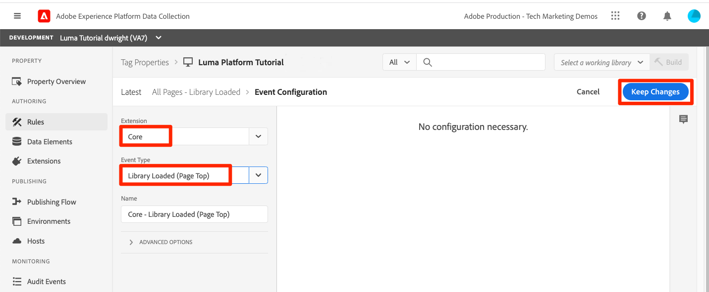
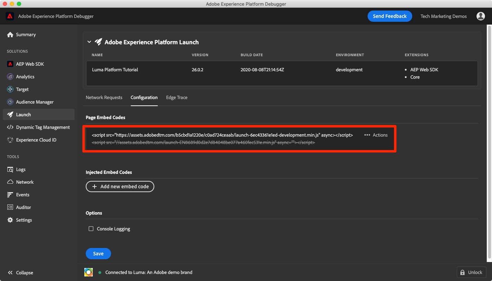
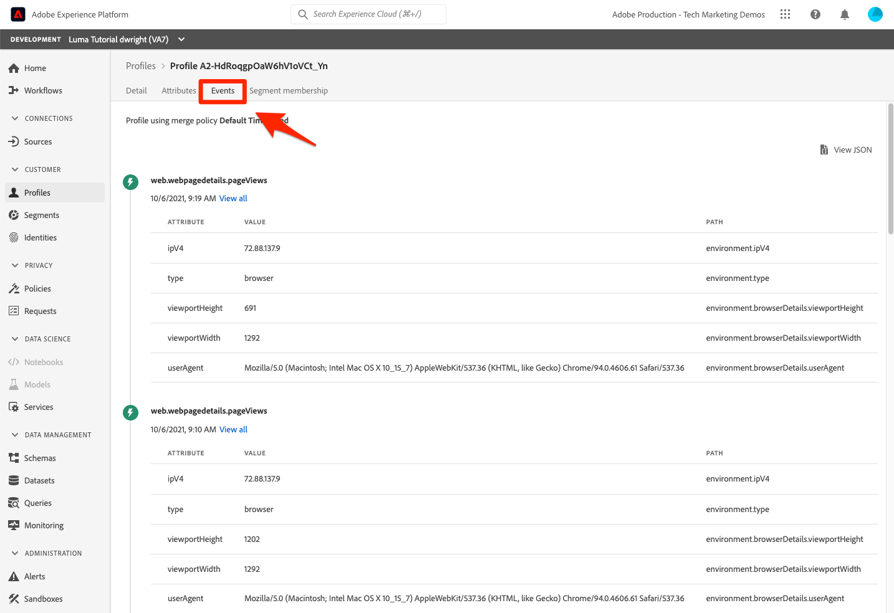

# 引入流数据

<!--1hr-->

在本课程中，您将使用Adobe Experience Platform Web SDK流式传输数据。

在数据收集界面中，我们必须完成两个主要任务：

* 我们必须在Luma网站上实施Web SDK，以将有关访客活动的数据从网站发送到Adobe Edge网络。 我们将使用标记（以前称为Launch）进行简单的实施

* 我们必须配置一个数据流，告诉Edge网络将数据转发到何处。 我们将对其进行配置，以将数据发送到 `Luma Web Events` 数据集。

**数据工程师** 将需要在本教程之外摄取流数据。 在实施Adobe Experience Platform的Web或移动SDK时，通常由Web或移动开发人员参与数据层创建和标记属性配置。

在开始练习之前，请观看这两个简短视频，详细了解流数据摄取和Web SDK：
>[!VIDEO](https://video.tv.adobe.com/v/28425?quality=12&learn=on)

>[!VIDEO](https://video.tv.adobe.com/v/34141?quality=12&learn=on)

>[!NOTE]
>
>虽然本教程的重点是通过Web SDK从网站进行流式摄取，但您也可以使用 [Adobe移动SDK](https://developer.adobe.com/client-sdks/documentation/)， [Apache Kafka Connect](https://github.com/adobe/experience-platform-streaming-connect)和其他机制。

## 所需的权限

在 [配置权限](configure-permissions.md) 在本课程中，您将设置完成本课程所需的所有访问控制。

<!--
* Permission items **[!UICONTROL Launch]** > **[!UICONTROL Property Rights]** > **[!UICONTROL Approve]**, **[!UICONTROL Develop]**, **[!UICONTROL Manage Environments]**, **[!UICONTROL Manage Extensions]**, and **[!UICONTROL Publish]**
* Permission item **[!UICONTROL Launch]** > **[!UICONTROL Company Rights]** > **[!UICONTROL Manage Properties]**
* User-role access to the `Luma Tutorial Launch` product profile
* Admin-role access to the `Luma Tutorial Launch` product profile
* Permission items **[!UICONTROL Platform]** > **[!UICONTROL Data Ingestion]** > **[!UICONTROL View Sources]** and **[!UICONTROL Manage Sources]**
* Permission items **[!UICONTROL Platform]** > **[!UICONTROL Data Management]** > **[!UICONTROL View Datasets]** and **[!UICONTROL Manage Datasets]**
* Permission items **[!UICONTROL Platform]** > **[!UICONTROL Profiles]** > **[!UICONTROL View Profiles]**, **[!UICONTROL Manage Profiles]** and **[!UICONTROL Export Audience Segment]**
* Permission item **[!UICONTROL Platform]** > **[!UICONTROL Sandbox Administration]** > **[!UICONTROL View Sandboxes]**
* Permission item **[!UICONTROL Platform]** > **[!UICONTROL Sandboxes]** > `Luma Tutorial`
* User-role access to the `Luma Tutorial Platform` product profile
-->

<!--## Create a streaming source

1. Log into the [Experience Platform  user interface](https://experience.adobe.com/platform/)
1. Go to **[!UICONTROL Sources]** in the left navigation
1. Filter the list by selecting **[!UICONTROL Streaming]**
1. In the **[!UICONTROL HTTP API]** section, select the **[!UICONTROL Configure]** button
    
1. On the **[!UICONTROL Authentication]** step, enter `Luma Web Events Source` as the **[!UICONTROL Account name]** and select the **[!UICONTROL Connect to source]** button (we don't need to enable authentication since the data will be originating from website visitors)
    
1. Once connected, select the **[!UICONTROL Next]** button to proceed to the next step in the workflow
1. On the **[!UICONTROL Select data]** step, choose **[!UICONTROL Existing Dataset]**, select your `Luma Web Events Dataset`, and then select the **[!UICONTROL Next]** button
    
1. On the **[!UICONTROL Dataflow detail]** step, select the **[!UICONTROL Next]** button:
    
    <!--What is a good practice for naming the data flow vs the source-->
<!--
1. On the **[!UICONTROL Review]** step, review your source details and select the **[!UICONTROL Finish]** button:
    
-->

## 配置数据流

首先，我们将配置数据流。 数据流可告知Adobe Edge网络，在从Web SDK调用收到数据后，将数据发送到何处。 例如，是否要将数据发送到Experience Platform、Adobe Analytics或Adobe Target？ 数据流在数据收集用户界面（以前称为Launch）中进行管理，并且对于通过Web SDK收集数据至关重要。

要创建您的 [!UICONTROL 数据流]：

1. 登录 [Experience Platform数据收集用户界面](https://experience.adobe.com/launch/)
   <!--when will the edge config go live?-->

1. 选择 **[!UICONTROL 数据流]** 在左侧导航中
1. 选择 **[!UICONTROL 新建数据流]** 按钮（右上角）

   

1. 对于 **[!UICONTROL 友好名称]**，输入 `Luma Platform Tutorial` （如果您公司的多个人员学习本教程，请向结尾添加您的姓名）
1. 选择 **[!UICONTROL 保存]** 按钮

   

在下一个屏幕中，您指定要将数据发送到的位置。 要将数据发送到Experience Platform，请执行以下操作：

1. 打开 **[!UICONTROL Adobe Experience Platform]** 以显示其他字段
1. 对象 **[!UICONTROL 沙盒]**，选择 `Luma Tutorial`
1. 对象 **[!UICONTROL 事件数据集]**，选择 `Luma Web Events Dataset`
1. 如果您使用其他Adobe应用程序，请随意浏览其他部分，以了解在这些其他解决方案的Edge Configuration中需要哪些信息。 请记住，开发Web SDK不仅是为了将数据流式传输到Experience Platform中，而且也是为了替换其他Adobe应用程序使用的所有以前的JavaScript库。 Edge Configuration用于指定要将数据发送到的每个应用程序的帐户详细信息。
1. 选择 **[!UICONTROL 保存]**
   

保存Edge配置后，生成的屏幕将显示已创建用于开发、暂存和生产环境的三个环境。 可以添加其他开发环境：

所有三个环境都包含您刚刚输入的平台详细信息。 但是，这些详细信息的配置方式可根据环境而有所不同。 例如，您可以让每个环境将数据发送到不同的Platform沙盒。 在本教程中，我们不会对数据流进行任何额外的自定义。

## 安装Web SDK扩展

### 添加资产

首先，我们必须创建标记属性（以前称为标记属性）。 资产是一个容器，其中包含从网页收集详细信息并将其发送到不同位置所需的所有JavaScript、规则和其他功能。

要创建资产，请执行以下操作：

1. 转到 **[!UICONTROL 属性]** 在左侧导航中
1. 选择 **[!UICONTROL 新建属性]** 按钮
   
1. 作为 **[!UICONTROL 名称]**，输入 `Luma Platform Tutorial` （如果您公司的多个人员学习本教程，请向结尾添加您的姓名）
1. 作为 **[!UICONTROL 域]**，输入 `enablementadobe.com` （稍后解释）
1. 选择 **[!UICONTROL 保存]**
   

<!--
After saving the property, you might see an error message like the one below. If so, this is because you don't actually have access to the property you just created. To fix this, we need to go to the Admin Console to give yourself access:
    

To give yourself access to the property:

1. In a separate browser tab, log into the [Admin Console](https://adminconsole.adobe.com/)
1. Go to **[!UICONTROL Products]** from the top navigation
1. Select **[!UICONTROL Adobe Experience Platform Launch]** on the left navigation
1. Go to your `Luma Tutorial Launch` product profile
1. Go to the **[!UICONTROL Permissions]** tab
1. On the **[!UICONTROL Properties]** row, select **[!UICONTROL Edit]**
    
1. Select the "+" icon to move your `Luma Platform Tutorial` property to the right-hand side and select the **[!UICONTROL Save]** button to update the permissions
   
    

Now switch back to your browser tab with the Data Collection interface still open. Reload the page and the `Luma Platform Tutorial` property should display in the list. Select to open the property:

-->

## 添加Web SDK扩展

现在您已经拥有资产，可以使用扩展添加Web SDK。 扩展是一种代码包，用于扩展数据收集界面和功能。 添加该扩展:

1. 打开您的标记属性
1. 转到 **[!UICONTROL 扩展]** 在左侧导航中
1. 转到 **[!UICONTROL 目录]** 选项卡
1. 有许多扩展可用于标记。 使用术语筛选目录 `Web SDK`
1. 在 **[!UICONTROL Adobe Experience Platform Web SDK]** 扩展上，选择 **[!UICONTROL 安装]** 按钮
   
1. Web SDK扩展有多种配置可用，但在本教程中，我们将只配置其中两种。 更新 **[!UICONTROL 边缘域]** 到 `data.enablementadobe.com`. 此设置允许您通过Web SDK实施设置第一方Cookie，我们鼓励这样做。 在本课程的后面部分，您将在 `enablementadobe.com` 域到您的标记属性。 的CNAME `enablementadobe.com` 域已配置，因此 `data.enablementadobe.com` 将转发到Adobe服务器。 在您自己的网站上实施Web SDK时，您需要为自己的数据收集目的创建一个CNAME，例如， `data.YOUR_DOMAIN.com`
1. 从 **[!UICONTROL 数据流]** 在下拉列表中，选择您的 `Luma Platform Tutorial` 数据流。
1. 您可以随意查看其他配置选项（但不要更改它们！） 然后选择 **[!UICONTROL 保存]**
   <!--is edge domain required for first party? when will it break?-->
   <!--any other fields that should be highlighted-->
   

## 创建规则以发送数据

现在，我们将创建一个规则以将数据发送到Platform。 规则是指示标记执行操作的事件、条件和操作的组合。 创建规则:

1. 转到 **[!UICONTROL 规则]** 在左侧导航中
1. 选择 **[!UICONTROL 创建新规则]** 按钮
   
1. 将规则命名为 `All Pages - Library Loaded`
1. 下 **[!UICONTROL 事件]**，选择 **[!UICONTROL 添加]** 按钮
   
1. 使用 **[!UICONTROL 核心]** **[!UICONTROL 扩展]** 并选择 **[!UICONTROL Library Loaded (Page Top)]** 作为 **[!UICONTROL 事件类型]**. 此设置意味着每当在页面上加载Launch库时，就会触发我们的规则。
1. 选择 **[!UICONTROL 保留更改]** 以返回到主规则屏幕
   
1. 离开 **[!UICONTROL 条件]** 为空，因为我们希望此规则在所有页面上触发（根据我们提供的名称）
1. 下 **[!UICONTROL 操作]**，选择 **[!UICONTROL 添加]** 按钮
1. 使用 **[!UICONTROL Adobe Experience Platform Web SDK]** **[!UICONTROL 扩展]** 并选择 **[!UICONTROL 发送事件]** 作为 **[!UICONTROL 操作类型]**
1. 在右侧，选择 **[!UICONTROL web.webpagedetails.pageViews]** 从 **[!UICONTROL 类型]** 下拉菜单。 这是我们的 `Luma Web Events Schema`
1. 选择 **[!UICONTROL 保留更改]** 以返回到主规则屏幕
   
1. 选择 **[!UICONTROL 保存]** 保存规则\
   

## 在库中发布规则

接下来，我们将将规则发布到开发环境，以便验证它是否有效。

<!--
There are a few quick steps we must take in the **[!UICONTROL Publishing]** section of Launch.

### Create a host

Launch libraries can be hosted on Adobe's Content Delivery Network (CDN) or on your own servers. In this tutorial, we will use Adobe's CDN since it is faster to set up:

1. Go to **[!UICONTROL Hosts]** in the left navigation
1. Select the **[!UICONTROL Create New Host]** button
       
1. For the **[!UICONTROL Name]**, enter `Adobe CDN`
1. For the **[!UICONTROL Type]**, select **[!UICONTROL Managed by Adobe]**
1. Select the **[!UICONTROL Save]** button to complete the setup of the host
       

### Create an environment

Environments allow you to have different versions of a library in different publishing environments to accommodate your publishing workflow. For example, the fully tested version of your library can be published to a Production environment, while new changes are being created in a Development environment. You can also use different hosts for each environment. To create an environment:

1. Go to **[!UICONTROL Environments]** in the left navigation
1. Select the **[!UICONTROL Create New Environment]** button
     
1. Under **[!UICONTROL Development]** select **[!UICONTROL Select]**   
     
1. For the **[!UICONTROL Name]**, enter `Development`
1. For the **[!UICONTROL Select Host]** dropdown, select `Adobe CDN`
1. Select the **[!UICONTROL Save]** button to complete the setup of the environment
    
1. You will see a modal with URL and other implementation details of this library. These are critical for a real Launch implementation, but we don't need to worry about them for this tutorial. Select the **[!UICONTROL Close]** button to exit the modal.

### Create and publish the library

Now let's bundle the contents of our property&mdash;currently an extension and a rule&mdash;into a library. 
-->

要创建库，请执行以下操作：

1. 转到 **[!UICONTROL 发布流]** 在左侧导航中
1. 选择 **[!UICONTROL 添加库]**
   
1. 对于 **[!UICONTROL 名称]**，输入 `Luma Platform Tutorial`
1. 对于 **[!UICONTROL 环境]**，选择 `Development`
1. 选择 **[!UICONTROL 添加所有更改的资源]** 按钮。 (除了 [!UICONTROL Adobe Experience Platform Web SDK] 扩展和 `All Pages - Library Loaded` 规则，您还将看到 [!UICONTROL 核心] 添加了扩展，其中包含所有Launch Web属性所需的基本JavaScript。)
1. 选择 **[!UICONTROL 保存并构建用于开发]** 按钮
   

库可能需要几分钟才能构建，完成后，库名称左侧会显示一个绿色圆点：

如您所见 [!UICONTROL 发布流] 屏幕，发布流程还有许多内容超出了本教程的范围。 我们将在开发环境中使用单个库。

## 验证请求中的数据

### 添加Adobe Experience Platform Debugger

Experience Platform调试器是一个适用于Chrome和Firefox浏览器的扩展，可帮助您查看在网页中实现的Adobe技术。 下载首选浏览器的版本：

* [Firefox扩展](https://addons.mozilla.org/zh-CN/firefox/addon/adobe-experience-platform-dbg/)
* [Chrome扩展](https://chrome.google.com/webstore/detail/adobe-experience-platform/bfnnokhpnncpkdmbokanobigaccjkpob)

如果您以前从未使用过Debugger，并且此调试器与以前的Adobe Experience Cloud Debugger不同，则可能需要观看以下时长为5分钟的概述视频：

>[!VIDEO](https://video.tv.adobe.com/v/32156?quality=12&learn=on)

### 打开Luma网站

在本教程中，我们使用公开托管版本的Luma演示网站。 让我们打开它并将其加入书签：

1. 在新的浏览器选项卡中，打开 [Luma网站](https://luma.enablementadobe.com/content/luma/us/en.html).
1. 将页面加入书签以便在本教程的其余部分中使用

我们之所以使用这个托管网站 `enablementadobe.com` 在 [!UICONTROL 域] 字段，了解我们使用初始标记属性配置的原因 `data.enablementadobe.com` 作为我们在 [!UICONTROL Adobe Experience Platform Web SDK] 扩展。 我有个计划！

### 使用Experience PlatformDebugger映射到您的标记资产

Experience PlatformDebugger具有一项酷炫功能，允许您使用其他标记属性替换现有标记属性。 这有助于验证，并且允许我们跳过本教程中的许多实施步骤。

1. 确保已打开Luma网站并选择Experience PlatformDebugger扩展图标
1. Debugger将打开并显示硬编码实施的一些详细信息，这些实施与本教程无关（在打开Debugger后，您可能需要重新加载Luma网站）
1. 确认调试器为“**[!UICONTROL 已连接到Luma]**&quot;，如下图所示，然后选择&quot;**[!UICONTROL 锁定]**”图标将Debugger锁定到Luma网站。
1. 选择 **[!UICONTROL 登录]** 按钮进行身份验证。
1. 现在转到 **[!UICONTROL Launch]** 在左侧导航中
1. 选择配置选项卡
1. 右边显示了 **[!UICONTROL 页面嵌入代码]**，打开 **[!UICONTROL 操作]** 下拉列表，然后选择 **[!UICONTROL Replace]**
   
1. 由于您已经过身份验证，因此Debugger将提取您可用的Launch属性和环境。 选择您的 `Luma Platform Tutorial` 属性
1. 选择您的 `Development` 环境
1. 选择 **[!UICONTROL 应用]** 按钮
   
1. Luma网站现在将重新加载 _标记属性_. 救命啊，我被黑了！ 开个玩笑。
   
1. 转到 **[!UICONTROL 摘要]** 在左侧导航栏中，查看 [!UICONTROL Launch] 属性
   
1. 现在转到 **[!UICONTROL AEP Web SDK]** ，查看 **[!UICONTROL 网络请求]**
1. 打开 **[!UICONTROL 事件]** row

   
1. 请注意我们如何查看 `web.webpagedetails.pageView` 我们在 [!UICONTROL 发送事件] 操作以及其他遵循的现成变量 `AEP Web SDK ExperienceEvent Mixin` 格式
   
1. 这些类型的请求详细信息还可在浏览器的Web开发人员工具中查看 **网络** 选项卡。 打开它并重新加载页面。 过滤调用 `interact` 要查找调用，请选择它，然后查看 **标头** 选项卡， **请求有效负载** 区域。
   
1. 转到 **响应** 选项卡，并记下ECID值如何包含在响应中。 复制此值，因为您将在下一个练习中使用它来验证用户档案信息。
   

## 验证Experience Platform中的数据

您可以通过查看到达的数据批次来验证数据是否已登陆Platform `Luma Web Events Dataset`. (我知道，这被称为流式数据摄取，但现在我说的是它分批到达！ 它实时流式传输到用户档案，因此可用于实时分段和激活，但每15分钟会批量发送到数据湖。)

要验证数据：

1. 在平台用户界面中，转到 **[!UICONTROL 数据集]** 在左侧导航中
1. 打开 `Luma Web Events Dataset` 并确认批次已到达。 请记住，它们每15分钟发送一次，因此您可能需要等待批次显示。
1. 选择 **[!UICONTROL 预览数据集]** 按钮
   
1. 在预览模式中，请注意如何选择左侧架构的不同字段来预览这些特定数据点：
   

您还可以确认新配置文件是否显示：

1. 在平台用户界面中，转到 **[!UICONTROL 配置文件]** 在左侧导航中
1. 选择 **[!UICONTROL ECID]** 命名空间并搜索您的ECID值（从响应中复制）。 该配置文件将具有其自己的ID，与ECID不同。
1. 选择 **[!UICONTROL 配置文件ID]** 以打开用户档案
   
1. 选择 **[!UICONTROL 事件]** 选项卡，以查看您查看的页面
   \
   <!---->

## 将自定义数据添加到事件

### 为页面名称创建数据元素

1. 在数据收集标记界面中，将 `Luma Platform Tutorial` 属性，打开 **[!UICONTROL 选择工作库]** 下拉列表并选择您的 `Luma Platform Tutorial` 库。 此设置使向库发布其他更新更加容易。
1. 现在转到 **[!UICONTROL 数据元素]** 在左侧导航中
1. 选择 **[!UICONTROL 创建新数据元素]** 按钮

   
1. 作为 **[!UICONTROL 名称]**，输入 `Page Name`
1. 作为 **[!UICONTROL 数据元素类型]**，选择 `JavaScript Variable`
1. 作为 **[!UICONTROL JavaScript变量名称]**，输入 `digitalData.page.pageInfo.pageName`
1. 为了帮助标准化值的格式，请选中 **[!UICONTROL 强制使用小写值]** 和 **[!UICONTROL 清除文本]**
1. 确保 `Luma Platform Tutorial` 被选为工作库
1. 选择 **[!UICONTROL 保存到库]**
   

### 将页面名称映射到XDM对象数据元素

现在，我们将页面名称映射到Web SDK。

>[!IMPORTANT]
>
>为了完成此任务，我们需要确保您的用户首先有权访问Prod沙盒。 如果您尚无法从其他产品配置文件访问Prod沙盒，请快速打开 `Luma Tutorial Platform` 配置文件并添加权限项 **[!UICONTROL 沙盒]** > **[!UICONTROL Prod]**. 执行此操作后，在“数据元素”页面上执行SHIFT — 重新加载以清除缓存
>

在 **[!UICONTROL 数据元素]** 页面：

1. 创建新数据元素
1. 作为 **[!UICONTROL 名称]**，输入 `XDM Object`
1. 作为 **[!UICONTROL 扩展]**，选择 `Adobe Experience Platform Web SDK`
1. 作为 **[!UICONTROL 数据元素类型]**，选择 `XDM object`
1. 作为 **[!UICONTROL 沙盒]**，选择您的 `Luma Tutorial` 沙盒
1. 作为 **[!UICONTROL 架构]**，选择您的 `Luma Web Events Schema`
1. 选择 `web.webPageDetails.name` 字段
1. 作为 **[!UICONTROL 值]**，选择图标以打开数据元素选择模式窗口，然后选择 `Page Name` 数据元素
1. 选择 **[!UICONTROL 保存到库]**
   

可使用同一过程将网站上的其他自定义数据映射到XDM字段。

### 将XDM数据添加到发送事件操作

现在，您已经将数据映射到XDM字段，您可以将其包含在“发送事件”操作中：

1. 转到 **[!UICONTROL 规则]** screen
1. 打开您的 `All Pages - Library Loaded` 规则
1. 打开 `Adobe Experience Platform Web SDK - Send Event` 操作
1. 作为 **[!UICONTROL XDM数据]**，选择图标以打开数据元素选择模式窗口，然后选择 `XDM Object` 数据元素
1. 选择 **[!UICONTROL 保留更改]** 按钮
   
1. 既然你已经 `Luma Platform Tutorial` 您在上几个练习中被选为工作库，您最近的更改已直接保存到库。 您不必通过发布流屏幕发布更改，只需打开蓝色按钮上的下拉菜单并选择 **[!UICONTROL 保存到库并生成]**
   

这将开始使用您刚刚进行的三项更改构建新的标记库。

### 验证XDM数据

现在，在使用Debugger映射到您的标记资产时，您应该能够重新加载Luma主页（如前所述），并看到页面名称字段填充在请求中！

您还可以通过预览数据集和配置文件，验证在Platform中接收的页面名称数据。

## 发送其他身份

您的Web SDK实施现在发送将Experience CloudID (ECID)作为主要标识符的事件。 ECID由Web SDK自动生成，并且在每个设备和浏览器中是唯一的。 根据客户使用的设备和浏览器，一个客户可以拥有多个ECID。 那么，我们如何才能获得此客户的统一视图，并将其在线活动关联到我们的CRM、忠诚度和离线购买数据？ 我们通过在客户会话期间收集其他身份并通过身份拼接确定性地关联其用户档案来实现这一点。

如果您还记得，我曾提到我们将使用ECID和CRM Id作为我们在以下位置的Web数据的标识： [映射身份](map-identities.md) 上课。 让我们使用Web SDK收集CRM ID！

### 为CRM ID添加数据元素

首先，将CRM ID存储在数据元素中：

1. 在标记界面中，添加一个名为的数据元素 `CRM Id`
1. 作为 **[!UICONTROL 数据元素类型]**，选择 **[!UICONTROL JavaScript变量]**
1. 作为 **[!UICONTROL JavaScript变量名称]**，输入 `digitalData.user.0.profile.0.attributes.username`
1. 选择 **[!UICONTROL 保存到库]** 按钮(`Luma Platform Tutorial` 仍应为您的工作库)
   

### 将CRM ID添加到“身份映射”数据元素

现在，我们已经捕获了CRM ID值，我们必须将其与名为的特殊数据元素类型相关联 [!UICONTROL 身份映射] 数据元素：

1. 添加名为的数据元素 `Identities`
1. 作为 **[!UICONTROL 扩展]**，选择 **[!UICONTROL Adobe Experience Platform Web SDK]**
1. 作为 **[!UICONTROL 数据元素类型]**，选择 **[!UICONTROL 标识映射]**
1. 作为 **[!UICONTROL 命名空间]**，输入 `Luma CRM Id`，也就是 [!UICONTROL 命名空间] 我们在之前的课程中创建

   >[!WARNING]
   >
   >Adobe Experience Platform Web SDK扩展版本2.2允许您使用Platform帐户中的实际值从预填充的下拉菜单中选择命名空间。 遗憾的是，此功能尚未“识别沙盒”，因此 `Luma CRM Id` 值可能不会显示在下拉列表中。 这可能会妨碍您完成本练习。 确认后，我们将发布解决方法。

1. 作为 **[!UICONTROL ID]**，选择图标以打开数据元素选择模式窗口，然后选择 `CRM Id` 数据元素
1. 作为 **[!UICONTROL 已验证状态]**，选择 **[!UICONTROL 已验证]**
1. 离开 **[!UICONTROL 主要]** _未选中_. 由于Luma网站的大多数访客不存在CRM ID，因此您肯定 _不想将ECID覆盖为主要标识符_. 将ECID以外的任何应用程序用作主要标识符的情况将非常少见。 通常，我未在这些说明中提及默认设置，但我调用此设置是为了帮助您以后在自己的实施中避免感到头痛。
1. 选择 **[!UICONTROL 保存到库]** 按钮(`Luma Platform Tutorial` 仍应为您的工作库)
   

>[!NOTE]
>
>您可以使用以下代码传递多个标识符 [!UICONTROL 标识映射] 数据类型。

### 将身份映射数据元素添加到XDM对象

还有一个数据元素我们必须更新 — XDM对象数据元素。 必须更新三个单独的数据元素才能传递此一个身份似乎有些奇怪，但此过程旨在针对多个身份进行扩展。 别担心，这课快结束了！

1. 打开XDM对象数据元素
1. 打开IdentityMap XDM字段
1. 作为 **[!UICONTROL 数据元素]**，选择图标以打开数据元素选择模式窗口，然后选择 `Identities` 数据元素
1. 既然你已经 `Luma Platform Tutorial` 您在上几个练习中被选为工作库，您最近的更改已直接保存到库。 您无需通过发布流屏幕发布更改，而是可以打开蓝色按钮上的下拉菜单并选择 **[!UICONTROL 保存到库并生成]**
   

### 验证身份

要验证Web SDK是否正在发送CRM ID，请执行以下操作：

1. 打开 [Luma网站](https://luma.enablementadobe.com/content/luma/us/en.html)
1. 按照之前的说明，使用Debugger将其映射到您的标记属性
1. 选择 **登录** Luma网站右上角的链接
1. 使用凭据登录 `test@adobe.com`/`test`
1. 经过身份验证后，在Debugger中检查Experience PlatformWeb SDK调用(**[!UICONTROL Adobe Experience Platform Web SDK]** > **[!UICONTROL 网络请求]** > **[!UICONTROL 事件]** ，您应会看到 `lumaCrmId`：
   
1. 再次使用ECID命名空间和值查找用户配置文件。 在配置文件中，您将看到CRM ID，以及忠诚度ID和配置文件详细信息，如姓名和电话号码。 所有身份和数据都已拼合到单个实时客户个人资料中！
   

## 其他资源

* [利用 Web SDK 实施 Adobe Experience Cloud](/help/tutorial-web-sdk/overview.md)
* [流摄取文档](https://experienceleague.adobe.com/docs/experience-platform/ingestion/streaming/overview.html?lang=zh-Hans)
* [流摄取API参考](https://www.adobe.io/experience-platform-apis/references/data-ingestion/#tag/Streaming-Ingestion)

做得好！这是关于Web SDK和Launch的大量信息。 现在，还有更多内容需要投入到全面实施中，但是这些是帮助您开始使用Platform并查看结果的基础知识。

>[!NOTE]
>
>现在您已完成“流式摄取”课程，您可以删除 [!UICONTROL Prod] 沙盒(从您的 `Luma Tutorial Platform` 产品配置文件

数据工程师，如果您愿意，可跳至 [运行查询课程](run-queries.md).

数据架构师，您可以转到 [合并策略](create-merge-policies.md)！
