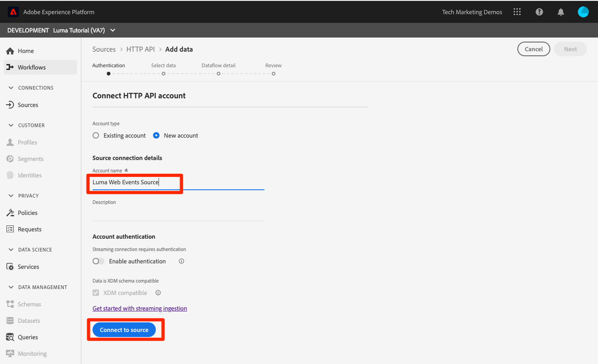

# 摄取流数据

<!--1hr-->

在本课程中，您将使用Adobe Experience Platform Web SDK来传输数据。

必须在数据收集界面中完成以下两个主要任务：

* 我们必须在Luma网站上实施Web SDK，以将有关访客活动的数据从该网站发送到Adobe Edge网络。 我们将使用标记（以前称为Launch）进行简单的实施

* 我们必须配置数据流，该数据流告知边缘网络将数据转发到何处。 我们将对其进行配置，以将数据发送到我们的 `Luma Web Events` 数据集。

**数据工程师** 将需要在本教程之外引入流数据。 实施Adobe Experience Platform的Web SDK或移动SDK时，通常由Web或移动开发人员参与数据层创建和标记属性配置。

在开始练习之前，请观看以下两个简短视频，以了解有关流数据摄取和Web SDK的更多信息：
>[!VIDEO](https://video.tv.adobe.com/v/28425?quality=12&learn=on)

>[!VIDEO](https://video.tv.adobe.com/v/34141?quality=12&learn=on)

>[!NOTE]
>
>虽然本教程重点介绍使用Web SDK流式引入网站，但您也可以使用 [AdobeMobile SDK](https://aep-sdks.gitbook.io/), [Apache Kafka Connect](https://github.com/adobe/experience-platform-streaming-connect)和其他机制。

## 所需权限

在 [配置权限](configure-permissions.md) 课程中，您将设置完成本课程所需的所有访问控制。

<!--
* Permission items **[!UICONTROL Launch]** > **[!UICONTROL Property Rights]** > **[!UICONTROL Approve]**, **[!UICONTROL Develop]**, **[!UICONTROL Manage Environments]**, **[!UICONTROL Manage Extensions]**, and **[!UICONTROL Publish]**
* Permission item **[!UICONTROL Launch]** > **[!UICONTROL Company Rights]** > **[!UICONTROL Manage Properties]**
* User-role access to the `Luma Tutorial Launch` product profile
* Admin-role access to the `Luma Tutorial Launch` product profile
* Permission items **[!UICONTROL Platform]** > **[!UICONTROL Data Ingestion]** > **[!UICONTROL View Sources]** and **[!UICONTROL Manage Sources]**
* Permission items **[!UICONTROL Platform]** > **[!UICONTROL Data Management]** > **[!UICONTROL View Datasets]** and **[!UICONTROL Manage Datasets]**
* Permission items **[!UICONTROL Platform]** > **[!UICONTROL Profiles]** > **[!UICONTROL View Profiles]**, **[!UICONTROL Manage Profiles]** and **[!UICONTROL Export Audience Segment]**
* Permission item **[!UICONTROL Platform]** > **[!UICONTROL Sandbox Administration]** > **[!UICONTROL View Sandboxes]**
* Permission item **[!UICONTROL Platform]** > **[!UICONTROL Sandboxes]** > `Luma Tutorial`
* User-role access to the `Luma Tutorial Platform` product profile
-->

<!--## Create a streaming source

1. Log into the [Experience Platform  user interface](https://experience.adobe.com/platform/)
1. Go to **[!UICONTROL Sources]** in the left navigation
1. Filter the list by selecting **[!UICONTROL Streaming]**
1. In the **[!UICONTROL HTTP API]** section, select the **[!UICONTROL Configure]** button
    
1. On the **[!UICONTROL Authentication]** step, enter `Luma Web Events Source` as the **[!UICONTROL Account name]** and select the **[!UICONTROL Connect to source]** button (we don't need to enable authentication since the data will be originating from website visitors)
    
1. Once connected, select the **[!UICONTROL Next]** button to proceed to the next step in the workflow
1. On the **[!UICONTROL Select data]** step, choose **[!UICONTROL Existing Dataset]**, select your `Luma Web Events Dataset`, and then select the **[!UICONTROL Next]** button
    
1. On the **[!UICONTROL Dataflow detail]** step, select the **[!UICONTROL Next]** button:
    
    <!--What is a good practice for naming the data flow vs the source-->
<!--
1. On the **[!UICONTROL Review]** step, review your source details and select the **[!UICONTROL Finish]** button:
    
-->

## 配置数据流

首先，我们将配置数据流。 数据流在从Web SDK调用中接收数据后，会告知Adobe Edge网络要将其发送到何处。 例如，您要将数据发送到Experience Platform、Adobe Analytics还是Adobe Target? 数据流在数据收集用户界面（以前称为Launch）中进行管理，对于使用Web SDK进行数据收集至关重要。

创建 [!UICONTROL 数据流]:

1. 登录 [Experience Platform数据收集用户界面](https://experience.adobe.com/launch/)

   <!--when will the edge config go live?-->

1. 选择 **[!UICONTROL 数据流]** 在左侧导航中
1. 选择 **[!UICONTROL 新数据流]** 按钮

   

1. 对于 **[!UICONTROL 友好名称]**，输入 `Luma Platform Tutorial` （如果您公司的多个人员参加了本教程，请将您的姓名添加到结尾）
1. 选择 **[!UICONTROL 保存]** 按钮

   

在下一个屏幕中，您可以指定要将数据发送到的位置。 要将数据发送到Experience Platform，请执行以下操作：

1. 打开 **[!UICONTROL Adobe Experience Platform]** 显示其他字段
1. 对于 **[!UICONTROL 沙盒]**，选择 `Luma Tutorial`
1. 对于 **[!UICONTROL 事件数据集]**，选择 `Luma Web Events Dataset`
1. 如果您使用其他Adobe应用程序，请随时浏览其他部分，以了解这些其他解决方案的“边缘配置”中需要哪些信息。 请记住，Web SDK的开发不仅用于将数据流式传输到Experience Platform中，还用于替换其他Adobe应用程序使用的所有以前的JavaScript库。 边缘配置用于指定要将数据发送到的每个应用程序的帐户详细信息。
1. 选择 **[!UICONTROL 保存]**

   

保存边缘配置后，生成的屏幕将显示已为开发、暂存和生产创建了三个环境。 可以添加其他开发环境：

所有三个环境都包含您刚刚输入的平台详细信息。 但是，这些详细信息可以按环境进行不同的配置。 例如，您可以让每个环境将数据发送到不同的Platform沙盒。 在本教程中，我们不会对数据流进行任何其他自定义。

## 安装Web SDK扩展

### 添加资产

首先，我们必须创建标记属性（以前称为标记属性）。 资产是一个容器，可容纳从网页收集详细信息并将其发送到不同位置所需的所有JavaScript、规则和其他功能。

要创建资产，请执行以下操作：

1. 转到 **[!UICONTROL 属性]** 在左侧导航中
1. 选择 **[!UICONTROL 新建资产]** 按钮
   
1. 作为 **[!UICONTROL 名称]**，输入 `Luma Platform Tutorial` （如果您公司的多个人员参加了本教程，请将您的姓名添加到结尾）
1. 作为 **[!UICONTROL 域]**，输入 `enablementadobe.com` （稍后解释）
1. 选择 **[!UICONTROL 保存]**

   

<!--
After saving the property, you might see an error message like the one below. If so, this is because you don't actually have access to the property you just created. To fix this, we need to go to the Admin Console to give yourself access:
    

To give yourself access to the property:

1. In a separate browser tab, log into the [Admin Console](https://adminconsole.adobe.com/)
1. Go to **[!UICONTROL Products]** from the top navigation
1. Select **[!UICONTROL Adobe Experience Platform Launch]** on the left navigation
1. Go to your `Luma Tutorial Launch` product profile
1. Go to the **[!UICONTROL Permissions]** tab
1. On the **[!UICONTROL Properties]** row, select **[!UICONTROL Edit]**
    
1. Select the "+" icon to move your `Luma Platform Tutorial` property to the right-hand side and select the **[!UICONTROL Save]** button to update the permissions
   
    

Now switch back to your browser tab with the Data Collection interface still open. Reload the page and the `Luma Platform Tutorial` property should display in the list. Select to open the property:

-->

## 添加Web SDK扩展

现在，您已拥有资产，可以使用扩展添加Web SDK。 扩展是用于扩展数据收集界面和功能的代码包。 添加该扩展:

1. 打开标记资产
1. 转到 **[!UICONTROL 扩展]** 在左侧导航中
1. 转到 **[!UICONTROL 目录]** 选项卡
1. 标记有许多可用的扩展。 使用术语筛选目录 `Web SDK`
1. 在 **[!UICONTROL Adobe Experience Platform Web SDK]** 扩展中，选择 **[!UICONTROL 安装]** 按钮
   
1. Web SDK扩展有多种可用配置，但我们仅将在本教程中配置两种。 更新 **[!UICONTROL 边缘域]** to `data.enablementadobe.com`. 此设置允许您使用Web SDK实施设置第一方Cookie，我们鼓励您这样做。 在本课程的后面，您将在 `enablementadobe.com` 域。 的CNAME `enablementadobe.com` 域已配置为 `data.enablementadobe.com` 将转发到Adobe服务器。 在您自己的网站上实施Web SDK时，您需要创建一个CNAME以用于您自己的数据收集，例如， `data.YOUR_DOMAIN.com`
1. 从 **[!UICONTROL 数据流]** 下拉菜单，选择 `Luma Platform Tutorial` 数据流。
1. 请随时查看其他配置选项（但不要更改它们！） 然后选择 **[!UICONTROL 保存]**
   <!--is edge domain required for first party? when will it break?-->
   <!--any other fields that should be highlighted-->
   

## 创建用于发送数据的规则

现在，我们将创建一个规则以将数据发送到Platform。 规则是事件、条件和操作的组合，用于告知标记执行一些操作。 创建规则:

1. 转到 **[!UICONTROL 规则]** 在左侧导航中
1. 选择 **[!UICONTROL 创建新规则]** 按钮
   
1. 将规则命名为 `All Pages - Library Loaded`
1. 在 **[!UICONTROL 事件]**，选择 **[!UICONTROL 添加]** 按钮
   
1. 使用 **[!UICONTROL 核心]** **[!UICONTROL 扩展]** 选择 **[!UICONTROL Library Loaded(Page Top)]** 作为 **[!UICONTROL 事件类型]**. 此设置意味着，每当页面上加载Launch库时，都会触发我们的规则。
1. 选择 **[!UICONTROL 保留更改]** 返回主规则屏幕
   
1. 离开 **[!UICONTROL 条件]** 为空，因为我们希望此规则在所有页面上触发，就像我们为其提供的名称一样
1. 在 **[!UICONTROL 操作]**，选择 **[!UICONTROL 添加]** 按钮
1. 使用 **[!UICONTROL Adobe Experience Platform Web SDK]** **[!UICONTROL 扩展]** 选择 **[!UICONTROL 发送事件]** 作为 **[!UICONTROL 操作类型]**
1. 在右侧，选择 **[!UICONTROL web.webpagedetails.pageViews]** 从 **[!UICONTROL 类型]** 下拉列表。 这是我们 `Luma Web Events Schema`
1. 选择 **[!UICONTROL 保留更改]** 返回主规则屏幕
   
1. 选择 **[!UICONTROL 保存]** 保存规则\
   

## 在库中发布规则

接下来，我们将将该规则发布到我们的开发环境，以便我们能够验证该规则是否有效。

<!--
There are a few quick steps we must take in the **[!UICONTROL Publishing]** section of Launch.

### Create a host

Launch libraries can be hosted on Adobe's Content Delivery Network (CDN) or on your own servers. In this tutorial, we will use Adobe's CDN since it is faster to set up:

1. Go to **[!UICONTROL Hosts]** in the left navigation
1. Select the **[!UICONTROL Create New Host]** button
       
1. For the **[!UICONTROL Name]**, enter `Adobe CDN`
1. For the **[!UICONTROL Type]**, select **[!UICONTROL Managed by Adobe]**
1. Select the **[!UICONTROL Save]** button to complete the setup of the host
       

### Create an environment

Environments allow you to have different versions of a library in different publishing environments to accommodate your publishing workflow. For example, the fully tested version of your library can be published to a Production environment, while new changes are being created in a Development environment. You can also use different hosts for each environment. To create an environment:

1. Go to **[!UICONTROL Environments]** in the left navigation
1. Select the **[!UICONTROL Create New Environment]** button
     
1. Under **[!UICONTROL Development]** select **[!UICONTROL Select]**   
     
1. For the **[!UICONTROL Name]**, enter `Development`
1. For the **[!UICONTROL Select Host]** dropdown, select `Adobe CDN`
1. Select the **[!UICONTROL Save]** button to complete the setup of the environment
    
1. You will see a modal with URL and other implementation details of this library. These are critical for a real Launch implementation, but we don't need to worry about them for this tutorial. Select the **[!UICONTROL Close]** button to exit the modal.

### Create and publish the library

Now let's bundle the contents of our property&mdash;currently an extension and a rule&mdash;into a library. 
-->

要创建库，请执行以下操作：

1. 转到 **[!UICONTROL 发布流程]** 在左侧导航中
1. 选择 **[!UICONTROL 添加库]**
   
1. 对于 **[!UICONTROL 名称]**，输入 `Luma Platform Tutorial`
1. 对于 **[!UICONTROL 环境]**，选择 `Development`
1. 选择 **[!UICONTROL Add All Changed Resources]** 按钮。 (除 [!UICONTROL Adobe Experience Platform Web SDK] 扩展和 `All Pages - Library Loaded` 规则中，您还将看到 [!UICONTROL 核心] 添加了扩展，其中包含所有Launch Web属性所需的基本JavaScript。)
1. 选择 **[!UICONTROL 保存并构建以用于开发]** 按钮
   

库可能需要几分钟时间才能构建完成，它会在库名称左侧显示一个绿色圆点：

如您在 [!UICONTROL 发布流程] 屏幕上，发布流程还有许多内容不在本教程的涵盖范围内。 我们将在开发环境中使用单个库。

## 验证请求中的数据

### 添加Adobe Experience Platform Debugger

Experience Platform调试器是适用于Chrome和Firefox浏览器的扩展，可帮助您查看在网页中实施的Adobe技术。 下载首选浏览器的版本：

* [Firefox扩展](https://addons.mozilla.org/zh-CN/firefox/addon/adobe-experience-platform-dbg/)
* [Chrome扩展](https://chrome.google.com/webstore/detail/adobe-experience-platform/bfnnokhpnncpkdmbokanobigaccjkpob)

如果您以前从未使用过Debugger(并且此调试器与旧版Adobe Experience Cloud Debugger不同)，则可能需要观看此五分钟的概述视频：

>[!VIDEO](https://video.tv.adobe.com/v/32156?quality=12&learn=on)

### 打开Luma网站

在本教程中，我们使用公开托管的Luma演示网站版本。 让我们打开它并将其加入书签：

1. 在新的浏览器选项卡中，打开 [Luma网站](https://luma.enablementadobe.com/content/luma/us/en.html).
1. 将页面加入书签以在教程的其余部分中使用

此托管网站就是我们使用 `enablementadobe.com` 在 [!UICONTROL 域] 初始标记属性配置的字段以及使用原因 `data.enablementadobe.com` 作为 [!UICONTROL Adobe Experience Platform Web SDK] 扩展。 看，我有计划！

### 使用Experience Platform调试器映射到您的标记属性

Experience Platform调试器具有一项酷炫的功能，允许您将现有标记属性替换为其他属性。 这对于验证非常有用，它允许我们在本教程中跳过许多实施步骤。

1. 确保已打开Luma网站，并选择Debugger扩展图标Experience Platform
1. Debugger将打开并显示硬编码实施的一些详细信息，这些信息与本教程无关（您可能需要在打开Debugger后重新加载Luma网站）
1. 确认Debugger为“**[!UICONTROL 已连接到Luma]**“ ”，然后选择“**[!UICONTROL 锁]**“ ”图标，将Debugger锁定到Luma网站。
1. 选择 **[!UICONTROL 登录]** 按钮进行身份验证。
1. 现在，转到 **[!UICONTROL Launch]** 在左侧导航中
1. 选择配置选项卡
1. 右边显示 **[!UICONTROL 页面嵌入代码]**，打开 **[!UICONTROL 操作]** 下拉菜单，然后选择 **[!UICONTROL 替换]**

   
1. 自您通过身份验证后，Debugger将提取您可用的Launch资产和环境。 选择 `Luma Platform Tutorial` 属性
1. 选择 `Development` 环境
1. 选择 **[!UICONTROL 应用]** 按钮
   
1. Luma网站现在将重新加载 _使用标记属性_. 救命，我被黑了！ 开个玩笑。
   
1. 转到 **[!UICONTROL 概要]** 在左侧导航中，查看 [!UICONTROL Launch] 属性
   
1. 现在，转到 **[!UICONTROL AEP Web SDK]** ，以查看 **[!UICONTROL 网络请求]**
1. 打开 **[!UICONTROL 事件]** row

   
1. 请注意，如何查看 `web.webpagedetails.pageView` 我们在 [!UICONTROL 发送事件] 操作，以及 `AEP Web SDK ExperienceEvent Mixin` 格式
   
1. 浏览器的Web开发人员工具中还会显示这些类型的请求详细信息 **网络** 选项卡。 打开它并重新加载页面。 筛选具有 `interact` 要找到调用，请选择它，然后查看 **标题** 选项卡， **请求有效负载** 的上界。
   
1. 转到 **响应** 选项卡，并记下ECID值是如何包含在响应中的。 复制此值，以便在下一个练习中使用该值验证用户档案信息。
   

## 验证Experience Platform中的数据

您可以通过查看 `Luma Web Events Dataset`. (我知道，这叫流数据摄取，但现在我说它是分批到达的！ 它以实时方式流式传输到Profile，以便用于实时分段和激活，但每15分钟会批量发送到数据湖。)

验证数据：

1. 在Platform用户界面中，转到 **[!UICONTROL 数据集]** 在左侧导航中
1. 打开 `Luma Web Events Dataset` 并确认批次已到达。 请记住，系统每15分钟发送一次这些批次，因此您可能需要等待批次显示完成。
1. 选择 **[!UICONTROL 预览数据集]** 按钮
   
1. 在预览模式中，请注意如何选择左侧架构的不同字段以预览这些特定数据点：
   

您还可以确认显示新配置文件：

1. 在Platform用户界面中，转到 **[!UICONTROL 用户档案]** 在左侧导航中
1. 选择 **[!UICONTROL ECID]** 命名空间并搜索您的ECID值（从响应中复制它）。 该用户档案将有其自己的ID，与ECID分开。
1. 选择 **[!UICONTROL 配置文件ID]** 打开用户档案
   
1. 选择 **[!UICONTROL 事件]** 选项卡，以查看您查看的页面
   
   <!---->

## 向事件添加自定义数据

### 为页面名称创建数据元素

1. 在数据收集标记界面中，位于 `Luma Platform Tutorial` 属性，打开 **[!UICONTROL 选择工作库]** 下拉菜单，选择 `Luma Platform Tutorial` 库。 通过此设置，可以更轻松地将其他更新发布到我们的库。
1. 现在，转到 **[!UICONTROL 数据元素]** 在左侧导航中
1. 选择 **[!UICONTROL 创建新数据元素]** 按钮

   
1. 作为 **[!UICONTROL 名称]**，输入 `Page Name`
1. 作为 **[!UICONTROL 数据元素类型]**，选择 `JavaScript Variable`
1. 作为 **[!UICONTROL JavaScript变量名称]**，输入 `digitalData.page.pageInfo.pageName`
1. 为帮助标准化值的格式，请选中 **[!UICONTROL 强制使用小写值]** 和 **[!UICONTROL 清理文本]**
1. 确保 `Luma Platform Tutorial` 选作工作库
1. 选择 **[!UICONTROL 保存到库]**
   

### 将页面名称映射到XDM对象数据元素

现在，我们将页面名称映射到Web SDK。

>[!IMPORTANT]
>
>要完成此任务，我们需要确保用户首先有权访问生产沙盒。 如果您尚未从其他产品配置文件访问“生产”沙盒，请快速打开 `Luma Tutorial Platform` 配置文件和添加权限项 **[!UICONTROL 沙箱]** > **[!UICONTROL 生产]**. 执行此操作后，在“数据元素”页面上执行SHIFT — 重新加载以清除缓存
>

在 **[!UICONTROL 数据元素]** 页面：

1. 创建新数据元素
1. 作为 **[!UICONTROL 名称]**，输入 `XDM Object`
1. 作为 **[!UICONTROL 扩展]**，选择 `Adobe Experience Platform Web SDK`
1. 作为 **[!UICONTROL 数据元素类型]**，选择 `XDM object`
1. 作为 **[!UICONTROL 沙盒]**，选择 `Luma Tutorial` 沙盒
1. 作为 **[!UICONTROL 架构]**，选择 `Luma Web Events Schema`
1. 选择 `web.webPageDetails.name` 字段
1. 作为 **[!UICONTROL 值]**，选择图标以打开数据元素选择模式并选择 `Page Name` 数据元素
1. 选择 **[!UICONTROL 保存到库]**

   

同一过程用于将网站上的其他自定义数据映射到XDM字段。

### 将XDM数据添加到“发送事件”操作

现在，您已将数据映射到XDM字段，接下来可以将其包含在“发送事件”操作中：

1. 转到 **[!UICONTROL 规则]** 屏幕
1. 打开 `All Pages - Library Loaded` 规则
1. 打开 `Adobe Experience Platform Web SDK - Send Event` 操作
1. 作为 **[!UICONTROL XDM数据]**，选择图标以打开数据元素选择模式并选择 `XDM Object` 数据元素
1. 选择 **[!UICONTROL 保留更改]** 按钮
   
1. 既然你 `Luma Platform Tutorial` 已选择作为最近几个练习的工作库，则最近所做的更改已直接保存到库。 您无需通过“发布流程”屏幕发布更改，只需打开蓝色按钮上的下拉菜单并选择 **[!UICONTROL 保存到库并构建]**
   

这会开始使用您刚才所做的三项更改来构建新标记库。

### 验证XDM数据

现在，您应该能够重新加载Luma主页，同时像之前学习到的那样使用Debugger映射到您的标记属性，并查看请求中填充的页面名称字段！

您还可以通过预览数据集和配置文件来验证在Platform中收到的页面名称数据。

## 发送其他标识

您的Web SDK实施现在正在发送将Experience CloudID(ECID)作为主标识符的事件。 ECID由Web SDK自动生成，并且每个设备和浏览器都是唯一的。 根据客户使用的设备和浏览器，一个客户可以拥有多个ECID。 那么，我们如何才能统一地了解此客户，并将其在线活动与我们的CRM、忠诚度和离线购买数据关联起来？ 为此，我们在其会话期间收集其他身份，并通过身份拼合确定性链接其用户档案。

如果您还记得，我曾提到，我们将在 [映射标识](map-identities.md) 课程。 那么，让我们使用Web SDK收集CRM ID!

### 为CRM Id添加数据元素

首先，我们将CRM ID存储在数据元素中：

1. 在标记界面中，添加一个名为 `CRM Id`
1. 作为 **[!UICONTROL 数据元素类型]**，选择 **[!UICONTROL JavaScript变量]**
1. 作为 **[!UICONTROL JavaScript变量名称]**，输入 `digitalData.user.0.profile.0.attributes.username`
1. 选择 **[!UICONTROL 保存到库]** 按钮(`Luma Platform Tutorial` 仍然是您的工作库)
   

### 将CRM ID添加到Identity Map数据元素

既然我们已捕获到CRM ID值，则必须将其与名为 [!UICONTROL 身份映射] 数据元素：

1. 添加名为 `Identities`
1. 作为 **[!UICONTROL 扩展]**，选择 **[!UICONTROL Adobe Experience Platform Web SDK]**
1. 作为 **[!UICONTROL 数据元素类型]**，选择 **[!UICONTROL 身份映射]**
1. 作为 **[!UICONTROL 命名空间]**，输入 `Luma CRM Id`，这是 [!UICONTROL 命名空间] 我们在前面的课程中

   >[!WARNING]
   >
   >Adobe Experience Platform Web SDK扩展版本2.2允许您使用Platform帐户中的实际值，从预填充的下拉列表中选择“命名空间”。 遗憾的是，此功能尚未“感知沙盒”，因此 `Luma CRM Id` 值可能不会显示在下拉菜单中。 这可能会阻止您完成本练习。 确认后，我们将发布解决方法。

1. 作为 **[!UICONTROL ID]**，选择图标以打开数据元素选择模式并选择 `CRM Id` 数据元素
1. 作为 **[!UICONTROL 身份验证状态]**，选择 **[!UICONTROL 已验证]**
1. 离开 **[!UICONTROL 主要]** _未选中_. 由于CRM ID不存在于Luma网站的大多数访客，因此您肯定 _不希望将ECID作为主标识符覆盖_. 将ECID以外的任何内容用作主标识符的用例非常少见。 通常我不会提及这些说明中的默认设置，但我会调用此设置，以帮助您在以后的实施中避免头疼。
1. 选择 **[!UICONTROL 保存到库]** 按钮(`Luma Platform Tutorial` 仍然是您的工作库)
   

>[!NOTE]
>
>您可以使用 [!UICONTROL 身份映射] 数据类型。

### 将身份映射数据元素添加到XDM对象

我们还必须更新一个数据元素 — XDM对象数据元素。 必须更新三个单独的数据元素才能传递此身份似乎很奇怪，但此过程旨在针对多个身份进行扩展。 别担心，这课快结束了！

1. 打开XDM对象数据元素
1. 打开IdentityMap XDM字段
1. 作为 **[!UICONTROL 数据元素]**，选择图标以打开数据元素选择模式并选择 `Identities` 数据元素
1. 既然你 `Luma Platform Tutorial` 已选择作为最近几个练习的工作库，则最近所做的更改已直接保存到库。 您无需通过“发布流程”屏幕发布更改，而是可以打开蓝色按钮上的下拉菜单并选择 **[!UICONTROL 保存到库并构建]**
   

### 验证身份

要验证Web SDK是否正在发送CRM ID，请执行以下操作：

1. 打开 [Luma网站](https://luma.enablementadobe.com/content/luma/us/en.html)
1. 按照前面的说明，使用Debugger将其映射到您的标记属性
1. 选择 **登录** Luma网站右上角的链接
1. 使用凭据登录 `test@adobe.com`/`test`
1. 验证后，在Debugger中检查Experience PlatformWeb SDK调用(**[!UICONTROL Adobe Experience Platform Web SDK]** > **[!UICONTROL 网络请求]** > **[!UICONTROL 事件]** )，您应会看到 `lumaCrmId`:
   
1. 再次使用ECID命名空间和值查找用户配置文件。 在用户档案中，您将看到CRM ID以及会员ID和用户档案详细信息，如姓名和电话号码。 所有身份和数据已拼合到一个实时客户用户档案中！
   

## 其他资源

* [利用 Web SDK 实施 Adobe Experience Cloud](/help/tutorial-web-sdk/overview.md)
* [流摄取文档](https://experienceleague.adobe.com/docs/experience-platform/ingestion/streaming/overview.html?lang=zh-Hans)
* [流摄取API参考](https://www.adobe.io/experience-platform-apis/references/data-ingestion/#tag/Streaming-Ingestion)

干得好！ 这是有关Web SDK和Launch的大量信息。 全面实施涉及的内容要多得多，但是这些是帮助您开始在平台中查看结果的基础知识。

>[!NOTE]
>
>现在，您已完成流摄取课程，接下来可以删除 [!UICONTROL 生产] 来自您的沙盒 `Luma Tutorial Platform` 产品配置文件

数据工程师，如果您愿意，请跳到 [运行查询课程](run-queries.md).

数据架构师，您可以 [合并策略](create-merge-policies.md)!
