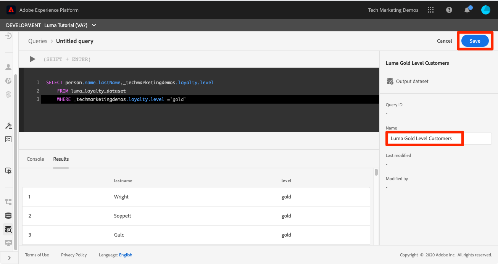

# 运行查询

<!-- 15 min-->
在本课程中，您将学习如何设置、编写和执行查询以验证您摄取的数据。

Adobe Experience Platform查询服务允许您使用标准SQL在Platform中查询数据，从而帮助您了解数据。 使用查询服务，您可以加入数据湖中的任何数据集，并将查询结果捕获为新的数据集，以用于报表、机器学习或将其摄取到实时客户档案中。

**数据架构师**&#x200B;和&#x200B;**数据工程师**&#x200B;需要在本教程之外使用查询服务。

在开始练习之前，请观看此简短视频，了解关于查询服务的更多信息：
>[!VIDEO](https://video.tv.adobe.com/v/33591?learn=on&enablevpops&captions=chi_hans)

## 所需的权限

在[配置权限](configure-permissions.md)课程中，您已设置完成本课程所需的所有访问控制。

<!-- Settings > **[!UICONTROL Services]** > **[!UICONTROL Query Service]**
* Permission items Data Management > **[!UICONTROL View Datasets]** and  **[!UICONTROL Manage Datasets]**
* Permission item Sandboxes > `Luma Tutorial`
* User-role access to the `Luma Tutorial Platform` product profile
-->

## 简单查询

让我们从一些简单的查询开始：

1. 在Platform用户界面中，转到左侧导航栏中的&#x200B;**查询**
1. 选择右上角的&#x200B;**创建查询**&#x200B;按钮，打开一个文本框以运行和执行查询
1. 在编辑器中输入以下查询，然后按Shift+Enter或Shift+Return以执行查询。

   ```
   SHOW TABLES
   ```

1. 这将显示可用表的列表

   


1. 现在，尝试此查询，将`_techmarketingdemos`替换为您自己的租户命名空间，如果您还记得，该命名空间会显示在您的架构中。

   ```
   SELECT person.name.lastName,loyalty.tier
   FROM luma_loyalty_dataset
   WHERE loyalty.tier ='gold'
   ```

   

1. 如果有任何错误，**[!UICONTROL 控制台]**&#x200B;选项卡中将显示详细消息，如下图所示
   

1. 成功查询后，**[!UICONTROL 命名]**，其名称为`Luma Gold Level Customers`
1. 选择&#x200B;**[!UICONTROL 保存]**&#x200B;按钮
   


<!--SELECT COUNT(DISTINCT (_techmarketingdemos.systemIdentifier.loyaltyId)) FROM luma_loyalty_dataset 


SELECT _techmarketingdemos.systemIdentifier.loyaltyId, COUNT(_techmarketingdemos.systemIdentifier.loyaltyId)
FROM luma_loyalty_dataset 
GROUP BY _techmarketingdemos.systemIdentifier.loyaltyId
HAVING COUNT(_techmarketingdemos.systemIdentifier.loyaltyId) > 1;-->

## 其他练习

稍后，我们将在教程中添加其他查询服务练习。
<!--
## Join Datasets

In this exercise, we will join two datasets `Luma Loyalty Dataset` and `Luma Offline Purchase` to get list of gold customers who have spend over $500 dollars in one purchase.

1. Create a new query
1. Copy and paste following query in query editor and execute, again replacing `_techmarketingdemos` with your own tenant namespace
    
    ```
    SELECT DISTINCT lopd.commerce.order.purchaseID as PurchaseId ,
        lld.person.name.firstName as LastName ,
        lld.person.name.lastName as LastName ,
        lopd.personalEmail.address as email,
        lopd.commerce.order.priceTotal as Total

    FROM luma_loyalty_dataset lld
    JOIN luma_offline_purchase_event_dataset lopd
    ON lopd._techmarketingdemos.systemIdentifier.loyaltyId = lld._techmarketingdemos.systemIdentifier.loyaltyId

    WHERE lld._techmarketingdemos.loyalty.level ='gold' AND lopd.commerce.order.priceTotal >500;
    ```

1. You should get list of Gold Customers who have spend over $500 in single purchase.

## Output datasets

1. Select on Output Dataset button
1. Provide name and description to the dataset
1. Save.
1. Go to **Datasets** under **Data Management** to find new dataset created.

-->
<!--Add content for Adobe Defined Functions-->

## 其他资源

* [查询服务文档](https://experienceleague.adobe.com/docs/experience-platform/query/home.html?lang=zh-Hans)
* [查询服务API引用](https://www.adobe.io/experience-platform-apis/references/query-service/)

现在，在最后一个实践课程中，[创建区段](build-segments.md)！
