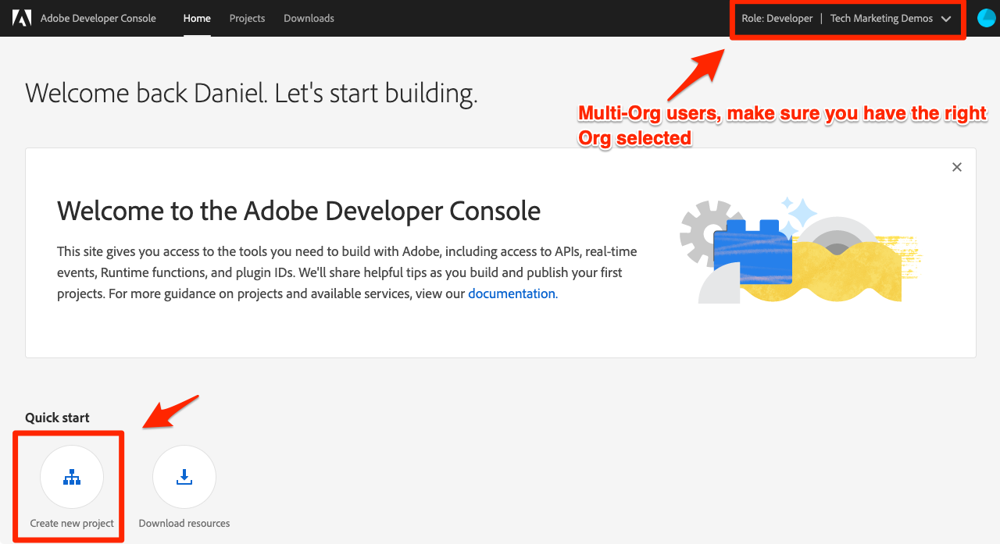

# 设置Developer Console和[!DNL Postman]

<!--30min-->

在本课程中，您将在Adobe Developer Console中设置一个项目并下载[!DNL Postman]收藏集，以便开始使用平台API。

要完成本教程中的API练习，[下载适用于您的操作系统的Postman应用程序。](https://www.postman.com/downloads/)使用Experience PlatformAPI不需要使用Postman，但API工作流更简单，Adobe Experience Platform提供了几十个Postman收藏集来帮助您执行API调用并了解其操作方式。 本教程的其余部分假定您了解Postman的一些工作知识。 如需帮助，请参阅[Postman文档](https://learning.postman.com/)。

平台是以API优先构建的。 虽然界面选项也适用于所有主要任务，但有时您可能需要使用平台API。 例如，在构建用户界面之前，要摄取数据、在沙盒之间移动项目、自动执行日常任务或使用新Platform功能。

**数据架构师**&#x200B;和&#x200B;**数据工程师**&#x200B;可能需要在本教程之外使用平台API。

## 所需的权限

在[配置权限](configure-permissions.md)课程中，您已设置完成本课程所需的所有访问控制。

<!--
* Permission item Sandboxes > `Luma Tutorial`
* Developer-role access to the `Luma Tutorial Platform` product profile
-->

## 设置Adobe Developer Console

Adobe Developer Console是开发人员目标，可用于访问AdobeAPI和SDK、侦听近乎实时的事件、在运行时运行函数或构建插件或App Builder应用程序。 您将使用它来访问Experience PlatformAPI。 有关详细信息，请参阅[Adobe Developer Console文档](https://www.adobe.io/apis/experienceplatform/console/docs.html)

1. 在本地计算机上为教程中使用的文件创建一个名为`Luma Tutorial Assets`的文件夹。

1. 打开[Adobe Developer Console](https://console.adobe.io){target="_blank"}

1. 登录并确认您所在的组织正确

1. 在[!UICONTROL 快速入门]菜单中选择&#x200B;**[!UICONTROL 新建项目]**。

   

1. 在新创建的项目中，选择&#x200B;**[!UICONTROL 编辑项目]**&#x200B;按钮
1. 将&#x200B;**[!UICONTROL 项目标题]**&#x200B;更改为`Luma Tutorial API Project`（如果您公司的多个人员正在参加本教程，请添加您的姓名到末尾）
1. 选择&#x200B;**[!UICONTROL 保存]**

   

1. 选择&#x200B;**[!UICONTROL 添加API]**

   

1. 通过选择&#x200B;**[!UICONTROL Adobe Experience Platform]**&#x200B;筛选列表

1. 在可用API列表中，选择&#x200B;**[!UICONTROL Experience PlatformAPI]**，然后选择&#x200B;**[!UICONTROL 下一步]**。

   

1. 选择&#x200B;**[!UICONTROL OAuth服务器到服务器]**&#x200B;作为凭据，然后选择&#x200B;**[!UICONTROL 下一步]**。
   

1. 选择`AEP-Default-All-Users`产品配置文件，然后选择&#x200B;**[!UICONTROL 保存配置的API]**

   

1. 现在，您的Developer Console项目已创建！

1. 在页面的&#x200B;**[!UICONTROL 尝试使用]**&#x200B;部分中，选择&#x200B;**[!UICONTROL 下载Postman]**，然后选择&#x200B;**[!UICONTROL OAuth服务器到服务器]**&#x200B;以下载[!DNL Postman]环境json文件。 将`oauth_server_to_server.postman_environment.json`保存在您的`Luma Tutorial Assets`文件夹中。

   

## 让系统管理员将API凭据添加到角色

要使用API凭据与Experience Platform交互，您需要让系统管理员将API凭据分配给在上一课程中创建的角色。  如果您不是系统管理员，请发送以下邮件：

1. API凭据(`Credential in Luma Tutorial API Project`)的[!UICONTROL Name]
1. 凭据的[!UICONTROL 技术帐户电子邮件]（这将帮助系统管理员查找凭据）

   你的凭据的![[!UICONTROL 名称]和[!UICONTROL 技术帐户电子邮件]](assets/postman-credentialDetails.png)

以下是系统管理员的说明：

1. 登录[Adobe Experience Platform](https://platform.adobe.com)
1. 在左侧导航中选择&#x200B;**[!UICONTROL 权限]**，您将转到[!UICONTROL 角色]屏幕
1. 打开`Luma Tutorial Platform`角色
   
1. 选择&#x200B;**[!UICONTROL API凭据]**&#x200B;选项卡
1. 选择&#x200B;**[!UICONTROL 添加API凭据]**
   
1. 如果列表较长，请使用教程参与者提供的[!UICONTROL 技术帐户电子邮件]进行筛选，以查找`Credential in Luma Tutorial API Project`凭据
1. 选择凭据
1. 选择&#x200B;**[!UICONTROL 保存]**

   

## 设置Postman

>[!CAUTION]
>
>Postman界面会定期更新。 本教程中的屏幕截图是使用适用于Mac的Postman v10.15.1拍摄的，但界面选项可能已更改。

1. 下载并安装[[!DNL Postman]](https://www.postman.com/downloads/)
1. 打开[!DNL Postman]并创建工作区
   

1. 导入下载的json环境文件`oauth_server_to_server.postman_environment.json`
   
1. 在[!DNL Postman]中，在下拉菜单中选择您的环境

1. 选择图标以查看环境变量：

   

### 添加沙盒名称和租户ID

`SANDBOX_NAME`和`TENANT_ID`以及`CONTAINER_ID`变量未包含在Adobe Developer Console导出中，因此我们手动添加它们：

1. 在[!DNL Postman]中，打开&#x200B;**环境变量**
1. 选择环境名称右侧的&#x200B;**编辑**&#x200B;链接
1. 在&#x200B;**添加新变量字段**&#x200B;中，输入`SANDBOX_NAME`
1. 在两个值字段中，输入`luma-tutorial`，即我们在上一课程中为沙盒提供的名称。 如果您对沙盒使用不同的名称，例如luma-tutorial-ignatiusjreilly，请确保使用该值。
1. 在&#x200B;**添加新变量字段**&#x200B;中，输入`TENANT_ID`
1. 切换到Web浏览器，通过转到Experience Platform的界面并提取@符号&#x200B;*之后的URL*&#x200B;部分，查找您公司的租户ID。 例如，我的租户ID为`techmarketingdemos`，但您的不同：

   

1. 复制此值并返回到[!DNL Postman]管理环境屏幕
1. 将您的租户ID粘贴到两个值字段中
1. 在&#x200B;**添加新变量字段**&#x200B;中，输入`CONTAINER_ID`
1. 在两个值字段中输入`global`

   >[!NOTE]
   >
   >`CONTAINER_ID`是一个字段，其值在教程中多次更改。 使用`global`时，API会与您Platform帐户中Adobe提供的元素进行交互。 使用`tenant`时，API与您自己的自定义元素进行交互。

1. 选择&#x200B;**保存**

   

## 进行API调用

### 检索访问令牌

Adobe提供了一组丰富的[!DNL Postman]收藏集，可帮助您探索Experience Platform的API。 这些收藏集位于[Adobe Experience Platform Postman Samples GitHub存储库](https://github.com/adobe/experience-platform-postman-samples)中。 您应该将此存储库加入书签，因为在本教程中，您将多次使用此存储库，稍后当您为自己的公司实施Experience Platform时，也会使用此存储库。

第一个集合适用于AdobeIdentity Management服务(IMS) API。 这是一种从Postman中检索访问令牌的便捷方法。

要生成访问令牌，请执行以下操作：

1. 将[Identity Management服务API集合](https://github.com/adobe/experience-platform-postman-samples/blob/master/apis/ims/Identity%20Management%20Service.postman_collection.json)下载到您的`Luma Tutorial Assets`文件夹
1. 将集合导入[!DNL Postman]
1. 选择请求&#x200B;**oAuth：请求访问令牌**&#x200B;请求并选择&#x200B;**发送**
1. 您应该会在响应中获取带有访问令牌的`200 OK`响应

   

1. 访问令牌应自动存储为[!DNL Postman]环境的&#x200B;**ACCESS_TOKEN**&#x200B;环境变量。

   

### 与平台API交互

现在，让我们进行Platform API调用，以确认我们正确配置了所有内容。

在GitHub[&#128279;](https://github.com/adobe/experience-platform-postman-samples/tree/master/apis/experience-platform)中打开Experience Platform [!DNL Postman] 集合。 此页面上有许多适用于各种Platform API的收藏集。 我强烈建议将它加入书签。

现在，我们进行第一个API调用：

1. 将[架构注册表API集合](https://raw.githubusercontent.com/adobe/experience-platform-postman-samples/master/apis/experience-platform/Schema%20Registry%20API.postman_collection.json)下载到您的`Luma Tutorial Assets`文件夹
1. 将其导入[!DNL Postman]
1. 打开&#x200B;**架构注册表API >架构>列表架构**
1. 查看&#x200B;**Params**&#x200B;和&#x200B;**Headers**&#x200B;选项卡，并注意它们如何包含我们之前输入的一些环境变量。
1. 请注意，**Headers > Accept value字段**&#x200B;设置为`application/vnd.adobe.xed-id+json`。 架构注册表API需要这些[指定的接受标头值](https://experienceleague.adobe.com/docs/experience-platform/xdm/api/getting-started.html?lang=zh-Hans#accept)之一，这些值在响应中提供不同的格式。
1. 选择&#x200B;**发送**&#x200B;以进行您的第一个Platform API调用！

希望您获得成功的`200 OK`响应，其中包含沙盒中可用Adobe提供的XDM架构列表，如下图所示。

Postman中的

如果您的调用失败，请花些时间使用API调用的错误响应详细信息调试并查看上述步骤。 如果卡住，请在[社区论坛](https://experienceleaguecommunities.adobe.com/t5/adobe-experience-platform/ct-p/adobe-experience-platform-community?profile.language=zh-Hans)中请求帮助，或使用此页面右侧的链接“记录问题”。

设置了Platform权限、沙盒和[!DNL Postman]后，您便可以[在架构中建模数据](model-data-in-schemas.md)！
