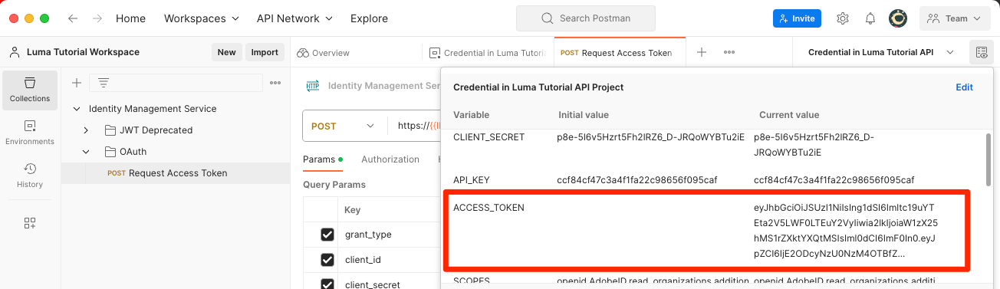

# 设置开发人员控制台和 [!DNL Postman]

<!--30min-->

在本课程中，您将在Adobe Developer控制台中设置一个项目并下载 [!DNL Postman] 收藏集，以便您可以开始使用Platform API。

要完成本教程中的API练习， [下载适用于您的操作系统的Postman应用程序。](https://www.postman.com/downloads/) 虽然使用Experience PlatformAPI不是必需的，但Postman简化了API工作流，并且Adobe Experience Platform提供了几十个Postman收藏集来帮助您执行API调用并了解其操作方式。 本教程的其余部分假定您具备一些Postman的工作知识。 如需帮助，请参考 [Postman文档](https://learning.postman.com/).

平台是API优先构建的。 虽然界面选项也可用于所有主要任务，但您可能希望在某些时候使用平台API。 例如，要摄取数据，请在沙盒之间移动项目，自动执行日常任务，或在构建用户界面之前使用新Platform功能。

**数据架构师** 和 **数据工程师** 您可能需要在本教程之外使用Platform API。

## 所需的权限

在 [配置权限](configure-permissions.md) 在本课程中，您将设置完成本课程所需的所有访问控制。

<!--
* Permission item Sandboxes > `Luma Tutorial`
* Developer-role access to the `Luma Tutorial Platform` product profile
-->

## 设置Adobe Developer控制台

Adobe Developer Console是开发人员目标，可用于访问AdobeAPI和SDK、侦听近乎实时的事件、在运行时运行函数，或构建插件或App Builder应用程序。 您将使用它来访问Experience PlatformAPI。 欲知更多详情，请参见 [Adobe Developer控制台文档](https://www.adobe.io/apis/experienceplatform/console/docs.html)

1. 在本地计算机上创建一个名为的文件夹 `Luma Tutorial Assets` 用于教程中使用的文件。

1. 打开 [Adobe Developer控制台](https://console.adobe.io){target="_blank"}

1. 登录并确认您所在的组织正确

1. 选择 **[!UICONTROL 创建新项目]** 在 [!UICONTROL 快速入门] 菜单。

   

1. 在新创建的项目中，选择 **[!UICONTROL 编辑项目]** 按钮
1. 更改 **[!UICONTROL 项目标题]** 到 `Luma Tutorial API Project` （如果您公司的多个人员学习本教程，请向结尾添加您的姓名）
1. 选择 **[!UICONTROL 保存]**

   

1. 选择 **[!UICONTROL 添加API]**

   

1. 通过选择筛选列表 **[!UICONTROL Adobe Experience Platform]**

1. 在可用API列表中，选择 **[!UICONTROL EXPERIENCE PLATFORMAPI]** 并选择 **[!UICONTROL 下一个]**.

   

1. 选择 **[!UICONTROL OAuth服务器到服务器]** 作为凭据，然后选择 **[!UICONTROL 下一个]**.
   

1. 选择 `AEP-Default-All-Users` 产品配置文件并选择 **[!UICONTROL 保存配置的API]**

   

1. 现在，您的开发人员控制台项目已创建！

1. 在 **[!UICONTROL 试试看]** 部分，选择 **[!UICONTROL Postman下载]** 然后选择 **[!UICONTROL OAuth服务器到服务器]** 下载 [!DNL Postman] 环境json文件。 保存 `oauth_server_to_server.postman_environment.json` 在您的 `Luma Tutorial Assets` 文件夹。

   

## 让系统管理员将API凭据添加到角色

要使用API凭据与Experience Platform交互，您需要让系统管理员将API凭据分配给在上一课程中创建的角色。  如果您不是系统管理员，请发送以下邮件：

1. 此 [!UICONTROL 名称] 的API凭据(`Credential in Luma Tutorial API Project`)
1. 此 [!UICONTROL 技术帐户电子邮件] 凭据（这将帮助系统管理员查找凭据）

   ![[!UICONTROL 名称] 和 [!UICONTROL 技术帐户电子邮件] 你的凭据的](assets/postman-credentialDetails.png)

以下是有关系统管理员的说明：

1. 登录 [Adobe Experience Platform](https://platform.adobe.com)
1. 选择 **[!UICONTROL 权限]** 左侧导航栏中的 [!UICONTROL 角色] screen
1. 打开 `Luma Tutorial Platform` 角色
   
1. 选择 **[!UICONTROL API凭据]** 选项卡
1. 选择 **[!UICONTROL 添加API凭据]**
   
1. 查找 `Credential in Luma Tutorial API Project` 凭据，使用 [!UICONTROL 技术帐户电子邮件] 由教程参与者提供（如果列表较长）
1. 选择凭据
1. 选择 **[!UICONTROL 保存]**

   

## 设置Postman

>[!CAUTION]
>
>Postman界面会定期更新。 本教程中的屏幕截图是使用适用于Mac的Postman v10.15.1拍摄的，但界面选项可能已更改。

1. 下载并安装 [[!DNL Postman]](https://www.postman.com/downloads/)
1. 打开 [!DNL Postman] 并创建工作区
   

1. 导入下载的json环境文件， `oauth_server_to_server.postman_environment.json`
   
1. In [!DNL Postman]，在下拉菜单中选择您的环境

1. 选择图标以查看环境变量：

   

### 添加沙盒名称和租户ID

此 `SANDBOX_NAME` 和 `TENANT_ID` 和 `CONTAINER_ID` 变量未包含在Adobe Developer Console导出中，因此我们手动添加它们：

1. In [!DNL Postman]，打开 **环境变量**
1. 选择 **编辑** 指向环境名称右侧的链接
1. 在 **添加新变量字段**，输入 `SANDBOX_NAME`
1. 在两个值字段中，输入 `luma-tutorial`，在上一课程中我们为沙盒提供的名称。 如果您对沙盒使用了不同的名称，例如luma-tutorial-ignatiusjreilly，请确保使用该值。
1. 在 **添加新变量字段**，输入 `TENANT_ID`
1. 切换到Web浏览器，通过转到Experience Platform的界面并提取URL的部分来查找公司的租户ID *在@符号之后*. 例如，我的租户ID为 `techmarketingdemos` 但你的不一样：

   

1. 复制此值并返回到 [!DNL Postman] “管理环境”屏幕
1. 将您的租户ID粘贴到两个值字段中
1. 在 **添加新变量字段**，输入 `CONTAINER_ID`
1. 输入 `global` 到两个值字段中

   >[!NOTE]
   >
   >`CONTAINER_ID` 是一个字段，在本教程中，我们会多次更改其值。 时间 `global` ，则API会与Platform帐户中由Adobe提供的元素进行交互。 时间 `tenant` 之后，API会与您自己的自定义元素进行交互。

1. 选择 **保存**

   

## 进行API调用

### 检索访问令牌

Adobe提供了一组丰富的 [!DNL Postman] 收藏集以帮助您探索Experience Platform的API。 这些收藏集位于 [Adobe Experience Platform Postman示例GitHub存储库](https://github.com/adobe/experience-platform-postman-samples). 您应该将此存储库加入书签，因为在本教程中，您将多次使用此存储库，以后当您为自己的公司实施Experience Platform时，也会使用此存储库。

第一个集合适用于AdobeIdentity Management服务(IMS) API。 这是一种从Postman中检索访问令牌的便捷方法。

要生成访问令牌，请执行以下操作：

1. 下载 [Identity Management服务API集合](https://github.com/adobe/experience-platform-postman-samples/blob/master/apis/ims/Identity%20Management%20Service.postman_collection.json) 敬您的 `Luma Tutorial Assets` 文件夹
1. 将收藏集导入 [!DNL Postman]
1. 选择请求 **oAuth：请求访问令牌** 请求并选择 **发送**
1. 您应该获得一个 `200 OK` 响应中具有访问令牌

   

1. 访问令牌应自动存储为 **ACCESS_TOKEN** 的环境变量 [!DNL Postman] 环境。

   

### 与平台API交互

现在，让我们进行Platform API调用，以确认我们正确配置了所有内容。

打开 [Experience Platform [!DNL Postman] GitHub中的集合](https://github.com/adobe/experience-platform-postman-samples/tree/master/apis/experience-platform). 此页面上有许多适用于各种Platform API的收藏集。 我强烈建议将它加入书签。

现在，让我们进行第一个API调用：

1. 下载 [架构注册表API收集](https://raw.githubusercontent.com/adobe/experience-platform-postman-samples/master/apis/experience-platform/Schema%20Registry%20API.postman_collection.json) 敬您的 `Luma Tutorial Assets` 文件夹
1. 将其导入 [!DNL Postman]
1. 打开 **架构注册表API >架构>列表架构**
1. 查看 **参数** 和 **标头** 并记下它们如何包含我们之前输入的一些环境变量。
1. 请注意 **标头>接受值字段** 设置为 `application/vnd.adobe.xed-id+json`. 架构注册表API需要以下任一项 [指定的接受标头值](https://experienceleague.adobe.com/docs/experience-platform/xdm/api/getting-started.html?lang=en#accept) 在响应中提供不同格式。
1. 选择 **发送** 进行您的第一个Platform API调用！

希望你成功了 `200 OK` 响应中包含Adobe在沙盒中提供的可用XDM架构的列表，如下图所示。

如果您的调用不成功，请花些时间使用API调用的错误响应详细信息进行调试，并查看上述步骤。 如果您卡住了，请在 [社区论坛](https://experienceleaguecommunities.adobe.com/t5/adobe-experience-platform/ct-p/adobe-experience-platform-community) 或使用此页面右侧的链接“记录问题”。

使用您的Platform权限、沙盒和 [!DNL Postman] 设置，您已准备好 [架构中的模型数据](model-data-in-schemas.md)！
