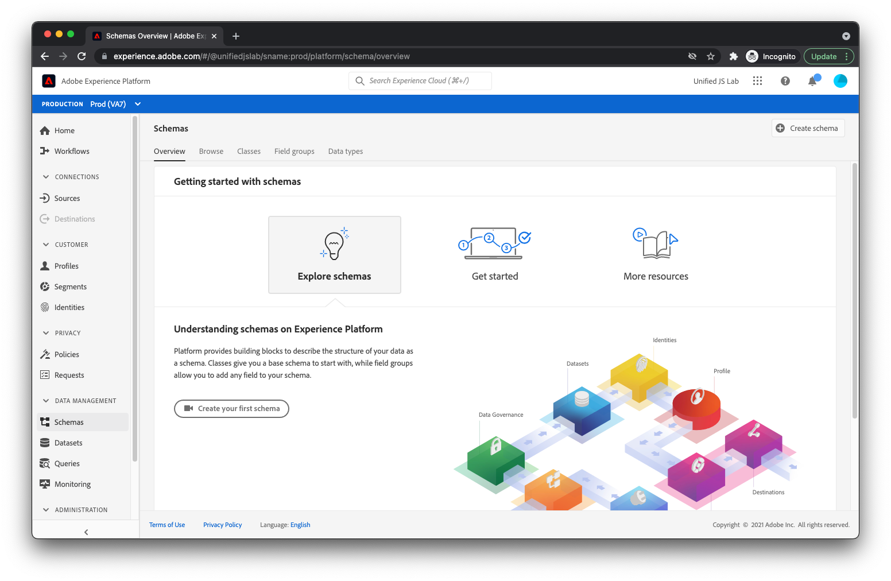

# 创建架构

如 [构建数据结构](../structuring-your-data.md)，则发送到Adobe Experience Platform的数据必须位于XDM中。 更具体地说，您的数据必须与 _模式_. 模式基本上是数据外观的描述。 它描述字段的名称以及这些字段在数据中的位置。 它还描述每个字段应具有的值类型（例如，布尔值、长度为12个字符的字符串、数字数组）。

Adobe Experience Platform提供了一些称为字段组的现成构建基块，这些字段组在行业中很常见。 例如，对于金融服务业，有用于余额转移和贷款申请的现场组。 旅游和酒店业设有航班和住宿预订的现场小组。

我们建议您在创建架构时尽可能使用内置字段组。 我们还了解您可能需要特定于您自己公司的字段。 因此，您可以创建自己的自定义字段组，以便在创建的架构中使用。

让我们逐步了解如何为典型的电子商务网站创建模式。

1. 选择 **[!UICONTROL 模式]** 在 [!UICONTROL 数据管理] 的左侧菜单。
1. 选择 **[!UICONTROL 创建架构]** 和 **[!UICONTROL XDM ExperienceEvent]** 下拉菜单中。

您现在位于架构生成器画布上。

## 添加字段组

1. 在 **[!UICONTROL 字段组]** 的左侧 **[!UICONTROL 结构]** 区域，选择 **[!UICONTROL +添加]** 链接。 此时，将显示一个模式窗口，选择要添加到架构中的字段组。
1. 首先，选择名为的字段组 **[!UICONTROL AEP Web SDK ExperienceEvent]**. 此字段组会添加一组字段，其中包含由Adobe Experience Platform Web SDK自动收集的数据。
   
1. 接下来，由于本教程的网站是电子商务网站，因此请选择 **[!UICONTROL 商务详细信息]** 字段组。 利用此字段组，可发送典型的商务数据，如查看、添加到购物车和购买的产品。
1. 选择 **[!UICONTROL 添加字段组]** 按钮。
   
1. 此时，您应会看到架构的结构。
   

## 保存架构

1. 最后，在屏幕右侧提供名称和描述，然后选择 **[!UICONTROL 保存]**.
   

您的架构已创建。 接下来，让我们了解如何创建数据集以存储您的数据。

有关创建模式的更多信息，请参阅 [创建架构](/help/platform/schemas/create-schemas.md).

[下一个： ](create-a-dataset.md)

>[!NOTE]
>
>感谢您花时间学习数据收集。 如果您有任何疑问、想要分享一般反馈或对未来内容提出建议，请就此分享 [Experience League社区讨论帖子](https://experienceleaguecommunities.adobe.com/t5/adobe-experience-platform-launch/tutorial-discussion-use-adobe-experience-platform-data/m-p/543877)
