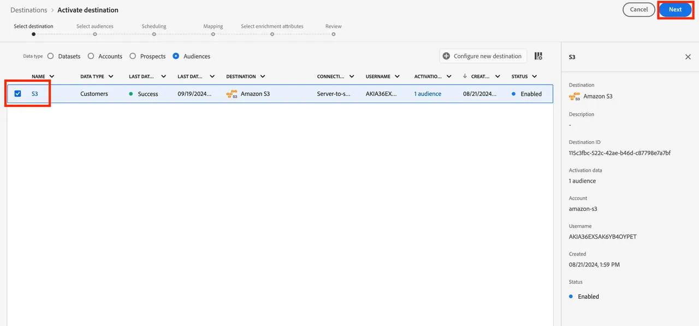

# 将联合受众映射到S3以利用受众属性进行扩充

在本练习中，您将了解如何利用Data Warehouse中的受众属性来丰富受众在使用RTCDP目标的下游激活工作流中的体验。 对于SecurFinancial，这些联合属性可用于增强客户受众的离线个性化体验。 在本例中，我们会将联合受众映射到预配置的Amazon S3目标。

## 步骤

1. 导航到&#x200B;**目标**&#x200B;门户。

2. 单击预配置的Amazon S3目标旁边的&#x200B;**3点菜单**&#x200B;按钮，然后单击&#x200B;**激活受众**。

   

3. 选择&#x200B;**S3目标**，然后单击&#x200B;**下一步**。

   

4. 选择&#x200B;**SecureFinancial客户 — 无贷款，信用良好**&#x200B;受众。

   

5. 在&#x200B;**计划**&#x200B;部分中，保留所有默认设置，然后单击&#x200B;**下一步**。

6. 在&#x200B;**映射**&#x200B;步骤中，确保包含并选定以下项作为&#x200B;**重复数据删除键**。 然后单击&#x200B;**下一步**：
   - `xdm: personalEmail.address`

   

7. 在以下映射步骤中，您可以根据联合受众构成中的受众字段映射选择扩充属性。 单击&#x200B;**铅笔（编辑）**&#x200B;图标以查看预先选定的属性。

   

   

8. 查看您的受众映射并点击&#x200B;**完成**。

我们已准备好继续[构建历程](build-journey-federated-audience.md)。
