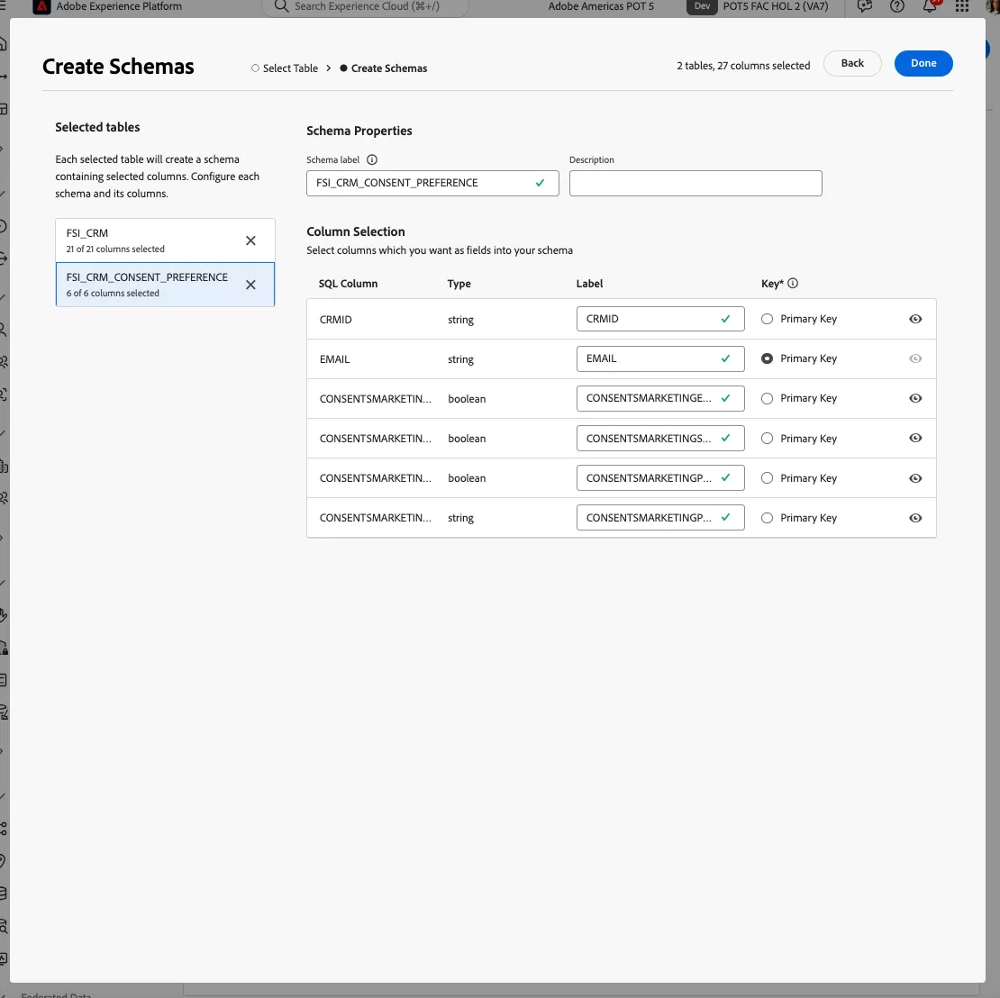

# 数据仓库连接

我们首先配置Adobe Experience Platform与您的企业Data Warehouse之间的连接。 我们根据数据在Data Warehouse中的存放方式使用架构和数据模型来支持查询构建。

为了演示，我们连接到Snowflake帐户。 联合受众组合支持不断增长的数据仓库连接列表。 查看[更新的集成列表](https://experienceleague.adobe.com/en/docs/federated-audience-composition/using/start/access-prerequisites){target="_blank"}。

## 步骤

1. 浏览到左边栏上的&#x200B;**联合数据**&#x200B;部分。
2. 在&#x200B;**联合数据库**&#x200B;链接中，单击&#x200B;**添加联合数据库**&#x200B;按钮。
3. 添加名称并选择&#x200B;**Snowflake**。
4. 填写详细信息，单击&#x200B;**测试连接**&#x200B;按钮，然后单击&#x200B;**部署函数**&#x200B;按钮。

   

   

   

## 创建架构

要在联合受众构成中创建架构，请执行以下步骤：

### 步骤

1. 在&#x200B;**联合数据**&#x200B;部分中，单击&#x200B;**模型**。
2. 浏览&#x200B;**架构**&#x200B;选项卡，然后单击&#x200B;**创建架构**&#x200B;按钮。
3. 在列表中选择源数据库，然后单击&#x200B;**添加表**&#x200B;选项卡。
4. 从联合源中选择表。 在我们的示例中：
   - FSI_CRM
   - FSI_CRM_CONSENT_PREFERENCE

   

   

选择表后，复查每个表中的列并选择主键。 为了支持业务案例，在两个表中都选择了&#x200B;**EMAIL**&#x200B;作为主键。

## 创建数据模型

数据模型允许您在表之间创建链接。 可以在同一数据库中的表之间创建链接，例如Snowflake中的表；也可以在不同数据库中的表之间创建链接，例如Snowflake中的表与Amazon Redshift中的表之间的链接。

### 步骤

1. 在&#x200B;**联合数据**&#x200B;部分中，单击&#x200B;**模型**，然后单击&#x200B;**数据模型**。
2. 单击&#x200B;**创建数据模型**&#x200B;按钮。
3. 提供数据模型的名称。
4. 单击&#x200B;**添加架构**&#x200B;并选择新的联合数据架构。 在此示例中，我们选择&#x200B;**FSI_CRM**&#x200B;和&#x200B;**FSI_CRM_CONSENT_PREFERENCE**&#x200B;架构。
5. 通过单击&#x200B;**创建链接**，创建这些表之间的链接。

创建链接时，请选择适用的基数：

- **1-N**：源表格的一个存在可以拥有目标表格的多个对应存在，但目标表格的一个存在最多可以拥有源表格的一个对应存在。
- **N-1**：目标表的一个存在可以具有源表的多个对应存在，但源表的一个存在最多可以具有目标表的一个对应存在。
- **1-1**：源表格的一个存在最多可以具有目标表格的一个对应存在。

以下是按照上述步骤创建的链接的预览。 该链接使CRM和同意表之间能够使用主键&#x200B;**EMAIL**&#x200B;执行联接。

现在，我们准备好[创建联合受众](create-a-federated-audience.md)。
