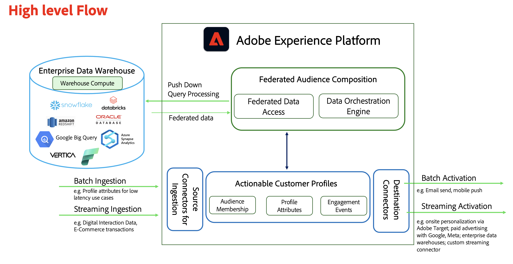

# 联合受众组合高级架构和流程

在我们深入探讨支持SecurFinancial业务方案的步骤之前，我们将回顾一下此可组合CDP方法的高级架构和流程。

Adobe Experience Platform中的“联合受众构成”模块扩展了对Data Warehouse数据集的访问，无需复制基础数据，从而最大限度地减少了数据移动和重复。

此外，对于已经在其仓库中完成了所需数据管理工作，并且希望使用零拷贝模式(Adobe Experience Platform将充当项目引擎)的组织来说，这也为他们提供了所需的可组合架构。

它允许企业快速处理存储在一个或多个数据仓库中的信息。 它消除了将数据摄取到Adobe Experience的需求。 此外，它还允许访问驻留在企业数据仓库中，但到目前为止仍无法供客户体验工作流访问的新数据集。 示例可能包括历史交易或个人数据，这些数据在汇总的受众级别很有用，可用于客户参与。

现在我们继续创建[Data Warehouse连接](data-warehouse-connection.md)。
