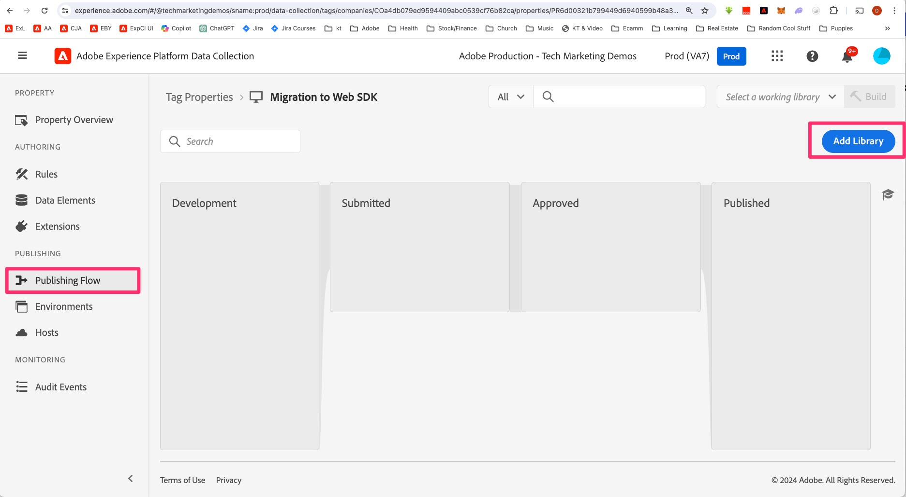
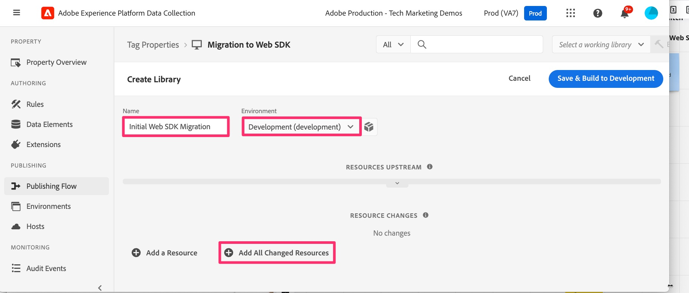

# 生成对开发库的实施更改

了解如何在标记资产中生成您对开发库所做的任何更改，以便您可以在开发网站上测试结果。

在本教程中进行更改时，或者在您对实施进行更改的任何时候，您将需要构建/发布这些更改，以便在开发、暂存或生产网站上看到它们。 我确定您以前已经这样做了，因为这是一个迁移文档，而不是第一次实施文档。 实际上，您经常需要这样做，因为您执行每个功能并想要对其进行测试以确保其正常运行并将正确的数据发送到Analytics。

因此，本教程中将有一些提醒来构建或发布您的更改。 如果需要，请在此页面上放置书签，并且不要羞于向开发库构建。 你随时可以做。

那么，让我们来构建我们目前所做的。 顺便说一下，我们有时可能会在本教程中交换“生成”和“发布”。 最重要的是了解您是否要“构建”到开发或暂存库，或者您是要“发布”到生产库和环境，而不管我们使用哪个词。

## 在Experience Platform标签中生成对开发的迁移更改

1. 在Experience Platform标签中的属性中，从左侧导航中选择&#x200B;**发布流**，然后添加一个新库。

   

1. 根据需要命名库，例如&#x200B;**初始Web SDK迁移**。
1. 选择&#x200B;**开发**&#x200B;环境。
1. 选择&#x200B;**添加所有已更改资源**&#x200B;以添加您正在处理的所有项。

   

1. 保存并生成到开发环境

   

1. 构建完成后，您将能够查看构建是否成功。 将鼠标悬停在发布流中新库左侧的绿色圆点上，实际上，如果该圆点为绿色，则它将会成功完成，并且会告诉您这是事实。

   

### 选择工作库

当您在标记中完成编辑时，下面是一个很好的快捷键。 您无需每次进行更改时都查看整个发布流，而是可以选择工作库，然后单击按钮以保存并构建。 动手吧。 你晚点会感谢我的。

1. 在标记UI中的几乎任意位置，单击从UI右上角选择工作库，然后选择所需的库。 在本教程中，请选择初始Web SDK迁移。

   

