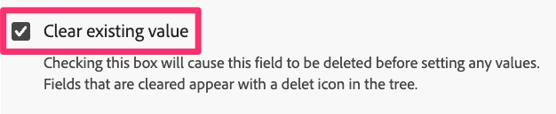

# 迁移自定义链接规则

在本练习中，您将了解如何迁移发送自定义链接点击（而不是页面查看）的规则。

## 概述

当您使用Analytics扩展或AppMeasurement代码发送自定义链接点击时，当您配置&#x200B;**发送信标**&#x200B;操作时，您还可以选择是发送页面查看点击还是自定义链接点击，如果您选择自定义链接点击，它将要求您提供该点击的&#x200B;**链接名称**&#x200B;和&#x200B;**链接类型**。 如果除了链接名称和类型之外，您未发送任何其他变量数据，则无需使用其他设置变量（prop、eVar和event）的操作。
因此，在迁移属于自定义链接规则的规则时，您将具有规则中以下两个**方案中的**&#x200B;个：

1. 现有规则将包含&#x200B;**Adobe Analytics - Set Variables**&#x200B;操作，该操作设置prop、eVar、事件等，然后包含&#x200B;**Adobe Analytics - Send Beacon**&#x200B;操作，该操作将点击设置为自定义链接点击(A.K.A.和s.tl()点击)，设置链接名称和类型，并在数据中发送。
   1. 在这种情况下，它还可能包含名为&#x200B;**Adobe Analytics - Clear Variables**&#x200B;的最终操作，以便在将数据发送到Adobe服务器后，从变量中“清零”值。
1. 现有规则将仅包含&#x200B;**Adobe Analytics - Send Beacon**&#x200B;操作，该操作将点击设置为自定义链接点击，设置链接名称和类型，并在数据中发送。

### 重要更改

当您将Adobe Analytics实施迁移到Web SDK时，这一点很重要，原因是：
对于要使其成为自定义链接点击的点击，所需的链接名称和类型设置不在“发送等效信标”操作（发送事件）中。 而是在“设置等效变量”操作（更新变量）中设置链接名称和类型。
其结果是，无论您具有上述场景1还是场景2，最终都需要执行更新变量操作和发送事件操作。

以下是实施中此差异的可视表示形式。

## 迁移步骤

打开您的规则自定义链接规则，并识别它是否与上面场景1或场景2相似。
**如果规则与方案1类似：**

1. 打开Set Variables操作并写下在该操作中设置的所有变量（prop、eVar、event等）（例如，在上图中，正在设置event10）。
1. 打开Send Beacon操作，验证是否已将其设置为发送s.tl()点击。 记下“Link Type（链接类型）”和“Link Name（链接名称）”的值。
1. 在自定义链接规则的Actions部分中，单击加号图标以添加其他规则。

   

1. 配置操作
   1. 将&#x200B;**扩展**&#x200B;设置为Adobe Experience Platform Web SDK
   1. 将&#x200B;**操作类型**&#x200B;设置为更新变量
   1. 选择&#x200B;**Analytics**&#x200B;对象
   1. 通过Analytics的“设置变量”操作（在此示例中为event10）设置prop、eVar和事件

      

   1. 在同一规则中，向下滚动到&#x200B;**其他属性**&#x200B;下拉字段，然后添加&#x200B;**链接名称**&#x200B;字段，将其设置为您从Send Beacon规则中拉取的值。 在下图中，示例是将名称设置为字符串值“menu click”。
   1. 此外，从同一下拉列表中添加&#x200B;**Link type**&#x200B;字段，添加“o”作为值（假定您在“发送信标”操作中的链接类型为“自定义链接”）。 这将发送链接类型“其他”，这相当于自定义链接。 如果您的链接类型是下载链接，则在此新的链接类型字段中选择值“d”；如果您的链接类型是退出链接，则在此新的链接类型字段中选择值“e”。

      

1. 在其他属性下，您会看到一个标记为&#x200B;**清除现有值**&#x200B;的复选框。 如果现有规则具有&#x200B;**Adobe Analytics - Clear Variables操作**（如上面步骤3中所示），则只需选中此框即可，并且无需为Web SDK添加清除变量操作。

   

1. 单击加号图标可添加其他操作。
1. 配置发送事件操作
   1. 将&#x200B;**扩展**&#x200B;设置为Adobe Experience Platform Web SDK
   1. 将&#x200B;**操作类型**&#x200B;设置为已发送事件
   1. 单击数据元素图标并选择&#x200B;**页面查看数据变量**&#x200B;数据元素

   

1. **保留更改**，**保存到库**，您可以从同一页面&#x200B;**生成**&#x200B;库，因为我们已设置工作库。

## 得出重要的迁移结论

* 在本课程中，您已了解如何迁移自定义链接规则。
* 在[迁移默认页面加载规则](migrate-your-default-page-load-rule.md)练习中，您已了解如何迁移既设置变量又在Analytics信标中发送的规则。
* 在[迁移其他页面规则](migrate-additional-page-rules.md)课程中，您已了解如何迁移设置变量但不将信标发送到Adobe Analytics的规则。

如您所见，可以通过多种不同的规则使用相同的方法将Analytics扩展迁移到Web SDK。
在大多数情况下，您只需**更新规则中的操作**。 您不会更改触发该事件的事件或条件。 您只能更改规则触发时，操作部分中发生的情况。
您的大多数（如果不是全部）规则将属于这些类别。 如果您的规则没有这样做，请考虑迁移操作的相同范式，而不是触发规则的原因。
