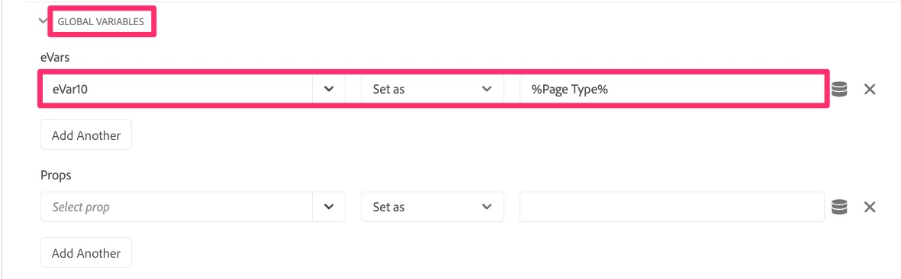
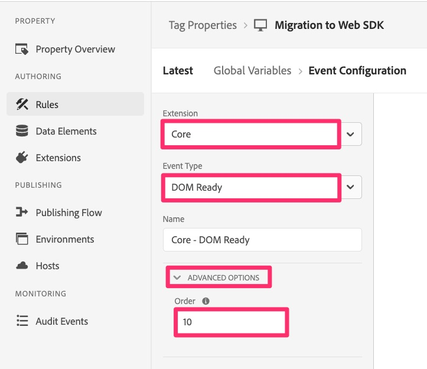

# 迁移全局变量

在本练习中，您将了解如何将全局变量从Analytics扩展配置迁移到Web SDK。

## 概述

在Adobe Analytics扩展中，有一个名为“全局变量”的配置部分。

全局变量是在页面上初始化 Analytics 跟踪对象时在该对象上设置的变量。在每个页面上创建跟踪对象时，将设置您在此处设置的任何变量。

如果您在此处设置了变量，则还需要将这些变量迁移到Web SDK。

## 在Web SDK中的何处添加全局变量

**归根结底**&#x200B;是Web SDK扩展的配置中没有等效的区域，因此不像在“默认页面加载规则”练习中那样轻松复制变量。
简短的答案是：**创建一个在每个页面上的其他规则之前运行的新规则，并在其中设置变量。**

如果您不需要定义步骤，请执行相应的操作，并完成本课程。 如果您需要帮助，请继续……

### 将全局变量迁移到Web SDK的步骤

1. 打开Adobe Analytics扩展配置

   

1. 向下滚动到“全局变量”部分（上面图像），打开它，并记下正在设置的任何/所有变量。 在后续步骤中，您将需要了解这些变量和值。
1. 取消退出Analytics扩展。
1. 在左侧导航中选择&#x200B;**规则**，然后单击&#x200B;**添加规则**。
1. 将新规则命名为“Global Variables”。
1. 单击Events下的Add按钮。

   

1. 将事件配置为在其他规则之前触发。 您需要了解事件类型以及在其他规则中使用的顺序。 示例值：
   1. 将&#x200B;**扩展**&#x200B;设置为核心
   1. **事件类型**&#x200B;可能是DOM已就绪，具体取决于您的实施
   1. 展开&#x200B;**高级选项**
   1. 将&#x200B;**Order**&#x200B;设置为比您的其他规则更低的数字，以便它先执行。

      
      >[!NOTE]
      >
      >主要内容是，此规则在默认页面加载规则之前触发，以便此规则中设置的任何变量都可以通过sendEvent规则发送到Analytics。 但是，我们建议此规则整体运行&#x200B;**first**，因为在其他规则中，可以更改Analytics扩展的Global Variables部分中设置的变量。 我们正在模仿这种功能。 在上面的示例中，我们假定“10”的顺序数低于任何其他规则。 如果不正确，请将数字更改为小于其他规则的数字。
1. 选择&#x200B;**保留更改**&#x200B;以保存您所做的工作。
1. 您无需向此规则添加条件，因此您可以保留规则创建部分。
1. 单击&#x200B;**操作**&#x200B;部分下的加号图标
1. 配置新操作
   1. 选择Adobe Experience Platform Web SDK **扩展**
   1. 对于&#x200B;**操作类型**，请选择“更新变量”
   1. 在右侧，选择您的变量&#x200B;**数据元素**（在本教程中，该变量名为“页面查看数据元素”，但您的变量可能有所不同）
   1. 在数据对象下选择&#x200B;**Analytics**
   1. 填充您从Analytics扩展配置的“全局变量”部分保存的变量(在本教程的示例中，将eVar10设置为页面类型数据元素)

   

1. 保留更改
1. 将规则保存到工作库并生成

您的全局变量现在已迁移到Web SDK，将在任何页面加载时触发。
