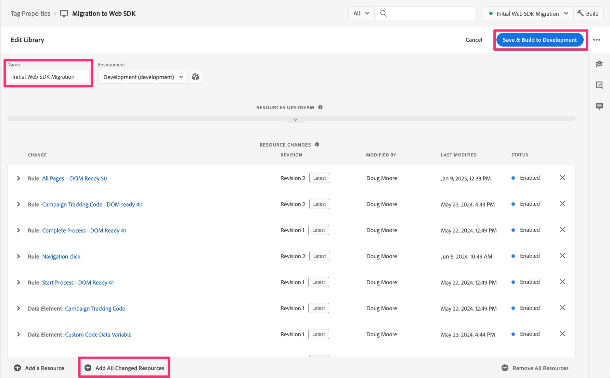
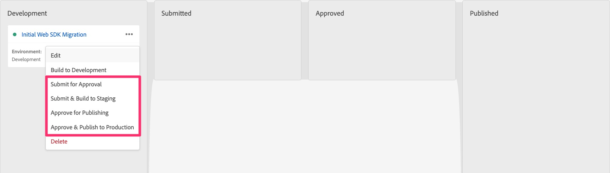

# Publish迁移到暂存和生产环境

完成迁移的所有开发并进行验证后，构建到暂存，然后在准备就绪后发布到生产环境。

## 概述

这确实是迁移的最后一个主要步骤，它将用于开发和测试迁移的库移至暂存环境以进行最终测试，然后再移至生产环境。

如果您返回[创建和配置数据流](create-and-configure-the-analytics-datastream.md)课程，您将在课程结束时看到我们指示暂存数据流将分析数据发送到同一开发报表包（或者发送到新的暂存报表包）。 此时您还会被提醒，我们已将生产数据流指向您一直在使用的现有生产报表包，以发送数据。
这是我们现在拥有的良好信息，我们将迁移的库沿着发布路径推送到暂存和生产环境。

## 推送到暂存和生产环境

以下是将我们的库推送到暂存和生产环境的步骤：

1. 在“标记”界面中，选择左侧导航栏中的发布流
1. 您应会看到正在开发的迁移库（名称为在此迁移过程开始时选择的名称）

   

1. 如果您确定已将每个更改都添加到库中，则可以将库移至三个圆点下方，并跳过后续的步骤。 如果您不确定，请执行下面的五个步骤。
1. 单击库名称可进入库详细信息
1. 通过名称验证您是否位于正确的库中
1. 选择页面底部的Add All Changed Resources
1. 然后单击Save &amp; Build to Development ，将所有已排队更改添加到库中

   

1. 然后，您将转到发布流界面，如果构建成功完成，库旁边将有一个绿点。
1. 然后，您可以根据自己的需求，在发布过程中继续使用库。 您可以将其设置为审批，直接将其移至暂存环境以进行测试和审批，甚至可以直接将其移至生产环境以供审批或发布。 同样，这取决于贵组织的发布需求。

   

恭喜！此时，您的Analytics实施将完全放在Web SDK上！

我将在此添加一个在本教程开始时包含的重要说明：

>[!IMPORTANT]
>
>请务必注意，执行此次实施迁移的主要原因之一是准备使用Adobe Experience Platform应用程序，如Customer Journey Analytics、Real-Time CDP或Journey Optimizer(如上#3所述)。 为此，使用您的网站数据将包括本教程中未包含的其他步骤，但本教程无疑将是进一步实施的前提条件。 因此，请先完成本教程，然后您可以继续执行必要的步骤，将此相同的网站数据也发送到Experience Platform。

祝您在分析和其他内容以及营销方面的工作取得进展顺利！
