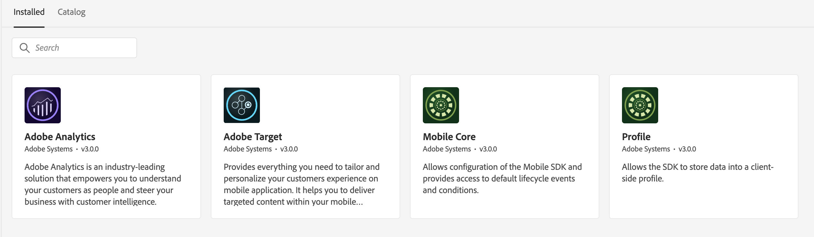

# 执行初始数据收集设置

从Target SDK迁移到优化SDK需要进行初始设置，才能启用优化SDK的正确数据捕获、特性和功能。 在进行任何网站实施更改之前，必须完成以下步骤：

- [在Adobe Admin Console中为数据收集配置适当的权限](https://experienceleague.adobe.com/zh-hans/docs/platform-learn/implement-web-sdk/overview#permissions){target="_blank"}
- [配置XDM架构](https://experienceleague.adobe.com/zh-hans/docs/platform-learn/implement-mobile-sdk/initial-configuration/create-schema){target="_blank"}以将结构化数据传递到Edge Network
- [配置架构](https://experienceleague.adobe.com/zh-hans/docs/platform-learn/implement-mobile-sdk/experience-cloud/target#update-your-schema){target="_blank"}以接收Adobe Target数据
- [为跨设备个性化和mbox3rdPartyId功能配置标识命名空间](https://experienceleague.adobe.com/zh-hans/docs/platform-learn/implement-mobile-sdk/app-implementation/identity#set-up-a-custom-identity-namespace){target="_blank"}
- [创建数据流](https://experienceleague.adobe.com/zh-hans/docs/platform-learn/implement-mobile-sdk/initial-configuration/create-datastream){target="_blank"}以启用从Edge Network转发数据
- [配置数据流](https://experienceleague.adobe.com/zh-hans/docs/platform-learn/implement-mobile-sdk/experience-cloud/target#update-datastream-configuration){target="_blank"}以启用将数据转发到Adobe Target
- [为Decisioning扩展配置Tag属性](https://experienceleague.adobe.com/zh-hans/docs/platform-learn/implement-mobile-sdk/experience-cloud/target#install-adobe-journey-optimizer---decisioning-tags-extension){target="_blank"}

## 扩展配置

>[!BEGINTABS]

>[!TAB Decisioning扩展]

标记在使用Decisioning扩展时安装的扩展：

1. Adobe Journey Optimizer - Decisioning
1. Adobe Experience Platform Edge Network
1. Mobile Core
1. 轮廓
1. 同意
1. 身份标识
1. AEP Assurance （可选，调试时需要使用）

使用Decisioning扩展时安装的

>[!TAB 目标扩展]

使用Target扩展时安装的标记扩展：

1. Adobe Target
1. Mobile Core
1. 轮廓
1. Adobe Analytics (可选，在使用Adobe Analytics作为Adobe Target活动的报表源时需要)

使用Target扩展时安装的

>[!ENDTABS]

## 数据流配置

Target扩展具有[可配置的设置](https://developer.adobe.com/client-sdks/solution/adobe-target/#configure-the-target-extension-in-the-data-collection-ui)，使用决策扩展这些设置在数据流[&#128279;](https://developer.adobe.com/client-sdks/edge/adobe-journey-optimizer-decisioning/#adobe-experience-platform-data-collection-setup)中配置了。

| 目标扩展 | Decisioning扩展 | 注释 |
| --- | --- | --- | 
| 客户端代码 | 不适用 | 边缘使用IMS组织详细信息自动设置 |
| 环境ID | 目标环境ID | 已在数据流中配置 |
| Target Workspace资产 | 资产令牌 | 已在数据流中配置 |
| 超时 | 超时 | 可在Decisioning扩展和优化SDK中进行配置。 默认超时为10秒。 |
| Server Domain | Edge Network域 | 在Adobe Experience Platform Edge Network扩展中设置 |

接下来，了解如何[替换Target SDK](replace-sdk.md)。

>[!NOTE]
>
>我们致力于帮助您成功将Target移动设备扩展从Target扩展迁移到Decisioning扩展。 如果您在迁移过程中遇到障碍或觉得本指南中缺少关键信息，请在[此社区讨论](https://experienceleaguecommunities.adobe.com/t5/adobe-experience-platform-data/tutorial-discussion-migrate-adobe-target-to-mobile-sdk-on-edge/m-p/747484#M625)中发帖让我们知道。
