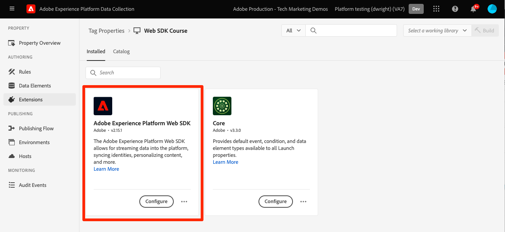

# 呈现Adobe Target可视化体验编辑器(VEC)活动

可使用可视化体验编辑器(VEC)或基于表单的编辑器设置Target活动。 Platform Web SDK可以像at.js一样检索基于VEC的活动并将其应用于页面。 对于迁移的这一部分，您将执行以下操作：

* 安装可视化编辑帮助程序浏览器扩展
* 使用Platform Web SDK执行`sendEvent`调用以请求活动。
* 更新来自使用`getOffers()`执行Target `pageLoad`请求的at.js实施的任何引用。

## 可视化编辑帮助程序浏览器扩展

借助适用于Google Chrome的Adobe Experience Cloud可视化编辑帮助程序浏览器扩展，您可以在Adobe Target可视化体验编辑器(VEC)中以可靠的方式加载网站，以快速创作和QA Web体验。

可视化编辑帮助程序浏览器扩展适用于使用at.js或Platform Web SDK的网站。

### 获取并安装可视化编辑帮助程序

1. 导航到Chrome网上应用商店[&#128279;](https://chrome.google.com/webstore/detail/adobe-experience-cloud-vi/kgmjjkfjacffaebgpkpcllakjifppnca)中的Adobe Experience Cloud可视化编辑帮助程序浏览器扩展。
1. 单击“添加到&#x200B;**Chrome** > **添加扩展**”。
1. 在Target中打开VEC。
1. 若要使用该扩展，请在VEC或QA模式下，单击Chrome浏览器工具栏中的可视化编辑帮助程序浏览器扩展图标{zoomable="yes"}。

当在目标VEC中打开网站以进行创作时，会自动启用可视化编辑帮助程序。 该扩展没有任何条件设置。 该扩展会自动处理所有设置，包括SameSite Cookie设置。

请参阅专用文档以了解有关[可视化编辑帮助程序扩展](https://experienceleague.adobe.com/docs/target/using/experiences/vec/troubleshoot-composer/visual-editing-helper-extension.html)和[可视化体验编辑器故障诊断](https://experienceleague.adobe.com/docs/target/using/experiences/vec/troubleshoot-composer/troubleshoot-composer.html)的更多信息。

>[!IMPORTANT]
>
>新的[可视化编辑帮助程序扩展](https://chrome.google.com/webstore/detail/adobe-experience-cloud-vi/kgmjjkfjacffaebgpkpcllakjifppnca)取代了以前的[Target VEC帮助程序浏览器扩展](https://experienceleague.adobe.com/docs/target/using/experiences/vec/troubleshoot-composer/vec-helper-browser-extension.html)。 如果安装了旧版VEC助手扩展，则在使用可视化编辑助手扩展之前，应将其删除或禁用。

## 自动请求和应用内容

在页面上配置Platform Web SDK后，您可以从Target请求内容。 与可以配置为在加载库时自动请求内容的at.js不同，Platform Web SDK要求您显式执行命令。

如果您的at.js实施将`pageLoadEnabled`设置设置为`true`，以便允许自动渲染基于VEC的活动，则您将通过Platform Web SDK执行以下`sendEvent`命令：

>[!BEGINTABS]

>[!TAB JavaScript]

```Javascript
alloy("sendEvent", {
  "renderDecisions": true
});
```

>[!TAB 标记]

在标记中，在选择了[!UICONTROL 呈现可视化个性化决策]选项的情况下使用[!UICONTROL 发送事件]操作类型：

{zoomable="yes"}

>[!ENDTABS]

<!--
When the Platform Web SDK renders an activity to the page with `renderDecisions` set to `true`, an additional notification call fires automatically to increment an impression and attribute the visitor to the activity. This call uses an event type with the value `decisioning.propositionDisplay`.

{zoomable="yes"}
-->

## 按需请求和应用内容

某些Target实施在将选件应用到页面之前，需要对VEC选件进行一些自定义处理。 或者，他们在一次调用中请求多个位置。 在at.js实现中，可以通过将`pageLoadEnabled`设置为`false`并使用`getOffers()`函数执行`pageLoad`请求来完成此操作。

+++ at.js示例使用`getOffers()`和`applyOffers()`手动渲染基于VEC的活动

```JavaScript
adobe.target.getOffers({
  request: {
    execute: {
      pageLoad: {}
    }
  }
}).
then(response => adobe.target.applyOffers({ response: response }));
```

+++

Platform Web SDK没有特定的`pageLoad`事件。 使用`decisionScopes`选项和`sendEvent`命令可控制Target内容的所有请求。 `__view__`作用域用于`pageLoad`请求的用途。

+++ 等效的Platform Web SDK `sendEvent`方法：

1. 执行包含`__view__`决策范围的`sendEvent`命令
1. 使用`applyPropositions`命令将返回的内容应用到页面
1. 执行具有`decisioning.propositionDisplay`事件类型和建议详细信息的`sendEvent`命令以递增展示

```Javascript
alloy("sendEvent", {
  // Request the special "__view__" scope for target-global-mbox / pageLoad
  decisionScopes: ["__view__"]
}).then(function(result) {
  // Check if content (propositions) were returned
  if (result.propositions) {
    var retrievedPropositions = result.propositions;
    // Apply propositions to the page
    return alloy("applyPropositions", {
      propositions: retrievedPropositions
    }).then(function(applyPropositionsResult) {
      var renderedPropositions = applyPropositionsResult.propositions;
      // Send a display notification with the sendEvent command
      alloy("sendEvent", {
        "xdm": {
          "eventType": "decisioning.propositionDisplay",
          "_experience": {
            "decisioning": {
              "propositions": renderedPropositions
            }
          }
        }
      });
    });
  }
});
```

+++

>[!NOTE]
>
>可以[手动渲染在可视化体验编辑器中进行的修改](https://experienceleague.adobe.com/docs/experience-platform/edge/personalization/rendering-personalization-content.html#manually-rendering-content)。 基于VEC的修改手动渲染并不常见。 检查您的at.js实施是否使用`getOffers()`函数手动执行Target `pageLoad`请求，而不使用`applyOffers()`将内容应用到页面。

Platform Web SDK在请求和呈现内容方面为开发人员提供了极大的灵活性。 有关其他选项和详细信息，请参阅有关渲染个性化内容的[专用文档](https://experienceleague.adobe.com/docs/experience-platform/edge/personalization/rendering-personalization-content.html)。

## 实施示例

基础Platform Web SDK实施现已完成。

>[!BEGINTABS]

>[!TAB JavaScript]

具有自动Target内容渲染的JavaScript示例：

```HTML
<!doctype html>
<html>
<head>
  <title>Example page</title>
  <!--Data Layer to enable rich data collection and targeting-->
  <script>
    var digitalData = { 
      // Data layer information goes here
    };
  </script>

  <!--Third party libraries that may be used by Target offers and modifications-->
  <script src="https://ajax.googleapis.com/ajax/libs/jquery/3.6.1/jquery.min.js"></script>

  <!--Prehiding snippet for Target with asynchronous Web SDK deployment-->
  <script>
    !function(e,a,n,t){var i=e.head;if(i){
    if (a) return;
    var o=e.createElement("style");
    o.id="alloy-prehiding",o.innerText=n,i.appendChild(o),setTimeout(function(){o.parentNode&&o.parentNode.removeChild(o)},t)}}
    (document, document.location.href.indexOf("mboxEdit") !== -1, ".body { opacity: 0 !important }", 3000);
  </script>

  <!--Platform Web SDK base code-->
  <script>
    !function(n,o){o.forEach(function(o){n[o]||((n.__alloyNS=n.__alloyNS||
    []).push(o),n[o]=function(){var u=arguments;return new Promise(
    function(i,l){n[o].q.push([i,l,u])})},n[o].q=[])})}
    (window,["alloy"]);
  </script>

  <!--Platform Web SDK loaded asynchonously. Change the src to use the latest supported version.-->
  <script src="https://cdn1.adoberesources.net/alloy/2.6.4/alloy.min.js" async></script>
  
  <!--Configure Platform Web SDK then send event-->
  <script>
    alloy("configure", {
      "edgeConfigId": "ebebf826-a01f-4458-8cec-ef61de241c93",
      "orgId":"ADB3LETTERSANDNUMBERS@AdobeOrg"
    });
    
    // Send an event to the Adobe edge network and render Target content automatically 
    alloy("sendEvent", {
      "renderDecisions": true
    });
  </script>
</head>
<body>
  <h1 id="title">Home Page</h1><br><br>
  <p id="bodyText">Navigation</p><br><br>
  <a id="home" class="navigationLink" href="#">Home</a><br>
  <a id="pageA" class="navigationLink" href="#">Page A</a><br>
  <a id="pageB" class="navigationLink" href="#">Page B</a><br>
  <a id="pageC" class="navigationLink" href="#">Page C</a><br>
  <div id="homepage-hero">Homepage Hero Banner Content</div>
</body>
</html>
```


>[!TAB 标记]

具有自动Target内容渲染的标记示例页面：


```HTML
<!doctype html>
<html>
<head>
  <title>Example page</title>
  <!--Data Layer to enable rich data collection and targeting-->
  <script>
    var digitalData = { 
      // Data layer information goes here
    };
  </script>

  <!--Third party libraries that may be used by Target offers and modifications-->
  <script src="https://ajax.googleapis.com/ajax/libs/jquery/3.6.1/jquery.min.js"></script>

  <!--Prehiding snippet for Target with asynchronous Web SDK deployment-->
  <script>
    !function(e,a,n,t){var i=e.head;if(i){
    if (a) return;
    var o=e.createElement("style");
    o.id="alloy-prehiding",o.innerText=n,i.appendChild(o),setTimeout(function(){o.parentNode&&o.parentNode.removeChild(o)},t)}}
    (document, document.location.href.indexOf("mboxEdit") !== -1, ".body { opacity: 0 !important }", 3000);
  </script>

    <!--Tags Header Embed Code: REPLACE WITH THE INSTALL CODE FROM YOUR OWN ENVIRONMENT-->
    <script src="//assets.adobedtm.com/launch-EN93497c30fdf0424eb678d5f4ffac66dc.min.js" async></script>
</head>
<body>
  <h1 id="title">Home Page</h1><br><br>
  <p id="bodyText">Navigation</p><br><br>
  <a id="home" class="navigationLink" href="#">Home</a><br>
  <a id="pageA" class="navigationLink" href="#">Page A</a><br>
  <a id="pageB" class="navigationLink" href="#">Page B</a><br>
  <a id="pageC" class="navigationLink" href="#">Page C</a><br>
  <div id="homepage-hero">Homepage Hero Banner Content</div>
</body>
</html>
```

在标记中，添加Adobe Experience Platform Web SDK扩展：

{zoomable="yes"}

添加所需的配置：
{zoomable="yes"}

使用[!UICONTROL 发送事件]操作和[!UICONTROL 呈现选定的可视化个性化决策]创建规则：
{zoomable="yes"}

>[!ENDTABS]

接下来，了解如何请求和[渲染基于表单的Target活动](render-form-based-activities.md)。

>[!NOTE]
>
>我们致力于帮助您成功完成从at.js到Web SDK的Target迁移。 如果您在迁移过程中遇到障碍或觉得本指南中缺少关键信息，请在[此社区讨论](https://experienceleaguecommunities.adobe.com/t5/adobe-experience-platform-data/tutorial-discussion-migrate-target-from-at-js-to-web-sdk/m-p/575587#M463)中发帖让我们知道。
