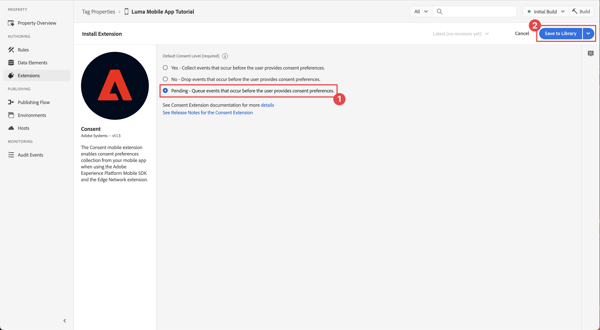

# 配置标记属性

了解如何在中配置标记属性 [!UICONTROL 数据收集] 界面。

Adobe Experience Platform 中的标记是 Adobe 推出的新一代标记管理功能。标记为客户提供了一种简单的方式来部署和管理用来加强相关客户体验的分析、营销和广告标记。 了解有关 [标记](https://experienceleague.adobe.com/docs/experience-platform/tags/home.html) 在产品文档中。

## 先决条件

要完成本课程，您必须具有创建标记属性的权限。 了解标记的基础信息也很有帮助。

>[!NOTE]
>
> platform launch（客户端）现在为 [标记](https://experienceleague.adobe.com/docs/experience-platform/tags/home.html?lang=en)

## 学习目标

在本课程中，您将执行以下操作：

* 安装和配置移动标记扩展。
* 生成SDK安装说明。

## 初始设置

1. 在数据收集界面中创建新的移动标记属性：
   1. 选择 **[!UICONTROL 标记]** 在左侧导航中。
   1. 选择 **[!UICONTROL 新建属性]**
      .
   1. 对于 **[!UICONTROL 名称]**，输入 `Luma Mobile App Tutorial`.
   1. 对于 **[!UICONTROL 平台]**，选择 **[!UICONTROL 移动设备]**.
   1. 选择&#x200B;**[!UICONTROL 保存]**。

      

      >[!NOTE]
      >
      > 对于基于Edge的Mobile Sdk实施（例如，您在本教程中正在执行的实施），默认同意设置来自 [!UICONTROL 同意扩展] 而不是 [!UICONTROL 隐私] 设置。 您可在本课程的后面部分添加并配置同意扩展。 有关更多信息，请参阅 [文档](https://developer.adobe.com/client-sdks/documentation/privacy-and-gdpr/).

1. 打开新资产。
1. 创建库:

   1. 转到 **[!UICONTROL 发布流]** 在左侧导航中。
   1. 选择 **[!UICONTROL 添加库]**.

      

   1. 对于 **[!UICONTROL 名称]**，输入 `Initial Build`.
   1. 对于 **[!UICONTROL 环境]**，选择 **[!UICONTROL 开发（开发）]**.
   1. 选择   **[!UICONTROL 添加所有已更改资源]**.
   1. 选择 **[!UICONTROL 保存并生成到开发环境]**.

      

   1. 最后，选择 **[!UICONTROL 初始构建]** 作为工作库，从 **[!UICONTROL 选择工作库]** 菜单。
      
1. 检查扩展：

   1. 确保 **[!UICONTROL 初始构建]** 被选为默认库。

   1. 选择左边栏中的&#x200B;**[!UICONTROL 扩展]**。

   1. 选择 **[!UICONTROL 已安装]** 选项卡。

      此 [!UICONTROL 移动核心] 和 [!UICONTROL 个人资料] 应预安装扩展。

      

## 扩展配置

1. 确保您位于 **[!UICONTROL 扩展]** （在移动设备应用程序资产中）。

1. 选择 **[!UICONTROL 目录]**.

   

1. 使用  **[!UICONTROL Search]** 填写以查找 **标识** 扩展。

   1. 搜索 `Identity`.

   2. 选择 **[!UICONTROL 标识]** 扩展。

   3. 选择 **[!UICONTROL 安装]**.

      

   此扩展不需要任何进一步的配置。

1. 使用  **[!UICONTROL Search]** 字段以查找并安装 **AEP保证** 扩展。

   此扩展不需要任何进一步的配置。

1. 使用  **[!UICONTROL Search]** 字段以查找并安装 **同意** 扩展。 在配置屏幕中：

   1. 选择 **[!UICONTROL 待处理]**. 在本教程中，您可以在应用程序中进一步管理同意。 在中进一步了解Consent扩展 [文档](https://developer.adobe.com/client-sdks/documentation/consent-for-edge-network/).
   1. 选择 **[!UICONTROL 保存到库]**.

      

1. 使用  **[!UICONTROL Search]** 字段以查找并安装 **Adobe Experience Platform边缘网络** 扩展。

   1. 在 **[!UICONTROL 数据流]** 选择 **[!UICONTROL 数据流]** 您在 [上一步](create-datastream.md) 例如，针对每个环境 **[!UICONTROL Luma移动应用程序]**.

   1. 指定 **[!UICONTROL Edge Network域]** 范围 **[!UICONTROL 域配置]**. Edge Network域是沙盒的名称，其后跟 `data.adobedc.net`例如 `techmarketingdemos.data.adobedc.net`.

   1. 从 **[!UICONTROL 保存到库]** 菜单，选择 **[!UICONTROL 保存到库并生成]**.

      

您的库是为新的扩展和配置而构建的。 成功构建由表示 ● 在 **[!UICONTROL 初始构建]** 按钮。

## 生成SDK安装说明

1. 选择 **[!UICONTROL 环境]** 从左边栏开始。

1. 选择 **[!UICONTROL 开发]** 安装图标  .

   

1. 在 [!UICONTROL 移动设备安装说明] 对话框，选择 **[!UICONTROL iOS]** 选项卡。

1. 您可以复制  有关使用CocoaPods设置项目的说明。 CocoaPod用于管理SDK版本和下载。 要了解更多信息，请查阅 [文档](https://cocoapods.org/).

   安装说明为您提供了一个良好的实施起点。 您可以找到其他信息 [此处](https://developer.adobe.com/client-sdks/documentation/getting-started/get-the-sdk/).

1. 选择 **[!UICONTROL Swift]** 选项卡 **[!UICONTROL 添加初始化代码]**. 此代码块显示了如何导入所需的SDK并在启动时注册扩展。

1. 复制  该 **[!UICONTROL 环境文件Id]** 以后根据需要将其存储到某个位置。 此唯一ID指向您的开发环境。 每个环境（生产、暂存、开发）都有其自己的唯一ID值。

   

>[!NOTE]
>
>应将安装说明视为起点，而不是最终的文档。 可以在官方网站中找到最新的SDK版本和代码示例 [文档](https://developer.adobe.com/client-sdks/documentation/).

>[!INFO]
>
>在本教程的其余部分中，您将 **非** 使用CocoaPods指令，但查看基于软件包的本机Swift设置。

## 移动标记架构

如果您熟悉标记的Web版本（以前称为Launch），那么了解移动设备上的差异非常重要。

* 在Web上，标记属性呈现到JavaScript中，然后（通常）将该属性托管在云中。 该JavaScript文件直接在网站中引用。

* 在移动标记属性中，规则和配置将渲染到云中托管的JSON文件中。 JSON文件由移动设备应用程序中的Mobile Core扩展下载和读取。 扩展是相互协作的分隔SDK。 如果向标记属性添加扩展，则还必须更新应用程序。 如果更改扩展设置或创建规则，则在发布更新的标记库后，这些更改将反映在应用程序中。

>[!SUCCESS]
>
>您现在拥有了一个要在本教程的其余部分中使用的移动标记属性。 感谢您投入时间学习Adobe Experience Platform Mobile SDK。 如果您有疑问、希望分享一般反馈或有关于未来内容的建议，请在此共享它们 [Experience League社区讨论帖子](https://experienceleaguecommunities.adobe.com/t5/adobe-experience-platform-launch/tutorial-discussion-implement-adobe-experience-cloud-in-mobile/td-p/443796)

下一步： **[安装SDK](install-sdks.md)**
