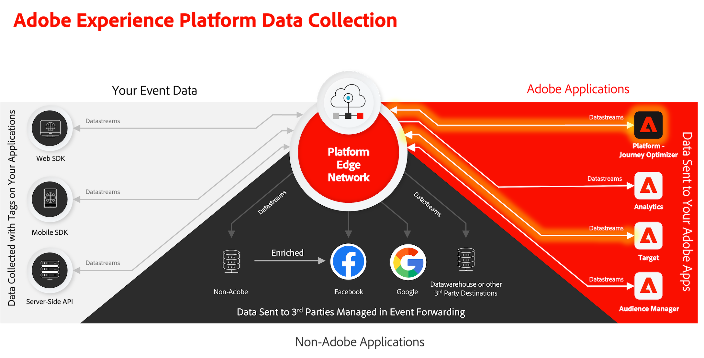
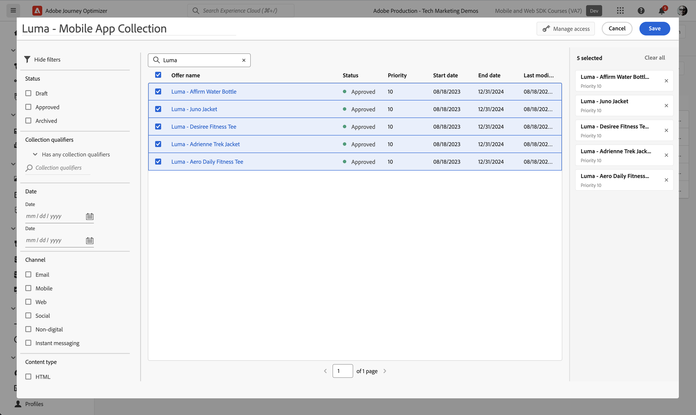
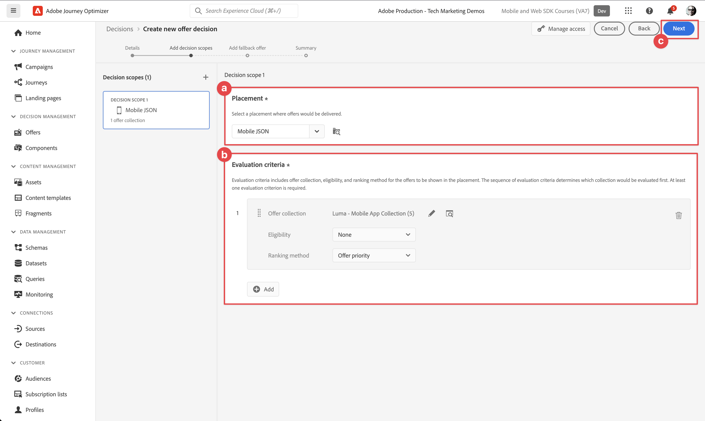

# 创建和显示优惠

了解如何使用Experience Platform移动SDK在移动应用程序中显示Journey Optimizer决策管理中的选件。

Journey Optimizer决策管理可帮助您在适当的时候通过所有接触点为客户提供最佳优惠和体验。 设计完成后，为您的受众提供个性化优惠。



决策管理通过集中的营销优惠库和决策引擎(该引擎可将规则和约束应用于Adobe Experience Platform创建的丰富实时用户档案)轻松实现个性化。 这样，您就可以在适当的时间向客户发送合适的优惠。 请参阅 [关于决策管理](https://experienceleague.adobe.com/docs/journey-optimizer/using/offer-decisioning/get-started-decision/starting-offer-decisioning.html?lang=en) 以了解更多信息。


>[!NOTE]
>
>本课程是可选的，仅适用于希望使用决策管理功能在移动应用程序中显示优惠的Journey Optimizer用户。


## 先决条件

* 在安装和配置SDK的情况下成功构建和运行应用程序。
* 为Adobe Experience Platform设置应用程序。
* 访问Journey Optimizer — 具有相应权限以管理优惠和决策的决策管理，如所述 [此处](https://experienceleague.adobe.com/docs/journey-optimizer/using/access-control/privacy/high-low-permissions.html?lang=en#decisions-permissions).


## 学习目标

在本课程中，您将执行以下操作

* 为决策管理更新您的边缘配置。
* 使用Journey Optimizer - Decisioning扩展更新您的标记属性。
* 更新您的架构以捕获建议事件。
* 验证Assurance中的设置。
* 根据Journey Optimizer - Decision Management中的优惠创建优惠决策。
* 更新您的应用程序以注册Optimizer扩展。
* 在应用程序中实施来自决策管理的选件。


## 设置

>[!TIP]
>
>如果您已将环境设置为 [使用Target设置A/B测试](target.md) 课程，您可能已经执行了此设置部分中的某些步骤。

### 更新数据流配置

要确保将从您的移动应用程序发送到边缘网络的数据转发到Journey Optimizer — 决策管理，请更新您的Experience Edge配置。

1. 在数据收集UI中，选择 **[!UICONTROL 数据流]**，并选择您的数据流，例如 **[!DNL Luma Mobile App]**.
1. 选择  对象 **[!UICONTROL Experience Platform]** 并选择  **[!UICONTROL 编辑]** 从上下文菜单中。
1. 在 **[!UICONTROL 数据流]** >  >  **[!UICONTROL Adobe Experience Platform]** 屏幕，确保 **[!UICONTROL offer decisioning]**， **[!UICONTROL 边缘分段]**、和 **[!UICONTROL Adobe Journey Optimizer]** 已选中。 如果您还参加了Target课程，则应选择 **[!UICONTROL 个性化目标]** 也一样。 请参阅 [Adobe Experience Platform设置](https://experienceleague.adobe.com/docs/experience-platform/datastreams/configure.html?lang=en#aep) 以了解更多信息。
1. 要保存数据流配置，请选择 **[!UICONTROL 保存]** .

   


### 安装Journey Optimizer - Decisioning标记扩展

1. 导航到 **[!UICONTROL 标记]** 并找到您的移动标记资产并打开该资产。
1. 选择 **[!UICONTROL 扩展]**.
1. 选择 **[!UICONTROL 目录]**.
1. 搜索 **[!UICONTROL Adobe Journey Optimizer - Decisioning]** 扩展。
1. 安装扩展。 该扩展不需要其他配置。

   


### 更新您的架构

1. 导航到数据收集界面并选择 **[!UICONTROL 架构]** 从左边栏开始。
1. 选择 **[!UICONTROL 浏览]** 从顶部栏中。
1. 选择您的架构以将其打开。
1. 在架构编辑器中，选择  **[!UICONTROL 添加]** ，位于字段组旁边。
1. 在 **[!UICONTROL 添加字段组]** 对话框，  搜索 `proposition`，选择 **[!UICONTROL 体验事件 — 建议交互]** 并选择 **[!UICONTROL 添加字段组]**. 此字段组收集与选件相关的体验事件数据：显示哪些选件，作为哪些收集、决策和其他参数的一部分（请参阅本课程后面部分的）。 但是，优惠中还发生了什么：它是否显示、交互、被忽略等等。
   
1. 选择 **[!UICONTROL 保存]** 以保存对架构所做的更改。


## 验证Assurance中的设置

要在Assurance中验证设置，请执行以下操作：

1. 转到Assurance UI。
1. 选择 **[!UICONTROL 配置]** 在左边栏中选择  旁边 **[!UICONTROL 验证设置]** 下 **[!UICONTROL Adobe Journey Optimizer决策]**.
1. 选择&#x200B;**[!UICONTROL 保存]**。
1. 选择 **[!UICONTROL 验证设置]** 在左边栏中。 您的应用程序中的数据流设置和SDK设置都经过验证。
   


## 创建优惠

1. 在Journey Optimizer UI中，选择   **[!UICONTROL 选件]** 从 **[!UICONTROL 决策管理]** 在左边栏中。
1. 在 **[!UICONTROL 选件]** 屏幕，选择 **[!UICONTROL 浏览]** 以查看选件列表。
1. 选择 **[!UICONTROL 创建选件]**.
1. 在 **[!UICONTROL 新优惠]** 对话框，选择 **[!UICONTROL 个性化优惠]** 并单击 **[!UICONTROL 下一个]**.
1. 在 **[!UICONTROL 详细信息]** 第步/共步 **[!UICONTROL 创建新的个性化优惠]**：
   1. 输入 **[!UICONTROL 名称]** 例如，对于选件 `Luma - Juno Jacket`，并输入 **[!UICONTROL 开始日期和时间]** 和 **[!UICONTROL 结束日期和时间]**. 在这些日期之外，决策引擎将不会选择选件。
   1. 选择&#x200B;**[!UICONTROL 下一步]**。
      

1. 在 **[!UICONTROL 添加呈现]** 第步/共步 **[!UICONTROL 创建新的个性化优惠]**：
   1. 选择  **[!UICONTROL 移动设备]** 从 **[!UICONTROL 渠道]** 列表，然后选择 **[!UICONTROL 移动设备JSON]** 从 **[!UICONTROL 投放]** 列表。
   1. 选择 **[!UICONTROL 自定义]** 对象 **[!UICONTROL 内容]**.
   1. 选择 **[!UICONTROL 添加内容]**. 在 **[!UICONTROL 添加个性化]** 对话框：
      1. 输入以下JSON：

         ```json
         { 
             "title": "Juno Jacket",
             "text": "On colder-than-comfortable mornings, you'll love warming up in the Juno All-Ways Performanc Jacket, designed to compete with wind and chill. Built-in Cocona&trade; technology aids evaporation, while a special zip placket and stand-up collar keep your neck protected.", 
             "image": "https://luma.enablementadobe.com/content/dam/luma/en/products/women/tops/jackets/wj06-purple_main.jpg" 
         }  
         ```

      1. 选择&#x200B;**[!UICONTROL 保存]**。
         
   1. 选择&#x200B;**[!UICONTROL 下一步]**。
      

1. 在 **[!UICONTROL 添加约束]** 步骤 **[!UICONTROL 创建新的个性化优惠]**：
   1. 设置 **[!UICONTROL 优先级]** 到 `10`.
   1. 切换 **[!UICONTROL 包括上限]** 关闭。
   1. 选择&#x200B;**[!UICONTROL 下一步]**。
      

1. 在 **[!UICONTROL 审核]** 第步/共步 **[!UICONTROL 创建新的个性化]** 选件：
   1. 查看选件，然后选择 **[!UICONTROL 完成]**.
   1. 在 **[!UICONTROL 保存选件]** 对话框，选择 **[!UICONTROL 保存并批准]**.

1. 重复步骤3 - 8以创建四个具有不同名称和内容的更多选件。 所有其他配置值（例如开始日期和时间或优先级）与您创建的第一个选件相似。 您可以快速创建重复和编辑选件。

   1. 在Journey Optimizer UI中，选择  **[!UICONTROL 选件]** 从左边栏中，然后从顶部栏中选择选件。
   1. 选择您创建的选件的行。
   1. 在右窗格中，选择  **[!UICONTROL 更多操作]** 并从上下文菜单中选择  **[!UICONTROL 复制]**.

      使用下表定义其他四个选件。

      | 选件名称 | JSON中的选件内容 |
      |---|---|
      | Luma - Affirm水瓶 | `{ "title": "Affirm Water Bottle", "text": "You'll stay hydrated with ease with the Affirm Water Bottle by your side or in hand. Measurements on the outside help you keep track of how much you're drinking, while the screw-top lid prevents spills. A metal carabiner clip allows you to attach it to the outside of a backpack or bag for easy access.", "image": "https://luma.enablementadobe.com/content/dam/luma/en/products/gear/fitness-equipment/ug06-lb-0.jpg" }` |
      | Luma - Desiree健身球 | `{ "title": "Desiree Fitness Tee", "text": "When you're too far to turn back, thank yourself for choosing the Desiree Fitness Tee. Its ultra-lightweight, ultra-breathable fabric wicks sweat away from your body and helps keeps you cool for the distance.", "image": "https://luma.enablementadobe.com/content/dam/luma/en/products/women/tops/tees/ws05-yellow_main.jpg" }` |
      | Luma - Adrienne Trek Jacket | `{ "title": "Adrienne Trek Jacket", "text": "You're ready for a cross-country jog or a coffee on the patio in the Adrienne Trek Jacket. Its style is unique with stand collar and drawstrings, and it fits like a jacket should.", "image": "https://luma.enablementadobe.com/content/dam/luma/en/products/women/tops/jackets/wj08-gray_main.jpg" }` |
      | Luma - Aero每日健身运动鞋 | `{ "title": "Adrienne Trek Jacket", "text": "You're ready for a cross-country jog or a coffee on the patio in the Adrienne Trek Jacket. Its style is unique with stand collar and drawstrings, and it fits like a jacket should.", "image": "https://luma.enablementadobe.com/content/dam/luma/en/products/women/tops/jackets/wj08-gray_main.jpg" }` |

      {style="table-layout:fixed"}

1. 作为最后一步，您必须创建后备优惠，如果客户不符合其他优惠的条件，该优惠将发送给客户。
   1. 选择 **[!UICONTROL 创建选件]**.
   1. 在 **[!UICONTROL 详细信息]** 第步/共步 **[!UICONTROL 创建新的个性化优惠]**：
   1. 输入 **[!UICONTROL 名称]** 例如，对于选件 `Luma - Fallback Offer`，并输入 **[!UICONTROL 开始日期和时间]** 和 **[!UICONTROL 结束日期和时间]**.
   1. 选择&#x200B;**[!UICONTROL 下一步]**。

1. 在 **[!UICONTROL 添加呈现]** 步骤 **[!UICONTROL 创建新的个性化优惠]** 屏幕：
   1. 选择  **[!UICONTROL 移动设备]** 从 **[!UICONTROL 渠道]** 列表，然后选择 **[!UICONTROL 移动设备JSON]** 从 **[!UICONTROL 投放]** 列表。
   1. 选择 **[!UICONTROL 自定义]** 对象 **[!UICONTROL 内容]**.
   1. 选择 **[!UICONTROL 添加内容]**. 在 **[!UICONTROL 添加个性化]** 对话框：
      1. 输入以下JSON：

         ```json
         {  
             "title": "Luma",
             "text": "Your store for sports wear and equipment.", 
             "image": "https://luma.enablementadobe.com/content/dam/luma/en/logos/Luma_Logo.png" 
         }  
         ```

      1. 选择&#x200B;**[!UICONTROL 保存]**。
   1. 选择&#x200B;**[!UICONTROL 下一步]**。


1. 在 **[!UICONTROL 审核]** 第步/共步 **[!UICONTROL 创建新的个性化]** 选件：
   1. 查看选件，然后选择 **[!UICONTROL 完成]**.
   1. 在 **[!UICONTROL 保存选件]** 对话框，选择 **[!UICONTROL 保存并批准]**.

现在，您应该拥有以下选件列表。


## 创建收藏集

要向移动设备应用程序用户呈现选件，您必须定义选件收藏集，其中包含您创建的一个或多个选件。

1. 在Journey Optimizer UI中，选择 **[!UICONTROL 选件]** 从左边栏开始。
1. 选择 **[!UICONTROL 收藏集]** 从顶部栏中。
1. 选择  **[!UICONTROL 创建收藏集]**.
1. 在 **[!UICONTROL 新建收藏集]** 对话框，请输入 **[!UICONTROL 名称]** 例如，对于您的收藏集 `Luma - Mobile App Collection`，选择 **[!UICONTROL 创建静态收藏集]**，然后单击 **[!UICONTROL 下一个]**.
1. 在 **[!DNL Luma - Mobile App Collection]**&#x200B;中，选择要包含在收藏集中的选件。 在本教程中，选择您创建的五个选件。 您可以使用搜索字段轻松筛选列表，例如，通过键入 **[!DNL Luma]**.
1. 选择&#x200B;**[!UICONTROL 保存]**。

   


## 创建决策

最后一步是定义决策，即一个或多个决策范围与您的备用优惠的组合。

决策范围是特定投放位置(例如电子邮件中的HTML或移动应用程序中的JSON)和一个或多个评估标准的组合。

评估标准是

* 优惠收藏集，
* 资格规则：例如，选件仅适用于特定受众，
* 排名方法：当有多个选件可供选择时，您使用哪个方法为其排名（例如，按选件优先级、使用公式或AI模型）。

请参阅 [创建和管理优惠的关键步骤](https://experienceleague.adobe.com/docs/journey-optimizer/using/offer-decisioning/get-started-decision/key-steps.html?lang=en) 如果您想更好地了解投放位置、规则、排名、优惠、呈现、收藏集、决策等如何相互交互和相互关联。 本课程仅侧重于使用决策的输出，而不是侧重于在Journey Optimizer中定义决策的灵活性 — 决策管理。

1. 在Journey Optimizer UI中，选择 **[!UICONTROL 选件]** 从左边栏开始。
1. 选择 **[!UICONTROL 决策]** 从顶部栏中。
1. 选择  **[!UICONTROL 创建决策]**.
1. 在 **[!UICONTROL 详细信息]** 第步/共步 **[!UICONTROL 创建新的优惠决策]**：
   1. 输入 **[!UICONTROL 名称]** 例如，对于决策 `Luma - Mobile App Decision`，输入 **[!UICONTROL 开始日期和时间]** 和 **[!UICONTROL 结束日期和时间]**.
   1. 选择&#x200B;**[!UICONTROL 下一步]**。

1. 在 **[!UICONTROL 添加决策范围]** 第步/共步 **[!UICONTROL 创建新的优惠决策]**：
   1. 选择 **[!UICONTROL 移动设备JSON]** 从 **[!UICONTROL 投放]** 列表。
   1. 在 **[!UICONTROL 评估标准]** 图块，选择  **[!UICONTROL 添加]**.
      1. 在 **[!UICONTROL 添加优惠收藏集]** 对话框中，选择您的选件收藏集。 例如：**[!DNL Luma - Mobile App Collection]**。
      1. 选择 **[!UICONTROL 添加]**.
         
   1. 确保 **[!UICONTROL 无]** 已选定用于 **[!UICONTROL 资格]**、和 **[!UICONTROL 优惠优先级]** 已选为 **[!UICONTROL 排名方法]**.
   1. 选择&#x200B;**[!UICONTROL 下一步]**。
      .
1. 在 **[!UICONTROL 添加后备优惠]** 第步/共步 **[!UICONTROL 创建新的优惠决策]**：
   1. 选择您的后备优惠，例如 **[!DNL Luma - Fallback offer]**.
   1. 选择&#x200B;**[!UICONTROL 下一步]**。
1. 在 **[!UICONTROL 摘要]** 第步/共步 **[!UICONTROL 创建新的优惠决策]**：
   1. 选择&#x200B;**[!UICONTROL 完成]**。
   1. 在 **[!UICONTROL 保存优惠决策]** 对话框，选择 **[!UICONTROL 保存并激活]**.
   1. 在 **[!UICONTROL 决策]** 选项卡，您会看到自己的决策状态 **[!UICONTROL 实时]**.

您的优惠决策（由一组优惠组成）现已准备就绪，可供使用。 要在应用程序中使用决策，您必须在代码中引用决策范围。

1. 在Journey Optimizer UI中，选择 **[!UICONTROL 选件]**.
1. 选择 **[!UICONTROL 决策]** 从顶部栏中。
1. 选择您的决策，例如 **[!DNL Luma - Mobile App Decision]**.
1. 在 **[!UICONTROL 决策范围]** 图块，选择  **[!UICONTROL 复制]**.
1. 从上下文菜单中，选择 **[!UICONTROL 决策范围]**.
   
1. 使用任意文本编辑器粘贴决策范围以供将来使用。 决策范围具有以下JSON格式。

   ```json
   {
       "xdm:activityId":"xcore:offer-activity:xxxxxxxxxxxxxxx",
       "xdm:placementId":"xcore:offer-placement:xxxxxxxxxxxxxxx"
   }
   ```

## 在应用程序中实施选件

如前面的课程中所述，安装移动标记扩展仅提供配置。 接下来，您必须安装并注册优化SDK。 如果这些步骤不明确，请查阅 [安装SDK](install-sdks.md) 部分。

>[!NOTE]
>
>如果您已完成 [安装SDK](install-sdks.md) 部分，则该SDK已安装，您可以跳过此步骤。
>

1. 在Xcode中，确保 [AEP优化](https://github.com/adobe/aepsdk-messaging-ios.git) 会添加到包依赖关系中的包列表中。 请参阅 [Swift包管理器](install-sdks.md#swift-package-manager).
1. 导航到 **[!DNL Luma]** > **[!DNL Luma]** > **[!UICONTROL AppDelegate]** 在Xcode项目导航器中。
1. 确保 `AEPOptimize` 是导入列表的一部分。

   `import AEPOptimize`

1. 确保 `Optimize.self` 是您注册的扩展数组的一部分。

   ```swift
   let extensions = [
       AEPIdentity.Identity.self,
       Lifecycle.self,
       Signal.self,
       Edge.self,
       AEPEdgeIdentity.Identity.self,
       Consent.self,
       UserProfile.self,
       Places.self,
       Messaging.self,
       Optimize.self,
       Assurance.self
   ]
   ```

1. 导航到 **[!DNL Luma]** > **[!DNL Luma]** > **[!DNL Utils]** > **[!UICONTROL MobileSDK]** 在Xcode项目导航器中。 查找 `func updatePropositionOD(ecid: String, activityId: String, placementId: String, itemCount: Int) async` 函数。 添加以下代码：

   ```swift
   // set up the XDM dictionary, define decision scope and call update proposition API
   Task {  
      let ecid = ["ECID" : ["id" : ecid, "primary" : true] as [String : Any]]
      let identityMap = ["identityMap" : ecid]
      let xdmData = ["xdm" : identityMap]
      let decisionScope = DecisionScope(activityId: activityId, placementId: placementId, itemCount: UInt(itemCount))
      Optimize.clearCachedPropositions()
      Optimize.updatePropositions(for: [decisionScope], withXdm: xdmData)
   }
   ```

   此函数：

   * 设置XDM词典 `xdmData`，包含ECID以标识必须提供选件的配置文件。
   * 定义 `decisionScope`，该对象基于您在Journey Optimizer — 决策管理界面中定义的决策，并使用从复制的决策范围进行定义 [创建决策](#create-a-decision).  Luma应用程序使用配置文件(`decisions.json`)以检索范围参数，具体取决于以下JSON格式：

     ```swift
     "scopes": [
         {
             "name": "name of the scope",
             "activityId": "xcore:offer-activity:xxxxxxxxxxxxxxx",
             "placementId": "xcore:offer-placement:xxxxxxxxxxxxxxx",
             "itemCount": 2
         }
     ]
     ```

     但是，您可以使用任何类型的实施来确保优化API获得正确的参数(`activityId`， `placementId` 和， `itemCount`)，以构造有效的 [`DecisionScope`](https://developer.adobe.com/client-sdks/documentation/adobe-journey-optimizer-decisioning/api-reference/#decisionscope) 实施对象。
   * 调用两个API： [`Optimize.clearCachePropositions`](https://support.apple.com/en-ie/guide/mac-help/mchlp1015/mac)  和 [`Optimize.updatePropositions`](https://developer.adobe.com/client-sdks/documentation/adobe-journey-optimizer-decisioning/api-reference/#updatepropositions).  这些函数清除任何缓存的建议并更新此用户档案的建议。

1. 导航到 **[!DNL Luma]** > **[!DNL Luma]** > **[!DNL Views]** > **[!UICONTROL 个性化]** > **[!UICONTROL EdgeOffersView]** 在Xcode项目导航器中。 查找 `func onPropositionsUpdateOD(activityId: String, placementId: String, itemCount: Int) async` 函数并检查此函数的代码。 此函数最重要的部分是 [`Optimize.onPropositionsUpdate`](https://developer.adobe.com/client-sdks/documentation/adobe-journey-optimizer-decisioning/api-reference/#onpropositionsupdate) API调用，其中

   * 根据决策范围(您在Journey Optimizer — 决策管理中定义)检索当前用户档案的建议，
   * 从建议中检索优惠，
   * 解包选件的内容，以便该内容可以在应用程序中正确显示，并且
   * 触发 `displayed()` 将显示选件上的操作，该操作会将事件发送回Edge Network，通知选件。

1. 仍在使用 **[!DNL EdgeOffersView]**，将以下代码添加到 `.onFirstAppear` 修饰符。 此代码将确保用于更新优惠的回调仅注册一次。

   ```swift
   // Invoke callback for offer updates
   Task {
       await self.onPropositionsUpdateOD(activityId: decision.activityId, placementId: decision.placementId, itemCount: decision.itemCount)
   }
   ```

1. 仍在使用 **[!UICONTROL EdgeOffersView]**，将以下代码添加到 `.task` 修饰符。 刷新视图后，此代码将更新选件。

   ```swift
   // Clear and update offers
   await self.updatePropositionsOD(ecid: currentEcid, activityId: decision.activityId, placementId: decision.placementId, itemCount: decision.itemCount)
   ```


## 使用应用程序进行验证

1. 在设备或模拟器中打开您的应用程序。

1. 转到 **[!DNL Personalisation]** 选项卡。

1. 选择 **[!DNL Edge Personalisation]**。

1. 滚动到顶部，您将看到您在中定义的收藏集中显示的两个随机选件。 **[!DNL DECISION LUMA - MOBILE APP DECISION]** 磁贴。

   

   这些优惠是随机的，因为您为所有优惠提供了相同的优先级，且决策的排名基于优先级。


## 在Assurance中验证实施

验证Assurance中的选件实施：

1. 转到Assurance UI。
1. 选择 **[!UICONTROL 配置]** 在左边栏中选择  旁边 **[!UICONTROL 审阅和模拟]** 下 **[!UICONTROL Adobe Journey Optimizer决策]**.
1. 选择&#x200B;**[!UICONTROL 保存]**。
1. 选择 **[!UICONTROL 审阅和模拟]** 在左边栏中。 数据流设置以及应用程序中的SDK设置均已验证。
1. 选择 **[!UICONTROL 请求]** 在顶栏里。 您看到您的 **[!UICONTROL 选件]** 请求。
   

1. 您可以浏览 **[!UICONTROL 模拟]** 和 **[!UICONTROL 事件列表]** 选项卡以了解更多功能，检查您的Journey Optimizer决策管理设置。

## 后续步骤

您现在应该拥有所有工具，可以开始向Journey Optimizer — 决策管理实施添加更多功能。 例如：

* 将不同的参数应用于选件（例如，优先级、上限）
* 收集应用程序中的配置文件属性(请参阅 [个人资料](profile.md))，并使用这些配置文件属性构建受众。 然后，将这些受众用作您决策中的资格规则的一部分。
* 合并多个决策范围。

>[!SUCCESS]
>
>您已启用应用程序，以便使用适用于Experience PlatformMobile SDK的Journey Optimizer - Decisioning扩展来显示Offers。<br/>感谢您投入时间学习Adobe Experience Platform Mobile SDK。 如果您有疑问、希望分享一般反馈或有关于未来内容的建议，请在此共享它们 [Experience League社区讨论帖子](https://experienceleaguecommunities.adobe.com/t5/adobe-experience-platform-launch/tutorial-discussion-implement-adobe-experience-cloud-in-mobile/td-p/443796).

下一步： **[执行A/B测试](target.md)**
