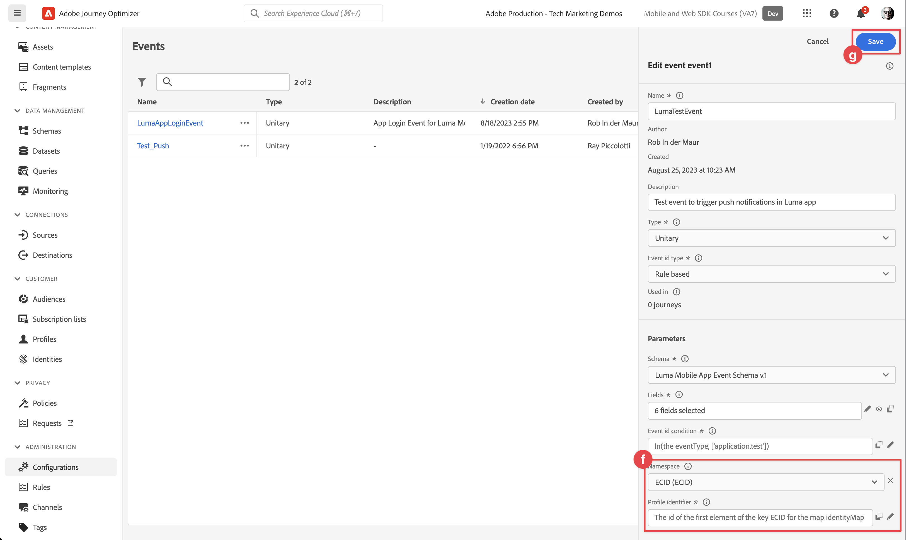

# Journey Optimizer推送消息

了解如何使用Experience PlatformMobile SDK和Journey Optimizer为移动应用程序创建推送消息。

Journey Optimizer允许您创建历程并向目标受众发送消息。 在使用Journey Optimizer发送推送通知之前，您必须确保已进行适当的配置和集成。 要了解Journey Optimizer中的推送通知数据流，请参阅 [文档](https://experienceleague.adobe.com/docs/journey-optimizer/using/configuration/configuration-message/push-config/push-gs.html).


>[!NOTE]
>
>本课程是可选的，仅适用于希望发送推送消息的Journey Optimizer用户。


## 先决条件

* 在安装和配置SDK的情况下成功构建并运行应用程序。
* 为Adobe Experience Platform设置应用程序。
* 对Journey Optimizer的访问权限和足够的权限，如所述 [此处](https://experienceleague.adobe.com/docs/journey-optimizer/using/configuration/configuration-message/push-config/push-configuration.html?lang=en). 此外，您需要具有足够的权限才能使用以下Journey Optimizer功能。
   * 创建应用程序表面。
   * 创建历程.
   * 创建消息.
   * 创建消息预设.
* 具有创建证书、标识符和密钥的足够访问权限的付费Apple开发人员帐户。
* 用于测试的物理iOS设备或模拟器。

## 学习目标

在本课程中，您将执行以下操作

* 向Apple推送通知服务(APN)注册应用程序ID。
* 在Journey Optimizer中创建应用程序表面。
* 更新您的架构以包含推送消息字段。
* 安装和配置Journey Optimizer标记扩展。
* 更新您的应用程序以注册Journey Optimizer标记扩展。
* 验证Assurance中的设置。
* 从Assurance发送测试消息
* 在Journey Optimizer中定义您自己的推送通知事件、历程和体验。
* 从应用程序内发送您自己的推送通知。


## 设置

>[!TIP]
>
>如果您已将环境设置为 [Journey Optimizer应用程序内消息传送](journey-optimizer-inapp.md) 教程中，您可以跳过此部分。

### 向APN注册应用程序ID

以下步骤并非特定于Adobe Experience Cloud，而是旨在引导您完成APN配置。

### 创建私钥

1. 在Apple开发人员门户中，导航到 **[!UICONTROL 键]**.
1. 要创建键，请选择 **[!UICONTROL +]**.
   

1. 提供 **[!UICONTROL 密钥名称]**.
1. 选择 **[!UICONTROL Apple推送通知服务] (APNs)** 复选框。
1. 选择 **[!UICONTROL 继续]**.
   
1. 查看配置并选择 **[!UICONTROL 注册]**.
1. 下载 `.p8` 私钥。 在本课程的后面部分，它将在“应用程序表面”配置中使用。
1. 记下 **[!UICONTROL 密钥ID]**. 它用在应用程序表面配置中。
1. 记下 **[!UICONTROL 团队编号]**. 它用在应用程序表面配置中。
   

其他文档可以是 [在此处找到](https://help.apple.com/developer-account/#/devcdfbb56a3).

### 在数据收集中添加您的应用程序推送凭据

1. 从 [数据收集界面](https://experience.adobe.com/data-collection/)，选择 **[!UICONTROL 应用程序表面]** 在左侧面板中。
1. 要创建配置，请选择 **[!UICONTROL 创建应用程序表面]**.
   
1. 输入 **[!UICONTROL 名称]** 例如，对于配置 `Luma App Tutorial`  .
1. 从 **[!UICONTROL 移动应用程序配置]**，选择 **[!UICONTROL Apple iOS]**.
1. 在中输入移动应用程序捆绑包ID **[!UICONTROL 应用程序ID(iOS捆绑包ID)]** 字段。 例如：`com.adobe.luma.tutorial.swiftui`。
1. 打开 **[!UICONTROL 推送凭据]** 切换以添加您的凭据。
1. 拖放 `.p8` **Apple推送通知身份验证密钥** 文件。
1. 提供 **[!UICONTROL 密钥ID]**，在创建期间分配的10个字符的字符串 `p8` 身份验证密钥。 它可以在以下位置找到 **[!UICONTROL 键]** 选项卡 **证书、标识符和配置文件** Apple开发人员门户页面的页面。 另请参阅 [创建私钥](#create-a-private-key).
1. 提供 **[!UICONTROL 团队编号]**. “团队ID”是一个值，该值可在下找到 **会员资格** 选项卡或Apple开发人员门户页面顶部的。 另请参阅 [创建私钥](#create-a-private-key).
1. 选择&#x200B;**[!UICONTROL 保存]**。

   

### 安装Journey Optimizer标记扩展

要使您的应用程序能够与Journey Optimizer配合使用，您需要更新标记属性。

1. 导航到 **[!UICONTROL 标记]** > **[!UICONTROL 扩展]** > **[!UICONTROL 目录]**，
1. 打开您的资产，例如 **[!UICONTROL Luma移动应用程序教程]**.
1. 选择 **[!UICONTROL 目录]**.
1. 搜索 **[!UICONTROL Adobe Journey Optimizer]** 扩展。
1. 安装扩展。
1. 在 **[!UICONTROL 安装扩展]** 对话框
   1. 选择环境，例如 **[!UICONTROL 开发]**.
   1. 选择 **[!UICONTROL AJO推送跟踪体验事件数据集]** 来自的数据集 **[!UICONTROL 事件数据集]** 列表。
   1. 选择 **[!UICONTROL 保存到库并生成]**.
      

>[!NOTE]
>
>如果您没有看到 **[!UICONTROL AJO推送跟踪体验事件数据集]** 或者，请联系客户关怀团队。
>

### 在应用程序中实施Journey Optimizer

如前面的课程中所述，安装移动标记扩展仅提供配置。 接下来，您必须安装并注册消息传送SDK。 如果这些步骤不明确，请查阅 [安装SDK](install-sdks.md) 部分。

>[!NOTE]
>
>如果您已完成 [安装SDK](install-sdks.md) 部分，则该SDK已安装，您可以跳过此步骤。
>

1. 在Xcode中，确保 [AEP消息](https://github.com/adobe/aepsdk-messaging-ios.git) 会添加到包依赖关系中的包列表中。 请参阅 [Swift包管理器](install-sdks.md#swift-package-manager).
1. 导航到 **[!UICONTROL Luma]** > **[!UICONTROL Luma]** > **[!UICONTROL AppDelegate]** 在Xcode项目导航器中。
1. 确保 `AEPMessaging` 是导入列表的一部分。

   `import AEPMessaging`

1. 确保 `Messaging.self` 是您注册的扩展数组的一部分。

   ```swift
   let extensions = [
       AEPIdentity.Identity.self,
       Lifecycle.self,
       Signal.self,
       Edge.self,
       AEPEdgeIdentity.Identity.self,
       Consent.self,
       UserProfile.self,
       Places.self,
       Messaging.self,
       Optimize.self,
       Assurance.self
   ]
   ```

### 注册推送通知的设备令牌

1. 添加 [`MobileCore.setPushIdentifier`](https://developer.adobe.com/client-sdks/documentation/mobile-core/api-reference/#setpushidentifier) 的API `func application(_ application: UIApplication, didRegisterForRemoteNotificationsWithDeviceToken deviceToken: Data)` 函数。

   ```swift
   // Send push token to Mobile SDK
   MobileCore.setPushIdentifier(deviceToken)
   ```

   此函数检索与安装应用程序的设备特有的设备令牌。 然后，使用您设置的依赖于Apple推送通知服务(APN)的配置来设置推送通知投放令牌。

## 使用Assurance验证设置

1. 查看 [设置说明](assurance.md) 部分。
1. 在物理设备或模拟器上安装应用程序。
1. 使用保障生成的URL启动应用程序。
1. 在Assurance UI中，选择 **[!UICONTROL 配置]**.
   
1. 选择  旁边 **[!UICONTROL 推送调试]**.
1. 选择&#x200B;**[!UICONTROL 保存]**。
   
1. 选择 **[!UICONTROL 推送调试]** 从左侧导航栏中。
1. 选择 **[!UICONTROL 验证设置]** 选项卡。
1. 从中选择设备 **[!UICONTROL 客户端]** 列表。
1. 确认您没有收到任何错误。
   
1. 选择 **[!UICONTROL 发送测试推送]** 选项卡。
1. （可选）更改的默认详细信息 **[!UICONTROL 标题]** 和 **[!UICONTROL 正文]**
1. 选择  **[!UICONTROL 发送测试推送通知]**.
1. 查看 **[!UICONTROL 测试结果]**.
1. 您应会看到测试推送通知显示在应用程序中。

   


## 创建自己的推送通知

要创建自己的推送通知，您必须在Journey Optimizer中定义一个事件，以触发负责发送推送通知的历程。

### 更新您的架构

您即将定义一个新的事件类型，该类型还不能作为您在架构中定义的事件列表的一部分使用。 稍后在触发推送通知时，您将使用此事件类型。

1. 在Journey Optimizer UI中，选择 **[!UICONTROL 架构]** 从左边栏开始。
1. 选择 **[!UICONTROL 浏览]** 在选项卡栏中。
1. 选择您的架构，例如 **[!UICONTROL Luma移动应用程序事件架构]** 打开它。
1. 在架构编辑器中：
   1. 选择 **[!UICONTROL 事件类型]** 字段。
   1. 在 **[!UICONTROL 字段属性]** 窗格，向下滚动以查看事件类型可能值的列表。 选择 **[!UICONTROL 添加行]**，并添加 `application.test` 作为 **[!UICONTROL 值]** 和 `[!UICONTROL Test event for push notification]` 作为 `DISPLAY NAME`.
   1. 选择&#x200B;**[!UICONTROL 应用]**。
   1. 选择&#x200B;**[!UICONTROL 保存]**。
      

### 定义事件

Journey Optimizer中的事件允许您统一触发历程以发送消息，例如推送通知。 请参阅 [关于事件](https://experienceleague.adobe.com/docs/journey-optimizer/using/configuration/configure-journeys/events-journeys/about-events.html?lang=en) 以了解更多信息。

1. 在Journey Optimizer UI中，选择 **[!UICONTROL 配置]** 从左边栏开始。

1. 在 **[!UICONTROL 仪表板]** 屏幕上，选择 **[!UICONTROL 管理]** 中的按钮 **[!UICONTROL 活动]** 磁贴。

1. 在 **[!UICONTROL 活动]** 屏幕，选择 **[!UICONTROL 创建事件]**.

1. 在 **[!UICONTROL 编辑事件event1]** 窗格：

   1. 输入 `LumaTestEvent` 作为 **[!UICONTROL 名称]** 事件的。
   1. 提供 **[!UICONTROL 描述]**&#x200B;例如 `Test event to trigger push notifications in Luma app`.

   1. 选择您之前在中创建的移动应用程序体验事件架构 [创建XDM架构](create-schema.md) 从 **[!UICONTROL 架构]** 列表，例如 **[!UICONTROL Luma移动应用程序事件架构v.1]**.
   1. 选择  旁边的 **[!UICONTROL 字段]** 列表。

      

      在 **[!UICONTROL 字段]** 对话框，请确保选择以下字段(位于始终选择的默认字段之上(**[!UICONTROL _id]**， **[!UICONTROL id]**、和 **[!UICONTROL 时间戳]**)。 您可以使用下拉列表在 **[!UICONTROL 已选择]**， **[!UICONTROL 全部]** 和 **[!UICONTROL 主要]** 或使用  字段。

      * **[!UICONTROL 已识别应用程序(ID)]**，
      * **[!UICONTROL 事件类型(eventType)]**，
      * **[!UICONTROL 主要（主要）]**.

      

      然后选择 **[!UICONTROL 确定]**.

   1. 选择  旁边的 **[!UICONTROL 事件ID条件]** 字段。

      1. 在 **[!UICONTROL 添加事件ID条件]** 对话框，拖放 **[!UICONTROL 事件类型(eventType)]** 到 **[!UICONTROL 将元素拖放到此处]**.
      1. 在弹出窗口中，滚动到底部并选择 **[!UICONTROL application.test]** （这是您之前作为的一部分添加到事件类型列表中的事件类型） [更新您的架构](#update-your-schema))。 然后向上滚动到顶部并选择 **[!UICONTROL 确定]**.
      1. 选择 **[!UICONTROL 确定]** 以保存条件。
         

   1. 选择 **[!UICONTROL ECID (ECID)]** 从 **[!UICONTROL 命名空间]** 列表。 自动 **[!UICONTROL 配置文件标识符]** 字段填充有 **[!UICONTROL 映射identityMap的键ECID的第一个元素的id]**.
   1. 选择&#x200B;**[!UICONTROL 保存]**。
      

您刚刚创建了一个事件配置，该配置基于您之前在本教程中创建的“移动应用程序体验事件”架构。 此事件配置将使用您的特定事件类型(`application.test`)，因此您确保只有从该移动应用程序启动的具有特定类型的事件才会触发您在下一步中构建的历程。 在现实场景中，您可能希望从外部服务发送推送通知，但可以应用相同的概念：从外部应用程序将体验事件发送到具有特定字段的Experience Platform，您可以在这些事件触发历程之前对其应用条件。

### 创建历程

您的下一步是创建在收到相应的事件时触发推送通知发送的历程。

1. 在Journey Optimizer UI中，选择 **[!UICONTROL 历程]** 从左边栏开始。
1. 选择 **[!UICONTROL 创建历程]**.
1. 在 **[!UICONTROL 历程属性]** 面板：

   1. 输入 **[!UICONTROL 名称]** 例如，对于历程 `Luma - Test Push Notification Journey`.
   1. 输入 **[!UICONTROL 描述]** 例如，对于历程 `Journey for test push notifications in Luma mobile app`.
   1. 确保 **[!UICONTROL 允许重新进入]** 已选定并设置 **[!UICONTROL 重新进入等待期]** 到 **[!UICONTROL 30]** **[!UICONTROL 秒]**.
   1. 选择 **[!UICONTROL 确定]**.
      

1. 返回历程画布，从 **[!UICONTROL 活动]**，拖放  **[!UICONTROL LumaTestEvent]** 在画布上显示 **[!UICONTROL 选择进入事件或读取受众活动]**.

   * 在 **[!UICONTROL 事件：LumaTestEvent]** 面板，输入 **[!UICONTROL 标签]**&#x200B;例如 `Luma Test Event`.

1. 从 **[!UICONTROL 操作]** 下拉列表，拖放  **[!UICONTROL 推送]** 在  出现在您的右侧 **[!UICONTROL LumaTestEvent]** 活动。 在 **[!UICONTROL 操作：推送]** 窗格：

   1. 提供 **[!UICONTROL 标签]**&#x200B;例如 `Luma Test Push Notification`，提供 **[!UICONTROL 描述]**&#x200B;例如 `Test push notification for Luma mobile app`，选择 **[!UICONTROL 事务性]** 从 **[!UICONTROL 类别]** 列出并选择 **[!UICONTROL Luma]** 从 **[!UICONTROL 推送表面]**.
   1. 选择  **[!UICONTROL 编辑内容]** 以开始编辑实际的推送通知。
      

      在 **[!UICONTROL 推送通知]** 编辑者：

      1. 输入 **[!UICONTROL 标题]**&#x200B;例如 `Luma Test Push Notification` 并输入 **[!UICONTROL 正文]**&#x200B;例如 `Test push notification for Luma mobile app`.
      1. 要保存并退出编辑器，请选择 .
         

   1. 要保存并完成推送通知定义，请选择 **[!UICONTROL 确定]**.

1. 您的历程应如下所示。 选择 **[!UICONTROL Publish]** 发布并激活您的历程。
   


## 触发推送通知

您已具备发送推送通知的所有要素。 剩下的问题是如何触发此推送通知。 实质上，它与您之前看到的相同：只需发送具有适当有效负载的体验事件(如 [活动](events.md))。

此时，您即将发送的体验事件未构建为简单的XDM词典。 您将使用 `struct` 表示推送通知有效负载。 定义专用数据类型是如何在应用程序中实施构建体验事件有效负载的替代方法。

1. 导航到 **[!UICONTROL Luma]** > **[!UICONTROL Luma]** > **[!UICONTROL 模型]** > **[!UICONTROL XDM]** > **[!UICONTROL TestPushPayload]** 在Xcode项目导航器中检查代码。

   ```swift
   import Foundation
   
   // MARK: - TestPush
   struct TestPushPayload: Codable {
      let application: Application
      let eventType: String
   }
   
   // MARK: - Application
   struct Application: Codable {
      let id: String
   }
   ```

   该代码表示您要发送的用于触发测试推送通知历程的以下简单有效负载

   ```json
   {
      "eventType": string,
      "application" : [
          "id": string
      ]
   }
   ```

1. 导航到 **[!UICONTROL Luma]** > **[!UICONTROL Luma]** > **[!UICONTROL 实用工具]** > **[!UICONTROL MobileSDK]** 在Xcode项目导航器中，将以下代码添加到 `func sendTestPushEvent(applicationId: String, eventType: String)`：

   ```swift
   // Create payload and send experience event
   Task {
       let testPushPayload = TestPushPayload(
           application: Application(
               id: applicationId
           ),
           eventType: eventType
       )
       // send the final experience event
       await sendExperienceEvent(
           xdm: testPushPayload.asDictionary() ?? [:]
       )
   }
   ```

   此代码将创建 `testPushPayload` 实例来使用提供给函数的参数(`applicationId` 和 `eventType`)，然后调用 `sendExperienceEvent` 将有效负载转换为词典时。 Adobe Experience Platform这一次，该代码还通过使用基于 `await` 和 `async`.

1. 导航到 **[!UICONTROL Luma]** > **[!UICONTROL Luma]** > **[!UICONTROL 视图]** > **[!UICONTROL 常规]** > **[!UICONTROL 配置视图]** 在Xcode项目导航器中。 在推送通知按钮定义中，添加以下代码以发送测试推送通知体验事件有效负载，以便在点击该按钮时触发您的历程。

   ```swift
   // Setting parameters and calling function to send push notification
   Task {
       let eventType = testPushEventType
       let applicationId = Bundle.main.bundleIdentifier ?? "No bundle id found"
       await MobileSDK.shared.sendTestPushEvent(applicationId: applicationId, eventType: eventType)
   }
   ```


## 使用应用程序进行验证

1. 在设备或模拟器中打开您的应用程序。

1. 转到 **[!UICONTROL 设置]** 选项卡。

1. 点按 **[!UICONTROL 推送通知]**. 您会看到推送通知显示在应用程序中。

   


## 后续步骤

现在，您应该拥有在应用程序中处理推送通知的所有工具。 例如，您可以在Journey Optimizer中构建一个历程，当应用程序用户登录时，该历程会发送欢迎推送通知。 或者，当用户在应用程序中购买产品时显示确认推送消息。 或输入位置的地理围栏(如您所看到的 [地标](places.md) 课程)。

>[!SUCCESS]
>
>现在，您已使用适用于Experience PlatformMobile SDK的Journey Optimizer和Journey Optimizer扩展为推送通知启用应用程序。<br/>感谢您投入时间学习Adobe Experience Platform Mobile SDK。 如果您有疑问、希望分享一般反馈或有关于未来内容的建议，请在此共享它们 [Experience League社区讨论帖子](https://experienceleaguecommunities.adobe.com/t5/adobe-experience-platform-launch/tutorial-discussion-implement-adobe-experience-cloud-in-mobile/td-p/443796).

下一步： **[Journey Optimizer的应用程序内消息传递](journey-optimizer-inapp.md)**

