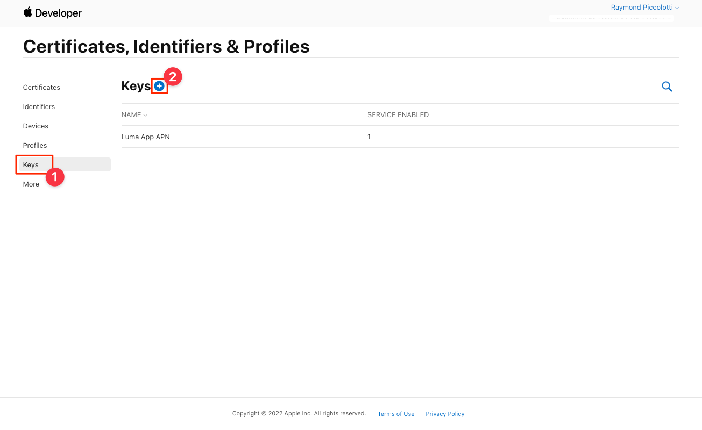

# Adobe Journey Optimizer推送消息

了解如何使用Platform Mobile SDK和Adobe Journey Optimizer为移动应用程序创建推送消息。

Journey Optimizer允许您创建历程，并向目标受众发送消息。 在使用Journey Optimizer发送推送通知之前，您必须确保已进行适当的配置和集成。 要了解Adobe Journey Optimizer中的推送通知数据流，请参阅 [文档](https://experienceleague.adobe.com/docs/journey-optimizer/using/configuration/configuration-message/push-config/push-gs.html).

>[!NOTE]
>
>本课程是可选的，仅适用于希望发送推送消息的Adobe Journey Optimizer用户。


## 先决条件

* 在安装和配置SDK的情况下成功构建和运行应用程序。
* 对Adobe Journey Optimizer的访问权限和足够的权限，如所述 [此处](https://experienceleague.adobe.com/docs/journey-optimizer/using/configuration/configuration-message/push-config/push-configuration.html?lang=en). 您还需要具有足够权限才能使用以下Adobe Journey Optimizer功能。
   * 创建应用程序表面。
   * 创建历程
   * 创建消息.
   * 创建消息预设.
* 具有创建证书、标识符和密钥的足够访问权限的付费Apple开发人员帐户。
* 用于测试的物理iOS设备。

## 学习目标

在本课程中，您将执行以下操作：

* 向Apple推送通知服务(APN)注册应用程序ID。
* 创建 **[!UICONTROL 应用程序表面]** 在AJO中。
* 更新您的 **[!UICONTROL 架构]** 以包含推送消息字段。
* 安装和配置 **[!UICONTROL Adobe Journey Optimizer]** 标记扩展。
* 更新您的应用程序以包含AJO标记扩展。
* 验证Assurance中的设置。
* 发送测试消息。


## 向APN注册应用程序ID

以下步骤并非特定于Adobe Experience Cloud，而是旨在引导您完成APN配置。

### 创建私钥

1. 在Apple开发人员门户中，导航到 **[!UICONTROL 键]**.
1. 要创建键，请选择 **[!UICONTROL +]**.
   

1. 提供 **[!UICONTROL 密钥名称]**.
1. 选择 **[!UICONTROL APN]** 复选框。
1. 选择 **[!UICONTROL 继续]**.
   
1. 查看配置并选择 **[!UICONTROL 注册]**.
1. 下载 `.p8` 私钥。 它用在应用程序表面配置中。
1. 记下 [!UICONTROL 密钥ID]. 它用在应用程序表面配置中。
1. 记下 [!UICONTROL 团队编号]. 它用在应用程序表面配置中。
   

其他文档可以是 [在此处找到](https://help.apple.com/developer-account/#/devcdfbb56a3).

## 在数据收集中添加您的应用程序推送凭据

1. 从 [数据收集界面](https://experience.adobe.com/data-collection/)，选择 **[!UICONTROL 应用程序表面]** 在左侧面板中。
1. 要创建配置，请选择 **[!UICONTROL 创建应用程序表面]**.
   
1. 输入 **[!UICONTROL 名称]** 例如，对于配置 `Luma App Tutorial`  .
1. 在移动设备应用程序配置中，选择 **[!UICONTROL Apple iOS]**.
1. 在“应用程序ID(iOS捆绑包ID)”字段中输入移动应用程序捆绑包ID。 如果您将与Luma应用程序一起关注，则该值为 `com.adobe.luma.tutorial.swiftui`.
1. 打开 **[!UICONTROL 推送凭据]** 按钮以添加您的凭据。
1. 拖放 `.p8` **Apple推送通知身份验证密钥** 文件。
1. 提供 **[!UICONTROL 密钥ID]**，在创建期间分配的10个字符的字符串 `p8` 身份验证密钥。 它可以在以下位置找到 **[!UICONTROL 键]** tab in **证书、标识符和配置文件** Apple开发人员门户页面的页面。
1. 提供 **[!UICONTROL 团队编号]**. “团队ID”是一个值，该值可在下找到 **会员资格** 选项卡或Apple开发人员门户页面顶部的。
1. 选择&#x200B;**[!UICONTROL 保存]**。

   

## 安装Adobe Journey Optimizer标记扩展

1. 导航到 **[!UICONTROL 标记]** > **[!UICONTROL 扩展]** > **[!UICONTROL 目录]**，
1. 打开您的资产，例如 **[!UICONTROL Luma移动应用程序教程]**.
1. 选择 **[!UICONTROL 目录]**.
1. 搜索 **[!UICONTROL Adobe Journey Optimizer]** 扩展。
1. 安装扩展。
1. 在 **[!UICONTROL 安装扩展]** 对话框
   1. 选择环境，例如 **[!UICONTROL 开发]**.
   1. 选择 **[!UICONTROL AJO推送跟踪体验事件数据集]** 来自的数据集 **[!UICONTROL 事件数据集]** 下拉列表。
      
   1. 选择 **[!UICONTROL 保存到库并生成]**.

>[!NOTE]
>
>如果您没有看到 `AJO Push Tracking Experience Event Dataset` 或者，请联系客户关怀团队。
>

## 在应用程序中实施Adobe Journey Optimizer

如前面的课程中所述，安装移动标记扩展仅提供配置。 接下来，您必须安装并注册消息传送SDK。 如果这些步骤不明确，请查阅 [安装SDK](install-sdks.md) 部分。

>[!NOTE]
>
>如果您已完成 [安装SDK](install-sdks.md) 部分，则该SDK已安装，您可以跳至步骤#7。
>

1. 在Xcode中，确保 [AEP消息](https://github.com/adobe/aepsdk-messaging-ios.git) 会添加到包依赖关系中的包列表中。 请参阅 [Swift包管理器](install-sdks.md#swift-package-manager).
1. 打开Xcode并导航到 **[!UICONTROL AppDelegate]**.
1. 确保 `AEPMessaging` 是导入列表的一部分。

   `import AEPMessaging`

1. 确保 `Messaging.self` 是您注册的扩展数组的一部分。

   ```swift
   let extensions = [
       AEPIdentity.Identity.self,
       Lifecycle.self,
       Signal.self,
       Edge.self,
       AEPEdgeIdentity.Identity.self,
       Consent.self,
       UserProfile.self,
       Places.self,
       Messaging.self,
       Optimize.self,
       Assurance.self
   ]
   ```

1. 添加 `MobileCore.setPushIdentifier` 到 `application(_, didRegisterForRemoteNotificationsWithDeviceToken)` 函数。

   ```swift {highlight="7"}
   func application(_ application: UIApplication, didRegisterForRemoteNotificationsWithDeviceToken deviceToken: Data) {
       // Required to log the token
       let tokenParts = deviceToken.map { data in String(format: "%02.2hhx", data) }
       let token = tokenParts.joined()
       Logger.notifications.info("didRegisterForRemoteNotificationsWithDeviceToken - device token: \(token)")
   
       // Send push token to Experience Platform
       MobileCore.setPushIdentifier(deviceToken)
       currentDeviceToken = token
   }
   ```

   此函数检索安装有应用程序的设备所特有的设备令牌，并将该令牌发送到AdobeApple以进行推送消息投放。

## 通过发送测试推送消息进行验证

1. 查看 [设置说明](assurance.md) 部分。
1. 在物理设备或模拟器上安装应用程序。
1. 使用保障生成的URL启动应用程序。
1. 在Assurance UI中，选择 **[!UICONTROL 配置]**.
   
1. 选择  按钮旁边 **[!UICONTROL 推送调试]**.
1. 选择&#x200B;**[!UICONTROL 保存]**。
   
1. 选择 **[!UICONTROL 推送调试]** 从左侧导航栏中。
1. 选择 **[!UICONTROL 验证设置]** 选项卡。
1. 从中选择设备 **[!UICONTROL 客户端]** 列表。
1. 确认您没有收到任何错误。
   
1. 选择 **[!UICONTROL 发送测试推送]** 选项卡。
1. （可选）更改的默认详细信息 **[!UICONTROL 标题]** 和 **[!UICONTROL 正文]**
1. 选择  **[!UICONTROL 发送测试推送通知]**.
1. 查看 **[!UICONTROL 测试结果]**.
1. 您应会在应用程序中看到推送通知。

   


>[!SUCCESS]
>
>现在，您已使用适用于Adobe Experience Platform Mobile SDK的Adobe Journey Optimizer扩展为推送通知启用应用程序。<br/>感谢您投入时间学习Adobe Experience Platform Mobile SDK。 如果您有疑问、希望分享一般反馈或有关于未来内容的建议，请在此共享它们 [Experience League社区讨论帖子](https://experienceleaguecommunities.adobe.com/t5/adobe-experience-platform-launch/tutorial-discussion-implement-adobe-experience-cloud-in-mobile/td-p/443796).

下一步： **[结论和后续步骤](conclusion.md)**
