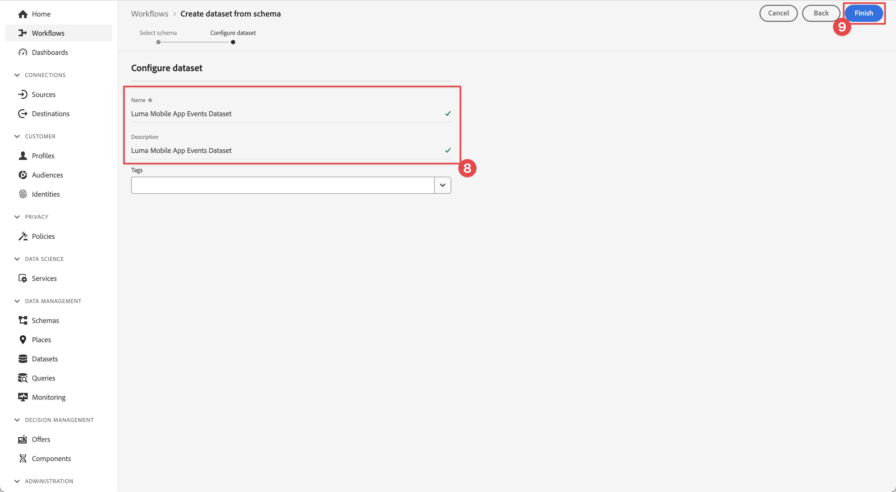
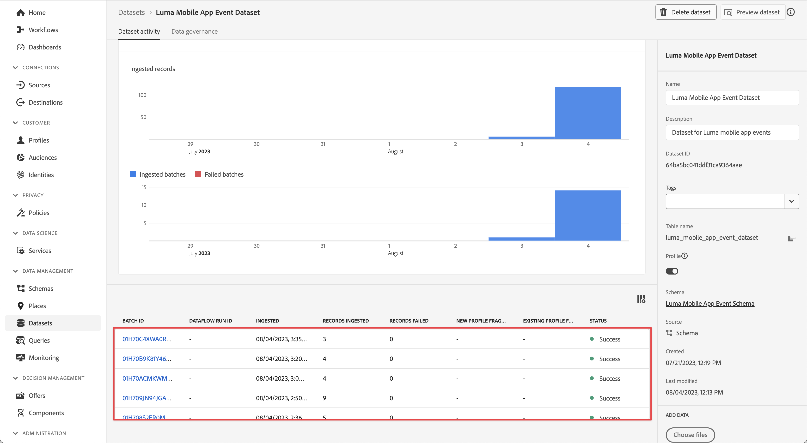

# 将数据发送到Adobe Experience Platform

了解如何将移动应用程序数据发送到Adobe Experience Platform。

本可选课程与Real-time Customer Data Platform (Real-Time CDP)、Journey Optimizer和Customer Journey Analytics的所有客户都相关。 Experience Platform是Experience Cloud产品的基础，它是一个开放系统，可将您的所有数据(Adobe和非Adobe)转换为强大的客户档案。 这些客户配置文件会实时更新，并使用AI驱动的见解来帮助您在每个渠道中提供正确的体验。

此 [事件](events.md)， [生命周期](lifecycle-data.md)、和 [身份](identity.md) 您在之前的课程中收集并发送到Platform Edge Network的数据将转发到您在数据流中配置的服务，包括Adobe Experience Platform。

## 先决条件

必须配置您的组织并授予Adobe Experience Platform权限。

如果您没有访问权限，可以 [跳过本课程](install-sdks.md).

## 学习目标

在本课程中，您将执行以下操作：

* 创建Experience Platform数据集。
* 配置数据流以将数据转发到Experience Platform。
* 验证数据集中的数据。
* 为Real-time Customer Profile启用架构和数据集。
* 验证实时客户档案中的数据。
* 验证身份图中的数据。

## 创建数据集

所有成功引入Adobe Experience Platform的数据将作为数据集保留在数据湖中。 数据集是用于数据集合（通常是表）的存储和管理结构，其中包含架构（列）和字段（行）。 数据集还包含描述其存储的数据的各方面特性的元数据。请参阅 [文档](https://experienceleague.adobe.com/docs/experience-platform/catalog/datasets/overview.html?lang=zh-Hans) 了解相关信息。

1. 从应用程序中选择Experience Platform界面，以导航至该界面  菜单的位置。

1. 选择 **[!UICONTROL 数据集]** 从左侧导航菜单中。

1. 选择  **[!UICONTROL 创建数据集]**.

1. 选择&#x200B;**[!UICONTROL 使用模式创建数据集]**。
   

1. 搜索您的架构。 例如，使用 `Luma Mobile` 在搜索字段中。
1. 选择您的架构，例如 **[!DNL Luma Mobile App Event Schema]**.

1. 选择&#x200B;**[!UICONTROL 下一步]**。
   

1. 提供 **[!UICONTROL 名称]**&#x200B;例如 `Luma Mobile App Events Dataset` 和 **[!UICONTROL 描述]**.

1. 选择&#x200B;**[!UICONTROL 完成]**。
   

## 添加Adobe Experience Platform数据流服务

要将XDM数据从Edge Network发送到Adobe Experience Platform，请将Adobe Experience Platform服务配置为包含在中设置的数据流 [创建数据流](create-datastream.md).

>[!IMPORTANT]
>
>您只能在创建事件数据集后启用Adobe Experience Platform服务。

1. 在数据收集UI中，选择 **[!UICONTROL 数据流]** 和您的数据流。

1. 然后选择  **[!UICONTROL 添加服务]**.

1. 从 [!UICONTROL 服务] 列表中选择 **[!UICONTROL Adobe Experience Platform]**。

1. 通过切换启用服务 **[!UICONTROL 已启用]** 打开。

1. 选择 **[!UICONTROL 事件数据集]** 之前创建的对象，例如 **[!DNL Luma Mobile App Event Dataset]**.

1. 选择&#x200B;**[!UICONTROL 保存]**。

   
1. 最终配置应如下所示。

   

## 验证数据集中的数据

现在，您已创建一个数据集并更新数据流以将数据发送到Experience Platform，所有发送到Platform边缘网络的XDM数据将转发到Platform并载入数据集。

打开应用程序，然后导航到要跟踪事件的屏幕。 您还可以触发生命周期量度。

在Platform界面中打开数据集。 您应该会看到数据批次到达数据集

您还应该能够使用 **[!UICONTROL 预览数据集]** 功能：

用于验证数据的更强大的工具是Platform的 [查询服务](https://experienceleague.adobe.com/docs/platform-learn/tutorials/queries/explore-data.html?lang=zh-CN).

## 启用Real-time Customer Profile

Experience Platform的实时客户资料允许您构建每个客户的整体视图，该视图将来自多个渠道的数据（包括在线、离线、CRM和第三方数据）整合在一起。 用户档案允许您将不同的客户数据整合到一个统一的视图中，并提供每个客户交互的带时间戳的可操作帐户。

### 启用架构

1. 打开您的架构，例如 **[!DNL Luma Mobile App Event Schema]**.
1. 启用 **[!UICONTROL 个人资料]**.
1. 选择 **[!UICONTROL 此架构的数据将在identityMap字段中包含主标识。]** 在对话框中。
1. **[!UICONTROL 保存]** 架构。

   

### 启用数据集

1. 打开您的数据集，例如 **[!DNL Luma Mobile App Event Dataset]**.
1. 启用 **[!UICONTROL 个人资料]**.

   

### 验证配置文件中的数据

打开应用程序，然后导航到要在其中跟踪事件的屏幕，例如：登录Luma应用程序并购买。

使用Assurance查找在identityMap中传递的某个身份（电子邮件、lumaCrmId或ECID），例如CRM Id。

在平台界面中，

1. 导航到 **[!UICONTROL 配置文件]**，并选择 **[!UICONTROL 浏览]** 从顶部栏中。
1. 指定您刚刚捕获的身份详细信息，例如 `Luma CRM ID` 对象 **[!UICONTROL 身份命名空间]** 以及您复制的值 **[!UICONTROL 标识值]**. 然后选择 **[!UICONTROL 视图]**.
1. 要查看详细信息，请选择配置文件。

在 **[!UICONTROL 详细信息]** 屏幕时，您可以看到有关用户的基本信息，包括 **[!UICONTROL **&#x200B;链接身份&#x200B;**]**：

在 **[!UICONTROL 活动]**，您可以查看从您的移动设备应用程序实施中为此用户收集的事件：

在配置文件详细信息屏幕中：

1. 要查看身份图，请单击链接或导航到 **[!UICONTROL 身份]**，然后选择 **[!UICONTROL 身份图]** 从顶部栏中。
1. 要查找标识值，请指定 `Luma CRM ID` 作为 **[!UICONTROL 身份命名空间]** 而复制的值作为 **[!UICONTROL 标识值]**. 然后选择 **[!UICONTROL 视图]**.

   此可视化显示了在用户档案中链接到一起的所有身份及其来源。 以下是一个由完成此Mobile SDK教程（数据源2）和 [Web SDK教程](https://experienceleague.adobe.com/docs/platform-learn/implement-web-sdk/overview.html?lang=zh-Hans) （数据源1）：

   

## 后续步骤

营销人员和Analytics还可处理在Experience Platform中捕获的数据很多事情，包括在Customer Journey Analytics中分析数据以及在Real-time Customer Data Platform中构建区段。 你开了一个好头！

>[!SUCCESS]
>
>现在，您已将应用程序设置为将数据不仅发送到Edge Network，还发送到Adobe Experience Platform。 感谢您投入时间学习Adobe Experience Platform Mobile SDK。 如果您有疑问、希望分享一般反馈或有关于未来内容的建议，请在此共享它们 [Experience League社区讨论帖子](https://experienceleaguecommunities.adobe.com/t5/adobe-experience-platform-launch/tutorial-discussion-implement-adobe-experience-cloud-in-mobile/td-p/443796).

下一步： **[使用Journey Optimizer推送消息](journey-optimizer-push.md)**
