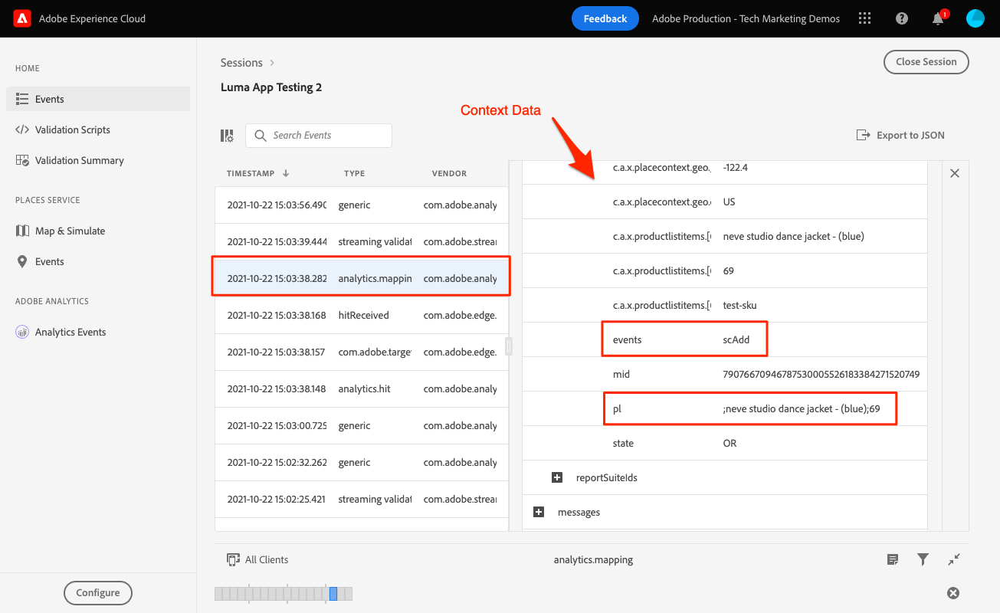

# Analytics映射

了解如何将移动数据映射到Adobe Analytics。

的 [事件](events.md) 您在前面的课程中收集并发送到Platform Edge Network的数据会转发到数据流中配置的服务，包括Adobe Analytics。 您只需将数据映射到报表包中的正确变量即可。

## 先决条件

* 了解ExperienceEvent跟踪。
* 在示例应用程序中成功发送XDM数据。
* 配置到Adobe Analytics的数据流

## 学习目标

在本课程中，您将：

* 了解Analytics变量的自动映射。
* 设置处理规则以将XDM数据映射到Analytics变量。

## 自动映射

许多标准XDM字段会自动映射到Analytics变量。 请在[此处](https://experienceleague.adobe.com/docs/experience-platform/edge/data-collection/adobe-analytics/automatically-mapped-vars.html?lang=en)查看完整列表。

### 示例#1 - s.products

一个很好的例子是 [产品变量](https://experienceleague.adobe.com/docs/analytics/implementation/vars/page-vars/products.html?lang=zh-Hans) 无法使用处理规则填充的规则。 通过XDM实施，您可以传递productListItems和s.products中所有必需的数据，这些数据将通过Analytics映射自动填充。

此对象：

```swift
"productListItems": [
    [
      "name":  "Yoga Mat",
      "SKU": "5829",
      "priceTotal": "49.99",
      "quantity": 1
    ],
    [
      "name":  "Water Bottle",
      "SKU": "9841",
      "priceTotal": "30.00",
      "quantity": 3
    ]
]
```

会导致以下结果：

```
s.products = ";Yoga Mat;1;49.99,;Water Bottle,3,30.00"
```

>[!NOTE]
>
>当前 `productListItems[N].SKU` 被自动映射忽略。

### 示例#2 - scAdd

如果仔细查看，则所有事件都有两个字段 `value` （必需）和 `id` （可选）。 的 `value` 字段，用于递增事件计数。 的 `id` 字段进行序列化。

此对象：

```swift
"commerce" : {
  "productListAdds" : {
    "value" : 1
  }
}
```

会导致以下结果：

```
s.events = "scAdd"
```

此对象：

```swift
"commerce" : {
  "productListAdds" : {
    "value" : 1,
    "id": "321435"
  }
}
```

会导致以下结果：

```
s.events = "scAdd:321435"
```

## 通过保证进行验证

使用 [保证QA工具](assurance.md) 您可以确认发送的是ExperienceEvent、XDM数据正确无误，并且Analytics映射正在按预期进行。 例如：

1. 发送productListAdds事件。

   ```swift
   var xdmData: [String: Any] = [
     "eventType": "commerce.productListAdds",
     "commerce": [
       "productListAdds": [
         "value": 1
       ]
     ],
     "productListItems": [
       [
         "name": "neve studio dance jacket - (blue)",
         "SKU": "test-sku",
         "priceTotal": 69
       ]
     ]
   ]
   let addToCartEvent = ExperienceEvent(xdm: xdmData)
   Edge.sendEvent(experienceEvent: addToCartEvent)
   ```

1. 查看ExperienceEvent点击。

   

1. 查看JSON的XDM部分。

   ```json
     "xdm" : {
       "productListItems" : [ {
         "priceTotal" : 69,
         "SKU" : "test-sku",
         "name" : "neve studio dance jacket - (blue)"
       } ],
       "timestamp" : "2021-10-22T22:03:37Z",
       "commerce" : {
         "productListAdds" : {
           "value" : 1
         }
       },
       "eventType" : "commerce.productListAdds",
       //...
     }
   ```

1. 查看 `analytics.mapping` 事件。

   

在Analytics映射中请注意以下事项：

* “events”中填充了基于 `commerce.productListAdds`.
* “pl”（产品变量）填充的连接值基于 `productListItems`.
* 此事件中还有其他有趣的信息，包括所有上下文数据。


## 使用上下文数据映射

转发到Analytics的XDM数据会转换为 [上下文数据](https://experienceleague.adobe.com/docs/mobile-services/ios/getting-started-ios/proc-rules.html?lang=en) 包括标准字段和自定义字段。

上下文数据键是按照以下语法构建的：

```
a.x.[xdm path]
```

例如：

```
//Standard Field
a.x.commerce.saveforlaters.value

//Custom Field
a.x._techmarketingdemos.appinformationa.appstatedetails.screenname
```

>[!NOTE]
>
>自定义字段放置在Experience Cloud组织标识符下。
>
>“_techmarketingdemos”已替换为您组织的唯一值。

以下是使用此数据的处理规则可能的样子：


>[!IMPORTANT]
>
>
>某些自动映射的变量可能无法在处理规则中使用。
>
>
>首次映射到处理规则时，UI不会显示XDM对象中的上下文数据变量。 要修复该问题，请选择任意值，请保存，然后返回以进行编辑。 此时应会显示所有XDM变量。


有关处理规则和上下文数据的其他信息可以找到 [此处](https://experienceleague.adobe.com/docs/analytics-learn/tutorials/implementation/implementation-basics/map-contextdata-variables-into-props-and-evars-with-processing-rules.html?lang=en).

>[!TIP]
>
>与以前的移动设备应用程序实施不同，页面/屏幕视图与其他事件之间没有区别。 您而是可以将 **[!UICONTROL 页面查看]** 量度 **[!UICONTROL 页面名称]** 维度。 由于您正在收集自定义 `screenName` 字段中，强烈建议将其映射到 **[!UICONTROL 页面名称]** 中。


下一个： **[Experience Platform](platform.md)**

>[!NOTE]
>
>感谢您花时间了解Adobe Experience Platform Mobile SDK。 如果您有任何疑问、想要分享一般反馈或对未来内容提出建议，请就此分享 [Experience League社区讨论帖子](https://experienceleaguecommunities.adobe.com/t5/adobe-experience-platform-launch/tutorial-discussion-implement-adobe-experience-cloud-in-mobile/td-p/443796)