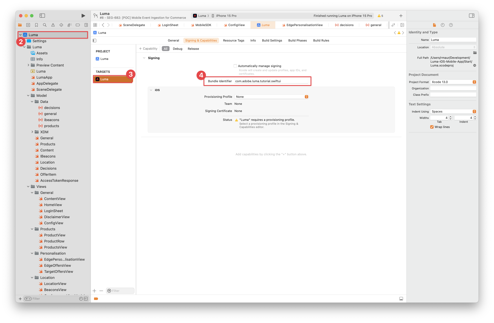
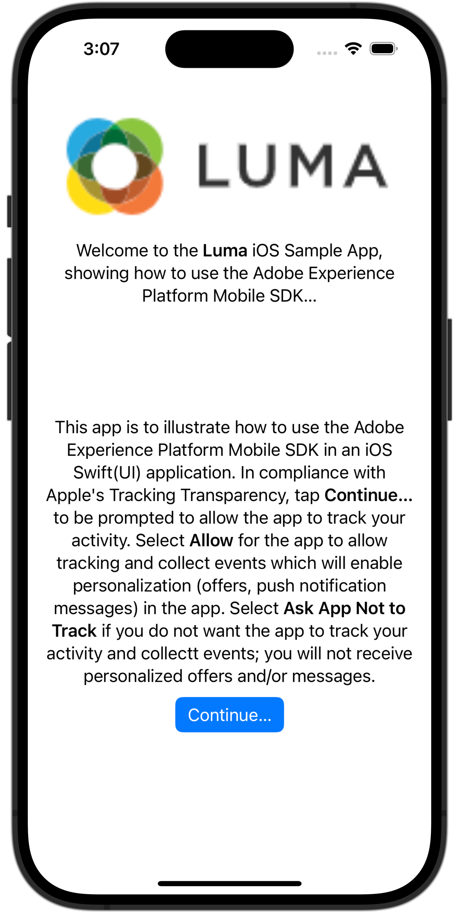
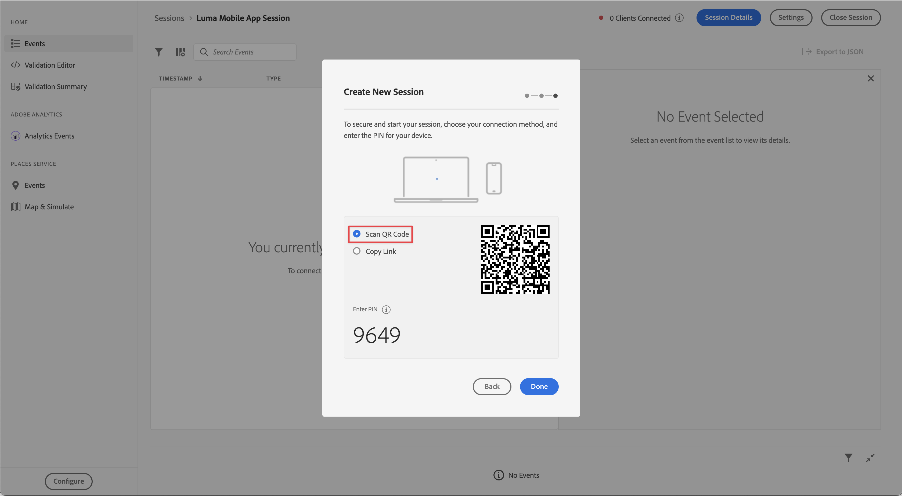

# 设置保证

了解如何在移动应用程序中设置Adobe Experience Platform保障。

Assurance（正式称为Project Griffon）旨在帮助您检查、证明、模拟和验证在移动应用程序中收集数据或提供体验的方式。

Assurance 可帮助您检查 Adobe Experience Platform Mobile SDK 生成的原始 SDK 事件。SDK 收集的所有事件都可供检查。SDK 事件加载在列表视图中，按时间排序。每个事件都有一个详细视图，可提供更多详细信息。还提供了用于浏览SDK配置、数据元素、共享状态和SDK扩展版本的其他视图。 在产品文档中了解有关[Assurance](https://experienceleague.adobe.com/docs/experience-platform/assurance/home.html)的更多信息。


## 先决条件

* 成功设置已安装并配置SDK的应用程序。

## 学习目标

在本课程中，您将执行以下操作：

* 确认您的组织具有访问权限（如果您没有访问权限，请进行请求）。
* 设置您的基本URL。
* 添加所需的iOS特定代码。
* 连接到会话。

## 确认访问

确认您的组织有权访问Assurance。 您作为用户，应该被添加到Adobe Experience Platform的配置文件。 有关详细信息，请参阅保证指南中的[用户访问权限](https://experienceleague.adobe.com/docs/experience-platform/assurance/user-access.html?lang=en)。

## 实施

除了常规的[SDK安装](install-sdks.md)之外，您已在前面的课程中完成，iOS还需要添加以下内容才能启动应用程序的保障会话。

1. 在Xcode的项目导航器中导航到&#x200B;**[!DNL Luma]** > **[!DNL Luma]** > **[!UICONTROL SceneDelegate]**。

1. 将以下代码添加到 `func scene(_ scene: UIScene, openURLContexts URLContexts: Set<UIOpenURLContext>`：

   ```swift
   // Called when the app in background is opened with a deep link.
   if let deepLinkURL = URLContexts.first?.url {
       // Start the Assurance session
       Assurance.startSession(url: deepLinkURL)
   }
   ```

   当应用程序处于后台并使用深层链接打开时，此代码会启动保证会话。

可在[此处](https://developer.adobe.com/client-sdks/documentation/platform-assurance-sdk/api-reference/){target="_blank"}找到更多信息。


## 定义捆绑包标识符

您需要为应用程序提供唯一的捆绑包标识符。

1. 在Xcode中打开项目。
1. 在项目导航器中选择&#x200B;**[!DNL Luma]**。
1. 选择&#x200B;**[!DNL Luma]**&#x200B;目标。
1. 选择&#x200B;**签名和功能**&#x200B;选项卡。
1. 定义&#x200B;**[!UICONTROL 捆绑包标识符]**。

   >[!IMPORTANT]
   >
   >请确保使用&#x200B;_唯一_&#x200B;捆绑标识符并替换`com.adobe.luma.tutorial.swiftui`捆绑标识符，因为每个捆绑标识符必须是唯一的。 通常，您使用反向DNS格式来打包的ID字符串，如`com.organization.brand.uniqueidentifier`。 例如，本教程的完成版本使用`com.adobe.luma.tutorial.swiftui`。


   {zoomable="yes"}


## 设置基本URL

1. 转到Xcode中的项目。
1. 在项目导航器中选择&#x200B;**[!DNL Luma]**。
1. 选择&#x200B;**[!DNL Luma]**&#x200B;目标。
1. 选择&#x200B;**信息**&#x200B;选项卡。
1. 要添加基本URL，请向下滚动到&#x200B;**URL类型**&#x200B;并选择&#x200B;**+**&#x200B;按钮。
1. 将&#x200B;**Identifier**&#x200B;设置为您选择的捆绑包标识符，并设置您选择的&#x200B;**URL方案**。

   

   >[!IMPORTANT]
   >
   >请确保使用&#x200B;_唯一_&#x200B;捆绑标识符并替换`com.adobe.luma.tutorial.swiftui`捆绑标识符，因为每个捆绑标识符必须是唯一的。 通常，您使用反向DNS格式来打包的ID字符串，如`com.organization.brand.uniqueidentifier`。 您可以使用在[定义捆绑标识符](#define-bundle-identifier)中使用的相同捆绑标识符。<br/>同样，使用唯一的URL方案，并将已经提供的`lumatutorialswiftui`替换为您的唯一URL方案。

要详细了解iOS中的URL方案，请查阅[Apple的文档](https://developer.apple.com/documentation/xcode/defining-a-custom-url-scheme-for-your-app){target="_blank"}。

Assurance的工作方式是通过浏览器或二维码打开URL。 该URL以基本URL开头，该URL可打开应用程序并包含其他参数。 这些唯一参数用于连接会话。


## 连接到会话

在Xcode中：

1. 使用，在模拟器或Xcode的物理设备上构建或重建并运行应用程序。

   >[!TIP]
   >
   >或者，您可能希望“清理”内部版本，尤其是看到意外结果时。 为此，请从Xcode **[!UICONTROL 产品]**&#x200B;菜单中选择&#x200B;**[!UICONTROL 清理生成文件夹……]**。


1. 在&#x200B;**[!UICONTROL 允许“Luma应用程序”使用您的位置]**&#x200B;对话框中，选择&#x200B;**[!UICONTROL 使用应用程序时允许]**。

   

1. 在&#x200B;**[!UICONTROL “Luma应用”希望向您发送通知]**&#x200B;对话框中，选择&#x200B;**[!UICONTROL 允许]**。

   

1. 选择&#x200B;**[!UICONTROL 继续……]**&#x200B;以允许应用跟踪您的活动。

   

1. 在&#x200B;**[!UICONTROL 允许“Luma应用”在其他公司的应用和网站]**&#x200B;中跟踪您的活动，选择&#x200B;**[!UICONTROL 允许]**。

   


在您的浏览器中：

1. 转到数据收集UI。
1. 从左边栏中选择&#x200B;**[!UICONTROL 保证]**。
1. 选择&#x200B;**[!UICONTROL 创建会话]**。
1. 选择&#x200B;**[!UICONTROL 启动]**。
1. 提供&#x200B;**[!UICONTROL 会话名称]**，如`Luma Mobile App Session`和&#x200B;**[!UICONTROL 基本URL]**，它是您在Xcode中输入的URL方案，后面是`://`，例如： `lumatutorialswiftui://`
1. 选择&#x200B;**[!UICONTROL 下一步]**。
   
1. 在&#x200B;**[!UICONTROL 创建新会话]**&#x200B;模式对话框中：

   如果您使用的是物理设备：

   * 选择&#x200B;**[!UICONTROL 扫描二维码]**。 要打开应用程序，请使用物理设备上的摄像头扫描二维码并点击链接。

     

   如果您使用模拟器：

   1. 选择&#x200B;**[!UICONTROL 复制链接]**。
   1. 使用复制深层链接，然后使用该深层链接在模拟器中通过Safari打开应用程序。

      

1. 应用程序加载时，系统会显示一个模式对话框，要求您输入步骤7中显示的PIN。

   

   输入PIN并选择&#x200B;**[!UICONTROL 连接]**。


1. 如果连接成功，您会看到：
   * “保证”图标浮动在应用程序顶部。

     

   * 在Assurance UI中执行的Experience Cloud更新显示：

      1. 来自应用程序的体验事件。
      1. 选定事件的详细信息。
      1. 设备和时间轴。

         

如果您遇到任何挑战，请查阅[技术](https://developer.adobe.com/client-sdks/documentation/platform-assurance-sdk/){target="_blank"}和[常规文档](https://experienceleague.adobe.com/docs/experience-platform/assurance/home.html){target="_blank"}。


## 验证扩展

要验证您的应用程序是否使用了最新的扩展，请执行以下操作：

1. 选择&#x200B;**[!UICONTROL 配置]**。

1. 为 **[!UICONTROL 扩展版本]**&#x200B;选择。

1. 选择&#x200B;**[!UICONTROL 保存]**。

   

1. 选择 **[!UICONTROL 扩展版本]**&#x200B;可查看应用程序版本中最新可用扩展和所用扩展的概述。

   

1. 要更新扩展版本（例如，**[!UICONTROL Messaging]**&#x200B;和&#x200B;**[!UICONTROL Optimize]**），请从&#x200B;**[!UICONTROL 包依赖项]**（例如，**[!UICONTROL AEPMessaging]**）中选择包（扩展），然后从上下文菜单中选择&#x200B;**[!UICONTROL 更新包]**。 Xcode将更新包依赖项。


>[!NOTE]
>
>在Xcode中更新扩展（包）后，请关闭并删除当前会话，然后从[连接到会话](#connecting-to-a-session)和[验证扩展](#verify-extensions)中重复所有步骤，以确保Assurance在新的Assurance会话中正确报告正确的扩展。


>[!SUCCESS]
>
>您现在已将应用程序设置为在教程的其余部分使用Assurance 。
>
>感谢您投入时间学习Adobe Experience Platform Mobile SDK。 如果您有任何疑问、希望分享一般反馈或有关于未来内容的建议，请在此[Experience League社区讨论帖子](https://experienceleaguecommunities.adobe.com/t5/adobe-experience-platform-data/tutorial-discussion-implement-adobe-experience-cloud-in-mobile/td-p/443796)上分享这些内容


下一步： **[实施同意](consent.md)**
