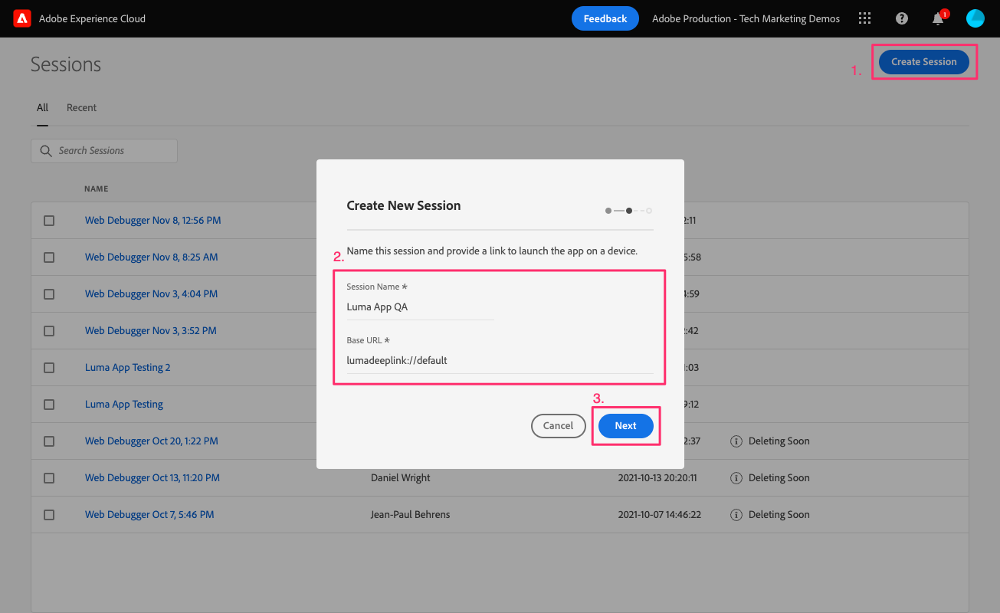
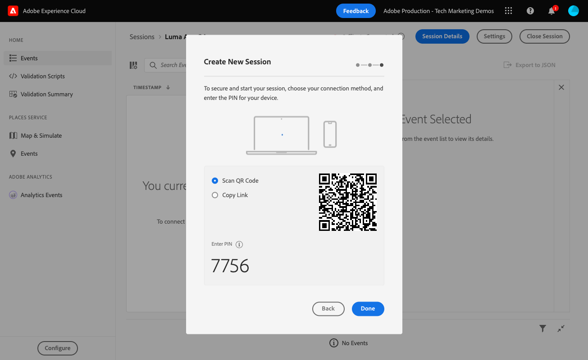

# Assurance

了解如何在移动应用程序中设置Adobe Experience Platform Assurance。

Assurance（正式称为Project Griffon）旨在帮助您检查、证明、模拟和验证在移动应用程序中收集数据或提供体验的方式。

Assurance可帮助您检查Adobe Experience Platform Mobile SDK生成的原始SDK事件。 SDK收集的所有事件均可供检查。 SDK事件会加载到列表视图中，并按时间排序。 每个事件都有一个详细视图，其中提供了更多详细信息。 还提供了用于浏览SDK配置、数据元素、共享状态和SDK扩展版本的其他视图。 进一步了解 [Assurance](https://experienceleague.adobe.com/docs/experience-platform/assurance/home.html) ，位于产品文档中。


## 先决条件

* 成功构建并运行已安装并配置SDK的示例应用程序。

## 学习目标

在本课程中，您将执行以下操作：

* 确认您的组织拥有访问权限（如果您没有访问权限，请提出请求）。
* 设置您的基本URL。
* 添加所需的iOS特定代码。
* 连接到会话。

## 确认访问

通过完成以下步骤，确认您的组织有权访问Assurance ：

1. 访问 [https://experience.adobe.com/#/assurance](https://experience.adobe.com/griffon){target="_blank"}
1. 使用您的Adobe ID凭据登录Experience Cloud。
1. 如果您被带到 **[!UICONTROL 会话]** 屏幕时，您便拥有访问权限。 如果您被引导至测试版访问页面，请选择 **[!UICONTROL 注册]**.

## 实施

除了一般 [SDK安装](install-sdks.md) 您已在上一课程中完成，iOS还需要添加以下内容。 将以下代码添加到 `AppDelegate.swift` 文件：

```swift
func application(_ app: UIApplication, open url: URL, options: [UIApplication.OpenURLOptionsKey: Any] = [:]) -> Bool {
    Assurance.startSession(url: url)
    return true
}
```

为本教程提供的示例Luma使用iOS 12.0。如果您使用iOS 13及更高版本跟踪您自己的基于场景的应用程序，请使用 `UISceneDelegate's scene(_:openURLContexts:)` 方法如下：

```swift
func scene(_ scene: UIScene, openURLContexts URLContexts: Set<UIOpenURLContext>) {
    // Called when the app in background is opened with a deep link.
    if let deepLinkURL = URLContexts.first?.url {
        Assurance.startSession(url: deepLinkURL)
    }
}
```

可找到更多信息 [此处](https://developer.adobe.com/client-sdks/documentation/platform-assurance-sdk/api-reference/){target="_blank"}.

## 设置基本URL

1. 打开Xcode并选择项目名称。
1. 导航到 **信息** 选项卡。
1. 向下滚动到 **URL类型** 并选择 **+** 按钮以添加新按钮。
1. 设置 **标识符** 和 **URL方案** 到“lumadeeplink”。
1. 构建并运行应用程序。


要了解有关iOS中URL方案的更多信息，请查看 [Apple的文档](https://developer.apple.com/documentation/xcode/defining-a-custom-url-scheme-for-your-app){target="_blank"}.

Assurance的工作原理是通过浏览器或二维码打开一个URL，该URL以打开应用程序并包含其他参数的基本URL开头。 这些唯一参数用于连接会话。

## 连接到会话

1. 导航到 [Assurance UI](https://experience.adobe.com/griffon){target="_blank"}.
1. 选择 **[!UICONTROL 创建会话]**.
1. 提供 **[!UICONTROL 会话名称]** 例如 `Luma App QA` 和 **[!UICONTROL 基本URL]** `lumadeeplink://default`
1. 选择&#x200B;**[!UICONTROL 下一步]**。
   
1. **[!UICONTROL 扫描二维码]** 如果您使用的是物理设备。 如果您使用的是模拟器，则 **[!UICONTROL 复制链接]** 在模拟器中用Safari打开它。
   
1. 应用程序加载时，系统会显示一个模式窗口，要求您输入上一步中的PIN。
   
1. 如果连接成功，您将在Assurance Web UI中看到事件，并在应用程序中看到浮动的Assurance图标。
   * “保证”图标浮动。
      
   * Experience Cloud在Web UI中完成的事件。
      

如果您遇到任何挑战，请查看 [技术](https://developer.adobe.com/client-sdks/documentation/platform-assurance-sdk/){target="_blank"} and [general documentation](https://experienceleague.adobe.com/docs/experience-platform/assurance/home.html){target="_blank"}.

下一步： **[同意](consent.md)**

>[!NOTE]
>
>感谢您投入时间来了解Adobe Experience Platform Mobile SDK。 如果您有疑问、希望分享一般反馈或有关于未来内容的建议，请在此分享这些内容 [Experience League社区讨论帖子](https://experienceleaguecommunities.adobe.com/t5/adobe-experience-platform-launch/tutorial-discussion-implement-adobe-experience-cloud-in-mobile/td-p/443796)
