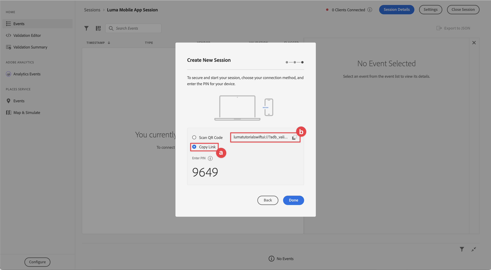

# 设置Assurance

了解如何在移动应用程序中设置Adobe Experience Platform Assurance。

Assurance（正式称为Project Griffon）旨在帮助您检查、验证、模拟和验证在移动应用程序中收集数据或提供体验的方式。

Assurance 可帮助您检查 Adobe Experience Platform Mobile SDK 生成的原始 SDK 事件。SDK 收集的所有事件都可供检查。SDK 事件加载在列表视图中，按时间排序。每个事件都有一个详细视图，可提供更多详细信息。还提供了用于浏览SDK配置、数据元素、共享状态和SDK扩展版本的其他视图。 在产品文档中了解有关[Assurance](https://experienceleague.adobe.com/zh-hans/docs/experience-platform/assurance/home)的更多信息。


## 先决条件

* 成功设置已安装并配置SDK的应用程序。

## 学习目标

在本课程中，您将执行以下操作：

* 确认您的组织具有访问权限（如果您没有访问权限，请进行请求）。
* 设置您的基本URL。
* 添加所需的iOS特定代码。
* 连接到会话。

## 确认访问

确认您的组织有权访问Assurance。 您作为用户，应该被添加到Adobe Experience Platform的配置文件。 有关详细信息，请参阅Assurance指南中的[用户访问权限](https://experienceleague.adobe.com/zh-hans/docs/experience-platform/assurance/user-access)。

## 实施

要在应用程序中实施Assurance，请执行以下操作：

>[!BEGINTABS]

>[!TAB iOS]

除了常规的[SDK安装](install-sdks.md)之外，iOS还需要以下附加代码来启动应用程序的Assurance会话。

1. 在Xcode的项目导航器中导航到&#x200B;**[!DNL Luma]** > **[!DNL Luma]** > **[!UICONTROL SceneDelegate]**。

1. 将以下代码添加到 `func scene(_ scene: UIScene, openURLContexts URLContexts: Set<UIOpenURLContext>`：

   ```swift
   // Called when the app in background is opened with a deep link.
   if let deepLinkURL = URLContexts.first?.url {
       // Start the Assurance session
       Assurance.startSession(url: deepLinkURL)
   }
   ```

   当应用程序处于后台并使用深层链接打开时，此代码会启动保证会话。

>[!TAB Android]

除了常规的[SDK安装](install-sdks.md)之外，Android还需要以下附加代码来启动应用程序的Assurance会话。

1. 在Android Studio的&#x200B;**[!UICONTROL Android]**&#x200B;视图中，导航到&#x200B;**[!UICONTROL 应用程序]** > **[!UICONTROL kotlin+java]** > **[!UICONTROL com.adobe.luma.tutorial.android]** > **[!UICONTROL LumaApplication]**。

1. 将以下代码添加到 `fun handleDeeplink(deeplink: String?)`：

   ```kotlin
   // Called when the app in background is opened with a deep link.
   if (deeplink.isNullOrEmpty()) {
      Log.w("Luma", "Deeplink is null or empty")
      return
   }
   
   Log.i("Luma", "Handling deeplink: $deeplink")
   Assurance.startSession(deeplink)
   ```

   当应用程序处于后台并使用深层链接打开时，此代码会启动保证会话。

>[!ENDTABS]


有关详细信息，请参阅[Assurance API引用](https://developer.adobe.com/client-sdks/documentation/platform-assurance-sdk/api-reference/){target="_blank"}。


## 定义捆绑标识符

您需要为应用程序提供唯一的捆绑包标识符。

>[!BEGINTABS]

>[!TAB iOS]

1. 在Xcode中打开项目。
1. 在项目导航器中选择&#x200B;**[!DNL Luma]**。
1. 选择&#x200B;**[!DNL Luma]**&#x200B;目标。
1. 选择&#x200B;**签名和功能**&#x200B;选项卡。
1. 定义&#x200B;**[!UICONTROL 捆绑包标识符]**。

请确保使用&#x200B;_唯一_&#x200B;捆绑标识符并替换`com.adobe.luma.tutorial.swiftui`捆绑标识符，因为每个捆绑标识符必须是唯一的。 通常，您使用反向DNS格式来打包的ID字符串，如`com.organization.brand.uniqueidentifier`。 例如，本教程的完成版本使用`com.adobe.luma.tutorial.swiftui`。

{zoomable="yes"}

>[!TAB Android]

1. 在Android Studio中打开项目。
1. 在导航器中选择&#x200B;**[!UICONTROL build.gradle.kts （模块:app）]**。
1. 确保使用&#x200B;_唯一_&#x200B;捆绑标识符并替换`com.adobe.luma.tutorial.android`中`namespace`的`android`值
1. 请确保使用相同的&#x200B;_唯一_&#x200B;包标识符并在`com.adobe.luma.tutorial.android`中的`applicationId`中替换`defaultConfig`的`android`

通常，您使用反向DNS格式来打包的ID字符串，如`com.organization.brand.uniqueidentifier`。 例如，本教程的完成版本使用`com.adobe.luma.tutorial.android`。

{zoomable="yes"}{zoomable="yes"}

>[!ENDTABS]


## 设置基本URL

您需要设置基本URL以确保深层链接正常工作。

>[!BEGINTABS]

>[!TAB iOS]

1. 转到Xcode中的项目。
1. 在项目导航器中选择&#x200B;**[!DNL Luma]**。
1. 选择&#x200B;**[!DNL Luma]**&#x200B;目标。
1. 选择&#x200B;**信息**&#x200B;选项卡。
1. 要添加基本URL，请向下滚动到&#x200B;**URL类型**&#x200B;并选择&#x200B;**+**&#x200B;按钮。
1. 将&#x200B;**标识符**&#x200B;设置为您选择的捆绑标识符，并设置您选择的&#x200B;**URL方案**。

   {zoomable="yes"}

请确保使用&#x200B;_唯一_&#x200B;捆绑标识符并替换`com.adobe.luma.tutorial.swiftui`捆绑标识符，因为每个捆绑标识符必须是唯一的。 通常，您使用反向DNS格式来打包的ID字符串，如`com.organization.brand.uniqueidentifier`。 您可以使用在[定义捆绑标识符](#define-bundle-identifier)中使用的相同捆绑标识符。<br/>同样，使用唯一的URL方案，并将已经提供的`lumatutorialswiftui`替换为您的唯一URL方案。

要详细了解iOS中的URL方案，请查阅[Apple的文档](https://developer.apple.com/documentation/xcode/defining-a-custom-url-scheme-for-your-app){target="_blank"}。

Assurance的工作方式是通过浏览器或二维码打开URL。 该URL以基本URL开头，该URL可打开应用程序并包含其他参数。 这些唯一参数用于连接会话。 在示例应用程序中，深层链接为`lumatutorialswiftui://`。

>[!TAB Android]

1. 转到Android Studio中项目的&#x200B;**[!UICONTROL Android]**&#x200B;视图。
1. 在导航器中选择&#x200B;**[!UICONTROL 应用程序]** > **[!UICONTROL 清单]** > **[!UICONTROL AndroidManifest.xml]**。
1. 确保&#x200B;**[!UICONTROL 清单]** > **[!UICONTROL 应用程序]** > **[!UICONTROL 活动]** XML元素如下所示：

   ```xml
   <activity
      android:name=".MainActivity"
      android:exported="true"
      android:theme="@style/Theme.LumaAndroid">
      <intent-filter>
            <action android:name="android.intent.action.MAIN" />
            <category android:name="android.intent.category.LAUNCHER" />
      </intent-filter>
      <intent-filter
            android:label="@string/app_name">
            <action android:name="android.intent.action.VIEW" />
            <category android:name="android.intent.category.DEFAULT" />
            <category android:name="android.intent.category.BROWSABLE" />
            <data android:scheme="lumatutorialandroid"
               android:host="default" />
      </intent-filter>
   </activity>
   ```

确保指定`android:scheme`(例如。 `lumatutorialandroid`)和`android:host`（例如`default`）来定义基础URL。

要详细了解Android中的深层链接，请参阅Android文档中的[创建深层链接](https://developer.android.com/training/app-links/create-deeplinks){target="_blank"}。

Assurance的工作方式是通过浏览器或二维码打开URL。 该URL以基本URL开头，基本URL可打开应用程序并包含其他参数。 这些唯一参数用于连接会话。  在示例应用程序中，深层链接为`lumatutorialandroid://default`。

>[!ENDTABS]


## 连接到会话

您现在可以使用Assurance连接到会话。

>[!BEGINTABS]

>[!TAB iOS]

在Xcode中：

1. 使用，在模拟器或Xcode的物理设备上构建或重建并运行应用程序。

   或者，您可能需要&#x200B;*清理*&#x200B;您的生成，尤其是当您看到意外结果时。 从Xcode **[!UICONTROL 产品]**&#x200B;菜单中选择&#x200B;**[!UICONTROL 清理生成文件夹……]**。


1. 在&#x200B;**[!UICONTROL 允许“Luma应用程序”使用您的位置]**&#x200B;对话框中，选择&#x200B;**[!UICONTROL 使用应用程序时允许]**。

   

1. 在&#x200B;**[!UICONTROL “Luma应用”希望向您发送通知]**&#x200B;对话框中，选择&#x200B;**[!UICONTROL 允许]**。

   

1. 选择&#x200B;**[!UICONTROL 继续……]**&#x200B;以允许应用跟踪您的活动。

   

1. 在&#x200B;**[!UICONTROL 允许“Luma应用”在其他公司的应用和网站]**&#x200B;中跟踪您的活动，选择&#x200B;**[!UICONTROL 允许]**。

   

1. 选择&#x200B;**[!UICONTROL 继续]**。


在您的浏览器中：

1. 转到数据收集UI。
1. 从左边栏中选择&#x200B;**[!UICONTROL Assurance]**。
1. 选择&#x200B;**[!UICONTROL 创建新会话]**，并选择选项&#x200B;**[!UICONTROL 深层链接连接]**。
1. 选择&#x200B;**[!UICONTROL 启动]**。
1. 提供&#x200B;**[!UICONTROL 会话名称]**，如`Luma Mobile App Session`和&#x200B;**[!UICONTROL 基本URL]**，它是您在Xcode中输入的URL方案，后面是`://`，例如： `lumatutorialswiftui://`
1. 选择&#x200B;**[!UICONTROL 下一步]**。
   {zoomable="yes"}
1. 在&#x200B;**[!UICONTROL 创建新会话]**&#x200B;模式对话框中：

   如果您使用的是物理设备：

   * 选择&#x200B;**[!UICONTROL 扫描二维码]**。 要打开应用程序，请使用物理设备上的摄像头扫描二维码并点击链接。

     {zoomable="yes"}

   如果您使用模拟器：

   1. 选择&#x200B;**[!UICONTROL 复制链接]**。
   1. 使用复制深层链接，然后使用该深层链接在模拟器中通过Safari打开应用程序。
      {zoomable="yes"}

1. 应用程序加载时，系统会显示一个模式对话框，要求您输入步骤7中显示的PIN。

   

   输入PIN并选择&#x200B;**[!UICONTROL 连接]**。


1. 如果连接成功，您会看到：
   * 位于应用程序顶部的Assurance图标。

     

   * Experience Cloud更新将在Assurance UI中完成，显示：

      1. 来自应用程序的体验事件。
      1. 选定事件的详细信息。
      1. 设备和时间轴。

         {zoomable="yes"}

1. 选择&#x200B;**[!UICONTROL 继续]**&#x200B;以转到主屏幕。

>[!TAB Android]

在Android Studio中：

1. 使用，在模拟器或Android Studio的物理设备上构建或重建并运行应用程序。

   或者，您可能需要&#x200B;*清理*&#x200B;您的生成，尤其是当您看到意外结果时。 从Android Studio **[!UICONTROL 生成]**&#x200B;菜单中选择&#x200B;**[!UICONTROL 清理项目]**。


1. 在&#x200B;**[!UICONTROL 允许Luma Android向您发送通知]**&#x200B;对话框中，选择&#x200B;**[!UICONTROL 允许]**。

   

1. 选择&#x200B;**[!UICONTROL 显示权限对话框]**。

   

1. 在&#x200B;**[!UICONTROL 允许Luma Android访问此设备的位置？]**...

   

   * 选择&#x200B;**[!UICONTROL 精确]**。
   * 在使用应用&#x200B;**[!UICONTROL 时选择]**。

1. 返回简介应用屏幕，选择&#x200B;**[!UICONTROL 打开设备设置]**。

1. 在&#x200B;**[!UICONTROL 位置权限]**&#x200B;屏幕中，选择&#x200B;**[!UICONTROL 允许所有时间]**。 然后选择&#x200B;**[!UICONTROL ←]**&#x200B;以返回介绍应用程序屏幕。

   

1. 选择&#x200B;**[!UICONTROL 继续]**&#x200B;以转到主屏幕。


在您的浏览器中：

1. 转到数据收集UI。
1. 从左边栏中选择&#x200B;**[!UICONTROL Assurance]**。
1. 选择&#x200B;**[!UICONTROL 创建新会话]**，并选择选项&#x200B;**[!UICONTROL 深层链接连接]**。
1. 选择&#x200B;**[!UICONTROL 启动]**。
1. 提供&#x200B;**[!UICONTROL 会话名称]**，如`Luma Mobile App Session`和&#x200B;**[!UICONTROL 基本URL]**，它是您在Android Studio的`android:scheme`AndroidManifest.xml`android:host`中定义的&#x200B;**[!UICONTROL 和]**，以`://`分隔。例如： `lumatutorialandroid://default`
1. 选择&#x200B;**[!UICONTROL 下一步]**。
   {zoomable="yes"}

1. 在&#x200B;**[!UICONTROL 创建新会话]**&#x200B;模式对话框中：

   如果您使用的是物理设备：

   * 选择&#x200B;**[!UICONTROL 扫描二维码]**。 要打开应用程序，请使用物理设备上的摄像头扫描二维码并点击链接。

     {zoomable="yes"}

   如果您使用模拟器：

   1. 选择&#x200B;**[!UICONTROL 复制链接]**。
   1. 使用复制深层链接，然后使用该深层链接在模拟器中通过Chrome打开应用程序。

   {zoomable="yes"}

   在Chrome中提示您&#x200B;**继续使用Luma Android**&#x200B;时，请选择&#x200B;**继续**。

1. 应用程序加载时，系统会显示一个模式对话框，要求您输入步骤7中显示的PIN。

   

   输入PIN并选择&#x200B;**[!UICONTROL 连接]**。


1. 如果连接成功，您会看到：
   * 位于应用程序顶部的Assurance图标。

     

   * Experience Cloud更新将在Assurance UI中完成，显示：

      1. 来自应用程序的体验事件。
      1. 选定事件的详细信息。
      1. 设备和时间轴。

         {zoomable="yes"}

>[!ENDTABS]

如果您遇到任何挑战，请查阅[技术](https://developer.adobe.com/client-sdks/documentation/platform-assurance-sdk/){target="_blank"}和[常规文档](https://experienceleague.adobe.com/zh-hans/docs/experience-platform/assurance/home){target="_blank"}。


## 验证扩展

要验证您的应用程序是否使用了最新的扩展，请执行以下操作：

1. 选择&#x200B;**[!UICONTROL 配置]**。

1. 为 选择&#x200B;**[!UICONTROL 添加]**。

1. 选择&#x200B;**[!UICONTROL 保存]**。

   {zoomable="yes"}

1. 选择 **[!UICONTROL 扩展版本]**&#x200B;可查看应用程序版本中最新可用扩展和所用扩展的概述。

>[!BEGINTABS]

>[!TAB iOS]

{zoomable="yes"}

要更新扩展版本（例如，**[!UICONTROL Messaging]**&#x200B;和&#x200B;**[!UICONTROL Optimize]**），请从&#x200B;**[!UICONTROL 包依赖项]**（例如，**[!UICONTROL AEPMessaging]**）中选择包（扩展），然后从上下文菜单中选择&#x200B;**[!UICONTROL 更新包]**。 Xcode将更新包依赖项。

>[!TAB Android]

{zoomable="yes"}

如果看到过时的扩展，请参阅[Android Studio文档](https://developer.android.com/build/agp-upgrade-assistant)，了解如何更新项目的依赖关系模块。


>[!ENDTABS]

>[!NOTE]
>
>在开发环境中更新扩展（包）后，请关闭并删除当前会话，然后重复[连接到会话](#connecting-to-a-session)和[验证扩展](#verify-extensions)中的所有步骤，以确保Assurance在新的Assurance会话中正确报告正确的扩展。
>


>[!SUCCESS]
>
>您现在已将应用程序设置为在本教程的剩余部分中使用Assurance 。
>
>感谢您投入时间学习Adobe Experience Platform Mobile SDK。 如果您有任何疑问、希望分享一般反馈或有关于未来内容的建议，请在此[Experience League社区讨论帖子](https://experienceleaguecommunities.adobe.com/t5/adobe-experience-platform-data/tutorial-discussion-implement-adobe-experience-cloud-in-mobile/td-p/443796?profile.language=zh-Hans)上分享这些内容


下一步： **[实施同意](consent.md)**
