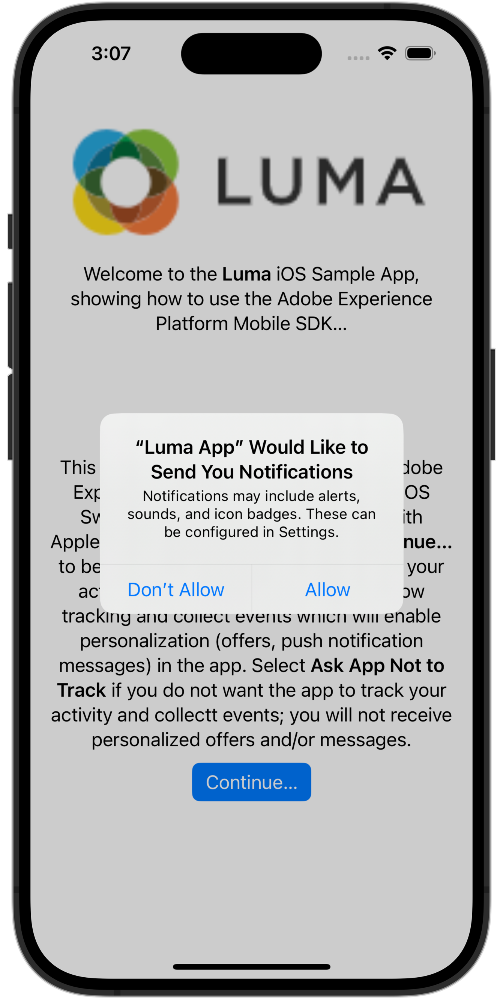

# 设置保证

了解如何在移动应用程序中设置Adobe Experience Platform保障。

Assurance（正式称为Project Griffon）旨在帮助您检查、证明、模拟和验证在移动应用程序中收集数据或提供体验的方式。

Assurance 可帮助您检查 Adobe Experience Platform Mobile SDK 生成的原始 SDK 事件。SDK 收集的所有事件都可供检查。SDK 事件加载在列表视图中，按时间排序。每个事件都有一个详细视图，可提供更多详细信息。还提供了用于浏览SDK配置、数据元素、共享状态和SDK扩展版本的其他视图。 了解关于 [Assurance](https://experienceleague.adobe.com/docs/experience-platform/assurance/home.html) 在产品文档中。


## 先决条件

* 成功设置已安装并配置SDK的应用程序。

## 学习目标

在本课程中，您将执行以下操作：

* 确认您的组织具有访问权限（如果您没有访问权限，请进行请求）。
* 设置您的基本URL。
* 添加所需的iOS特定代码。
* 连接到会话。

## 确认访问

确认您的组织有权访问Assurance。 您作为用户，应该被添加到Adobe Experience Platform的配置文件。 请参阅 [用户访问权限](https://experienceleague.adobe.com/docs/experience-platform/assurance/user-access.html?lang=en) ，以了解详细信息。

## 实施

除了一般 [SDK安装](install-sdks.md)（已在之前的课程中完成），iOS还需要添加以下内容才能启动应用程序的保障会话。

1. 导航到 **[!DNL Luma]** > **[!DNL Luma]** > **[!UICONTROL SceneDelegate]** 在Xcode的项目导航器中。

1. 将以下代码添加到 `func scene(_ scene: UIScene, openURLContexts URLContexts: Set<UIOpenURLContext>`：

   ```swift
   // Called when the app in background is opened with a deep link.
   if let deepLinkURL = URLContexts.first?.url {
       // Start the Assurance session
       Assurance.startSession(url: deepLinkURL)
   }
   ```

   当应用程序处于后台并使用深层链接打开时，此代码会启动保证会话。

可以找到更多信息 [此处](https://developer.adobe.com/client-sdks/documentation/platform-assurance-sdk/api-reference/){target="_blank"}.


## 定义捆绑包标识符

您需要为应用程序提供唯一的捆绑包标识符。

1. 在Xcode中打开项目。
1. 选择 **[!DNL Luma]** 在项目导航器中。
1. 选择 **[!DNL Luma]** 目标。
1. 选择 **签名和功能** 选项卡。
1. 定义 **[!UICONTROL 捆绑标识符]**.

   >[!IMPORTANT]
   >
   >确保使用 _独特_ 捆绑标识符并替换 `com.adobe.luma.tutorial.swiftui` 捆绑标识符，因为每个捆绑标识符必须是唯一的。 通常，会对捆绑ID字符串使用反向DNS格式，如 `com.organization.brand.uniqueidentifier`. 例如，本教程的完成版本使用 `com.adobe.luma.tutorial.swiftui`.


   {zoomable=&quot;yes&quot;}


## 设置基本URL

1. 转到Xcode中的项目。
1. 选择 **[!DNL Luma]** 在项目导航器中。
1. 选择 **[!DNL Luma]** 目标。
1. 选择 **信息** 选项卡。
1. 要添加基本URL，请向下滚动到 **URL类型** 并选择 **+** 按钮。
1. 设置 **标识符** 至所选的捆绑标识符，并设置 **URL方案** 中。

   

   >[!IMPORTANT]
   >
   >确保使用 _独特_ 捆绑标识符并替换 `com.adobe.luma.tutorial.swiftui` 捆绑标识符，因为每个捆绑标识符都必须是唯一的。 通常，会对捆绑ID字符串使用反向DNS格式，如 `com.organization.brand.uniqueidentifier`. 您可以使用在上使用的相同捆绑标识符 [定义捆绑包标识符](#define-bundle-identifier).<br/>同样，使用唯一的URL方案，并替换已经提供的 `lumatutorialswiftui` 使用您的唯一URL方案。

要了解有关iOS中URL方案的更多信息，请查看 [Apple的文档](https://developer.apple.com/documentation/xcode/defining-a-custom-url-scheme-for-your-app){target="_blank"}.

Assurance的工作方式是通过浏览器或二维码打开URL。 该URL以基本URL开头，该URL可打开应用程序并包含其他参数。 这些唯一参数用于连接会话。


## 连接到会话

在Xcode中：

1. 使用在模拟器或Xcode的物理设备上构建或重建并运行应用程序 .

   >[!TIP]
   >
   >或者，您可能希望“清理”内部版本，尤其是看到意外结果时。 要执行此操作，请选择 **[!UICONTROL 清理生成文件夹……]** 从Xcode **[!UICONTROL 产品]** 菜单。


1. 在 **[!UICONTROL 允许“Luma应用程序”使用您的位置]** 对话框，选择 **[!UICONTROL 使用应用程序时允许]**.

   

1. 在 **[!UICONTROL “Luma应用程序”想要向您发送通知]** 对话框，选择 **[!UICONTROL 允许]**.

   

1. 选择 **[!UICONTROL 继续……]** 以允许应用程序跟踪您的活动。

   

1. 在 **[!UICONTROL 允许“Luma应用程序”在其他公司的应用程序和网站上跟踪您的活动]** 对话框，选择 **[!UICONTROL 允许]**.

   


在您的浏览器中：

1. 转到数据收集UI。
1. 选择 **[!UICONTROL Assurance]** 从左边栏开始。
1. 选择 **[!UICONTROL 创建会话]**.
1. 选择&#x200B;**[!UICONTROL 开始]**。
1. 提供 **[!UICONTROL 会话名称]** 例如 `Luma Mobile App Session` 和 **[!UICONTROL 基本URL]**，这是您在Xcode中输入的URL方案，后面接着 `://` 例如： `lumatutorialswiftui://`
1. 选择&#x200B;**[!UICONTROL 下一步]**。
   
1. 在 **[!UICONTROL 创建新会话]** 模式对话框：

   如果您使用的是物理设备：

   * 选择 **[!UICONTROL 扫描二维码]**. 要打开应用程序，请使用物理设备上的摄像头扫描二维码并点击链接。

     

   如果您使用模拟器：

   1. 选择 **[!UICONTROL 复制链接]**.
   1. 使用以下方式复制深层链接   并在模拟器中使用深层链接通过Safari打开应用程序。
      

1. 应用程序加载时，系统会显示一个模式对话框，要求您输入步骤7中显示的PIN。

   

   输入PIN并选择 **[!UICONTROL 连接]**.


1. 如果连接成功，您会看到：
   * “保证”图标浮动在应用程序顶部。

     

   * 在Assurance UI中执行的Experience Cloud更新显示：

      1. 来自应用程序的体验事件。
      1. 选定事件的详细信息。
      1. 设备和时间轴。

         

如果您遇到任何挑战，请查看 [技术](https://developer.adobe.com/client-sdks/documentation/platform-assurance-sdk/){target="_blank"} and [general documentation](https://experienceleague.adobe.com/docs/experience-platform/assurance/home.html){target="_blank"}.


## 验证扩展

要验证您的应用程序是否使用了最新的扩展，请执行以下操作：

1. 选择 **[!UICONTROL 配置]**.

1. 选择  对象  **[!UICONTROL 扩展版本]**.

1. 选择&#x200B;**[!UICONTROL 保存]**。

   

1. 选择  **[!UICONTROL 扩展版本]** 查看有关可用的最新扩展以及您的应用程序版本中使用的扩展的概述。

   

1. 要更新扩展版本(例如， **[!UICONTROL 消息传送]** 和 **[!UICONTROL 优化]**)从中选择包（扩展） **[!UICONTROL 程序包依赖项]** (例如， **[!UICONTROL AEPMessaging]**)，然后从上下文菜单中选择 **[!UICONTROL 更新包]**. Xcode将更新包依赖项。


>[!NOTE]
>
>在Xcode中更新扩展（包）后，关闭并删除当前会话，然后从重复所有步骤 [连接到会话](#connecting-to-a-session) 和 [验证扩展](#verify-extensions) 确保Assurance在新的Assurance会话中正确报告正确的扩展。


>[!SUCCESS]
>
>您现在已将应用程序设置为在教程的其余部分使用Assurance 。
>
>感谢您投入时间学习Adobe Experience Platform Mobile SDK。 如果您有疑问、希望分享一般反馈或有关于未来内容的建议，请在此共享它们 [Experience League社区讨论帖子](https://experienceleaguecommunities.adobe.com/t5/adobe-experience-platform-data/tutorial-discussion-implement-adobe-experience-cloud-in-mobile/td-p/443796)


下一步： **[实施同意](consent.md)**
