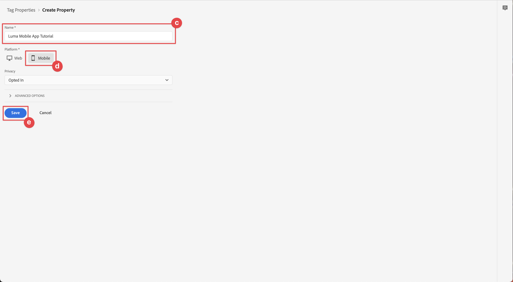

# 配置标记属性

了解如何在[!UICONTROL 数据收集]界面中配置标记属性。

Adobe Experience Platform中的标记是Adobe推出的新一代标记管理功能。 标记为客户提供了一种简单的方式来部署和管理用来加强相关客户体验的分析、营销和广告标记。 在产品文档中了解有关[标记](https://experienceleague.adobe.com/en/docs/experience-platform/tags/home)的更多信息。

## 先决条件

要完成本课程，您必须具有创建标记属性的权限。 了解标记的基础信息也很有帮助。

>[!NOTE]
>
> Platform Launch（客户端）现在为[标记](https://experienceleague.adobe.com/en/docs/experience-platform/tags/home)

## 学习目标

在本课程中，您将执行以下操作：

* 安装和配置移动标记扩展。
* 生成SDK安装说明。

## 初始设置

1. 在数据收集界面中创建新的移动标记属性：
   1. 在左侧导航中选择&#x200B;**[!UICONTROL 标记]**。
   1. 选择&#x200B;**[!UICONTROL 新属性]**
      {zoomable="yes"}。
   1. 对于&#x200B;**[!UICONTROL Name]**，输入`Luma Mobile App Tutorial`。
   1. 对于&#x200B;**[!UICONTROL 平台]**，请选择&#x200B;**[!UICONTROL 移动设备]**。
   1. 选择&#x200B;**[!UICONTROL 保存]**。

      {zoomable="yes"}

      >[!NOTE]
      >
      > 基于边缘的Mobile SDK实施的默认同意设置（例如，您在本课程中执行的设置）来自[!UICONTROL 同意扩展]，而不是标记属性配置中的[!UICONTROL 隐私]设置。 您可在本课程的后面部分添加并配置同意扩展。 有关详细信息，请参阅[文档](https://developer.adobe.com/client-sdks/edge/consent-for-edge-network/)。

1. 打开新资产。
1. 创建库：

   1. 在左侧导航中转到&#x200B;**[!UICONTROL 发布流]**。
   1. 选择&#x200B;**[!UICONTROL 添加库]**。

      {zoomable="yes"}

   1. 对于&#x200B;**[!UICONTROL Name]**，输入`Initial Build`。
   1. 对于&#x200B;**[!UICONTROL 环境]**，请选择&#x200B;**[!UICONTROL 开发（开发）]**。
   1. 选择 **[!UICONTROL 添加所有更改的资源]**。
   1. 选择&#x200B;**[!UICONTROL 保存并生成到开发]**。

      {zoomable="yes"}

   1. 最后，从&#x200B;**[!UICONTROL 选择工作库]**&#x200B;菜单中选择&#x200B;**[!UICONTROL 初始生成]**作为工作库。
      {zoomable="yes"}
1. 检查扩展：

   1. 确保选择&#x200B;**[!UICONTROL 初始内部版本]**&#x200B;作为默认库。

   1. 在左边栏中选择&#x200B;**[!UICONTROL 扩展]**。

   1. 选择&#x200B;**[!UICONTROL 已安装]**&#x200B;选项卡。

      应预安装[!UICONTROL Mobile Core]和[!UICONTROL Profile]扩展。

      已安装{zoomable="yes"}

## 扩展配置

1. 确保您在移动应用程序属性中的&#x200B;**[!UICONTROL 扩展]**&#x200B;中。

1. 选择&#x200B;**[!UICONTROL 目录]**。

   {zoomable="yes"}

1. 使用 **[!UICONTROL 搜索]**&#x200B;字段查找&#x200B;**标识**&#x200B;扩展。

   1. 搜索`Identity`。

   2. 选择&#x200B;**[!UICONTROL Identity]**&#x200B;扩展。

   3. 选择&#x200B;**[!UICONTROL 安装]**。

      {zoomable="yes"}

   此扩展不需要任何进一步的配置。

1. 使用 **[!UICONTROL 搜索]**&#x200B;字段查找并安装&#x200B;**AEP Assurance**&#x200B;扩展。

   此扩展不需要任何进一步的配置。

1. 使用 **[!UICONTROL 搜索]**&#x200B;字段查找并安装&#x200B;**同意**&#x200B;扩展。 在配置屏幕中：

   1. 选择&#x200B;**[!UICONTROL 待处理]**。 在本教程中，您可以在应用程序中进一步管理同意。 在[文档](https://developer.adobe.com/client-sdks/documentation/consent-for-edge-network/)中了解有关同意扩展的更多信息。
   1. 选择&#x200B;**[!UICONTROL 保存到库]**。

      {zoomable="yes"}

1. 使用 **[!UICONTROL 搜索]**&#x200B;字段查找并安装&#x200B;**Adobe Experience Platform Edge Network**&#x200B;扩展。

   1. 在&#x200B;**[!UICONTROL 数据流]**&#x200B;中，选择您在&#x200B;**[!UICONTROL 上一步]**&#x200B;中为每个环境创建的[数据流](create-datastream.md)，例如&#x200B;**[!DNL Luma Mobile App]**。

   1. 如果尚未填充，请在&#x200B;**[!UICONTROL 域配置]**&#x200B;中指定&#x200B;**[!UICONTROL Edge Network域]**。 Edge Network域是您的组织的名称，后跟`data.adobedc.net`，例如`techmarketingdemos.data.adobedc.net`。

   1. 从&#x200B;**[!UICONTROL 保存到库]**&#x200B;菜单中，选择&#x200B;**[!UICONTROL 保存到库并生成]**。

      {zoomable="yes"}

您的库是为新扩展和配置构建的。 ●初始生成&#x200B;**[!UICONTROL 按钮中的]**&#x200B;指示生成成功。

## 生成SDK安装说明

标记为您提供在应用程序中安装Adobe Experience Platform Mobile SDK的说明和代码片段。

>[!BEGINTABS]

>[!TAB iOS]

1. 从左边栏中选择&#x200B;**[!UICONTROL 环境]**。

1. 选择&#x200B;**[!UICONTROL 开发]**&#x200B;安装图标 。

   {zoomable="yes"}

1. 在&#x200B;**[!UICONTROL 移动设备安装说明]**&#x200B;对话框中，选择&#x200B;**[!UICONTROL iOS]**&#x200B;选项卡。

1. 您可以复制使用CocoaPods设置项目的说明。 CocoaPod用于管理SDK版本和下载。 若要了解更多信息，请查阅[CocoaPods文档](https://cocoapods.org/)。

   [安装说明](https://developer.adobe.com/client-sdks/documentation/getting-started/get-the-sdk/)为您提供了一个良好的实施起点。

   在本教程的其余部分中，您使用CocoaPods说明&#x200B;**不是**。 您而是使用基于本机Swift Package Manager (SPM)的设置。

1. 选择&#x200B;**[!UICONTROL Add Initialization Code]**&#x200B;下的&#x200B;**[!UICONTROL Swift]**&#x200B;选项卡。 此代码块显示了如何导入所需的SDK并在启动时注册扩展。 此导入和注册在[安装SDK](install-sdks.md)中有更详细的介绍。

1. 复制 **[!UICONTROL 环境文件ID]**，并在以后需要时将其存储到某个位置。 此唯一ID指向您的开发环境。 每个环境（生产、暂存、开发）都有其自己的唯一ID值。

   {zoomable="yes"}

>[!TAB Android]

1. 从左边栏中选择&#x200B;**[!UICONTROL 环境]**。
1. 选择&#x200B;**[!UICONTROL 开发]**&#x200B;安装图标 。

   {zoomable="yes"}

1. 在&#x200B;**[!UICONTROL 移动设备安装说明]**&#x200B;对话框中，选择&#x200B;**[!UICONTROL Android]**&#x200B;选项卡。
1. 您可以复制说明以使用Gradle设置项目。 Gradle用于管理SDK版本和下载。 要了解更多信息，请查阅[Gradle文档](https://gradle.org/)

   [安装说明](https://developer.adobe.com/client-sdks/documentation/getting-started/get-the-sdk/)为您提供了一个良好的实施起点。

1. 此代码块显示了如何导入所需的SDK并在启动时注册扩展。 此导入和注册在[安装SDK](install-sdks.md)中有更详细的介绍。

1. 复制 **[!UICONTROL 环境文件ID]**，并在以后需要时将其存储到某个位置。 此唯一ID指向您的开发环境。 每个环境（生产、暂存、开发）都有其自己的唯一ID值。

   {zoomable="yes"}

>[!ENDTABS]

>[!NOTE]
>
>应将安装说明视为起点，而不是最终的文档。 在官方的[文档](https://developer.adobe.com/client-sdks/home/)中可找到最新的SDK版本和代码示例。

## 移动标记架构

如果您熟悉Tags的Web版本（以前称为Launch），那么了解移动设备上的差异非常重要。

* 在Web上，标记属性呈现到JavaScript中，然后（通常）将该属性托管在云中。 该JavaScript文件直接在网站中引用。

* 在移动标记属性中，规则和配置将渲染到云中托管的JSON文件中。 JSON文件由移动设备应用程序中的Mobile Core扩展下载和读取。 扩展是相互协作的分隔SDK。 如果向标记属性添加扩展，则还必须更新应用程序。 如果更改扩展设置或创建规则，则在发布更新的标记库后，这些更改将反映在应用程序中。 这种灵活性允许您修改设置(如Adobe Analytics报表包ID)。 甚至无需更改应用程序中的代码并重新提交至应用商店即可更改应用程序行为（使用数据元素和规则，如您将在后续课程中看到的）。

>[!SUCCESS]
>
>您现在拥有了一个要在本教程的其余部分中使用的移动标记属性。
>
>感谢您投入时间学习Adobe Experience Platform Mobile SDK。 如果您有任何疑问、希望分享一般反馈或有关于未来内容的建议，请在此[Experience League社区讨论帖子](https://experienceleaguecommunities.adobe.com/t5/adobe-experience-platform-data/tutorial-discussion-implement-adobe-experience-cloud-in-mobile/td-p/443796)上分享这些内容

下一步： **[安装SDK](install-sdks.md)**
