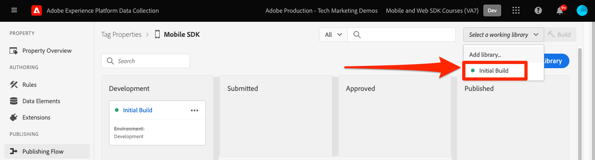

# 配置标记属性

了解如何在中配置标记属性 [!UICONTROL 数据收集] 界面。

Adobe Experience Platform 中的标记是 Adobe 推出的新一代标记管理功能。标记为客户提供了一种简单的方式，让客户可以部署和管理所有用来加强相关客户体验的分析、营销和广告标记。详细了解 [标记](https://experienceleague.adobe.com/docs/experience-platform/tags/home.html) ，位于产品文档中。

## 先决条件

要完成本课程，您必须具有创建标记属性的权限。 了解标记的基础信息也很有帮助。

>[!NOTE]
>
> platform launch（客户端）现在为 [标记](https://experienceleague.adobe.com/docs/experience-platform/tags/home.html?lang=en)

## 学习目标

在本课程中，您将执行以下操作：

* 安装和配置移动标记扩展。
* 生成SDK安装说明。

## 初始设置

1. 创建新的移动标记属性：
   1. 在 [数据收集界面](https://experience.adobe.com/data-collection?lang=zh-Hans/){target="_blank"}，选择 **[!UICONTROL 标记]** 在左侧导航中
   1. 选择 **[!UICONTROL 新建属性]**

      .
   1. 对于 **[!UICONTROL 名称]**，输入 `Mobile SDK Course`.
   1. 对于 **[!UICONTROL Platform]**，选择 **[!UICONTROL 移动设备]**.
   1. 选择&#x200B;**[!UICONTROL 保存]**。

      

      >[!NOTE]
      >
      > 基于Edge的Mobile Sdk实施（例如，您在本教程中正在执行的实施）的默认同意设置来自 [!UICONTROL 同意扩展] 而不是 [!UICONTROL 隐私] 设置。 您将在本课程的后面部分添加并配置同意扩展。 有关更多信息，请参阅 [文档](https://developer.adobe.com/client-sdks/documentation/privacy-and-gdpr/).

1. 打开新资产
1. 创建库:

   1. 转到 **[!UICONTROL 发布流]** 左侧导航栏中。
   1. 选择 **[!UICONTROL 添加库]**.

      

   1. 对于 **[!UICONTROL 名称]**，输入 `Initial Build`.
   1. 对于 **[!UICONTROL 环境]**，选择 **[!UICONTROL 开发]**.
   1. 选择  **[!UICONTROL 添加所有更改的资源]**.
   1. 选择 **[!UICONTROL 保存并生成到开发环境]**.

      

   1. 最后，将其设置为您的 **[!UICONTROL 工作库]**.
      
1. 选择 **[!UICONTROL 扩展]**.

   应预安装Mobile Core和Profile扩展。

1. 选择 **[!UICONTROL 目录]**.

   

1. 使用 [!UICONTROL 搜索] 功能查找并安装以下扩展。 这两个扩展均不需要任何配置：
   * 标识
   * AEP保证

## 扩展配置

1. 安装 **同意** 扩展。

   在本教程中，请选择 **[!UICONTROL 待处理]**. 在中了解有关Consent扩展的更多信息 [文档](https://developer.adobe.com/client-sdks/documentation/consent-for-edge-network/).

   

1. 安装 **Adobe Experience Platform边缘网络** 扩展。

   在 **[!UICONTROL Edge配置]** 下拉列表中，选择您在中创建的数据流 [上一步](create-datastream.md).

1. 选择 **[!UICONTROL 保存到库并生成]**.

   

## 生成SDK安装说明

1. 选择 **[!UICONTROL 环境]**.

1. 选择 **[!UICONTROL 开发]** 安装图标。

   

1. 选择 **[!UICONTROL iOS]**.

1. 选择 **[!UICONTROL Swift]**.

   

1. 安装说明为您提供了一个良好的实施起点。

   您可以找到其他信息 [此处](https://developer.adobe.com/client-sdks/documentation/getting-started/get-the-sdk/).

   * **[!UICONTROL 环境文件Id]**：此唯一ID指向您的开发环境，请记下此值。 生产/暂存/开发都具有不同的ID值。
   * **[!UICONTROL Podfile]**：CocoaPods用于管理SDK版本和下载。 要了解更多信息，请查看 [文档](https://cocoapods.org/).
   * **[!UICONTROL 初始化代码]**：此代码块显示了如何导入所需的SDK并在启动时注册扩展。

>[!NOTE]
>应将安装说明视为起点，而不是最终的文档。 可以在官方网站中找到最新的SDK版本和代码示例 [文档](https://developer.adobe.com/client-sdks/documentation/).

## 移动标记架构

如果您熟悉标记的Web版本（以前称为Launch），那么了解移动设备上的差异非常重要。

在Web上，标记属性呈现到JavaScript中，然后（通常）将该属性托管在云中。 该JS文件直接在网站中引用。

在移动标记属性中，规则和配置将渲染到云中托管的JSON文件中。 JSON文件由移动设备应用程序中的Mobile Core扩展下载和读取。 扩展是单独的SDK，可一起工作。 如果向标记资产中添加扩展，则还必须更新应用程序。 如果更改扩展设置或创建规则，则在发布更新的标记库后，这些更改将反映在应用程序中。

下一步： **[安装SDK](install-sdks.md)**

>[!NOTE]
>
>感谢您投入时间来了解Adobe Experience Platform Mobile SDK。 如果您有疑问、希望分享一般反馈或有关于未来内容的建议，请在此分享这些内容 [Experience League社区讨论帖子](https://experienceleaguecommunities.adobe.com/t5/adobe-experience-platform-launch/tutorial-discussion-implement-adobe-experience-cloud-in-mobile/td-p/443796)