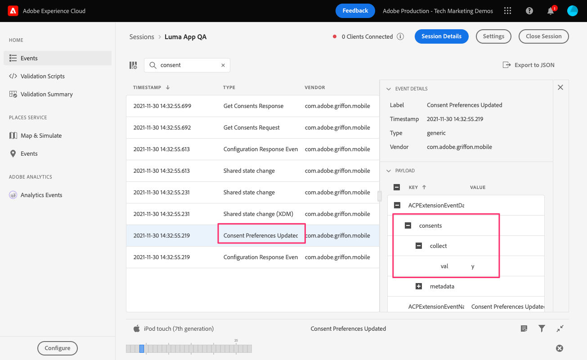

# 同意

了解如何在移动应用程序中实施同意。

使用Adobe Experience Platform Mobile SDK和Edge Network扩展时，Adobe Experience Platform Consent移动扩展支持从移动应用程序收集同意首选项。 进一步了解 [同意扩展](https://developer.adobe.com/client-sdks/documentation/consent-for-edge-network/)，在文档中。

## 先决条件

* 成功构建并运行安装并配置了SDK的应用程序。

## 学习目标

在本课程中，您将执行以下操作：

* 提示用户同意。
* 根据用户响应更新扩展。
* 了解如何获取当前的同意状态。

## 征求同意

如果您从一开始就学习了本教程，那么您会记得设置 **[!UICONTROL 默认同意级别]** 更改为“待处理”。 要开始收集数据，您必须获得用户的同意。 在本教程中，只需在真实世界应用程序中询问警报即可获得同意，您需要查阅适合您所在地区的同意最佳实践。

1. 您只需询问用户一次。 管理这种情况的一个简单方法是使用 `UserDefaults`.
1. 导航到 `Home.swift`。
1. 将以下代码添加到 `viewDidLoad()`.

   ```swift
   let defaults = UserDefaults.standard
   let consentKey = "askForConsentYet"
   let hidePopUp = defaults.bool(forKey: consentKey)
   ```

1. 如果用户之前未看到警报，则显示警报并根据其响应更新同意。 将以下代码添加到 `viewDidLoad()`.

   ```swift
   if(hidePopUp == false){
       //Consent Alert
       let alert = UIAlertController(title: "Allow Data Collection?", message: "Selecting Yes will begin data collection", preferredStyle: .alert)
       alert.addAction(UIAlertAction(title: "Yes", style: .default, handler: { action in
           //Update Consent -> "yes"
           let collectConsent = ["collect": ["val": "y"]]
           let currentConsents = ["consents": collectConsent]
           Consent.update(with: currentConsents)
           defaults.set(true, forKey: consentKey)
       }))
       alert.addAction(UIAlertAction(title: "No", style: .cancel, handler: { action in
           //Update Consent -> "no"
           let collectConsent = ["collect": ["val": "n"]]
           let currentConsents = ["consents": collectConsent]
           Consent.update(with: currentConsents)
           defaults.set(true, forKey: consentKey)
       }))
       self.present(alert, animated: true)
   }
   ```


## 获取当前的同意状态

同意移动扩展将根据当前同意值自动禁止/挂起/允许跟踪。 您还可以自行访问当前同意状态：

1. 导航到 `Home.swift`。
1. 将以下代码添加到 `viewDidLoad()`.

```swift
Consent.getConsents{ consents, error in
    guard error == nil, let consents = consents else { return }
    guard let jsonData = try? JSONSerialization.data(withJSONObject: consents, options: .prettyPrinted) else { return }
    guard let jsonStr = String(data: jsonData, encoding: .utf8) else { return }
    print("Consent getConsents: ",jsonStr)
}
```

在上例中，您只是将同意状态打印到控制台。 在真实场景中，您可以使用该场景来修改向用户显示的菜单或选项。

## 使用保证进行验证

1. 查看 [Assurance](assurance.md) 上课。
1. 安装应用程序。
1. 使用保证生成的URL启动应用程序。
1. 如果您正确添加了上述代码，系统将提示您提供同意。 选择 **是**.
   
1. 您应会看到 **[!UICONTROL 已更新同意首选项]** Assurance UI中的事件。
   

下一步： **[收集生命周期数据](lifecycle-data.md)**

>[!NOTE]
>
>感谢您投入时间来了解Adobe Experience Platform Mobile SDK。 如果您有疑问、希望分享一般反馈或有关于未来内容的建议，请在此分享这些内容 [Experience League社区讨论帖子](https://experienceleaguecommunities.adobe.com/t5/adobe-experience-platform-launch/tutorial-discussion-implement-adobe-experience-cloud-in-mobile/td-p/443796)