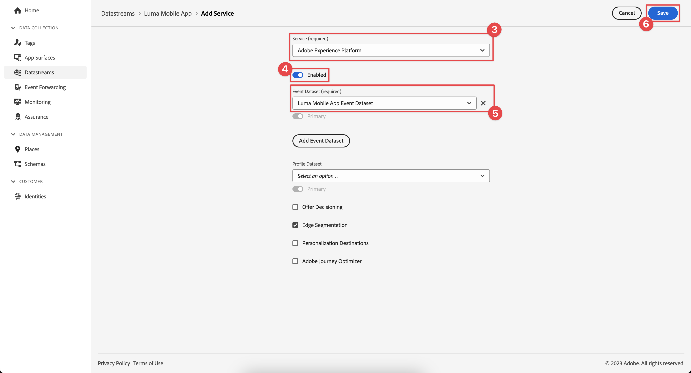

# 创建数据流

了解如何在 Experience Platform 中创建数据流。

数据流是Platform Edge Network上的服务器端配置。 数据流可确保将传入到Platform Edge Network的数据正确路由到Adobe Experience Cloud应用程序和服务。 有关详细信息，请参阅[文档](https://experienceleague.adobe.com/zh-hans/docs/experience-platform/datastreams/overview)或此[视频](https://experienceleague.adobe.com/zh-hans/docs/platform-learn/data-collection/edge-network/configure-datastreams)。

{zoomable="yes"}

## 先决条件

要创建数据流，必须在数据收集界面（以前为[!UICONTROL Launch]）中为您的组织配置此功能，并且您必须具有管理和查看数据流的用户权限。

## 学习目标

在本课程中，您将执行以下操作：

* 了解何时使用数据流。
* 创建数据流。
* 配置数据流。

## 创建数据流

可以使用[!UICONTROL 数据流]配置工具在[!UICONTROL 数据收集]界面中创建数据流。 要创建数据流，请执行以下操作：

1. 由于在沙盒级别定义了数据流，因此请确保您处于正确的Experience Platform沙盒中。
1. 在左边栏中选择&#x200B;**[!UICONTROL 数据流]**。
1. 选择&#x200B;**[!UICONTROL 新数据流]**。

   {zoomable="yes"}

1. 提供&#x200B;**[!UICONTROL Name]**，例如`Luma Mobile App`和&#x200B;**[!UICONTROL Description]**，例如`Datastream for Luma Mobile App`。

   >[!NOTE]
   >
   >最后提醒：如果您正在阅读本教程，将多人放在一个沙盒上，或者您使用的是共享帐户，请考虑在命名约定中附加或附加标识作为命名约定的一部分。 例如，使用`Luma Mobile App Event Dataset`而不是`Luma Mobile App Event Dataset - Joe Smith`。 另请参阅[概述](overview.md)中的注释。

1. 从&#x200B;**事件架构**&#x200B;列表中选择您在上一课中创建的架构。
1. 选择&#x200B;**[!UICONTROL 保存]**。

   {zoomable="yes"}

## 添加服务

完成本教程中的（可选）[Analytics](analytics.md)和[Experience Platform](platform.md)课程后，您可将服务添加到数据流，以便将发送到Platform Edge Network的数据转发到这些应用程序。

<!--

### Adobe Analytics

1. Select **[!UICONTROL Add Service]**.

1. Add **[!UICONTROL Adobe Analytics]** from the [!UICONTROL Service] list, 

1. Enter the name of the report site that you want to use in **[!UICONTROL Report Suite ID]**.

1. Enable the service by switching **[!UICONTROL Enabled]** on.

1. Select **[!UICONTROL Save]**.

   {zoomable="yes"}

### Adobe Experience Platform

You might also want to enable the Adobe Experience Platform service. 

>[!IMPORTANT]
>
>You can only enable the Adobe Experience Platform service when having created an event dataset. If you don't already have an event dataset created, follow the instructions [here](platform.md).

1. Click  **[!UICONTROL Add Service]** to add another service.

1. Select **[!UICONTROL Adobe Experience Platform]** from the [!UICONTROL Service] list.

1. Enable the service by switching **[!UICONTROL Enabled]** on.

1. Select the **[!UICONTROL Event Dataset]** that you created as part of the [Create a dataset](platform.md#create-a-dataset) instructions, for example **Luma Mobile App Event Dataset**

1. Select **[!UICONTROL Save]**.

   {zoomable="yes"}
1. The final configuration should look something like this.
   
   {zoomable="yes"}

-->

>[!NOTE]
>
>启用您的组织使用的每项服务，可确保随时随地使用在移动应用程序中收集的数据。 有关详细信息，请参阅[数据流设置](https://experienceleague.adobe.com/zh-hans/docs/experience-platform/datastreams/overview)。

在您自己的应用程序中实施Platform Mobile SDK时，您最终应创建三个数据流以映射到三个标记环境（开发、暂存和生产）。 如果您将Platform Mobile SDK与基于Platform的应用程序(如Adobe Real-Time Customer Data Platform或Adobe Journey Optimizer)一起使用，则应确保在相应的沙盒中创建这些数据流。

>[!SUCCESS]
>
>您现在有了一个数据流用于本教程的其余部分。
>
>感谢您投入时间学习Adobe Experience Platform Mobile SDK。 如果您有任何疑问、希望分享一般反馈或有关于未来内容的建议，请在此[Experience League社区讨论帖子](https://experienceleaguecommunities.adobe.com/t5/adobe-experience-platform-data/tutorial-discussion-implement-adobe-experience-cloud-in-mobile/td-p/443796)上分享这些内容

下一步： **[配置标记属性](configure-tags.md)**
