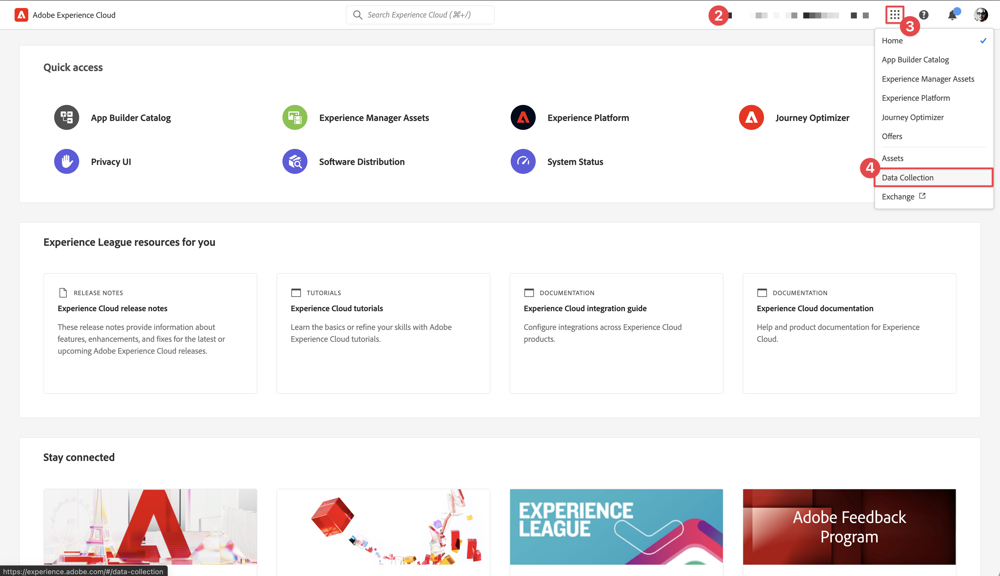
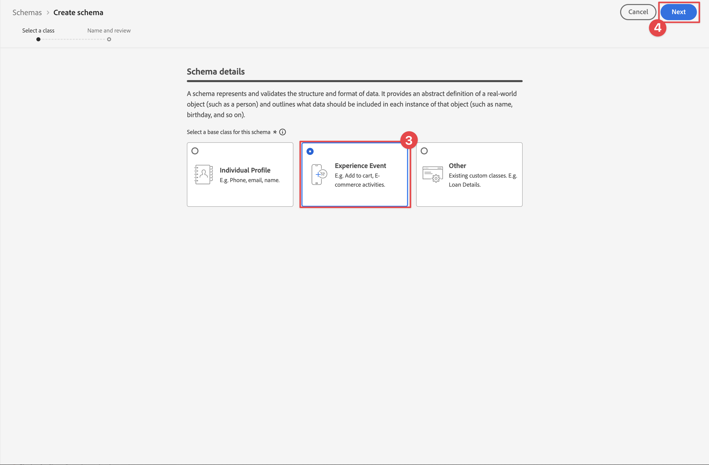
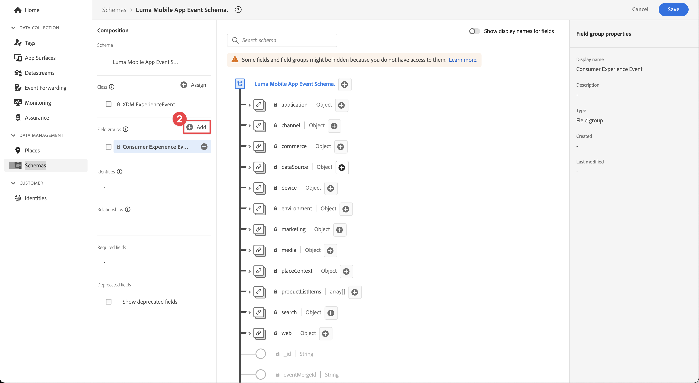

# 创建 XDM 架构

了解如何为移动应用程序事件创建XDM架构。

标准化和互操作性是Adobe Experience Platform背后的关键概念。 体验数据模型(XDM)由Adobe驱动，它致力于标准化客户体验数据并定义用于客户体验管理的架构。

## 什么是XDM架构？

XDM是一个公开记录的规范，旨在提高数字体验的强大功能。 它提供了通用结构和定义，允许任何应用程序与Platform服务进行通信。 通过遵守XDM标准，所有客户体验数据都可以纳入到通用表示中，从而以更快、更集成的方式提供见解。 您可以从客户操作中获得有价值的见解，通过区段定义客户受众，并将客户属性用于个性化目的。

Experience Platform使用架构以一致且可重用的方式描述数据结构。 通过在系统中以一致的方式定义数据，更容易保留含义并因此从数据中获取价值。

在将数据引入Platform之前，必须组合模式以描述数据的结构并对每个字段中可以包含的数据类型提供约束。 架构由一个基类以及零个或多个架构字段组组成。

有关架构组合模型的更多信息，包括设计原则和最佳实践，请参阅架构组合的[基础知识](https://experienceleague.adobe.com/docs/experience-platform/xdm/schema/composition.html?lang=en)或播放列表[使用XDM对您的客户体验数据进行建模](https://experienceleague.adobe.com/en/playlists/experience-platform-model-your-customer-experience-data-with-xdm)。

>[!TIP]
>
>如果您熟悉Analytics解决方案设计参考(SDR)，则可以将架构视为更强大的SDR。 有关详细信息，请参阅[创建和维护解决方案设计参考(SDR)文档](https://experienceleague.adobe.com/docs/analytics-learn/tutorials/implementation/implementation-basics/creating-and-maintaining-an-sdr.html?lang=en)。

## 先决条件

要完成本课程，您必须具有创建Experience Platform架构的权限。

## 学习目标

在本课程中，您将执行以下操作：

* 在数据收集界面中创建架构
* 将标准字段组添加到该架构
* 创建自定义字段组并将其添加到架构

## 导航到架构

1. 登录到Adobe Experience Cloud。

1. 确保您位于将在本教程中使用的Experience Platform沙盒中。

1. 打开应用程序切换器（位于右上方），

1. 从菜单中选择&#x200B;**[!UICONTROL 数据收集]**。

   

   >[!NOTE]
   >
   > 对于基于Platform的应用程序(如Real-Time CDP)，客户应使用开发沙盒来完成本教程。 其他客户使用默认的生产沙盒。

1. 在左边栏中的&#x200B;**[!UICONTROL 数据管理]**&#x200B;下选择&#x200B;**[!UICONTROL 架构]**。

   

现在，您位于主架构页面上，系统会向您显示任何现有架构的列表。 您还可以看到与架构的核心构建块对应的选项卡：

* **字段组**&#x200B;是可重复使用的组件，它们定义了一个或多个字段以捕获特定数据，如个人详细信息、酒店首选项或地址。
* **类**&#x200B;定义架构包含的数据的行为方面。 例如： `XDM ExperienceEvent`捕获时间序列、事件数据和`XDM Individual Profile`捕获有关个人的属性数据。
* **数据类型**&#x200B;在类或字段组中用作引用字段类型，其使用方式与基本文本字段相同。

以上描述只是简要的概述。 有关更多详细信息，请参阅[架构构建基块](https://experienceleague.adobe.com/docs/platform-learn/tutorials/schemas/schema-building-blocks.html?lang=zh-CN)视频或阅读产品文档中的[架构组合基础知识](https://experienceleague.adobe.com/docs/experience-platform/xdm/schema/composition.html?lang=en)。

在本教程中，您将使用使用者体验事件字段组并创建一个自定义字段组来演示该过程。

>[!NOTE]
>
>Adobe会不断添加更多标准字段组，应尽可能使用它们，因为Experience Platform服务可以隐式理解这些字段，并在跨Platform组件使用时提供更大的一致性。 使用标准字段组可提供切实的好处，例如在Platform中的Analytics和AI功能中进行自动映射。

## Luma应用程序架构架构

在真实场景中，架构设计过程可能如下所示：

* 收集业务需求。
* 查找预建字段组以尽可能满足更多要求。
* 为任何间隙创建自定义字段组。

出于学习目的，可使用预建和自定义字段组。

* **使用者体验事件**：预构建的字段组具有许多公共字段。
* **应用程序信息**：设计用于模拟TrackState/TrackAction Analytics概念的自定义字段组。

<!--Later in the tutorial, you can [update the schema](lifecycle-data.md) to include the **[!UICONTROL AEP Mobile Lifecycle Details]** field group.-->

## 创建架构

1. 选择&#x200B;**[!UICONTROL 创建架构]**。

1. 在&#x200B;**[!UICONTROL 创建架构]**&#x200B;向导的&#x200B;**[!UICONTROL 选择类]**&#x200B;步骤中，在&#x200B;**[!UICONTROL 为此架构]**&#x200B;选择基类下选择&#x200B;**[!UICONTROL 体验事件]**。

1. 选择&#x200B;**[!UICONTROL 下一步]**。

   

1. 在&#x200B;**[!UICONTROL 创建架构]**&#x200B;向导的&#x200B;**[!UICONTROL 名称和审核]**&#x200B;步骤中，输入&#x200B;**[!UICONTROL 架构显示名称]**（例如`Luma Mobile Event Schema`）和[!UICONTROL 描述]（例如`Schema for Luma mobile app experience events`）。

   >[!NOTE]
   >
   >如果您正在学习本教程，将多个人员放在一个沙盒中，或者您使用的是共享帐户，请考虑在命名约定中附加或附加标识作为命名约定的一部分。 例如，使用`Luma Mobile App Event Schema - Joe Smith`而不是`Luma Mobile App Event Schema`。 另请参阅[概述](overview.md)中的注释。

1. 选择&#x200B;**[!UICONTROL 完成]**&#x200B;以完成向导。

   

1. 选择&#x200B;**[!UICONTROL 字段组]**&#x200B;旁边的 **添加**。

   

1. 搜索`Consumer Experience Event`。

1. 选择以预览字段和/或在选择字段组之前阅读说明以了解更多详细信息。

1. 选择&#x200B;**使用者体验事件**。

1. 选择&#x200B;**[!UICONTROL 添加字段组]**。

   

   您将返回到主架构组合屏幕，在该屏幕中可以查看所有可用字段。

1. 选择&#x200B;**[!UICONTROL 保存]**。

>[!NOTE]
>
>请记住，您不必使用组中的所有字段。 您还可以删除字段以帮助保持架构简洁和可理解。 如果这很有帮助，您可以将架构视为空数据层。 在应用程序中，您可在适当时填充相关值。

[!UICONTROL 使用者体验事件]字段组具有名为[!UICONTROL Web信息]的数据类型，该数据类型描述页面查看和链接点击等事件。 在编写本文时，由于移动设备应用程序无法与这项功能媲美，因此您将创建自己的移动应用程序。

## 创建自定义数据类型

首先，创建描述以下两个事件的自定义数据类型：

* 屏幕视图
* 应用程序交互

1. 选择&#x200B;**[!UICONTROL 数据类型]**&#x200B;选项卡。

1. 选择&#x200B;**[!UICONTROL 创建数据类型]**。

   

1. 提供&#x200B;**[!UICONTROL 显示名称]**&#x200B;和&#x200B;**[!UICONTROL 描述]**，例如`App Information`和`Custom data type describing "Screen Views" & "App Actions"`

   

   >[!TIP]
   >
   > 对于您的自定义字段，请始终使用可读的描述性[!UICONTROL 显示名称]，因为这种做法使得营销人员更容易在区段生成器等下游服务中显示这些字段。

1. 要添加字段，请选择按钮。

1. 此字段是用于应用程序交互的容器对象，因此请提供驼峰式大小写&#x200B;**[!UICONTROL 字段名称]** `appInteraction`、**[!UICONTROL 显示名称]** `App Interaction`，并从&#x200B;**[!UICONTROL 类型]**&#x200B;列表中选择`Object`。

1. 选择&#x200B;**[!UICONTROL 应用]**。

   

1. 要测量操作的发生频率，请选择您创建的&#x200B;**[!UICONTROL appInteraction]**&#x200B;对象旁边的按钮来添加字段。

1. 请为其指定驼峰式大小写&#x200B;**[!UICONTROL 字段名称]** `appAction`、**[!UICONTROL 显示名称]** （共`App Action`和&#x200B;**[!UICONTROL 类型]** `Measure`）。

   此步骤等同于Adobe Analytics中的成功事件。

1. 选择&#x200B;**[!UICONTROL 应用]**。

   

1. 通过选择&#x200B;**[!UICONTROL appInteraction]**&#x200B;对象旁边的按钮，添加描述交互类型的字段。

1. 为其指定&#x200B;**[!UICONTROL 字段名]** `name`、**[!UICONTROL 显示名称]** （共`Name`和&#x200B;**[!UICONTROL 类型]** `String`）。

   此步骤等同于Adobe Analytics中的维度。

   

1. 滚动到右边栏的底部，然后选择&#x200B;**[!UICONTROL 应用]**。

1. 要创建包含名为`screenView`的&#x200B;**[!UICONTROL Measure]**&#x200B;字段以及名为`screenName`和`screenType`的两个&#x200B;**[!UICONTROL String]**&#x200B;字段的`appStateDetails`对象，请执行创建&#x200B;**[!UICONTROL appInteraction]**&#x200B;对象时执行的相同步骤。

1. 选择&#x200B;**[!UICONTROL 保存]**。

   

## 添加自定义字段组

现在，使用您的自定义数据类型添加自定义字段组：

1. 打开您之前在本课程中创建的架构。

1. 选择&#x200B;**[!UICONTROL 字段组]**&#x200B;旁边的 **[!UICONTROL 添加]**。

   

1. 选择&#x200B;**[!UICONTROL 创建新字段组]**。

1. 提供&#x200B;**[!UICONTROL 显示名称]**&#x200B;和&#x200B;**[!UICONTROL 描述]**，例如`App Interactions`和`Fields for app interactions`。

1. 选择&#x200B;**添加字段组**。

   

1. 从主构成屏幕中，选择**[!UICONTROL 应用程序交互**]。

1. 通过选择架构名称旁边的按钮，向架构的根添加字段。

1. 在右边栏中，提供`appInformation`的&#x200B;**[!UICONTROL 字段名称]**、`App Information`的&#x200B;**[!UICONTROL 显示名称]**&#x200B;和`App Information`的&#x200B;**[!UICONTROL 类型]**。

1. 从&#x200B;**[!UICONTROL 字段组]**&#x200B;下拉列表中选择&#x200B;**[!UICONTROL 应用程序交互]**，以将字段分配给新字段组。

1. 选择&#x200B;**[!UICONTROL 应用]**。

1. 选择&#x200B;**[!UICONTROL 保存]**。

   

>[!NOTE]
>
>自定义字段组始终位于您的Experience Cloud组织标识符下。

>[!SUCCESS]
>
>现在，您有一个模式可用于本教程的其余部分。
>
>感谢您投入时间学习Adobe Experience Platform Mobile SDK。 如果您有疑问、希望共享一般反馈或有关于未来内容的建议，请在此[Experience League社区讨论帖子](https://experienceleaguecommunities.adobe.com/t5/adobe-experience-platform-data/tutorial-discussion-implement-adobe-experience-cloud-in-mobile/td-p/443796)上共享它们。

下一步： **[创建[!UICONTROL 数据流]](create-datastream.md)**
