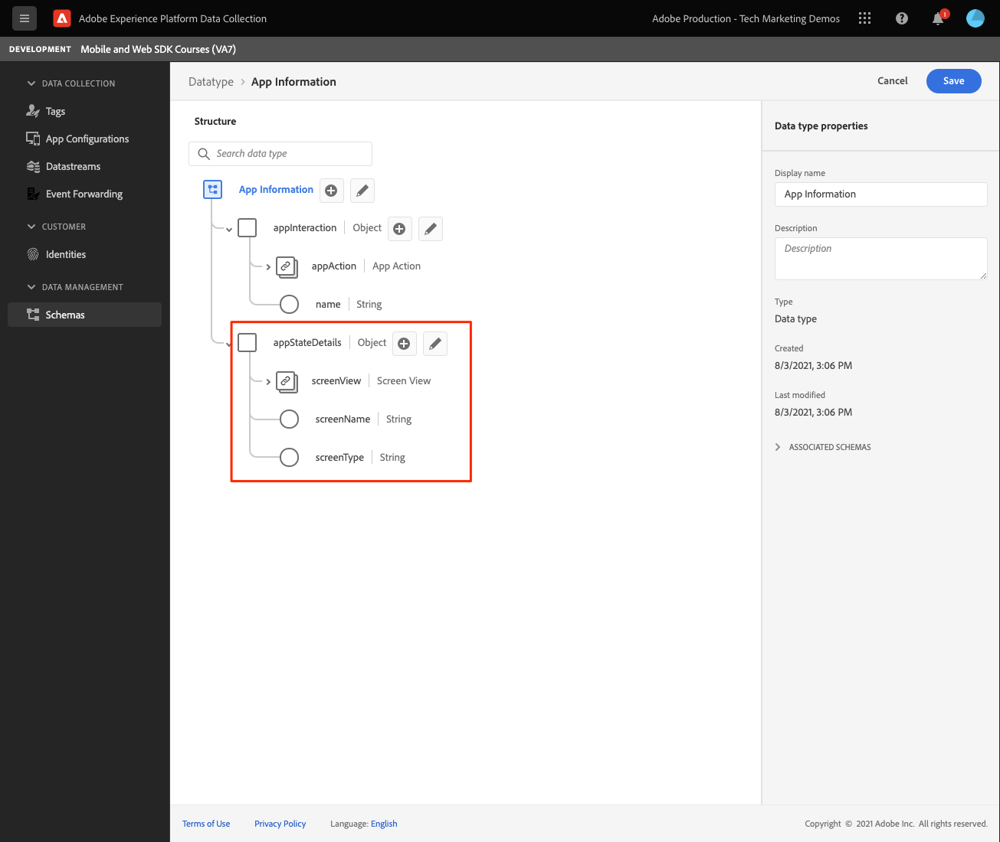

# 创建 XDM 架构

了解如何为移动设备应用程序事件创建XDM模式。

标准化和互操作性是Adobe Experience Platform背后的关键概念。 由Adobe驱动的体验数据模型(XDM)旨在标准化客户体验数据并定义客户体验管理架构。

## 什么是XDM模式？

XDM是一项公开记录的规范，旨在提高数字体验的强大功能。 它提供了通用结构和定义，允许任何应用程序与Platform服务通信。 通过遵循XDM标准，可以将所有客户体验数据纳入到通用的表示形式中，以便以更快、更集成的方式提供洞察。 您可以从客户操作中获得有价值的分析，通过区段定义客户受众，以及为个性化目的表达客户属性。

Experience Platform 会使用架构，以便以可重用的一致方式描述数据结构。通过在整个系统中以一致的方式定义数据，更容易保留含义并因此从数据中获取价值。

在将数据摄取到平台中之前，必须构建一个架构来描述数据的结构，并对每个字段中可包含的数据类型提供约束。 架构由基类和零个或多个架构字段组组成。

有关架构组合模型（包括设计原则和最佳实践）的更多信息，请参阅 [架构组合基础知识](https://experienceleague.adobe.com/docs/experience-platform/xdm/schema/composition.html?lang=zh-Hans) 或课程 [使用XDM为您的客户体验数据建模](https://experienceleague.adobe.com/?recommended=ExperiencePlatform-D-1-2021.1.xdm).

>[!TIP]
>
>如果您熟悉Analytics解决方案设计参考(SDR)，则可以将架构视为更强大的SDR。

## 先决条件

要完成本课程，您必须拥有创建Experience Platform架构的权限。

## 学习目标

在本课程中，您将：

* 在数据收集界面中创建架构
* 将标准字段组添加到架构
* 创建自定义字段组并将其添加到架构

## 导航到架构

1. 登录 Adobe Experience Cloud.

1. 打开应用程序切换器，然后选择 **[!UICONTROL 数据收集]**

   

1. 确保您位于在本教程中使用的Experience Platform沙盒中。

   >[!NOTE]
   >
   > 基于平台的应用程序(如Real-Time CDP)的客户应在本教程中使用一个开发沙盒。 其他客户将使用默认的生产沙盒。

1. 选择 **[!UICONTROL 模式]** 在 **[!UICONTROL 数据管理]**.

   

现在，您位于主架构页面上，并会看到任何现有架构的列表。 您还可以看到与架构的核心构建块对应的选项卡：

* **字段组** 是可重用的组件，用于定义一个或多个字段以捕获特定数据，如个人详细信息、酒店首选项或地址。
* **类** 定义架构所包含数据的行为方面。 例如： `XDM ExperienceEvent` 捕获时间系列、事件数据和 `XDM Individual Profile` 捕获有关个人的属性数据。
* **数据类型** 在类或字段组中用作引用字段类型，其方式与基本文字字段相同。

以上描述是高级概述。 有关更多详细信息，请参阅 [架构构建块](https://experienceleague.adobe.com/docs/platform-learn/tutorials/schemas/schema-building-blocks.html?lang=zh-CN) 视频或阅读 [架构组合的基础知识](https://experienceleague.adobe.com/docs/experience-platform/xdm/schema/composition.html?lang=zh-Hans) （在产品文档中）。

在本教程中，您将使用消费者体验事件字段组并创建一个自定义字段组来演示该过程。

>[!NOTE]
>
>Adobe会继续添加更多标准字段组，应尽可能使用这些字段组，因为Experience Platform服务会隐式理解这些字段，并在跨平台组件使用时提供更高的一致性。 使用标准字段组可提供切实的好处，例如在Platform的Analytics和AI功能中自动映射。

## Luma应用程序架构

在现实场景中，架构设计过程可能如下所示：

* 收集业务需求。
* 查找预建的字段组以满足尽可能多的要求。
* 为任何差距创建自定义字段组。

出于学习目的，您将使用预建和自定义字段组。

* **消费者体验事件**:具有许多公共字段的预建字段组。
* **应用程序信息**:自定义字段组，旨在模拟TrackState/TrackAction分析概念。

<!--Later in the tutorial, you can [update the schema](lifecycle-data.md) to include the **[!UICONTROL AEP Mobile Lifecycle Details]** field group.-->

## 创建架构

1. 选择 **[!UICONTROL 创建架构]** 要显示“选项”下拉菜单，请选择 **[!UICONTROL XDM ExperienceEvent]**.

   

1. 搜索 `Consumer Experience Event`.

1. 在选择之前，您可以预览字段和/或阅读有关更多详细信息的描述。

1. 选中复选框，然后 **[!UICONTROL 添加字段组]**.

   

   您将返回到主架构组合屏幕，您可以在该屏幕中查看所有可用字段。

1. 通过选择 **[!UICONTROL 无标题架构]** 从左上角，然后提供 **[!UICONTROL 显示名称]** &amp; **[!UICONTROL 描述]**，例如 `Luma Tutorial Mobile` 和 `"Luma App" schema for Adobe Tutorial`

1. 选择&#x200B;**[!UICONTROL 保存]**。

   

>[!NOTE]
>
>请记住，您不必使用组中的所有字段。 如果此模式很有用，您可以将架构视为空数据层。 在您的应用程序中，您需要在适当的时间填充相关值。
>
>的 `Consumer Experience Event` 具有名为 `Web information`，描述页面查看和链接点击等事件。 在编写时，此功能与移动设备应用程序没有对等性，因此您将创建自己的功能。

## 创建自定义数据类型

首先，创建描述这两个事件的自定义数据类型：

* 屏幕视图
* 应用程序交互

1. 选择 **[!UICONTROL 数据类型]** 选项卡，然后选择 **[!UICONTROL 创建数据类型]**.

   

1. 给它一个 **[!UICONTROL 显示名称]** 和 **[!UICONTROL 描述]**，例如 `App Information` 和 `Custom data type describing "Screen Views" & "App Actions"`

   

   >[!TIP]
   >
   > 始终使用可读的描述性内容 [!UICONTROL 显示名称] 对于您的自定义字段，因为这样当字段在区段生成器等下游服务中显示时，营销人员便可以更轻松地访问这些字段。

1. 要添加字段，请选择(+)按钮。

   此字段是用于应用程序交互的容器对象。 给它一个驼背 **[!UICONTROL 字段名称]** `appInteraction`, **[!UICONTROL 显示名称]** `App Interaction`和 **[!UICONTROL type]** `Object`.

1. 选择 **[!UICONTROL 应用]**.

   

1. 要测量操作发生的频率，请通过选择 `appInteraction` 对象。

1. 给它一个驼背 **[!UICONTROL 字段名称]** `appAction`, **[!UICONTROL 显示名称]** of `App Action` 和 **[!UICONTROL type]** `Measure`.

   此步骤等同于Adobe Analytics中的成功事件。

1. 选择 **[!UICONTROL 应用]**.

   

1. 通过选择 `appInteraction` 对象。

1. 给它一个 **[!UICONTROL 字段名称]** `name`, **[!UICONTROL 显示名称]** of `Name` 和 **[!UICONTROL type]** `String`.

   此步骤等同于Adobe Analytics中的维度。

   

1. 滚动到右边栏的底部，然后选择 **[!UICONTROL 应用]**.

1. 按照相同的模式创建 `appStateDetails` 包含名为的度量字段的对象 `screenView` 和两个名为 `screenName` 和 `screenType`.

1. 选择&#x200B;**[!UICONTROL 保存]**。

   

## 添加自定义字段组

现在，使用您的自定义数据类型添加自定义字段组：

1. 打开您在本课程前面创建的架构。

1. 选择 **[!UICONTROL 添加]** 下一页 **[!UICONTROL 字段组]**.

   

1. 此时，您通过选择 **[!UICONTROL 创建新字段组]** 单选按钮，然后提供名称和描述，例如， `App Interactions` 和 `Fields for app interactions`.

   

1. 从主合成屏幕中，将字段添加到架构的根。

1. 选择架构名称旁边的(+)。

1. 在右边栏中，提供 **[!UICONTROL 字段名称]** of `appInformation`，显示名称 `App Information`.

1. 选择 `App Information` 从 **[!UICONTROL 类型]** 下拉列表，您在上一个练习中创建的数据类型。

1. 选择 **[!UICONTROL 应用]**.

   

>[!NOTE]
>
>自定义字段组始终放在Experience Cloud组织标识符下。
>
>`_techmarketingdemos` 将替换为您组织的唯一值。

现在，您有一个架构可在本教程的其余部分使用。

下一个： **[创建 [!UICONTROL 数据流]](create-datastream.md)**

>[!NOTE]
>
>感谢您花时间了解Adobe Experience Platform Mobile SDK。 如果您有任何疑问、想要分享一般反馈或对未来内容提出建议，请就此分享 [Experience League社区讨论帖子](https://experienceleaguecommunities.adobe.com/t5/adobe-experience-platform-launch/tutorial-discussion-implement-adobe-experience-cloud-in-mobile/td-p/443796)