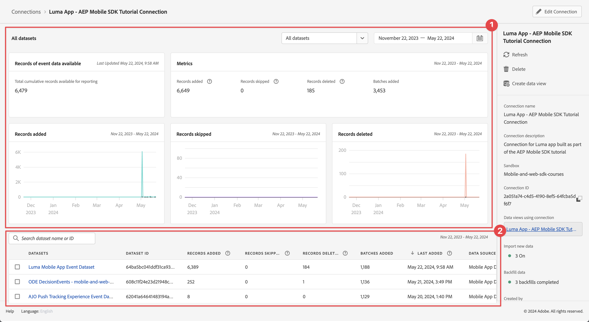
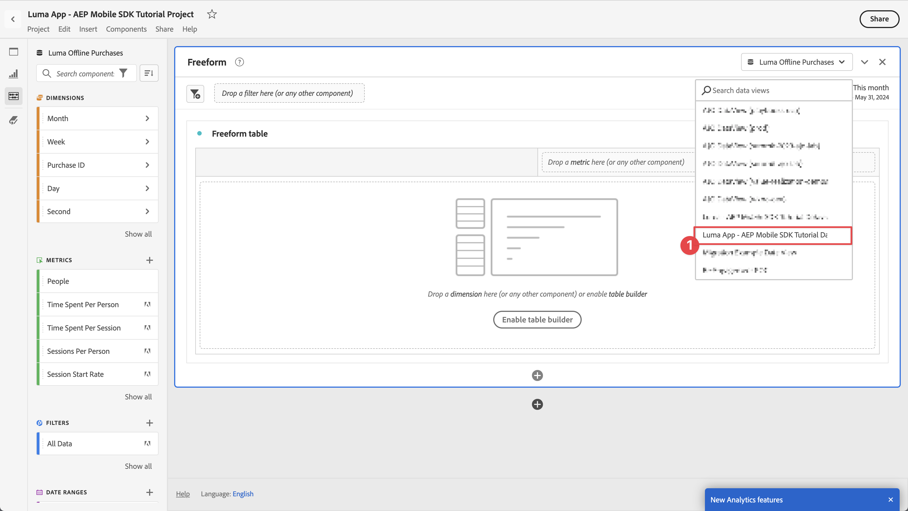
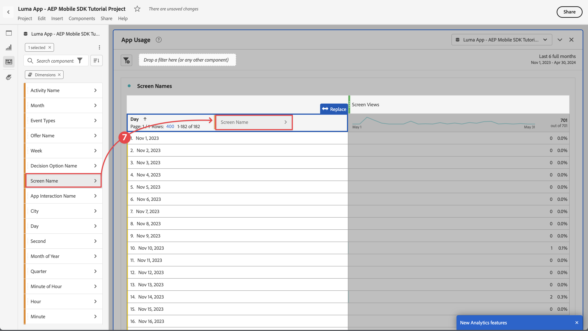

# 使用Customer Journey Analytics报告和分析

了解如何报告和分析您的移动应用程序与Customer Journey Analytics的交互。

您在前面的课程中收集并发送到PlatformEdge Network的移动应用程序事件数据将转发到您在数据流中配置的服务。 如果您学习了[将数据发送到Experience Platform](platform.md)课程，则该数据现在存储在Experience Platform数据集中，可供Customer Journey Analytics用于报表和分析。

与Adobe Analytics相反，Customer Journey Analytics *使用来自Experience Platform中创建的数据集的*&#x200B;数据。 使用Adobe Experience Platform Mobile SDK时，数据不会直接发送到Customer Journey Analytics，而是会发送到数据集。 然后，在Customer Journey Analytics中配置连接以选择您将在报表和分析项目中使用的数据集。

本教程中的本课程侧重于报告和分析从Luma教程应用程序捕获的数据。 Customer Journey Analytics的独特功能之一是将来自多个来源（CRM、销售点、忠诚度应用程序、呼叫中心）和渠道（Web、移动、离线）的数据整合在一起，以便深入了解客户历程。 该功能不在本课程的讨论范围内。 有关详细信息，请参阅[Customer Journey Analytics概述](https://experienceleague.adobe.com/en/docs/analytics-platform/using/cja-overview/cja-overview)。

## 先决条件

必须配置您的组织并授予Customer Journey Analytics权限。 您必须具有管理员访问权限才能进行Customer Journey Analytics。

## 学习目标

在本课程中，您将执行以下操作：

- 创建连接以定义要用于Customer Journey Analytics的Experience Platform中的数据集。
- 创建数据视图，从数据集准备数据以用于报告和分析
- 创建一个项目以生成报告和可视化图表，以便您能够分析来自移动设备应用程序的数据。

这个顺序是有意为之。 连接使用数据集，数据视图使用连接。

## 创建连接

Customer Journey Analytics中的连接从要用于报表和分析的Experience Platform中定义数据集（以及这些数据集中的数据）。

1. 使用右上角的“应用程序”菜单导航到Customer Journey Analytics界面。

1. 从顶部菜单栏中选择&#x200B;**[!UICONTROL 连接]**。

1. 请确保在“连接”界面中选择&#x200B;**[!UICONTROL 列表]**&#x200B;选项卡。 您会看到现有连接的列表。

1. 选择&#x200B;**[!UICONTROL 创建新连接]**。

1. 在&#x200B;**[!UICONTROL 连接]** > **[!UICONTROL 无标题连接]**&#x200B;屏幕中，在&#x200B;**[!UICONTROL 连接设置]**&#x200B;中

   1. 输入&#x200B;**[!UICONTROL 连接名称]**，例如`Luma App - AEP Mobile SDK Tutorial Connection`。
   2. 输入&#x200B;**[!UICONTROL 连接描述]**，例如`Connection for the Luma app used in the AEP Mobile SDK tutorial`。

      在&#x200B;**[!UICONTROL 数据设置]**&#x200B;中：

   3. 选择用于收集移动应用程序数据的沙盒，例如&#x200B;**[!UICONTROL 移动和Web SDK课程]**。
   4. 从&#x200B;**[!UICONTROL 平均每日事件数]**&#x200B;中选择&#x200B;**[!UICONTROL 小于100万]**。

   5. 选择&#x200B;**[!UICONTROL 添加数据集]**&#x200B;以从Experience Platform中选择要在Customer Journey Analytics中使用的数据集。

      

   6. 在&#x200B;**[!UICONTROL 添加数据集]**&#x200B;向导中，**[!UICONTROL 选择数据集]**&#x200B;步骤，

      1. 选择以下数据集：

         - **[!UICONTROL Luma移动应用程序事件数据集]**，您在Experience Platform课程中的[创建数据集](platform.md#create-a-dataset)部分中创建的数据集。
         - **[!UICONTROL ODE DecisionEvents - *沙盒名称*] decisioning**
         - **[!UICONTROL AJO推送跟踪事件数据集]**

      1. 选择&#x200B;**[!UICONTROL 下一步]**。

         

   7. 在&#x200B;**[!UICONTROL 添加数据集]**&#x200B;向导&#x200B;**[!UICONTROL 数据集设置]**&#x200B;步骤中，需要定义每个事件数据集的详细信息。
      1. 请参阅下表以了解正确的设置：

         | 数据集 | 人员ID ① | 时间戳 ② | 数据源类型③ | 导入所有新数据④ | 回填所有现有数据⑤ |
         |---|---|---|---|---|---|
         | Luma移动应用程序事件数据集 | identityMap | 时间戳 | 移动应用程序数据 | 启用 | 启用 |
         | ODE DecisionEvents - *沙盒名称* decisioning | identityMap | 时间戳 | 移动应用程序数据 | 启用 | 启用 |
         | AJO推送跟踪体验事件数据集 | identityMap | 时间戳 | 移动应用程序数据 | 启用 | 启用 |

      1. 选择&#x200B;**[!UICONTROL 添加数据集]**。

         

1. 返回&#x200B;**[!UICONTROL 连接]** > **[!UICONTROL Luma应用程序 — AEP Mobile SDK教程连接]**，选择&#x200B;**[!UICONTROL 保存]**&#x200B;以保存您的连接。

   

您现在已定义连接，Customer Journey Analytics会将来自数据集的数据添加到其自己的内部数据库。 此数据收集可能需要一些时间，具体取决于数据量。 对于您的教程应用程序，请期待几个小时让数据在Customer Journey Analytics中显示。

要查看连接的状态，请执行以下操作：

1. 在Customer Journey Analytics的主界面中选择&#x200B;**[!UICONTROL 连接]**。
1. 选择连接的名称，例如&#x200B;**[!UICONTROL Luma应用程序 — AEP Mobile SDK教程连接]**。

在&#x200B;**[!UICONTROL 连接]** > **[!UICONTROL Luma应用程序 — AEP Mobile SDK教程连接]**&#x200B;中，您会看到：

1. 有关添加的记录总数、跳过的记录数和删除的记录数的信息。 请确保选择&#x200B;**[!UICONTROL 所有数据集]**&#x200B;并选择适当的时段以查看有关连接的详细信息。 您可以使用打开对话框以选择时间段。
1. 有关添加的记录、跳过的记录、删除的记录等内容的单个数据集的信息。

   

## 创建数据视图

将记录从数据集添加到Customer Journey Analytics后，您可以创建一个数据视图，以定义要报告的数据的哪些组件。

数据视图是Customer Journey Analytics专属的容器，通过它，可决定如何解释来自连接的数据。 您可以从任何在连接中定义为Analysis Workspace中的组件（维度、量度）的数据集中配置标准和架构字段。

Customer Journey Analytics中的数据视图提供了极大的灵活性，可以正确设置和定义来自连接的数据。 在本教程中，您将仅使用报告和分析所需的功能。 有关详细信息，请参阅[数据视图](https://experienceleague.adobe.com/en/docs/analytics-platform/using/cja-dataviews/data-views)。

要创建数据视图，请执行以下操作：

1. 使用右上角的“应用程序”菜单导航到Customer Journey Analytics界面。

1. 从顶部菜单栏中选择&#x200B;**[!UICONTROL 数据视图]**。
1. 选择&#x200B;**[!UICONTROL 创建新数据视图]**。
1. 在&#x200B;**[!UICONTROL 数据视图>]**&#x200B;中，确保选中&#x200B;**[!UICONTROL 配置]**&#x200B;选项卡。

   1. 从“设置连接”下拉列表中选择您的连接，例如&#x200B;**[!UICONTROL Luma应用程序 — AEP Mobile SDK教程连接]**。
   1. 输入数据视图的名称，例如： `Luma App - AEP Mobile SDK Tutorial Data view`。
   1. 选择&#x200B;**[!UICONTROL 保存并继续]**。

      

1. 在&#x200B;**[!UICONTROL Luma应用程序 — AEP Mobile SDK教程数据视图]**&#x200B;的&#x200B;**[!UICONTROL 组件]**&#x200B;选项卡中，您可以定义要在报告移动应用程序时使用的量度和维度。 默认情况下，已为您的数据视图配置了多个标准量度和维度（统称为组件）。 但您的数据视图需要更多组件。  要从之前定义的架构或现成架构添加架构字段（请参阅[创建架构](create-schema.md)课程），请将其添加为组件（维度或量度）：

   1. 查找架构字段：

      - 使用 ***[!UICONTROL 搜索架构字段]***&#x200B;搜索字段搜索组件。 例如，`productListAdd`，或

        

      - 向下遍历到 **[!UICONTROL 事件数据集]** 中的架构字段。  例如， **[!UICONTROL 事件数据集]**   **[!UICONTROL 商务]**   **[!UICONTROL productListAdds]** 

        

   1. 从“架构字段”窗格中拖动特定架构字段，并将其放在[!UICONTROL 包含的组件]窗格中的&#x200B;**[!UICONTROL DIMENSION]**&#x200B;或&#x200B;**[!UICONTROL 量度]**&#x200B;列表中。

      

   1. 您可以配置组件的设置。 选择组件并在右侧窗格中配置设置。  例如，可以使用右窗格中的&#x200B;**[!UICONTROL 组件设置]** > **[!UICONTROL 组件名称]**&#x200B;字段将&#x200B;**[!UICONTROL commerce.productListAdds]**&#x200B;重命名为`Product Add To Lists`。

      

      或配置&#x200B;**[!UICONTROL 包括排除值]**。

      

   1. 现在，您已了解如何向数据视图添加字段并配置生成的组件，请使用下表列出要作为量度或维度添加的架构字段。 使用下表中的&#x200B;**架构路径**&#x200B;列值搜索或遍历特定架构字段。 添加量度和维度后，请检查表中的&#x200B;**组件设置**&#x200B;列值，确定组件是否需要特定设置，如组件名称&#x200B;**[!UICONTROL 或定义**&#x200B;[!UICONTROL &#x200B;包括排除值&#x200B;]&#x200B;**。]**

      **个量度**

      | 组件名称 | 数据集 | 架构数据类型 | 架构路径 | 组件设置 |
      |---|---|---|---|---|
      | 关闭 | AJO推送跟踪体验事件数据集、Luma移动应用程序事件数据集 | 整数 | _experience.decisioning. propositionEventType.discisse | 组件名称： `Dismiss` |
      | 取消订阅 | AJO推送跟踪体验事件数据集、Luma移动应用程序事件数据集 | 整数 | _experience.decisioning. propositionEventType.unsubscribe | 组件名称： `Unsubscribe` |
      | 触发器 | AJO推送跟踪体验事件数据集、Luma移动应用程序事件数据集 | 整数 | _experience.decisioning. propositionEventType.trigger | 组件名称： `Trigger` |
      | 显示 | AJO推送跟踪体验事件数据集、Luma移动应用程序事件数据集 | 整数 | _experience.decisioning. propositionEventType.display | 组件名称： `Display` |
      | 发送 | AJO推送跟踪体验事件数据集、Luma移动应用程序事件数据集 | 整数 | _experience.decisioning. propositionEventType.send | 组件名称： `Send` |
      | Interact | AJO推送跟踪体验事件数据集、Luma移动应用程序事件数据集 | 整数 | _experience.decisioning. propositionEventType.interact | 组件名称： `Interact` |
      | 位置事件 | AJO推送跟踪体验事件数据集、Luma移动应用程序事件数据集、ODE DecisionEvents — 移动和Web-sdk-courses决策 | 字符串 | 事件类型 | 组件名称： `Location Events`   |
      | 产品查看次数 | Luma移动应用程序事件数据集 | 两次 | commerce.productViews.value | 组件名称： `Product Views` |
      | 产品添加到列表 | Luma移动应用程序事件数据集 | 两次 | commerce.productListAdds.value | 组件名称： `Product Add To Lists` |
      | 购买次数 | Luma移动应用程序事件数据集 | 两次 | commerce.purchases.value | 组件名称： `Purchases` |
      | 保存以供日后使用次数 | Luma移动应用程序事件数据集 | 两次 | commerce.saveForLaters.value | 组件名称： `Save For Laters` |
      | 应用程序交互 | Luma移动应用程序事件数据集 | 两次 | _techmarketingdemos.appInformation. appinteraction.appAction.value | 组件名称： `App Interactions` |
      | 屏幕查看 | Luma移动应用程序事件数据集 | 两次 | _techmarketingdemos.appInformation. appstateDetails.screenView.value | 组件名称： `Screen Views` |

      {style="table-layout:auto"}

      >[!NOTE]
      >
      >请注意，位置事件量度的架构字段如何使用&#x200B;**[!UICONTROL 包括排除值]**&#x200B;来计数包含`location`的事件类型。

      将上表中的所有架构字段添加为量度组件后，**[!UICONTROL METRICS]**&#x200B;的数据视图配置应与以下匹配：

      

      **DIMENSION**

      | 组件名称 | 数据集 | 架构数据类型 | 架构路径 | 组件设置 |
      |---|---|---|---|---|
      | 城市 | AJO推送跟踪体验事件数据集、Luma移动应用程序事件数据集 | 字符串 | placeContext.geo.city | 组件名称： `City` |
      | 事件类型 | AJO推送跟踪体验事件数据集、Luma移动应用程序事件数据集、ODE DecisionEvents — 移动和Web-sdk-courses决策 | 字符串 | 事件类型 | 组件名称： `Event Types` |
      | 决策选项名称 | AJO推送跟踪体验事件数据集、Luma移动应用程序事件数据集、ODE DecisionEvents — 移动和Web-sdk-courses决策 | 字符串 | _experience.decisioning. 建议.items.name | 组件名称： `Decision Option Name` |
      | 应用程序交互名称 | Luma移动应用程序事件数据集 | 字符串 | _techmarketingdemos.appInformation. appInteract.name | 组件名称： `App Interaction Name` |
      | 屏幕名称 | Luma移动应用程序事件数据集 | 字符串 | _techmarketingdemos.appInformation. appStateDetails.screenName | 组件名称： `Screen Name` |
      | 活动名称 | ODE DecisionEvents — 移动和Web-sdk-courses决策 | 字符串 | _experience.decisioning. propositionDetails.activity.name | 组件名称： `Activity Name` |
      | 选件名称 | ODE DecisionEvents — 移动和Web-sdk-courses决策 | 字符串 | _experience.decisioning. propositionDetails.selections.name | 组件名称： `Offer Name` |

      {style="table-layout:auto"}

      从上表添加所有架构字段作为维度组件后，**[!UICONTROL DIMENSION]**&#x200B;的数据视图配置应与以下匹配：

      

   1. 选择&#x200B;**[!UICONTROL 保存并继续]**。

1. **[!UICONTROL Luma应用程序 — AEP Mobile SDK教程数据视图]**&#x200B;的&#x200B;**[!UICONTROL 设置]**&#x200B;选项卡允许您配置过滤器和会话设置。 在本教程中，您无需进行其他配置。

   - 选择&#x200B;**[!UICONTROL 保存并完成]**。

您已定义数据视图，并且已准备好开始构建报告和可视化图表。

## 创建项目

Workspace项目在Customer Journey Analytics中用于构建报告和可视化图表。 构建全面报告和引人入胜的可视化图表有许多可能性，但这不在本教程的涵盖范围内。 有关详细信息，请参阅[Workspace概述](https://experienceleague.adobe.com/en/docs/customer-journey-analytics-learn/tutorials/analysis-workspace/workspace-projects/analysis-workspace-overview)和[生成新项目](https://experienceleague.adobe.com/en/docs/customer-journey-analytics-learn/tutorials/analysis-workspace/workspace-projects/build-a-new-project)。

在本课程的此部分中，您将创建一个项目，其中显示有关以下各项的报告和可视化图表：

- 应用程序使用情况：使用有关屏幕和应用程序交互的信息。
- Commerce：使用商业事件（如产品查看），添加到购物车并购买。
- 选件：使用应用程序中显示的选件事件。
- 商店访问次数：使用应用程序中的（模拟）地理围栏事件。

要创建项目，请执行以下操作：

1. 使用右上角的“应用程序”菜单导航到Customer Journey Analytics界面。

1. 从顶部菜单栏中选择&#x200B;**[!UICONTROL Workspace]**。

1. 选择&#x200B;**[!UICONTROL 创建项目]**。

   1. 从弹出对话框中选择&#x200B;**[!UICONTROL 空白Workspace项目]**。

   1. 选择&#x200B;**[!UICONTROL 创建]**。

      

1. 您看到了&#x200B;**[!UICONTROL 新项目]**&#x200B;界面。 在此界面中，您可以构建报告和可视化图表。

1. 选择项目的名称（**[!UICONTROL 新建项目]**）并提供您自己的项目名称。 例如：`Luma App - AEP Mobile SDK Tutorial Project`。
   

1. 要保存项目，请选择&#x200B;**[!UICONTROL 项目]** > **[!UICONTROL 保存]**。
   

1. 在&#x200B;**[!UICONTROL 保存]**&#x200B;对话框中，忽略所有其他字段并选择&#x200B;**[!UICONTROL 保存]**。
   

>[!IMPORTANT]
>
>   请记住定期保存您的项目，否则您的更改将丢失。 您可以使用&#x200B;**[!UICONTROL ctrl + s]** (Windows)或&#x200B;**[!UICONTROL ⌘ (cmd) + s]** (macOS)快速保存项目。

您现在已设置项目。 默认情况下，会提供一个自由格式表。 在添加组件之前，请确保您的自由格式面板使用了正确的数据视图和时间段。

1. 从下拉列表中选择数据视图。 例如，**[!UICONTROL Luma应用程序 — AEP Mobile SDK教程数据视图]**。 如果在列表中看不到您的数据视图，请选择下拉列表底部的&#x200B;**[!UICONTROL 全部显示]**。
   

1. 要为面板定义合适的时间段，请选择默认预设&#x200B;**[!UICONTROL 本月]**，输入自定义的开始和结束日期，或使用&#x200B;**[!UICONTROL 预设]**（如&#x200B;**[!UICONTROL 最近6个整月]**），然后选择&#x200B;**[!UICONTROL 应用]**。
   

### 应用程序使用情况

现在，您已准备好报告应用程序的使用方式。 您已在应用程序中添加了必要的代码来注册应用程序交互以及在应用程序中使用的屏幕（请参阅[跟踪事件](events.md)课程），现在要报告此数据。

#### 屏幕名称

要报告应用程序中查看的屏幕，请执行以下操作：

1. 将您的&#x200B;**[!UICONTROL 自由格式]**&#x200B;面板重命名为`App Usage`。

1. 将您的&#x200B;**[!UICONTROL 自由格式表]**&#x200B;重命名为`Screen Names`。

1. 选择&#x200B;**[!UICONTROL METRICS]**&#x200B;列表下的&#x200B;**[!UICONTROL 显示所有]**。

1. 将&#x200B;**[!UICONTROL 屏幕视图]**&#x200B;组件拖放到&#x200B;[!UICONTROL _将&#x200B;**量度**&#x200B;拖放到此处（或任何其他组件_）]。
   
现在，您的自由格式表会显示所选时间段的每日屏幕查看次数。 但是，您希望显示应用程序中使用的每个不同屏幕的屏幕查看次数。

1. 要显示&#x200B;**[!UICONTROL DIMENSION]**&#x200B;组件列表，请选择以从组件边栏中删除 **[!UICONTROL 量度]**&#x200B;筛选器。
   

1. 选择&#x200B;**[!UICONTROL DIMENSION]**&#x200B;列表下的&#x200B;**[!UICONTROL 显示所有]**。

1. 将&#x200B;**[!UICONTROL 屏幕名称]**&#x200B;组件拖放到&#x200B;**[!UICONTROL Day]**&#x200B;标题上。 该操作显示 **[!UICONTROL Replace]**&#x200B;以指示维度的替换。
   

报表中的第一个自由格式表已完成。

>[!NOTE]
>
>请先保存您的项目，然后再继续。

#### 应用程序交互

接下来，您将构建一个自由格式表以报告用户如何与应用程序进行交互。

1. 选择并从弹出窗口中添加新的自由格式表。
   

1. 将&#x200B;**[!UICONTROL 自由格式表(2)]**&#x200B;重命名为`App Interactions`。

1. 将&#x200B;**[!UICONTROL 应用程序交互]**&#x200B;量度拖放到&#x200B;[!UICONTROL _将&#x200B;**量度**&#x200B;拖放到此处（或任何其他组件_）]。

1. 将&#x200B;**[!UICONTROL 应用程序交互名称]**&#x200B;维度拖放到&#x200B;**[!UICONTROL Day]**&#x200B;标题上以替换此维度。

您的第二个报表现已准备就绪，可显示应用程序交互。

信息有限，主要是因为您仅在登录屏幕上实施了`MobileSDK.shared.sendAppInteractionEvent(actionName: "<actionName>")` API调用。 如果将此API调用添加到应用程序的更多屏幕中，此报表将提供更多信息。

>[!NOTE]
>
>请先保存您的项目，然后再继续。

### Commerce

现在，您需要在单独的面板中报告应用程序中发生的商业事件。

#### Commerce事件

1. 在当前[!UICONTROL 应用程序使用情况]面板之外选择以创建新面板。
   

1. 请确保选择适当的时间段。

1. 选择 **[!UICONTROL 自由格式表]**&#x200B;以创建新的自由格式表。
   

1. 将&#x200B;**[!UICONTROL 面板]**&#x200B;重命名为`Commerce`。

1. 将&#x200B;**[!UICONTROL 自由格式表]**&#x200B;重命名为`Commerce Events`。

1. 将&#x200B;**[!UICONTROL 产品查看]**&#x200B;指标拖放到&#x200B;[!UICONTROL _将&#x200B;**指标**&#x200B;拖放到此处（或任何其他组件_）]。

1. 将&#x200B;**[!UICONTROL 产品添加到列表]**&#x200B;量度拖放到&#x200B;**[!UICONTROL 产品视图]**&#x200B;列的右侧，以将此列插入到自由格式表中。 确保在插入列时显示&#x200B;**[!UICONTROL +添加]**（蓝色）。
   

1. 重复上一步骤以将&#x200B;**[!UICONTROL 保存供日后使用]**&#x200B;指标和&#x200B;**[!UICONTROL 购买]**&#x200B;指标添加到自由格式表中。

1. 将&#x200B;**[!UICONTROL 月]**&#x200B;维度拖放到&#x200B;**[!UICONTROL 日]**&#x200B;维度上，以将报表从每日更改为每月。

Commerce事件报表已完成。

>[!NOTE]
>
>请先保存您的项目，然后再继续。

#### 流失

接下来，您将为商业漏斗构建一个流失可视化图表，其中显示查看这些产品的用户将产品添加到购物车的数量，以及从购物车中保存这些产品的用户数量，以备将来使用。

1. 在&#x200B;**[!UICONTROL Commerce]**&#x200B;面板中选择，然后从弹出窗口中选择（表示流失可视化图表）。

1. 从&#x200B;[!UICONTROL *添加接触点*]&#x200B;下拉列表中选择&#x200B;**[!UICONTROL 产品视图]**。
   
或者，您可以将&#x200B;**[!UICONTROL 产品视图]**&#x200B;维度拖放到&#x200B;**[!UICONTROL 流失]**&#x200B;可视化图表中的&#x200B;**[!UICONTROL 所有人员]**&#x200B;维度下。

1. 对&#x200B;**[!UICONTROL 产品添加到列表]**&#x200B;和&#x200B;**[!UICONTROL 购买]**&#x200B;维度重复上述步骤。

流失可视化报表已完成。

>[!NOTE]
>
>请先保存您的项目，然后再继续。

### 选件

您希望报告向应用程序用户显示的选件数量以及选件。

#### 每月概述

1. 在当前Commerce面板之外选择以创建新面板。

1. 将&#x200B;**[!UICONTROL 面板]**&#x200B;重命名为`Offers`。

1. 确保选择适当的期间。

1. 选择自由格式表以创建新的自由格式表。

1. 将&#x200B;**[!UICONTROL 自由格式表]**&#x200B;重命名为`Monthly Overview`。

1. 将&#x200B;**[!UICONTROL 显示]**&#x200B;量度拖放到&#x200B;[!UICONTROL _将&#x200B;**量度**&#x200B;拖放到此处（或任何其他组件_）]。

1. 将&#x200B;**[!UICONTROL Month]**&#x200B;维度拖放到&#x200B;**[!UICONTROL Day]**&#x200B;列以替换该维度。

您已完成每月一次的选件概述。

>[!NOTE]
>
>请先保存您的项目，然后再继续。

#### 提供给人员的选件

此外，您还希望有一个报表，以应用程序的用户能够看到的数字来显示哪些选件。

1. 在&#x200B;**[!UICONTROL 选件]**&#x200B;面板中选择并从弹出窗口中选择以添加新的自由格式表。

1. 将&#x200B;**[!UICONTROL 自由格式表(2)]**&#x200B;重命名为`People`。

1. 将&#x200B;**[!UICONTROL 人员]**&#x200B;指标拖放到&#x200B;[!UICONTROL _将&#x200B;**指标**&#x200B;拖放到此处（或任何其他组件_）]。

1. 将&#x200B;**[!UICONTROL 活动名称]**&#x200B;拖放到&#x200B;**[!UICONTROL 天]**&#x200B;列以替换维度。

1. 右键单击该行，确定您在[使用决策管理创建和显示优惠](journey-optimizer-offers.md)课程中定义的一个或多个优惠决策。 例如，**[!UICONTROL Luma — 移动设备应用程序决策]**。

1. 从上下文菜单中，选择&#x200B;**[!UICONTROL 划分]** > **[!UICONTROL Dimension]** > **[!UICONTROL 选件名称]**。 此选择会将“活动名称”维度划分为“选件名称”。
   

您的面向人员的优惠报表已完成。

>[!NOTE]
>
>请先保存您的项目，然后再继续。

### 商店访问次数

最后，您要报告商店访问情况。

1. 在当前选件面板之外选择以创建新面板。

1. 将&#x200B;**[!UICONTROL 面板]**&#x200B;重命名为`Store Visits`。

1. 确保选择适当的期间。

1. 选择自由格式表以创建新的自由格式表。

1. 将&#x200B;**[!UICONTROL 自由格式表]**&#x200B;重命名为`Store Entries / Exits Across Cities`。

1. 将&#x200B;**[!UICONTROL 位置事件]**&#x200B;量度拖放到&#x200B;[!UICONTROL _将&#x200B;**量度**&#x200B;拖放到此处（或任何其他组件_）]。 现在，该报表会显示应用程序中发生的所有位置事件的每日概述。 请记住您如何明确将此维度配置为[数据视图](#create-a-data-view)的一部分。

1. 将&#x200B;**[!UICONTROL City]**&#x200B;维度拖放到&#x200B;**[!UICONTROL Day]**&#x200B;列标题上以替换该维度。 现在，报表会显示位置事件的城市。

1. 要删除没有与其关联的城市的地理位置事件，请选择，然后从&#x200B;**[!UICONTROL 搜索]**&#x200B;弹出窗口中，关闭&#x200B;**[!UICONTROL 包括“无值”]**，然后选择&#x200B;**[!UICONTROL 应用]**。

   

   此操作从报表中删除&#x200B;**[!UICONTROL 无值]**&#x200B;行。

1. 选择表格中的所有行，单击鼠标右键，然后从上下文菜单中选择划分>Dimension>事件类型。

您的商店访问报表已完成。 您现在有一个报告，显示用户进入和离开商店位置附近（如您在[位置](places.md)课程中定义的这些位置）。

请注意，如果您确实希望报告访客亲自访问您商店的情况，则可以使用信标。 但愿您已捕获有关地理位置数据的报表概念。

## 后续步骤

现在，您应该对如何使用Customer Journey Analytics来报告和可视化您的移动应用程序使用情况、交互情况等有了基本的了解。

>[!SUCCESS]
>
>
>感谢您投入时间学习Adobe Experience Platform Mobile SDK。 如果您有疑问、希望共享一般反馈或有关于未来内容的建议，请在此[Experience League社区讨论帖子](https://experienceleaguecommunities.adobe.com/t5/adobe-experience-platform-data/tutorial-discussion-implement-adobe-experience-cloud-in-mobile/td-p/443796)上共享它们。

下一步： **[结论和后续步骤](conclusion.md)**
