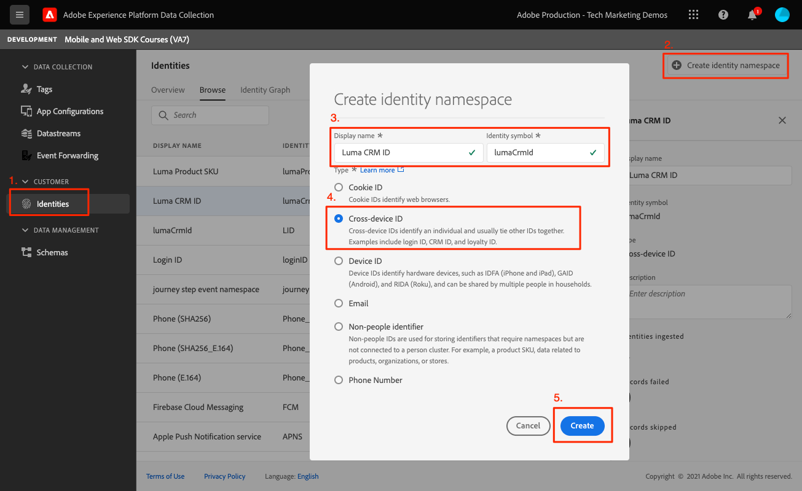

# 标识

了解如何在移动设备应用程序中收集身份数据。

Adobe Experience Platform Identity Service通过跨设备和系统桥接身份，使您能够实时提供有影响的个人数字体验，从而帮助您更好地了解客户及其行为。 身份字段和命名空间是将不同数据源联接在一起以构建360度实时客户用户档案的粘合剂。

进一步了解 [身份扩展](https://aep-sdks.gitbook.io/docs/foundation-extensions/identity-for-edge-network) 和 [身份服务](https://experienceleague.adobe.com/docs/experience-platform/identity/home.html?lang=zh-Hans) 中。

## 先决条件

* 已成功构建并运行安装并配置了SDK的应用程序。

## 学习目标

在本课程中，您将：

* 更新标准标识。
* 设置自定义标识。
* 更新自定义标识。
* 验证身份图。
* 获取ECID和其他身份。

## 更新标准标识

首先，在用户登录时更新用户的身份映射。

1. 导航到 `Login.swift` 如果Luma应用程序并找到名为的函数，则 `loginButt`.

   在Luma示例应用程序中，不进行用户名或密码验证。 您只需点按按钮即可“登录”。

1. 创建 `IdentityMap` 和 `IdentityItem`.

   ```swift
   let identityMap: IdentityMap = IdentityMap()
   let emailIdentity = IdentityItem(id: emailAddress, authenticatedState: AuthenticatedState.authenticated)
   ```

1. 添加 `IdentityItem` 到 `IdentityMap`

   ```swift
   identityMap.add(item:emailIdentity, withNamespace: "Email")
   ```

1. 调用 `updateIdentities` 将数据发送到Platform Edge Network。

   ```swift
   Identity.updateIdentities(with: identityMap)
   ```

>[!NOTE]
>
>您可以在单个updateIdentities调用中发送多个身份。 您还可以修改之前发送的身份。


## 设置自定义身份命名空间

身份命名空间是 [Identity Service](https://experienceleague.adobe.com/docs/experience-platform/identity/home.html?lang=en) 作为身份相关背景的指标。 例如，它们将值“name@email.com”区分为电子邮件地址或“443522”作为数字CRM ID。

1. 在数据收集界面中，选择 **[!UICONTROL 标识]** 从左边栏导航。
1. 选择 **[!UICONTROL 创建身份命名空间]**.
1. 提供 **[!UICONTROL 显示名称]** of `Luma CRM ID` 和 **[!UICONTROL 身份符号]** 值 `lumaCrmId`.
1. 选择 **[!UICONTROL 跨设备ID]**.
1. 选择&#x200B;**[!UICONTROL 创建]**。



## 更新自定义标识

现在，您已创建自定义身份，接下来可通过修改 `updateIdentities` 您在上一步中添加的代码。 只需创建一个IdentityItem并将其添加到IdentityMap即可。 以下是完整代码块的外观：

```swift
//Hardcoded identity values
let emailAddress = "testuser@gmail.com"
let crmId = "112ca06ed53d3db37e4cea49cc45b71e"

// Create identity map
let identityMap: IdentityMap = IdentityMap()
// Add email (standard)
let emailIdentity = IdentityItem(id: emailAddress, authenticatedState: AuthenticatedState.authenticated)
identityMap.add(item:emailIdentity, withNamespace: "Email")
// Add lumaCrmId (custom)
let crmIdentity = IdentityItem(id: crmId, authenticatedState: AuthenticatedState.authenticated)
identityMap.add(item: crmIdentity, withNamespace: "lumaCrmId")
// Update
Identity.updateIdentities(with: identityMap)
```

## 删除标识

您可以使用 `removeIdentity` 从存储的客户端IdentityMap中删除身份。 标识扩展将停止向边缘网络发送标识符。 使用此API不会从服务器端用户配置文件图或身份图中删除标识符。

添加以下内容 `removeIdentity` 代码到注销按钮单击 `Account.swift`.

```swift
// Logout
let logout = UIAlertAction(title: "Logout", style: .destructive, handler: { (action) -> Void in
    isLoggedIn = false;
    ////Hardcoded identity values
    let emailAddress = "testuser@gmail.com"
    let crmId = "112ca06ed53d3db37e4cea49cc45b71e"
    // Adobe Experience Platform - Remove Identity
    Identity.removeIdentity(item: IdentityItem(id: emailAddress), withNamespace: "Email")
    Identity.removeIdentity(item: IdentityItem(id: crmId), withNamespace: "lumaCrmId")
})
```

>[!NOTE]
>在上述示例中， `crmId` 和 `emailAddress` 经过硬编码，但在实际应用程序中，这些值将是动态的。

## 通过保证进行验证

1. 查看 [设置说明](assurance.md) 部分，并将您的模拟器或设备连接到“保证”。
1. 在应用程序中，从右下方选择帐户图标。

   
1. 选择 **登录** 按钮。
1. 系统会为您提供输入用户名和密码的选项，这两个选项都是可选的，您只需选择 **登录**.

   
1. 在Assurance Web UI中查找 `Edge Identity Update Identities` 事件 `com.adobe.griffon.mobile` 供应商。
1. 选择事件并查看 `ACPExtensionEventData` 对象。 您应会看到您更新的身份。
   

## 使用身份图验证

完成 [Experience Platform课程](platform.md)，您还将能够在平台标识图形查看器中确认标识捕获：


下一个： **[用户档案](profile.md)**

>[!NOTE]
>
>感谢您花时间了解Adobe Experience Platform Mobile SDK。 如果您有任何疑问、想要分享一般反馈或对未来内容提出建议，请就此分享 [Experience League社区讨论帖子](https://experienceleaguecommunities.adobe.com/t5/adobe-experience-platform-launch/tutorial-discussion-implement-adobe-experience-cloud-in-mobile/td-p/443796)